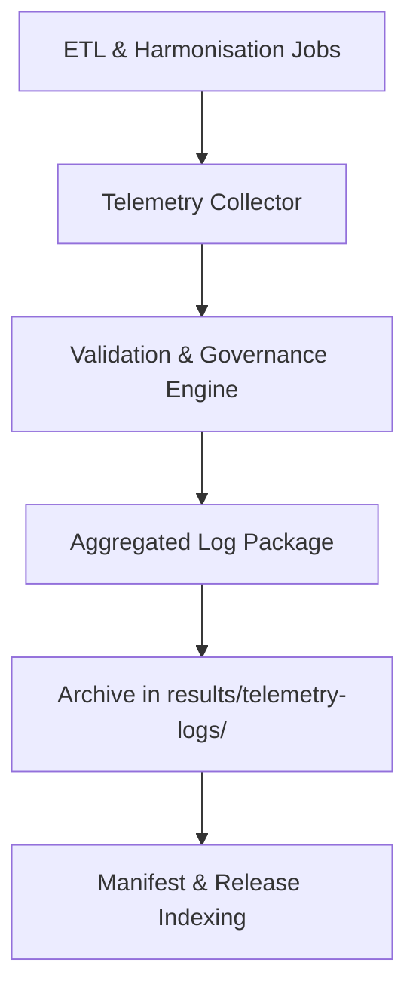

<div align="center">

# 📡 **Kansas Frontier Matrix — Cross-Domain Datasets Results: Telemetry Logs**  
`docs/analyses/cross-domain/datasets/results/telemetry-logs/README.md`

**Purpose:**  
This directory documents the telemetry and audit logs generated during the processing, integration, harmonisation, and user-interaction phases of the cross-domain datasets module of the Kansas Frontier Matrix (KFM) v10.2.2.  
It ensures all operations adhere to FAIR + CARE standards, supporting reproducibility, ethical governance, and traceable dataset lineage.

[](../../../../../../README.md)  
[](../../../../../../standards/faircare.md)  
[](../../../../../../LICENSE)  
[](../../../../../../releases/v10.2.0/manifest.zip)

</div>

---

## 📘 Overview

Telemetry logs in this folder capture the following classes of metrics and events:
- Pipeline performance metrics: ingestion latency, throughput, data volume, error rates  
- Harmonisation & schema conformance logs: validation outcomes, schema drift detection  
- AI/Focus-Mode usage logs: user sessions, query traces, summarisation outcomes  
- Ethical and governance audit logs: consent triggers, CARE governance events, data access logs  
- Sustainability metrics: compute resource usage, energy consumption (kWh), job run times  

These logs are integral to maintaining machine-actionable provenance and enabling traceability across the full data life cycle. They align with FAIR metadata best practices.  [oai_citation:0‡NCEAS Training Materials](https://learning.nceas.ucsb.edu/2023-09-ucsb-faculty/session_04.html?utm_source=chatgpt.com)

---

## 🗂️ Directory Layout

```bash
telemetry-logs/
 ├── focus-mode-usage.json             # Detailed user and AI interaction logs  
 ├── pipeline-latency.json              # End-to-end processing latency and throughput  
 ├── schema-drift.log                   # Detected schema changes and drift events  
 ├── energy-usage.csv                   # Compute job energy consumption metrics  
 ├── governance-events.log              # Ethical/governance audit events and triggers  
 └── README.md                          # This file  
```

Each file includes embedded metadata fields (version, generation date in ISO 8601, commit hash, checksum). Logs are referenced in the release manifest and linked to dataset-level provenance.

---

## 🧾 Log Descriptions

| File                     | Description                                                              | Format    | Validation      |
|--------------------------|--------------------------------------------------------------------------|-----------|------------------|
| `focus-mode-usage.json`  | Tracks user interactions with Focus Mode and AI summarisation sessions  | JSON      | FAIR+CARE validator |
| `pipeline-latency.json`  | Contains metrics for ingestion, ETL, harmonisation latency & errors      | JSON      | Performance validator |
| `schema-drift.log`       | Records schema drift events or deviations detected during harmonisation  | LOG       | Drift auditor     |
| `energy-usage.csv`       | Logs compute resource usage: job name, time, watts, kWh                 | CSV       | Sustainability audit |
| `governance-events.log`  | Governance triggers: consent checks, access events, redactions          | LOG       | Governance-as-Code audit |

---

## ⚙️ Generation Workflow



1. ETL/harmonisation pipelines emit telemetry events and logs.  
2. A telemetry collector aggregates into structured JSON/CSV/LOG formats.  
3. Validation engine audits FAIR+CARE compliance, governance triggers, and drift events.  
4. Final logs are archived in this directory and referenced in the release manifest.

---

## 🧩 Use Cases

- Trace performance regressions or bottlenecks across dataset integration workflows  
- Audit schema changes and detect drift over time in harmonised cross-domain datasets  
- Review user engagement and AI summarisation behaviours via Focus Mode logs  
- Monitor resource and energy usage for sustainability reporting  
- Evidence ethical and governance compliance (CARE) via audit logs  

---

## ⚖️ FAIR+CARE Compliance Summary

| Metric                      | Governance Tag             | Description                                                |
|-----------------------------|----------------------------|------------------------------------------------------------|
| `metadata_integrity_score`  | FAIR-Reproducible          | Verifies log files contain version, timestamp, checksum     |
| `pipeline_energy_kWh`       | FAIR-Sustainable           | Tracks energy usage for data integration jobs               |
| `schema_drift_events`       | FAIR-Interoperable         | Counts schema drift occurrences and resolution              |
| `user_focus_bias_index`     | CARE-Transparency          | Measures potential bias or fairness issues in user logs     |
| `governance_event_count`    | CARE-Integrity             | Number of governance interventions logged                   |

---

## 🕰️ Version History

| Version | Date       | Author                         | Summary                                         |
|---------|------------|--------------------------------|-------------------------------------------------|
| v10.2.2 | 2025-11-11 | Cross-Domain Integration Team   | Initial telemetry-logs README aligned with schema v3 |

---

<div align="center">

© 2025 Kansas Frontier Matrix · Master Coder Protocol v6.3 · FAIR+CARE Certified  
Diamond⁹ Ω / Crown∞Ω Ultimate Certified  

[Back to Results](../README.md) · [Governance Charter](../../../../../../docs/standards/governance/ROOT-GOVERNANCE.md)

</div>
