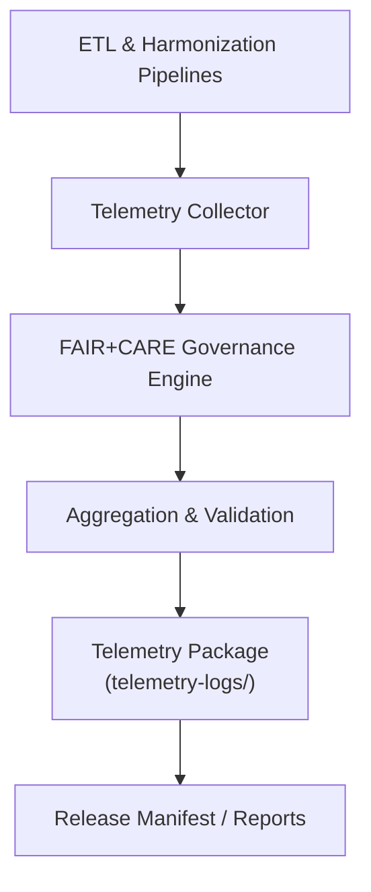

<div align="center">

# 📡 **Kansas Frontier Matrix — Cross-Domain Datasets Telemetry Logs**  
`docs/analyses/cross-domain/datasets/telemetry-logs/README.md`

**Purpose:**  
Provide a comprehensive record of **telemetry and audit data** generated during cross-domain dataset harmonization, validation, and Focus Mode interactions in Kansas Frontier Matrix (KFM) v10.2.2.  
All telemetry outputs follow FAIR+CARE compliance standards and are validated through Master Coder Protocol (MCP-DL v6.3) governance automation.

[](../../../../../docs/standards/markdown_guide.md)
[](../../../../../LICENSE)
[](../../../../../docs/standards/faircare.md)
[](../../../../../releases/v10.2.0/manifest.zip)

</div>

---

## 📘 Overview

The **Cross-Domain Telemetry Logs** directory captures metrics and audit data from all harmonized dataset integrations.  
These logs ensure every transformation, model operation, and user interaction is traceable, reproducible, and ethically governed.

Telemetry records include:
- Data pipeline performance metrics (latency, throughput, drift)
- FAIR+CARE governance actions and validation events
- AI inference summaries from Focus Mode v2
- Energy and resource utilization for sustainability tracking
- User telemetry during cross-domain Focus Mode sessions

---

## 🗂️ Directory Layout

```bash
telemetry-logs/
 ├── focus-telemetry.json           # Focus Mode v2 AI usage and insights
 ├── pipeline-latency-profile.json  # ETL and harmonization latency logs
 ├── model-drift-detection.log      # Detected deviations between harmonized datasets
 ├── energy-usage.csv               # Power consumption metrics per integration job
 ├── governance-events.log          # FAIR+CARE rule enforcement and audit triggers
 └── README.md                      # This file
```

---

## 🧾 Log Descriptions

| File | Description | Format | Validation |
|------|--------------|---------|-------------|
| `focus-telemetry.json` | Records all Focus Mode v2 usage analytics and AI summarization telemetry | JSON | FAIR+CARE validator |
| `pipeline-latency-profile.json` | Monitors end-to-end latency for ETL, harmonization, and validation processes | JSON | CI latency schema |
| `model-drift-detection.log` | Tracks schema or statistical drift across harmonized domain datasets | LOG | Drift validator |
| `energy-usage.csv` | Energy draw per process (Watts/kWh) for sustainability metrics | CSV | SBOM-linked energy audit |
| `governance-events.log` | FAIR+CARE-triggered governance actions (redactions, consent enforcement) | LOG | Governance-as-Code workflow |

Each log is checksum-verified and indexed in the release manifest for traceability.

---

## ⚙️ Workflow Integration



1. Pipelines emit telemetry events through standardized logging hooks.  
2. The collector aggregates events into structured JSON/CSV files.  
3. Governance engine validates compliance and flags exceptions.  
4. Validated logs are stored here and referenced by STAC/DCAT metadata.  
5. Reports are generated for the FAIR+CARE Council review.

---

## 🧩 Analytical Applications

- **Performance Optimization:** Identify latency and throughput bottlenecks.  
- **Ethical Compliance:** Audit governance actions per FAIR+CARE metrics.  
- **Sustainability Analysis:** Track energy efficiency in cross-domain processing.  
- **AI Explainability:** Analyze Focus Mode behavior and summarization accuracy.  
- **Data Integrity:** Detect and record schema drift between harmonized datasets.

---

## ⚖️ FAIR+CARE Compliance Summary

| Metric | Tag | Description |
|--------|-----|-------------|
| `governance.audit_trace` | CARE-Integrity | Logs all ethical governance interventions |
| `pipeline.energy_kWh` | FAIR-Sustainable | Records compute energy for transparency |
| `telemetry.latency_s` | FAIR-Reproducible | Captures process timing for repeatability |
| `focus.bias_index` | CARE-Transparency | Quantifies AI bias mitigation in Focus Mode v2 |

Telemetry data undergoes continuous validation under the FAIR+CARE automation pipeline.

---

## 🕰️ Version History

| Version | Date | Author | Summary |
|----------|------|--------|----------|
| v10.2.2 | 2025-11-11 | Cross-Domain Integration Council | Initial telemetry log structure for harmonized datasets and Focus Mode v2 |

---

<div align="center">

© 2025 Kansas Frontier Matrix · Master Coder Protocol v6.3 · FAIR+CARE Certified  
Diamond⁹ Ω / Crown∞Ω Ultimate Certified  

[Back to Cross-Domain Datasets](../README.md) · [Governance Charter](../../../../../docs/standards/governance/ROOT-GOVERNANCE.md)

</div>
