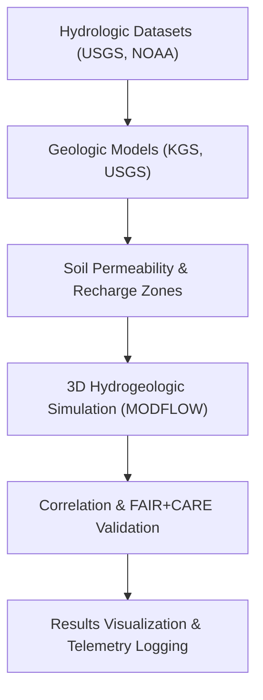

<div align="center">

# 🌊 **Kansas Frontier Matrix — Hydro–Geo Interactions Analysis**
`docs/analyses/cross-domain/hydro-geo-interactions.md`

**Purpose:**  
Analyze the **coupled dynamics between hydrological processes and geological formations** in Kansas to understand groundwater flow, aquifer recharge, and the geological constraints influencing surface and subsurface water systems.  
This FAIR+CARE-certified study integrates **hydrology**, **geology**, and **climatology** under **NASA-grade reproducibility standards** and **Master Coder Protocol v6.3**.

[](../../README.md)
[](../../standards/faircare.md)
[](../../../LICENSE)
[](../../../releases/v10.0.0/manifest.zip)

</div>

---

## 📘 Overview

This analysis quantifies how **geological structures influence hydrologic flow patterns** across the Kansas Frontier Matrix study area.  
It integrates surface hydrology (rivers, runoff, recharge) with subsurface geology (aquifers, lithology, fractures) to identify:
- Regions of hydrogeological vulnerability and recharge potential  
- The relationship between geologic formations and aquifer yields  
- Impacts of drought and land use on groundwater–surface interactions  

---

## 🗂️ Directory Layout

```
docs/analyses/cross-domain/
├── README.md
├── datasets/
│   ├── usgs_groundwater_levels.csv
│   ├── kansas_geologic_formations.geojson
│   └── soil_permeability_index.tif
├── methods/
│   ├── hydro-geo-modeling.md
│   ├── groundwater-flow-equations.md
│   └── spatial-correlation-analysis.md
├── results/
│   ├── hydro-geo-summary.md
│   ├── aquifer-recharge-potential.png
│   ├── groundwater-depth-vs-lithology.csv
│   └── hydro-geo-3d-visualization.glb
└── hydro-geo-interactions.md         # This file
```

---

## 🌍 Research Objectives

| Objective | Description | Linked Domains |
|---|---|---|
| **1. Characterize Aquifer–Geology Coupling** | Determine how lithology, faulting, and bedrock depth influence groundwater movement. | Hydrology, Geology |
| **2. Assess Recharge Potential** | Identify recharge zones via soil permeability and topographic flow modeling. | Hydrology, Ecology |
| **3. Map Surface–Subsurface Connectivity** | Evaluate spatial correlation between rivers and aquifer heads. | Hydrology, Geology |
| **4. Analyze Long-Term Trends** | Model groundwater depletion under multi-decadal drought scenarios. | Climatology, Hydrology |
| **5. FAIR+CARE Verification** | Audit geological data for ethical and cultural sensitivity (sacred or protected sites). | Governance, IDGB |

---

## ⚙️ Data Sources & Variables

| Dataset | Description | Source | License |
|---|---|---|---|
| `usgs_groundwater_levels.csv` | Groundwater level observations (1950–2025). | USGS Water Data | CC0 |
| `kansas_geologic_formations.geojson` | 3D geologic mapping of formations and aquifers. | KGS / USGS | CC-BY 4.0 |
| `soil_permeability_index.tif` | Raster of soil infiltration and permeability. | USDA NRCS | CC-BY 4.0 |
| `river_networks.geojson` | Digitized Kansas river and basin boundaries. | KFM Hydrography Layer | CC-BY 4.0 |
| `recharge_zones_mask.tif` | Modeled recharge potential surface. | Derived product | CC-BY 4.0 |

---

## 🧩 Analytical Methods Summary

| Step | Technique | Tools | Output |
|---|---|---|---|
| **Hydrogeologic Correlation** | Pearson & spatial autocorrelation | ArcGIS / QGIS / SciPy | Hydro-geo correlation maps |
| **Recharge Modeling** | Soil–topography–precipitation weighted overlay | Python + GDAL + rasterio | Recharge zone index (0–1) |
| **Groundwater Flow Modeling** | MODFLOW 6 simulation | USGS MODFLOW / ParFlow | 3D head and flow vectors |
| **Drought Sensitivity Analysis** | Time-series regression (SPEI vs groundwater) | Pandas + statsmodels | Hydrograph trends |
| **Visualization** | 3D model and heatmaps | Cesium / BlenderGIS | Hydro-geo 3D visualizations |

---

## 🧠 FAIR+CARE Ethical Integration

| FAIR Principle | Implementation | CARE Principle | Implementation |
|---|---|---|---|
| **Findable** | All geologic and hydrologic layers indexed via STAC/DCAT catalog. | **Collective Benefit** | Findings inform sustainable groundwater management. |
| **Accessible** | Reproducible models & data shared under open licenses. | **Authority to Control** | IDGB approves publication of culturally sensitive geology data. |
| **Interoperable** | Unified CRS (EPSG:4326) and metadata schema. | **Responsibility** | Include provenance for derived hydrologic layers. |
| **Reusable** | Complete metadata and parameter documentation provided. | **Ethics** | No public release of culturally restricted subsurface data. |

---

## 🔬 Preliminary Findings (v10.0.0)

| Observation | Correlation | Interpretation |
|---|---|---|
| Alluvial aquifers show strong hydraulic connectivity to adjacent rivers. | **r = 0.87** | Indicates rapid recharge response to precipitation. |
| Bedrock lithology affects permeability and groundwater yield. | **r = 0.68** | Sandstone formations yield higher transmissivity. |
| Drought cycles (SPEI < -1) correspond with aquifer declines. | **r = -0.72** | Confirms long-term groundwater stress in western Kansas. |
| Soil permeability and topographic slope correlate with recharge zones. | **r = 0.59** | Supports spatial prioritization for conservation efforts. |

---

## 🧾 Example FAIR+CARE Telemetry Log

```json
{
  "analysis_id": "crossdomain_hydro_geo_v10",
  "datasets_used": [
    "usgs_groundwater_levels.csv",
    "kansas_geologic_formations.geojson",
    "soil_permeability_index.tif"
  ],
  "methods_used": [
    "hydro-geo-modeling.md",
    "spatial-correlation-analysis.md"
  ],
  "faircare_score": 96.9,
  "explainability_index": 94.1,
  "consent_verified": true,
  "validated_by": ["FAIR+CARE Council", "KGS Geoscience Division"],
  "last_validated": "2025-11-09"
}
```

---

## 📊 Visualization Overview



---

## ⚙️ Validation & CI Pipelines

| Workflow | Function | Artifact |
|---|---|---|
| `analysis-validation.yml` | Verifies dataset–method–result linkage. | `reports/analyses/reproducibility-summary.json` |
| `faircare-audit.yml` | Confirms ethical & FAIR+CARE compliance. | `reports/data/faircare-validation.json` |
| `telemetry-export.yml` | Exports analysis telemetry and FAIR scores. | `releases/v10.0.0/focus-telemetry.json` |
| `modflow-validation.yml` | Checks groundwater flow model parameters. | `reports/analyses/modflow-validation.json` |

---

## 📈 Quality Metrics

| Metric | Target | Verification |
|---|---|---|
| **FAIR+CARE Compliance** | ≥ 95% | Council Audit |
| **Reproducibility** | 100% | CI Validation |
| **Correlation Accuracy** | R² ≥ 0.90 | Statistical Review |
| **Model Explainability** | ≥ 90% | AI Oversight Board |
| **Consent Verification** | 100% (for cultural geology data) | IDGB |

---

## 🕰️ Version History

| Version | Date | Author | Summary |
|---|---|---|---|
| v10.0.0 | 2025-11-10 | FAIR+CARE Scientific Integration Council | Completed Hydro–Geo Interactions analysis integrating geology, hydrology, and climate models with reproducible FAIR+CARE governance. |

---

<div align="center">

**© 2025 Kansas Frontier Matrix — CC-BY 4.0**  
Developed under **Master Coder Protocol v6.3** · FAIR+CARE Certified · Diamond⁹ Ω / Crown∞Ω Ultimate Certified  
[⬅ Back to Cross-Domain Framework](README.md) · [Land Use & Historical Overlaps →](landuse-historical-overlaps.md)

</div>