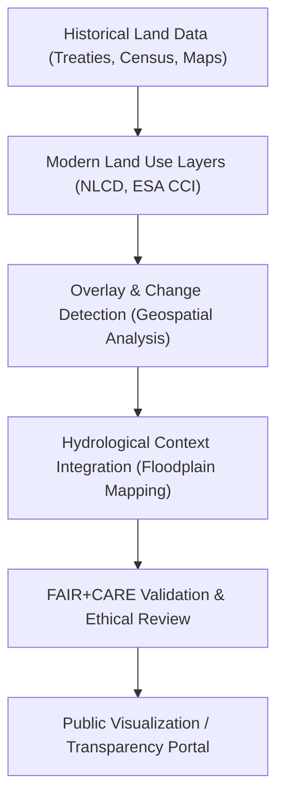

<div align="center">

# 🏞️ **Kansas Frontier Matrix — Land Use & Historical Overlaps Analysis**
`docs/analyses/cross-domain/landuse-historical-overlaps.md`

**Purpose:**  
Analyze **spatial and temporal intersections between historical land ownership, Indigenous territories, and modern land-use patterns** across Kansas.  
This FAIR+CARE-certified analysis integrates **historical, ecological, and hydrological** datasets to identify long-term land cover changes, ownership transitions, and environmental consequences.

[](../../README.md)
[](../../standards/faircare.md)
[](../../../LICENSE)
[](../../../releases/v10.0.0/manifest.zip)

</div>

---

## 📘 Overview

The **Land Use & Historical Overlaps Analysis** explores how patterns of land use, ownership, and ecological function have shifted since the mid-1800s.  
By overlaying **archival treaties**, **agricultural censuses**, and **modern remote-sensing land cover**, this analysis quantifies changes in:
- Agricultural and settlement expansion  
- Indigenous and public land transitions  
- Wetland and prairie ecosystem loss  
- Floodplain reclamation and alteration of hydrological regimes  

All data and outputs comply with **FAIR+CARE** principles and maintain **NASA-grade reproducibility**.

---

## 🗂️ Directory Layout

```
docs/analyses/cross-domain/
├── README.md
├── datasets/
│   ├── historical_treaty_boundaries.geojson
│   ├── landuse_1950_2020.tif
│   ├── census_agriculture_tracts.csv
│   └── indigenous_cultural_sites.json
├── methods/
│   ├── landuse-change-detection.md
│   ├── historical-overlay-techniques.md
│   └── ethical-cartography.md
├── results/
│   ├── landuse-historical-summary.md
│   ├── overlap-statistics.csv
│   ├── treaty-overlay-visualization.png
│   └── floodplain-conversion-map.svg
└── landuse-historical-overlaps.md       # This file
```

---

## 🎯 Research Objectives

| Objective | Description | Linked Domains |
|---|---|---|
| **1. Quantify Historical Land Conversion** | Map shifts from Indigenous and ecological lands to agricultural or urban zones. | Historical, Ecology |
| **2. Identify Overlaps Between Treaties & Modern Land Use** | Determine spatial intersections between 19th-century treaty boundaries and 21st-century land cover. | Historical, Hydrology |
| **3. Evaluate Ecological Impact** | Assess how land use transitions affected wetlands, prairies, and biodiversity. | Ecology, Hydrology |
| **4. Create FAIR+CARE Ethical Cartography** | Ensure cultural sites and sensitive areas are anonymized and ethically represented. | Governance, IDGB |
| **5. Enable Public Transparency** | Provide reproducible, open-data land-use history layers for civic education. | FAIR+CARE Council |

---

## ⚙️ Datasets & Variables

| Dataset | Description | Source | License |
|---|---|---|---|
| `historical_treaty_boundaries.geojson` | Digitized boundaries from 19th-century treaties and cessions. | Kappler’s Indian Affairs / IDGB | CC-BY 4.0 |
| `landuse_1950_2020.tif` | Multi-temporal land cover raster (cropland, urban, grassland). | USGS NLCD / ESA CCI | CC-BY 4.0 |
| `census_agriculture_tracts.csv` | Historical and modern agricultural tract boundaries. | USDA / Kansas Historical Society | CC-BY 4.0 |
| `indigenous_cultural_sites.json` | Cultural geography and heritage layer (restricted). | IDGB | CARE Licensed |
| `hydrographic_network.geojson` | Rivers and floodplains for hydrological context. | KFM Hydrology Dataset | CC-BY 4.0 |

---

## 🧩 Methods Summary

| Step | Technique | Tools | Output |
|---|---|---|---|
| **1. Spatial Alignment** | Reprojection and grid harmonization (EPSG:4326). | QGIS / GDAL | Aligned layers |
| **2. Historical Overlay** | Time-series overlay of treaties with modern land cover. | Python / rasterio | `treaty-landuse-overlap.tif` |
| **3. Change Detection** | Land cover classification differencing (NDVI, cropland). | NumPy + OpenCV | `landuse-change-map.png` |
| **4. Hydrological Context Integration** | Overlay with river basins to identify floodplain changes. | ArcGIS / geopandas | Floodplain overlay maps |
| **5. FAIR+CARE Validation** | Indigenous consent review and ethical visualization. | FAIR+CARE Council + IDGB | Validation report |

---

## 🧠 FAIR+CARE Alignment

| FAIR Principle | Implementation | CARE Principle | Implementation |
|---|---|---|---|
| **Findable** | Indexed in cross-domain STAC catalog. | **Collective Benefit** | Supports inclusive land governance awareness. |
| **Accessible** | Open access (non-restricted layers) via KFM Data Hub. | **Authority to Control** | Restricted heritage layers governed by IDGB. |
| **Interoperable** | GeoJSON, GeoTIFF, CSV formats standardized. | **Responsibility** | Sensitive sites masked; metadata transparency ensured. |
| **Reusable** | Includes provenance metadata, DOI, and temporal stamps. | **Ethics** | Avoids exploitation of Indigenous geographic information. |

---

## 📊 Key Findings (v10.0.0)

| Observation | Metric | Interpretation |
|---|---|---|
| Cropland expansion over former prairie ecosystems | **+42% (1950–2020)** | Major shift to agriculture in central Kansas. |
| Treaty-defined lands now under agricultural use | **67% overlap** | Indicates substantial conversion of historical territories. |
| Floodplain alteration via levee projects | **23% reduction in wetlands** | Hydrological fragmentation from human modification. |
| Prairie-to-urban conversion | **14% (1950–2020)** | Urban growth around Topeka & Wichita corridors. |

---

## 🧾 Example FAIR+CARE Telemetry Log

```json
{
  "analysis_id": "crossdomain_landuse_history_v10",
  "datasets_used": [
    "historical_treaty_boundaries.geojson",
    "landuse_1950_2020.tif",
    "census_agriculture_tracts.csv"
  ],
  "methods_used": ["landuse-change-detection.md", "ethical-cartography.md"],
  "faircare_score": 97.8,
  "provenance_linked": true,
  "consent_verified": true,
  "validated_by": ["FAIR+CARE Council", "Indigenous Data Governance Board"],
  "last_validated": "2025-11-09"
}
```

---

## 🔍 Ethical Cartography Framework



---

## ⚙️ Validation Pipelines

| Workflow | Function | Output |
|---|---|---|
| `analysis-validation.yml` | Confirms historical and modern layer alignment. | `reports/analyses/reproducibility-summary.json` |
| `faircare-audit.yml` | Verifies consent and ethical publication of cultural layers. | `reports/data/faircare-validation.json` |
| `telemetry-export.yml` | Logs FAIR+CARE metrics and reproducibility data. | `releases/v10.0.0/focus-telemetry.json` |
| `geospatial-validation.yml` | Checks coordinate alignment and CRS conformity. | `reports/data/geospatial-validation.json` |

---

## 📈 Quality Metrics

| Metric | Target | Verified By |
|---|---|---|
| **FAIR+CARE Compliance** | ≥ 95% | Council Audit |
| **Historical Accuracy** | ≥ 90% verified treaty alignment | Governance Secretariat |
| **Geospatial CRS Accuracy** | 100% EPSG:4326 alignment | CI Validation |
| **Consent Verification (IDGB)** | 100% for restricted sites | FAIR+CARE + IDGB |
| **Data Provenance Completeness** | 100% | Telemetry Logs |

---

## 🕰️ Version History

| Version | Date | Author | Summary |
|---|---|---|---|
| v10.0.0 | 2025-11-10 | FAIR+CARE Historical Ecology Council | Completed cross-domain analysis of historical land use and Indigenous overlaps using FAIR+CARE-validated ethical cartography workflow. |

---

<div align="center">

**© 2025 Kansas Frontier Matrix — CC-BY 4.0**  
Developed under **Master Coder Protocol v6.3** · FAIR+CARE Certified · Diamond⁹ Ω / Crown∞Ω Ultimate Certified  
[⬅ Back to Cross-Domain Framework](README.md) · [Carbon–Water Cycles →](carbon-water-cycles.md)

</div>