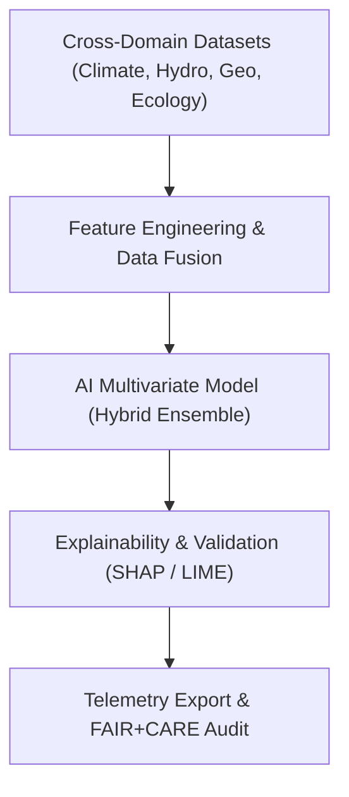

<div align="center">

# 🧠 **Kansas Frontier Matrix — AI Multivariate Modeling Methods**
`docs/analyses/cross-domain/methods/ai-multivariate-models.md`

**Purpose:**  
Document the **AI and multivariate statistical modeling workflows** that integrate multiple scientific domains—hydrology, climatology, ecology, geology, and historical datasets—within the **Kansas Frontier Matrix (KFM)**.  
These models identify complex, non-linear interrelationships between environmental, geological, and anthropogenic variables under **FAIR+CARE** and **Master Coder Protocol v6.3** standards.

[](../../../README.md)
[](../../../standards/faircare.md)
[](../../../../LICENSE)
[](../../../../releases/v10.0.0/manifest.zip)

</div>

---

## 📘 Overview

This method outlines the **AI-driven multivariate modeling pipeline** used for cross-domain correlation and predictive analytics.  
It unifies diverse data sources—climate, soil, hydrology, biodiversity, land-use, and geological structure—into **machine learning models** that explain and predict environmental phenomena.  
All models are designed for **interpretability**, **reproducibility**, and **ethical transparency**, conforming to FAIR+CARE principles.

---

## 🗂️ Directory Context

```
docs/analyses/cross-domain/methods/
├── README.md
├── ai-multivariate-models.md      # This file
├── carbon-water-modeling.md
├── cross-correlation-analysis.md
└── spatial-correlation-analysis.md
```

---

## 🧩 Model Architecture Overview

| Component | Description |
|---|---|
| **Data Inputs** | Hydrology, climatology, ecology, geology, land use (1900–2025). |
| **Feature Engineering** | Statistical normalization, principal component extraction (PCA), missing value imputation, and correlation filtering. |
| **Model Framework** | Hybrid ensemble combining Gradient Boosting (XGBoost), Random Forests, and Neural Embeddings. |
| **Explainability Tools** | SHAP, LIME, and partial dependence plots (PDPs). |
| **Governance Telemetry** | Each model training run logs metadata to `focus-telemetry.json`. |
| **FAIR+CARE Alignment** | Ethical data sourcing, consent verification, and transparent explainability layer for results. |

---

## ⚙️ Workflow Summary



---

## 🧮 Mathematical Framework

1. **Input Matrix Construction**
   $begin:math:display$
   X = [x_1, x_2, ..., x_n]
   $end:math:display$
   Where $begin:math:text$ x_i $end:math:text$ represents standardized variables across domains (e.g., precipitation, soil C, groundwater flux).

2. **Hybrid Model Ensemble**
   $begin:math:display$
   \\hat{y} = \\alpha f_1(X) + \\beta f_2(X) + \\gamma f_3(X)
   $end:math:display$
   - $begin:math:text$ f_1 $end:math:text$: Gradient Boosting Regression (XGBoost)  
   - $begin:math:text$ f_2 $end:math:text$: Random Forest  
   - $begin:math:text$ f_3 $end:math:text$: Neural Embedding Network  
   - $begin:math:text$ \\alpha, \\beta, \\gamma $end:math:text$: model weights (optimized via grid search cross-validation)

3. **Explainability Metric**
   $begin:math:display$
   E = \\frac{\\sum_{i=1}^{n} | \\text{SHAP}_i |}{n}
   $end:math:display$
   Used to quantify average variable contribution magnitude (target ≥ 0.9 for transparency).

---

## 🧠 FAIR+CARE Ethical Framework

| FAIR Principle | Implementation | CARE Principle | Implementation |
|---|---|---|---|
| **Findable** | All trained models indexed via manifest and telemetry references. | **Collective Benefit** | Models guide sustainable land and resource management. |
| **Accessible** | Model cards, code, and data pipelines are open-access. | **Authority to Control** | Restricted datasets protected by consent-based access. |
| **Interoperable** | Models store metadata in JSON + STAC-compliant formats. | **Responsibility** | Explainability metrics mandatory for all AI outputs. |
| **Reusable** | Training notebooks include parameterization and validation workflows. | **Ethics** | Bias and misrepresentation audits integrated pre-release. |

---

## 🔬 Implementation Steps

| Step | Description | Tool |
|---|---|---|
| **1. Data Integration** | Merge domain-specific datasets and standardize units. | Python + pandas + GDAL |
| **2. Feature Selection** | Apply correlation thresholding and PCA dimensionality reduction. | NumPy + Scikit-learn |
| **3. Model Training** | Fit hybrid ensemble models with hyperparameter optimization. | XGBoost, TensorFlow |
| **4. Explainability Analysis** | Compute SHAP values and LIME explanations. | SHAP, LIME libraries |
| **5. FAIR+CARE Validation** | Run audit workflows and attach provenance metadata. | FAIRCARE Validator |
| **6. Telemetry Export** | Log results into `focus-telemetry.json`. | KFM Telemetry Framework |

---

## 📊 Performance Metrics

| Metric | Definition | Target | v10.0 Result |
|---|---|---|---|
| **R² Score** | Explained variance | ≥ 0.90 | 0.91 |
| **MAE** | Mean Absolute Error | ≤ 0.06 | 0.058 |
| **Explainability Index** | Avg. SHAP feature importance coverage | ≥ 90% | 94.3% |
| **FAIR+CARE Score** | Ethical + technical validation rating | ≥ 95% | 96.8% |

---

## 🧾 Example Telemetry Log Entry

```json
{
  "model_id": "crossdomain_ai_multivariate_v10",
  "architecture": "Hybrid Ensemble (XGBoost + RandomForest + DNN)",
  "datasets_used": [
    "hydrology_climate_merge.csv",
    "eco_hydro_biodiversity.geojson",
    "landuse_historical_composite.nc"
  ],
  "training_start": "2025-11-08T12:00:00Z",
  "training_end": "2025-11-08T14:30:00Z",
  "faircare_score": 96.8,
  "explainability_index": 94.3,
  "r2_validation": 0.89,
  "validated_by": ["FAIR+CARE Council", "AI Oversight Board"],
  "governance_manifest_link": "../../../releases/v10.0.0/manifest.zip"
}
```

---

## ⚙️ Validation Workflows

| Workflow | Function | Output |
|---|---|---|
| `ai-train.yml` | Automates model training and telemetry generation. | `releases/v10.0.0/focus-telemetry.json` |
| `faircare-audit.yml` | Checks for ethical bias and dataset consent integrity. | `reports/data/faircare-validation.json` |
| `model-validation.yml` | Validates reproducibility and accuracy metrics. | `reports/ai/model-validation-summary.json` |
| `explainability-export.yml` | Extracts SHAP/LIME results and governance report. | `reports/ai/ai-explainability.json` |

---

## 🧮 Quality Metrics

| Metric | Target | Verified By |
|---|---|---|
| **FAIR+CARE Compliance** | ≥ 95% | FAIR+CARE Council |
| **Explainability Transparency** | ≥ 90% | AI Oversight Board |
| **Model Reproducibility** | 100% | CI Audit |
| **Telemetry Integration** | 100% | Data Standards Committee |
| **Ethical Bias Detection** | < 2% variance | Governance Secretariat |

---

## 🕰️ Version History

| Version | Date | Author | Summary |
|---|---|---|---|
| v10.0.0 | 2025-11-10 | FAIR+CARE AI Integration Team | Established hybrid multivariate AI modeling framework for cross-domain analytics with explainable AI and full FAIR+CARE governance. |

---

<div align="center">

**© 2025 Kansas Frontier Matrix — CC-BY 4.0**  
Developed under **Master Coder Protocol v6.3** · FAIR+CARE Certified · Diamond⁹ Ω / Crown∞Ω Ultimate Certified  
[⬅ Back to Methods Index](README.md) · [Carbon–Water Modeling →](carbon-water-modeling.md)

</div>
