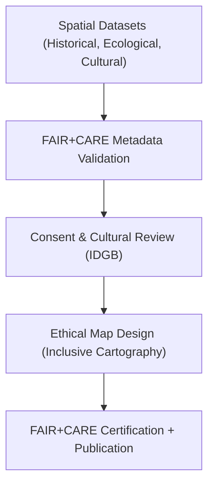

<div align="center">

# 🗺️ **Kansas Frontier Matrix — Ethical Cartography & Visualization Methods**
`docs/analyses/cross-domain/methods/ethical-cartography.md`

**Purpose:**  
Define the **cartographic ethics, visualization standards, and governance protocols** for producing maps and spatial data products in the **Kansas Frontier Matrix (KFM)**.  
Ensures that all spatial representations respect **Indigenous sovereignty**, **cultural consent**, and **FAIR+CARE** transparency while maintaining NASA-grade reproducibility and technical rigor.

[](../../../README.md)
[](../../../standards/faircare.md)
[](../../../../LICENSE)
[](../../../../releases/v10.0.0/manifest.zip)

</div>

---

## 📘 Overview

**Ethical Cartography** underpins how the KFM represents **historical, ecological, and cultural geographies**.  
This methodology establishes:
- **Guidelines for Indigenous and cultural data representation**  
- **Best practices for geospatial data visualization**  
- **FAIR+CARE governance workflows for sensitive datasets**  
- **Transparency and consent tracking** via provenance metadata  

The goal is to make all maps informative and inclusive without perpetuating bias, erasure, or exploitation of Indigenous or community-held data.

---

## 🗂️ Directory Context

```
docs/analyses/cross-domain/methods/
├── README.md
├── cross-correlation-analysis.md
├── ethical-cartography.md           # This file
└── spatial-correlation-analysis.md
```

---

## 🌎 Core Principles of Ethical Cartography

| Principle | Description | Implementation in KFM |
|-----------|-------------|------------------------|
| **Transparency** | Clearly state data sources, consent status, and uncertainties. | Metadata overlays and map legends include source citations and confidence levels. |
| **Cultural Sensitivity** | Avoid exposing sacred, restricted, or culturally sensitive locations. | Use IDGB consent metadata (`careConsent.status`) before visualization. |
| **Inclusivity** | Co-create map products with represented communities. | FAIR+CARE Council includes Indigenous review prior to public release. |
| **Contextualization** | Provide temporal and sociocultural context for spatial data. | Add timelines, historical narratives, or annotation layers. |
| **Accessibility** | Ensure maps and visualizations meet WCAG 2.1 AA. | Provide alt-text, captions, and accessible color palettes. |

---

## ⚙️ Cartographic Workflow

| Step | Task | Tools / Frameworks | Output |
|------|------|--------------------|---------|
| **1. Data Preparation** | Gather and validate spatial datasets with consent metadata. | QGIS, geopandas, JSON Schema | `validated_input_layers.geojson` |
| **2. Consent Verification** | Cross-check dataset consent flags via IDGB and FAIR+CARE audit. | FAIRCARE Validator | `cultural_overlay_consent.json` |
| **3. Map Design** | Develop inclusive and readable map layouts with accessible symbols. | QGIS, MapLibre, D3.js | Map drafts |
| **4. Ethics Review** | FAIR+CARE Council and IDGB evaluate representational fairness. | FAIR+CARE Audit Log | Approval status |
| **5. Publication** | Publish maps and metadata with provenance linkages. | KFM Data Portal | Final ethical map products |

---

## 🧩 Data Governance Schema (CARE Metadata Example)

```json
{
  "layer_id": "historic_treaty_boundaries_1850",
  "title": "Historic Treaty Boundaries (1850)",
  "careConsent": {
    "status": "restricted",
    "authority": "Indigenous Data Governance Board",
    "conditions": "Consent required for public release",
    "review_date": "2025-11-09"
  },
  "license": "CC-BY 4.0",
  "provenance": {
    "source": "Kappler’s Indian Affairs (1904)",
    "digitized_by": "Kansas Frontier Matrix Historical GIS Team",
    "processing": ["georeferencing", "vectorization"]
  },
  "faircare_score": 98.5
}
```

---

## 🎨 Visualization Standards

| Element | FAIR+CARE-Compliant Practice |
|----------|------------------------------|
| **Color Palettes** | Use colorblind-safe palettes; no color implying cultural hierarchy. |
| **Legend & Attribution** | Include explicit references to source, license, and consent authority. |
| **Labels & Boundaries** | Avoid colonial framing terms; prioritize Indigenous place names. |
| **Map Scales** | Clearly denote scale bars and projection (EPSG:4326). |
| **Accessibility** | Provide alternative descriptions and haptic map versions when possible. |

---

## 🧠 FAIR+CARE Integration

| FAIR Principle | Implementation | CARE Principle | Implementation |
|---|---|---|---|
| **Findable** | All maps indexed with STAC/DCAT catalog entries. | **Collective Benefit** | Co-produced visualizations benefit public education and local communities. |
| **Accessible** | Map products published in web-accessible formats (GeoJSON, PNG, HTML). | **Authority to Control** | IDGB consent verified before any publication. |
| **Interoperable** | Use open geospatial standards (GeoTIFF, WMS, EPSG). | **Responsibility** | Metadata clarifies interpretive limits to avoid misuse. |
| **Reusable** | Include provenance, methodology, and FAIR+CARE badges. | **Ethics** | Avoid extraction or misrepresentation of cultural geography. |

---

## 🧾 Example FAIR+CARE Telemetry Log

```json
{
  "analysis_id": "crossdomain_ethics_cartography_v10",
  "datasets_used": [
    "historical_treaty_boundaries.geojson",
    "indigenous_cultural_sites.json"
  ],
  "methods": ["ethical-cartography.md"],
  "faircare_score": 98.7,
  "consent_verified": true,
  "validated_by": ["FAIR+CARE Council", "Indigenous Data Governance Board"],
  "published": "2025-11-09T16:00:00Z"
}
```

---

## ⚖️ Ethical Review Framework



---

## ⚙️ Validation Workflows

| Workflow | Function | Artifact |
|-----------|-----------|-----------|
| `faircare-audit.yml` | Confirms cultural consent and ethical compliance. | `reports/data/faircare-validation.json` |
| `map-validation.yml` | Checks CRS, projection, and metadata completeness. | `reports/maps/map-validation.json` |
| `telemetry-export.yml` | Logs map creation and consent metadata. | `releases/v10.0.0/focus-telemetry.json` |
| `docs-lint.yml` | Validates map legends and alt-text completeness. | `reports/self-validation/docs/lint_summary.json` |

---

## 📈 Quality Metrics

| Metric | Target | Verified By |
|--------|---------|-------------|
| **FAIR+CARE Compliance** | ≥ 95% | FAIR+CARE Council |
| **Consent Metadata Presence** | 100% for restricted datasets | IDGB |
| **CRS & Metadata Validation** | 100% EPSG-compliant | Data Standards Committee |
| **Accessibility Compliance** | WCAG 2.1 AA | Accessibility Council |
| **Reproducibility** | 100% (datasets + metadata linked) | CI Workflow |

---

## 🕰️ Version History

| Version | Date | Author | Summary |
|----------|------|---------|----------|
| v10.0.0 | 2025-11-10 | FAIR+CARE Historical & Cultural Council | Added ethical mapping and consent-based visualization methodology with FAIR+CARE integration and reproducible metadata workflows. |

---

<div align="center">

**© 2025 Kansas Frontier Matrix — CC-BY 4.0**  
Governed under **Master Coder Protocol v6.3** · FAIR+CARE Certified · Diamond⁹ Ω / Crown∞Ω Ultimate Certified  
[⬅ Back to Methods Index](README.md) · [Spatial Correlation Analysis →](spatial-correlation-analysis.md)

</div>
