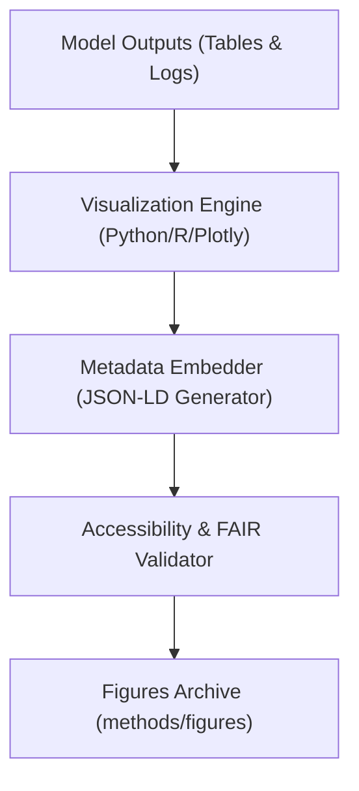

<div align="center">

# 🖼️ **Kansas Frontier Matrix — Cross-Domain Methods: Figures**  
`docs/analyses/cross-domain/methods/figures/README.md`

**Purpose:**  
Archive and describe **visual figures and analytical diagrams** generated by the Cross-Domain Modeling Methods within Kansas Frontier Matrix (KFM).  
These visuals communicate key model relationships, statistical results, and geospatial integration patterns under FAIR+CARE documentation standards.

[](../../../../../../../docs/standards/markdown_guide.md)
[](../../../../../../../LICENSE)
[](../../../../../../../docs/standards/faircare.md)
[](../../../../../../../releases/v10.2.0/manifest.zip)

</div>

---

## 📘 Overview

This directory contains visual artifacts—charts, maps, correlation diagrams, and model schematics—produced during the development of **cross-domain analytical methods**.  
Each figure adheres to KFM’s visual governance framework, embedding metadata (version, dataset reference, checksum) and ensuring accessibility (WCAG 2.1 AA).

Figures illustrate:
- Model architecture and AI multivariate structure  
- Spatial and temporal correlation patterns across domains  
- Validation metrics and performance benchmarks  
- FAIR+CARE ethical visual overlays (e.g., consent boundaries, cultural regions)

---

## 🗂️ Directory Layout

```bash
figures/
 ├── ai-multivariate-architecture.svg       # Diagram of AI model inputs and outputs
 ├── carbon-water-correlation-plot.png      # Scatterplot showing carbon vs water flux
 ├── climate-ecology-network-map.svg        # Ecological interactions under climate stress
 ├── hydro-geo-simulation-results.pdf       # Visual report of hydro-geologic simulations
 ├── spatial-correlation-heatmap.png        # Cross-domain spatial autocorrelation matrix
 └── README.md                              # This file
```

Each file includes a JSON-LD metadata annotation block for provenance and machine readability.

---

## 🧾 Figure Descriptions

| File | Description | Domain | Format | Validation |
|------|--------------|--------|---------|-------------|
| `ai-multivariate-architecture.svg` | Structural flowchart of multivariate AI modeling across climatology and hydrology | AI / Systems | SVG | FAIR+CARE Metadata Validator |
| `carbon-water-correlation-plot.png` | Scatter plot showing linear fit between carbon flux and water availability | Hydrology / Ecology | PNG | FAIR Accessibility Check |
| `climate-ecology-network-map.svg` | Graph network of species interactions under climate scenarios | Ecology / Climate | SVG | Schema Integrity Audit |
| `hydro-geo-simulation-results.pdf` | Multi-page visualization of aquifer model outputs and validation curves | Hydrology / Geology | PDF | Validation Report |
| `spatial-correlation-heatmap.png` | Cross-domain correlation matrix between ecological, hydrologic, and climatic variables | Multi-domain | PNG | Statistical QC Script |

---

## ⚙️ Generation Workflow



1. Visualization scripts generate graphics from harmonized datasets and telemetry outputs.  
2. Metadata embedder appends version, checksum, and provenance references.  
3. FAIR+CARE validator ensures compliance with ethical visualization standards.  
4. Figures are archived and indexed in the release manifest for reproducibility.

---

## 🧩 Analytical Applications

- Visualize **cross-domain correlations** and AI model explainability outputs  
- Present **spatial-temporal dynamics** in Focus Mode dashboards  
- Audit **model validation curves** for drift detection and performance metrics  
- Communicate **ethical mapping overlays** respecting cultural data boundaries  

---

## ⚖️ FAIR+CARE Compliance Summary

| Metric | Tag | Description |
|--------|-----|-------------|
| `figure_metadata_integrity` | FAIR-Reproducible | Confirms figures embed correct version, checksum, and source metadata |
| `visual_energy_kWh` | FAIR-Sustainable | Measures energy consumption for rendering workflows |
| `ethical_visual_review` | CARE-Integrity | Confirms ethical standards in visualization of sensitive data |
| `accessibility_audit_score` | FAIR-Accessible | Verifies WCAG 2.1 AA compliance for all figures |

---

## 🕰️ Version History

| Version | Date | Author | Summary |
|----------|------|--------|----------|
| v10.2.2 | 2025-11-11 | Cross-Domain Modeling Council | Created visual archive README for cross-domain method figures, integrated FAIR+CARE metadata and validation schema. |

---

<div align="center">

© 2025 Kansas Frontier Matrix · Master Coder Protocol v6.3 · FAIR+CARE Certified  
Diamond⁹ Ω / Crown∞Ω Ultimate Certified  

[Back to Methods](../README.md) · [Governance Charter](../../../../../../../docs/standards/governance/ROOT-GOVERNANCE.md)

</div>