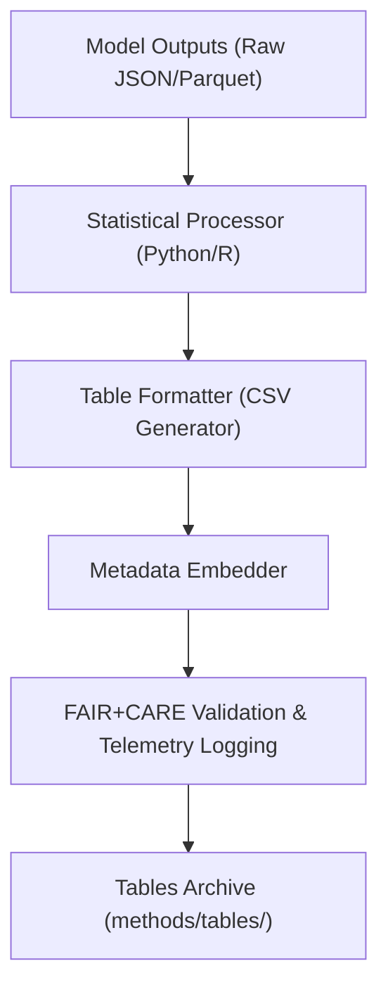

<div align="center">

# 📊 **Kansas Frontier Matrix — Cross-Domain Methods: Tables**  
`docs/analyses/cross-domain/methods/tables/README.md`

**Purpose:**  
Provide documentation for **tabular analytical outputs** generated from cross-domain modeling methods within Kansas Frontier Matrix (KFM) v10.2.2.  
These tables summarize statistical models, validation metrics, variable harmonization results, and inter-domain correlations following FAIR+CARE principles.

[](../../../../../../../docs/standards/markdown_guide.md)
[](../../../../../../../LICENSE)
[](../../../../../../../docs/standards/faircare.md)
[](../../../../../../../releases/v10.2.0/manifest.zip)

</div>

---

## 📘 Overview

This directory contains **quantitative tables** representing the numerical foundations of cross-domain analytical methods, including model coefficients, correlation matrices, and performance diagnostics.  
Each table is validated against telemetry and provenance metadata for full reproducibility and ethical traceability.

These tabular datasets are interoperable across AI, climatology, hydrology, ecology, and socio-economic analysis modules, enabling integrative model validation across domains.

---

## 🗂️ Directory Layout

```bash
tables/
 ├── ai_model_performance_metrics.csv      # AI multivariate model performance results
 ├── domain_correlation_matrix.csv         # Correlation coefficients across domains
 ├── variable_standardization_log.csv      # Harmonized variable mappings and units
 ├── validation_summary_table.csv          # Summary of model accuracy, precision, recall
 └── README.md                             # This file
```

Each file includes ISO 8601 timestamps, dataset version identifiers, and checksum hashes embedded in metadata.

---

## 🧾 Table Descriptions

| File | Description | Domain Scope | Format | Validation |
|------|--------------|---------------|---------|-------------|
| `ai_model_performance_metrics.csv` | Model accuracy, F1 scores, precision, and recall across domains | AI / Multivariate | CSV | FAIR Schema v3 |
| `domain_correlation_matrix.csv` | Cross-domain correlation matrix of key environmental and socio-economic variables | Multi-domain | CSV | Statistical QC |
| `variable_standardization_log.csv` | Unit conversion and variable harmonization reference table | All domains | CSV | FAIR+CARE Metadata Validator |
| `validation_summary_table.csv` | Consolidated summary of model validation metrics from each domain method | Multi-domain | CSV | Telemetry Integrity Check |

---

## ⚙️ Generation Workflow



1. Model results exported as JSON/Parquet from pipelines.  
2. Statistical processor computes summaries and correlations.  
3. Tables are formatted, versioned, and metadata embedded.  
4. Validation and telemetry scripts verify schema compliance and provenance linkage.  
5. Tables are archived and indexed within the release manifest.

---

## 🧩 Analytical Applications

- Validate AI model outputs across domains with unified metrics.  
- Quantify statistical relationships between environmental and socio-economic datasets.  
- Track standardization of variables and units for interoperability.  
- Serve as source data for visualizations in `methods/figures/`.  
- Enable reproducibility verification via telemetry logs and governance audits.  

---

## ⚖️ FAIR+CARE Compliance Summary

| Metric | Tag | Description |
|--------|-----|-------------|
| `table_schema_integrity` | FAIR-Reproducible | Confirms header consistency and metadata completeness |
| `variable_standardization_coverage` | FAIR-Interoperable | Percentage of harmonized attributes across domains |
| `energy_per_table_kWh` | FAIR-Sustainable | Energy usage logged during table generation |
| `audit_trace_validity` | CARE-Transparency | Validates provenance chain and ethical review status |

---

## 🕰️ Version History

| Version | Date | Author | Summary |
|----------|------|--------|----------|
| v10.2.2 | 2025-11-11 | Cross-Domain Integration Council | Created documentation for cross-domain method tables, added metadata embedding and FAIR+CARE validation workflow. |

---

<div align="center">

© 2025 Kansas Frontier Matrix · Master Coder Protocol v6.3 · FAIR+CARE Certified  
Diamond⁹ Ω / Crown∞Ω Ultimate Certified  

[Back to Methods](../README.md) · [Governance Charter](../../../../../../../docs/standards/governance/ROOT-GOVERNANCE.md)

</div>