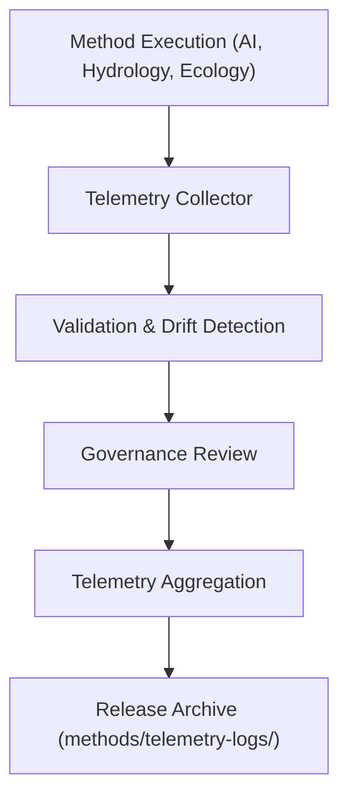

<div align="center">

# 📡 **Kansas Frontier Matrix — Cross-Domain Methods: Telemetry Logs**  
`docs/analyses/cross-domain/methods/telemetry-logs/README.md`

**Purpose:**  
Archive and describe the **telemetry and audit data** produced during execution of Cross-Domain Modeling Methods within the Kansas Frontier Matrix (KFM).  
This telemetry layer ensures full traceability of performance, governance, and ethical compliance under FAIR+CARE standards.

[](../../../../../../../docs/standards/markdown_guide.md)
[](../../../../../../../LICENSE)
[](../../../../../../../docs/standards/faircare.md)
[](../../../../../../../releases/v10.2.0/manifest.zip)

</div>

---

## 📘 Overview

This directory captures **runtime telemetry and governance logs** associated with all analytical and modeling methods within the Cross-Domain framework.  
Each log provides measurable transparency on computational efficiency, model integrity, ethical compliance, and AI explainability during method execution.

Telemetry is continuously aggregated and validated through CI/CD pipelines, providing data to FAIR+CARE dashboards and governance audits.

---

## 🗂️ Directory Layout

```bash
telemetry-logs/
 ├── ai-model-latency.json             # Inference latency logs for AI multivariate models
 ├── energy-usage-metrics.csv          # Energy consumption logs (kWh per job)
 ├── model-drift-detection.log         # Model drift and retraining alerts
 ├── governance-events.log             # FAIR+CARE governance interventions and consent actions
 ├── validation-summary.jsonl          # Validation outcomes for modeling and correlation analyses
 └── README.md                         # This file
```

Each log entry is linked to corresponding methods (`ai-multivariate-models.md`, `cross-correlation-analysis.md`, etc.) and cross-referenced in `focus-telemetry.json` at the release level.

---

## 🧾 Log Descriptions

| File | Description | Format | Validation |
|------|--------------|---------|-------------|
| `ai-model-latency.json` | Logs average and peak inference latency per AI method run | JSON | FAIR Schema v3 |
| `energy-usage-metrics.csv` | Records energy draw, GPU/CPU hours, and efficiency per run | CSV | SBOM-linked audit |
| `model-drift-detection.log` | Details model drift detections, thresholds, and retraining triggers | LOG | Drift validator |
| `governance-events.log` | FAIR+CARE actions (data redaction, consent verification, ethical overrides) | LOG | Governance-as-Code pipeline |
| `validation-summary.jsonl` | JSON Lines file summarizing validation metrics across methods | JSONL | CI validation workflow |

---

## ⚙️ Generation Workflow



1. Each modeling method emits telemetry and validation events.  
2. The telemetry collector aggregates data across all domains.  
3. Validation scripts detect drift, latency spikes, and compliance deviations.  
4. FAIR+CARE governance engine records ethical and consent actions.  
5. Telemetry is archived with checksum validation and indexed in the release manifest.

---

## 🧩 Analytical Applications

- **Performance Analysis:** Evaluate latency, throughput, and resource utilization per method.  
- **Ethical Compliance:** Track governance actions (CARE redactions, data consent triggers).  
- **Sustainability Metrics:** Measure compute energy usage for reproducibility audits.  
- **Drift Detection:** Identify model degradation or data schema drift across releases.  
- **Explainability Reports:** Enable bias and fairness tracking for AI modeling methods.

---

## ⚖️ FAIR+CARE Compliance Summary

| Metric | Tag | Description |
|--------|-----|-------------|
| `telemetry.log_integrity` | FAIR-Reproducible | Ensures telemetry logs include commit, checksum, and timestamp |
| `pipeline.energy_usage_kWh` | FAIR-Sustainable | Logs compute energy usage per method execution |
| `governance.audit_triggers` | CARE-Integrity | Tracks ethical actions and cultural consent reviews |
| `ai.bias_trace_index` | CARE-Transparency | Monitors bias and fairness scores in AI models |

---

## 🕰️ Version History

| Version | Date | Author | Summary |
|----------|------|--------|----------|
| v10.2.2 | 2025-11-11 | Cross-Domain Integration Council | Created telemetry log documentation for cross-domain methods; integrated governance and sustainability validation schema v3. |

---

<div align="center">

© 2025 Kansas Frontier Matrix · Master Coder Protocol v6.3 · FAIR+CARE Certified  
Diamond⁹ Ω / Crown∞Ω Ultimate Certified  

[Back to Methods](../README.md) · [Governance Charter](../../../../../../../docs/standards/governance/ROOT-GOVERNANCE.md)

</div>