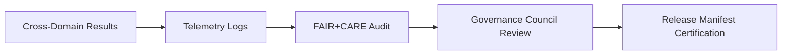

<div align="center">

# 📈 **Kansas Frontier Matrix — Cross-Domain Results Repository**  
`docs/analyses/cross-domain/results/README.md`

**Purpose:**  
Maintain and document the **Cross-Domain Analytical Results** generated within Kansas Frontier Matrix (KFM) v10.2.2 — encompassing model outputs, correlation tables, visualizations, telemetry reports, and FAIR+CARE audits.  
This repository guarantees full traceability, reproducibility, and ethical compliance across hydrology, climatology, ecology, geology, and cultural datasets.

[](../../../README.md)
[](../../../standards/faircare.md)
[](../../../../LICENSE)
[](../../../../releases/v10.2.0/manifest.zip)

</div>

---

## 📘 Overview

The **Cross-Domain Results Repository** serves as the terminal layer of the `datasets → methods → results` workflow defined under **MCP-DL v6.3**.  
All analytical outputs stored here undergo CI/CD validation, FAIR+CARE auditing, and provenance verification to maintain scientific integrity and transparency.

This repository includes:
- Quantitative result tables (`tables/`)
- Analytical and geospatial figures (`figures/`)
- Telemetry and audit logs (`telemetry-logs/`)
- Governance documentation and compliance summaries (`governance.md`)
- Cross-domain summary narratives (`summary-findings.md`)

---

## 🗂️ Directory Layout

```bash
docs/analyses/cross-domain/results/
 ├── README.md
 ├── summary-findings.md
 ├── model-card-crossdomain_v10.md
 ├── figures/
 │    └── README.md
 ├── tables/
 │    └── README.md
 ├── telemetry-logs/
 │    └── README.md
 ├── governance.md
 └── correlation-matrix.csv
```

Each subdirectory is version-controlled, containing its own README with YAML front matter, telemetry schema linkage, and version history.

---

## 🧾 Result Artefact Standards

| Artefact Type | Description | Required Metadata |
|----------------|-------------|-------------------|
| **Summary Findings** | High-level interpretations and contextual narratives | Analysis ID, date, domain linkage, datasets referenced |
| **Tabular Results** | Structured quantitative data outputs | Column descriptions, units, provenance linkage |
| **Figures & Visualizations** | Analytical diagrams, geospatial overlays, trend plots | Caption, alt-text, metadata checksum |
| **Telemetry Logs** | JSON and CSV traces of performance and validation | Run ID, runtime metrics, governance events |
| **Governance Record** | Ethical and procedural audit | Compliance reports, FAIR+CARE score, action trace |

---

## 🔍 Provenance & Traceability

Every result in this repository must:
1. Reference the **input datasets** (via DOI, STAC, or DCAT identifiers).  
2. Specify the **method or analytical pipeline** used to produce it.  
3. Include a **metadata block** (creation date, script hash, version, license).  
4. Record **telemetry linkage** for verification through `focus-telemetry.json`.  
5. Comply with **FAIR+CARE standards** for data ethics, consent, and accessibility.

---

## ⚙️ Validation Pipelines

| Workflow | Function | Output Artifact |
|-----------|-----------|-----------------|
| `analysis-validation.yml` | Confirms completeness and schema integrity | `reports/analyses/reproducibility-summary.json` |
| `faircare-audit.yml` | Executes cultural, ethical, and accessibility checks | `reports/data/faircare-validation.json` |
| `telemetry-export.yml` | Collects operational metrics and system logs | `releases/v10.2.0/focus-telemetry.json` |
| `governance-audit.yml` | Validates governance metadata and consent logs | `reports/governance/audit-summary.json` |

---

## 📊 Quality & Compliance Metrics

| Metric | Target | Verified By |
|--------|---------|-------------|
| FAIR+CARE Compliance | ≥ 95% | FAIR+CARE Council |
| Reproducibility Rate | 100% (automated) | CI/CD Validation |
| Provenance Integrity | 100% linkage | Data Standards Committee |
| Ethical Review Completion | Quarterly | Governance Council |
| Accessibility Score | ≥ 90% WCAG 2.1 AA | Human Audit |

---

## 🧠 Governance & Audit Workflow



- **Telemetry Logs:** Record metrics for latency, bias, drift, and validation outcomes.  
- **FAIR+CARE Audit:** Confirms compliance with accessibility and ethical principles.  
- **Governance Review:** Approves publication readiness and ethical standing.  
- **Release Certification:** Certified results archived with manifest checksum.  

---

## 🕰️ Version History

| Version | Date | Author | Summary |
|----------|------|--------|----------|
| v10.2.2 | 2025-11-11 | FAIR+CARE Data Standards Council | Updated Cross-Domain Results Repository to align with v10.2.2 schema and MCP-DL v6.3. |

---

<div align="center">

© 2025 Kansas Frontier Matrix · Master Coder Protocol v6.3 · FAIR+CARE Certified  
Diamond⁹ Ω / Crown∞Ω Ultimate Certified  

[Back to Cross-Domain Framework](../README.md) · [Governance Charter](../../../standards/governance/ROOT-GOVERNANCE.md)

</div>