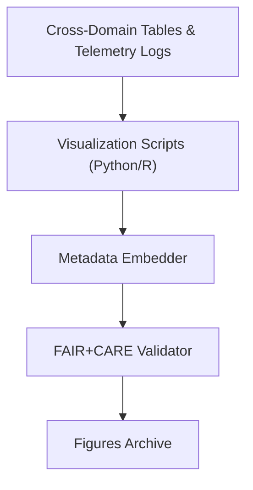

<div align="center">

# 🖼️ **Kansas Frontier Matrix — Cross-Domain Results: Figures**  
`docs/analyses/cross-domain/results/figures/README.md`

**Purpose:**  
Provide structured documentation for all visual assets generated from the **Cross-Domain Results** workflow in Kansas Frontier Matrix (KFM) v10.2.2.  
Figures include correlation diagrams, trend plots, and geospatial overlays that visually communicate analytical outcomes under FAIR+CARE governance.

[](../../../../../../docs/standards/markdown_guide.md)
[](../../../../../../LICENSE)
[](../../../../../../docs/standards/faircare.md)
[](../../../../../../releases/v10.2.0/manifest.zip)

</div>

---

## 📘 Overview

This directory houses finalized **visualizations and analytical figures** derived from cross-domain results.  
Each file captures model validation patterns, dataset harmonization performance, or spatial trends between environmental and socio-economic layers.

All figures are embedded with metadata for provenance (ISO 8601 timestamps, commit hash, checksum) and validated against the telemetry schema for compliance.

---

## 🗂️ Directory Layout

```bash
figures/
 ├── correlation_heatmap.png           # Cross-domain variable correlation visualization
 ├── trend_overlay.svg                 # Multi-domain temporal trend alignment chart
 ├── dataset_integration_flow.svg      # Process diagram of dataset harmonization
 ├── spatial_overlay_maps/             # Subfolder of geospatial overlays
 │    └── README.md
 └── README.md                         # This document
```

Each file is referenced within the release manifest and STAC catalog for discoverability and archival reproducibility.

---

## 🧾 Figure Descriptions

| File | Description | Format | Validation |
|------|--------------|---------|-------------|
| `correlation_heatmap.png` | Heatmap showing Pearson correlations between domain-specific variables | PNG | FAIR validator |
| `trend_overlay.svg` | Visualization of time-aligned multi-domain trends (climate, hydrology, land use) | SVG | Schema validation |
| `dataset_integration_flow.svg` | Workflow diagram showing inter-domain ETL and merge sequence | SVG | FAIR+CARE audit |
| `spatial_overlay_maps/` | Directory containing geographic overlays of integrated domains | SVG/PNG | GIS metadata validator |

---

## ⚙️ Generation Workflow



1. Figures are generated from harmonized tables and telemetry summaries.  
2. Metadata (commit, checksum, source ID) is embedded in each figure.  
3. FAIR+CARE validation ensures ethical transparency and accessibility.  
4. Figures are stored, indexed, and published via the release manifest.

---

## 🧩 Analytical Applications

- Visual confirmation of **model alignment and correlation strength** across domains  
- Exploration of **spatial and temporal dependencies** using overlay maps  
- Support for **Focus Mode v2 dashboards** and external FAIR repositories  
- Communication of **cross-domain modeling results** to researchers and policymakers  

---

## ⚖️ FAIR+CARE Compliance Summary

| Metric | Tag | Description |
|--------|-----|-------------|
| `figure_metadata_integrity` | FAIR-Reproducible | Confirms version, checksum, and provenance embedded in figures |
| `render_energy_kWh` | FAIR-Sustainable | Records energy usage during figure rendering |
| `overlay_alignment_accuracy` | FAIR-Interoperable | Quantifies geometric accuracy of spatial overlays |
| `visual_accessibility_score` | CARE-Transparency | Ensures WCAG 2.1 AA-compliant visualization output |

---

## 🕰️ Version History

| Version | Date | Author | Summary |
|----------|------|--------|----------|
| v10.2.2 | 2025-11-11 | Cross-Domain Visualization Council | Created and aligned README for cross-domain results figures under schema v3 with full FAIR+CARE integration. |

---

<div align="center">

© 2025 Kansas Frontier Matrix · Master Coder Protocol v6.3 · FAIR+CARE Certified  
Diamond⁹ Ω / Crown∞Ω Ultimate Certified  

[Back to Results](../README.md) · [Governance Charter](../../../../../../docs/standards/governance/ROOT-GOVERNANCE.md)

</div>