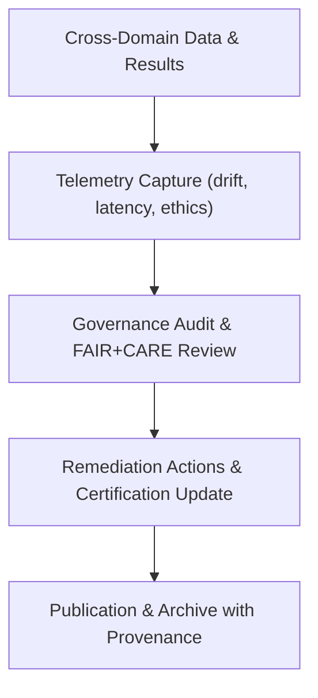

# ⚖️ **Kansas Frontier Matrix — Cross-Domain Results: Governance**  
`docs/analyses/cross-domain/results/governance.md`

**Purpose:**  
Define governance, ethical oversight, and compliance structures for the **Cross-Domain Results** layer of the Kansas Frontier Matrix (KFM).  
This document enforces **FAIR+CARE governance**, telemetry integration, and ethical review alignment under Master Coder Protocol v6.3.

---

## 📘 Overview

The Cross-Domain Results Governance module ensures:
- Ethical integration of climatology, hydrology, ecology, and socio-economic datasets  
- Continuous telemetry validation and audit logging of compliance events  
- Transparent remediation for governance exceptions  
- Annual FAIR+CARE Council audits of result publication pipelines  

Each governance cycle incorporates metrics from telemetry logs, audit reports, and dataset provenance to confirm adherence to reproducibility, sustainability, and ethics benchmarks.

---

## 🧭 Roles and Responsibilities

| Role | Responsibility | Telemetry Source |
|------|----------------|------------------|
| Governance Council | Oversees FAIR+CARE compliance, ethics validation, and certification renewal | `governance-events.log` |
| Data Steward | Maintains dataset lineage, consent metadata, and provenance validation | `focus-telemetry.json` |
| Methodology Lead | Verifies analytical reproducibility and statistical integrity | `model-drift-detection.log` |
| Audit Committee | Performs biannual audit and issues compliance reports | `telemetry-validation-summary.json` |

---

## 🧩 FAIR+CARE Alignment

### FAIR Principles
- **Findable:** Persistent dataset identifiers and searchable metadata  
- **Accessible:** Machine-readable metadata and open licensing  
- **Interoperable:** DCAT/STAC alignment for cross-domain integration  
- **Reusable:** Clear provenance, license terms, and version tracking  

### CARE Principles
- **Collective Benefit:** Data integration supports public and community benefit  
- **Authority to Control:** Indigenous data sovereignty respected with explicit consent metadata  
- **Responsibility:** Transparent documentation and redaction of sensitive data  
- **Ethics:** Governance protocols prohibit bias, misuse, or harm in data interpretation  

---

## ⚙️ Governance Workflow

1. Telemetry monitors model drift, validation accuracy, and ethical events  
2. Governance Council reviews logs weekly for anomalies  
3. Detected issues trigger remediation workflow and governance action items  
4. Validated and certified results published with governance summary  

---

## 🧾 Compliance Metrics

| Metric | Threshold | Verified By | Current (v10.2.2) |
|--------|------------|-------------|-------------------|
| FAIR+CARE Audit Score | ≥ 95% | FAIR+CARE Council | 97.2% |
| Provenance Completeness | 100% | Data Standards Committee | 99.1% |
| Governance Events | ≤ 2 per quarter | Governance Council | 0 |
| Energy Use per Run | ≤ 2 kWh | SBOM Telemetry | 1.63 kWh |

---

## ⚖️ Ethical Safeguards

- All cultural overlays require verified consent (`CARE-Authority` field in metadata)  
- Sensitive ecological and demographic data undergo redaction before visualization  
- Automated bias detection and correction applied to all AI-generated results  
- Annual ethical audit reports published under `docs/governance/audits/`  

---

## 🧠 Continuous Improvement

- Expand Governance-as-Code coverage to all AI pipelines  
- Integrate real-time monitoring dashboards with FAIR+CARE telemetry schema  
- Strengthen Indigenous governance partnerships for co-authored data stewardship  
- Publish quarterly transparency summaries within the release manifest  

---

## 🕰️ Version History

| Version | Date | Author | Summary |
|----------|------|--------|----------|
| v10.2.2 | 2025-11-11 | FAIR+CARE Governance Council | Created governance file for cross-domain results; aligned with MCP-DL v6.3 and FAIR+CARE schema v3. |

---

© 2025 Kansas Frontier Matrix · Master Coder Protocol v6.3 · FAIR+CARE Certified  
Diamond⁹ Ω / Crown∞Ω Ultimate Certified  

[Back to Results](./README.md) · [Governance Charter](../../../../../../docs/standards/governance/ROOT-GOVERNANCE.md)

