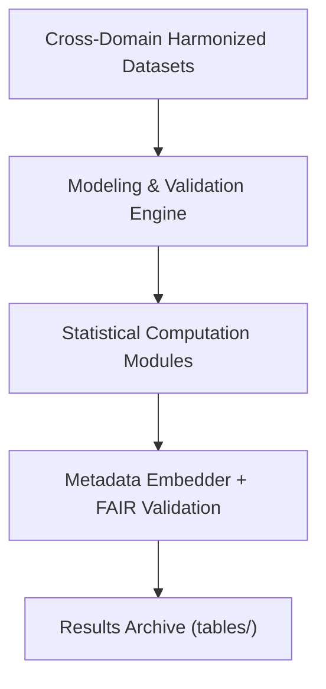

<div align="center">

# 📋 **Kansas Frontier Matrix — Cross-Domain Results: Tables**  
`docs/analyses/cross-domain/results/tables/README.md`

**Purpose:**  
Provide comprehensive documentation for all **tabular data outputs** generated during the cross-domain analytical workflows in Kansas Frontier Matrix (KFM) v10.2.2.  
These tables record harmonized cross-domain statistics, validation metrics, and quantitative outputs under FAIR+CARE-compliant governance.

[](../../../../../../docs/standards/markdown_guide.md)
[](../../../../../../LICENSE)
[](../../../../../../docs/standards/faircare.md)
[](../../../../../../releases/v10.2.0/manifest.zip)

</div>

---

## 📘 Overview

This directory contains **statistical and validation tables** representing the core numerical findings of KFM’s cross-domain analysis framework.  
Each dataset is versioned, validated through the CI telemetry pipeline, and embedded with metadata for full reproducibility and ethical traceability.

Tables serve as the foundation for:
- AI and multi-variable model evaluation  
- Domain correlation analysis  
- Temporal fusion and drift detection  
- FAIR+CARE governance audits  

---

## 🗂️ Directory Layout

```bash
tables/
 ├── domain_correlation_matrix.csv       # Correlation coefficients between cross-domain variables
 ├── harmonized_summary_metrics.csv      # Statistical summaries and data completeness metrics
 ├── validation_results.parquet          # Model validation outputs and accuracy measures
 ├── fusion_temporal_statistics.csv      # Aggregated temporal harmonization statistics
 └── README.md                           # This document
```

Each file is stored with a checksum reference and telemetry linkage ensuring auditability and machine verifiability.

---

## 🧾 Table Descriptions

| File | Description | Format | Validation |
|------|--------------|---------|-------------|
| `domain_correlation_matrix.csv` | Pairwise correlation matrix across domains (Pearson/Spearman) | CSV | FAIR Validator |
| `harmonized_summary_metrics.csv` | Dataset completeness, missingness, and bias statistics by domain | CSV | Schema Audit |
| `validation_results.parquet` | Validation metrics from AI and regression models | Parquet | CI Validation Workflow |
| `fusion_temporal_statistics.csv` | Temporal harmonization results showing aggregated metrics per period | CSV | FAIR+CARE Telemetry Check |

---

## ⚙️ Generation Workflow



1. The harmonized datasets feed into statistical computation modules.  
2. Model validation and correlation matrices are computed across domains.  
3. Metadata and checksum fields are embedded into resulting tables.  
4. Validation and governance pipelines confirm FAIR+CARE compliance.  

---

## 🧩 Analytical Applications

- Identify inter-domain relationships and dependencies.  
- Benchmark model performance across integrated datasets.  
- Provide traceable validation tables for FAIR+CARE audit.  
- Enable downstream visualization through `results/figures/`.  
- Support publication-ready open-science reproducibility.  

---

## ⚖️ FAIR+CARE Compliance Summary

| Metric | Tag | Description |
|--------|-----|-------------|
| `table_metadata_integrity` | FAIR-Reproducible | Ensures metadata completeness and version traceability |
| `integration_bias_index` | FAIR-Interoperable | Quantifies bias introduced during harmonization |
| `processing_energy_kWh` | FAIR-Sustainable | Logs computational energy usage for transparency |
| `audit_linkage_ratio` | CARE-Transparency | Confirms telemetry linkage across validation records |

---

## 🕰️ Version History

| Version | Date | Author | Summary |
|----------|------|--------|----------|
| v10.2.2 | 2025-11-11 | Cross-Domain Results Council | Created standardized documentation for cross-domain results tables, added FAIR+CARE compliance schema v3. |

---

<div align="center">

© 2025 Kansas Frontier Matrix · Master Coder Protocol v6.3 · FAIR+CARE Certified  
Diamond⁹ Ω / Crown∞Ω Ultimate Certified  

[Back to Results](../README.md) · [Governance Charter](../../../../../../docs/standards/governance/ROOT-GOVERNANCE.md)

</div>