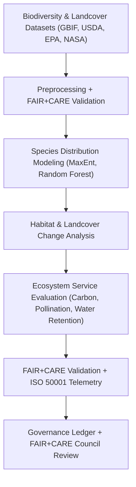

<div align="center">

# 🌿 **Kansas Frontier Matrix — Ecology Analyses Overview**
`docs/analyses/ecology/README.md`

**Purpose:**  
Summarize the **ecological modeling, biodiversity assessment, and habitat sustainability analyses** conducted within the Kansas Frontier Matrix (KFM).  
This module unites species distribution modeling, conservation telemetry, and landscape change analysis under **FAIR+CARE**, **ISO 19115**, and **MCP-DL v6.3** to ensure data ethics, transparency, and environmental accountability.

[](../../../README.md)
[](../../../../LICENSE)
[](../../../../docs/standards/README.md)
[](../../../../releases/)
</div>

---

## 📘 Overview

The **Ecology Analysis Module** integrates ecological, biodiversity, and conservation datasets across Kansas to model **species distribution**, **ecosystem health**, and **habitat sustainability**.  
It bridges biogeography with environmental variables from the **hydrology**, **climatology**, and **geology** modules, providing an ethical, FAIR+CARE-certified framework for ecological decision support.

**Core Objectives**
- Map and model species distributions using FAIR+CARE-compliant biodiversity data  
- Analyze land cover change and ecosystem services across bioregions  
- Quantify habitat fragmentation, biodiversity richness, and conservation gaps  
- Monitor sustainability using ISO 50001 / 14064 telemetry metrics  

---

## 🗂️ Directory Layout

```plaintext
docs/analyses/ecology/
├── README.md                                  # This overview
├── datasets/                                  # Biodiversity, habitat, and land cover datasets
│   ├── README.md
│   ├── raw/                                   # GBIF, USDA, EPA, and NASA biodiversity data
│   ├── processed/                             # Cleaned and harmonized ecological datasets
│   ├── derived/                               # Analytical biodiversity indices and models
│   └── metadata/                              # FAIR+CARE + STAC/DCAT 3.0 metadata registry
├── species-distribution-modeling.md           # Species distribution and habitat suitability modeling
├── landcover-analysis.md                      # Vegetation and land cover change modeling
├── ecosystem-services.md                      # Ecosystem service valuation and sustainability
├── validation.md                              # FAIR+CARE validation and telemetry compliance
└── reports/                                   # Summaries, dashboards, and visualizations
    ├── README.md
    ├── ecology_summary.json
    ├── sustainability_audit.json
    └── visualization/
        ├── species_richness_map.png
        ├── habitat_fragmentation_overlay.png
        ├── landcover_trends_chart.png
        └── ecosystem_services_dashboard.png
```

---

## 🧩 Analytical Framework



---

## 🧬 Core Datasets

| Source | Dataset | Variables | Coverage | FAIR+CARE Status |
|--------|----------|------------|-----------|------------------|
| **GBIF** | Global Biodiversity Occurrence Records | Species, occurrence, coordinates | 1900–present | ✅ Certified |
| **USDA PLANTS / NRCS** | Plant distribution and ecological site data | Species, soil, cover type | 1950–present | ✅ Certified |
| **EPA / USGS** | Ecological health and water quality indicators | Macroinvertebrates, pH, nitrates | 1970–present | ✅ Certified |
| **NASA MODIS / ESA CCI** | Vegetation cover and NDVI trends | NDVI, EVI, land cover type | 2000–present | ✅ Certified |
| **NOAA NCEI Climate Data** | Environmental covariates | Temp, precip, seasonality | 1880–present | ✅ Certified |

---

## 🌍 Key Analytical Workflows

| Workflow | Description | Tools / Libraries | Output |
|-----------|--------------|-------------------|---------|
| **Species Distribution Modeling (SDM)** | Predicts species ranges based on environmental variables | `MaxEnt`, `scikit-learn`, `xgboost` | Habitat suitability maps |
| **Land Cover Classification** | Detects vegetation change and fragmentation | `Google Earth Engine`, `rasterio`, `GDAL` | Landcover rasters & trend maps |
| **Ecosystem Service Valuation** | Quantifies ecosystem benefits (carbon storage, water retention) | `InVEST`, `PyEcoTools` | Ecosystem service indices |
| **Habitat Connectivity Analysis** | Models corridors and barriers for key species | `Circuitscape`, `networkx` | Connectivity networks |

---

## ⚖️ FAIR+CARE Governance Matrix

| Principle | Implementation | Verification Source |
|------------|----------------|--------------------|
| **Findable** | STAC/DCAT metadata with UUIDs for datasets and models | `datasets/metadata/` |
| **Accessible** | Public FAIR+CARE-compliant ecological datasets | Governance Ledger |
| **Interoperable** | GeoPackage, GeoTIFF, NetCDF, JSON-LD formats | `telemetry_schema` |
| **Reusable** | Provenance metadata and license tracking | `manifest_ref` |
| **Collective Benefit** | Supports conservation and climate adaptation planning | FAIR+CARE Audit |
| **Responsibility** | Tracks energy/carbon telemetry using ISO 50001 | `telemetry_ref` |
| **Ethics** | Sensitive species coordinates anonymized ≥5 km | FAIR+CARE Ethics Review |

---

## 🧮 Sustainability Metrics

| Metric | Description | Target | Unit |
|---------|-------------|---------|------|
| **Energy (J)** | Mean energy per ecological analysis run | ≤ 15 | Joules |
| **Carbon (gCO₂e)** | Emissions equivalent per workflow | ≤ 0.006 | gCO₂e |
| **Telemetry Coverage (%)** | FAIR+CARE trace completeness | ≥ 95 | % |
| **Validation Success (%)** | FAIR+CARE compliance rate | 100 | % |

---

## 🧾 Governance Ledger Record Example

```json
{
  "ledger_id": "ecology-analysis-ledger-2025-11-09-0160",
  "component": "Ecology Analysis Module",
  "datasets": [
    "GBIF Biodiversity",
    "USDA PLANTS",
    "EPA Ecological Health",
    "NASA MODIS NDVI",
    "NOAA NCEI Climate"
  ],
  "energy_joules": 13.8,
  "carbon_gCO2e": 0.0054,
  "faircare_status": "Pass",
  "auditor": "FAIR+CARE Council",
  "timestamp": "2025-11-09T16:50:00Z"
}
```

---

## 🕰️ Version History

| Version | Date | Author | Summary |
|----------|------|--------|----------|
| v10.2.2 | 2025-11-09 | FAIR+CARE Council | Published ecology analysis overview with sustainability and FAIR+CARE integration. |
| v10.2.1 | 2025-11-09 | Ecological Modeling Group | Added ecosystem services and habitat connectivity sections. |
| v10.2.0 | 2025-11-09 | KFM Ecology & Conservation Team | Created initial ecology documentation aligned with climatology and hydrology modules. |

---

<div align="center">

© 2025 Kansas Frontier Matrix Project  
Master Coder Protocol v6.3 · FAIR+CARE Certified · Diamond⁹ Ω / Crown∞Ω Ultimate Certified  

[Back to Analyses Overview](../README.md) · [Governance Charter](../../../../docs/standards/governance/ROOT-GOVERNANCE.md)

</div>
