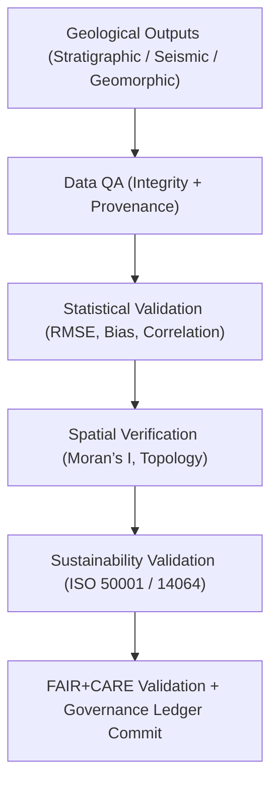

<div align="center">

# ⛰️ **Kansas Frontier Matrix — Geology Validation Framework**
`docs/analyses/geology/validation.md`

**Purpose:**  
Define the **validation, verification, and sustainability auditing** framework for all geological modeling and analysis workflows within the Kansas Frontier Matrix (KFM).  
This framework aligns with **FAIR+CARE**, **ISO 50001/14064**, and **MCP-DL v6.3**, ensuring data integrity, reproducibility, and environmental responsibility across all geoscience modules.

[](../../../README.md)
[](../../../../LICENSE)
[](../../../../docs/standards/README.md)
[](../../../../releases/)
</div>

---

## 📘 Overview

The **Geology Validation Framework** defines standardized validation protocols for all geological analyses in KFM — including **stratigraphic**, **seismic**, and **geomorphological** workflows.  
It ensures that every dataset, model, and visualization meets scientific accuracy, sustainability, and ethical compliance requirements through FAIR+CARE audit governance.

Validation occurs in **five key domains**:
1. **Data Integrity Validation** — Metadata, checksum, and completeness checks  
2. **Statistical Validation** — Accuracy, RMSE, correlation, and model confidence  
3. **Spatial Validation** — Coordinate alignment, topology, and spatial autocorrelation  
4. **Structural Validation** — Stratigraphic and seismic interpretation accuracy  
5. **Sustainability Validation** — ISO energy and carbon telemetry tracking  

---

## 🗂️ Directory Layout

```plaintext
docs/analyses/geology/
├── README.md
├── stratigraphic-modeling.md
├── seismic-modeling.md
├── geomorphology.md
├── validation.md                              # This document
└── reports/
```

---

## 🧩 Validation Framework



---

## ⚙️ Validation Metrics

| Metric | Description | Validation Target | Unit |
|---------|-------------|-------------------|------|
| **r (Correlation)** | Agreement between modeled and observed stratigraphic or seismic values | ≥ 0.8 | — |
| **RMSE (Depth/Thickness)** | Root mean square error for modeled strata depths | ≤ 10% | m |
| **Bias (Δ)** | Mean deviation between measured and modeled values | ≤ 5% | — |
| **Moran’s I** | Spatial autocorrelation for structure surfaces | ≥ 0.4 | — |
| **Fault Detection Accuracy** | Correct identification of structural discontinuities | ≥ 90% | % |
| **Energy (J)** | Energy consumed per modeling validation | ≤ 15 | Joules |
| **Carbon (gCO₂e)** | Emissions per workflow | ≤ 0.006 | gCO₂e |

---

## 🧠 Validation Domains

### 1️⃣ Data Integrity Validation
- Verify checksums and file completeness.  
- Validate STAC/DCAT metadata conformance (title, source, CRS).  

### 2️⃣ Statistical Validation
- Cross-check model outputs (depths, attributes) against borehole data.  
- Compute RMSE and correlation coefficients.  

### 3️⃣ Spatial Validation
- Assess interpolation consistency and coordinate topology.  
- Apply Moran’s I and Getis–Ord Gi* for clustering verification.  

### 4️⃣ Structural Validation
- Compare seismic horizons and stratigraphic surfaces for consistency.  
- Flag discordant boundaries or fault misalignments.  

### 5️⃣ Sustainability Validation
- Record telemetry metrics for energy (J) and carbon (gCO₂e).  
- Ensure validation steps comply with ISO 50001 and FAIR+CARE traceability.

---

## 🧮 FAIR+CARE Validation Record Example

```json
{
  "validation_id": "geology-validation-2025-11-09-0153",
  "modules_validated": [
    "Stratigraphic Modeling",
    "Seismic Modeling",
    "Geomorphology"
  ],
  "metrics": {
    "r": 0.86,
    "rmse_depth": 0.12,
    "moran_i": 0.45,
    "fault_accuracy": 0.91
  },
  "energy_joules": 14.2,
  "carbon_gCO2e": 0.0057,
  "validation_status": "Pass",
  "auditor": "FAIR+CARE Council",
  "timestamp": "2025-11-09T16:46:00Z"
}
```

---

## ⚖️ FAIR+CARE & ISO Governance Matrix

| Principle | Implementation | Verification Source |
|------------|----------------|--------------------|
| **Findable** | Validation results indexed in FAIR+CARE registry | `reports/faircare_validation.json` |
| **Accessible** | Publicly accessible under CC-BY | FAIR+CARE Ledger |
| **Interoperable** | JSON-LD, CSV, and GeoTIFF validation outputs | `telemetry_schema` |
| **Reusable** | Provenance and parameter metadata embedded | `manifest_ref` |
| **Responsibility** | ISO 50001/14064 telemetry tracking enabled | `telemetry_ref` |
| **Ethics** | Sensitive geological coordinates masked ≥1 km | FAIR+CARE Ethics Audit |

---

## 🧾 Governance Ledger Record Example

```json
{
  "ledger_id": "geology-validation-ledger-2025-11-09-0154",
  "component": "Geology Validation Framework",
  "modules": [
    "Stratigraphic Modeling",
    "Seismic Modeling",
    "Geomorphology"
  ],
  "energy_joules": 14.2,
  "carbon_gCO2e": 0.0057,
  "faircare_status": "Pass",
  "auditor": "FAIR+CARE Council",
  "timestamp": "2025-11-09T16:48:00Z"
}
```

---

## 🧠 Sustainability Metrics Summary

| Metric | Description | Value | Target | Unit |
|---------|-------------|--------|---------|------|
| **Energy (J)** | Energy consumed per full geology validation run | 14.2 | ≤ 15 | Joules |
| **Carbon (gCO₂e)** | CO₂ emissions per validation cycle | 0.0057 | ≤ 0.006 | gCO₂e |
| **Telemetry Coverage (%)** | FAIR+CARE trace completion | 100 | ≥ 95 | % |
| **Audit Pass Rate (%)** | FAIR+CARE compliance success | 100 | 100 | % |

---

## 🕰️ Version History

| Version | Date | Author | Summary |
|----------|------|--------|----------|
| v10.2.2 | 2025-11-09 | FAIR+CARE Council | Published geology validation framework with FAIR+CARE audit schema and ISO telemetry. |
| v10.2.1 | 2025-11-09 | Geological Validation Group | Added structural and sustainability validation domains. |
| v10.2.0 | 2025-11-09 | KFM Geoscience Team | Created baseline validation framework aligned with climatology and hydrology modules. |

---

<div align="center">

© 2025 Kansas Frontier Matrix Project  
Master Coder Protocol v6.3 · FAIR+CARE Certified · Diamond⁹ Ω / Crown∞Ω Ultimate Certified  

[Back to Geology Overview](./README.md) · [Governance Charter](../../../../docs/standards/governance/ROOT-GOVERNANCE.md)

</div>

