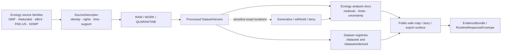

<!-- [KFM_META_BLOCK_V2]
doc_id: kfm://doc/<uuid-NEEDS-VERIFICATION>
title: Kansas Frontier Matrix — Ecology Analyses
type: standard
version: v1
status: draft
owners: @bartytime4life
created: <created-NEEDS-VERIFICATION>
updated: <updated-AT-MERGE>
policy_label: <policy_label-NEEDS-VERIFICATION>
related: [../README.md, ./datasets/README.md, ./datasets/derived/README.md, ../../domains/README.md, ../../../contracts/, ../../../policy/, ../../../schemas/]
tags: [kfm, ecology, analyses, biodiversity, geoprivacy]
notes: [owner confirmed from .github/CODEOWNERS on public main; public history shows 2025 creation, 2025 deletion, and 2026 scaffold reintroduction; doc_id, policy_label, and merge-time metadata dates need verification before merge]
[/KFM_META_BLOCK_V2] -->

<a id="top"></a>

# Kansas Frontier Matrix — Ecology Analyses

Directory README for ecology analysis surfaces, dataset registries, and future reviewed ecology modules under `docs/analyses/ecology/`.

> [!NOTE]
> **Status:** experimental  
> **Owners:** `@bartytime4life`  
>       
> **Quick jump:** [Scope](#scope) · [Repo fit](#repo-fit) · [Inputs](#inputs) · [Exclusions](#exclusions) · [Directory tree](#directory-tree) · [Quickstart](#quickstart) · [Usage](#usage) · [Diagram](#diagram) · [Reference tables](#reference-tables) · [Task list](#task-list) · [FAQ](#faq) · [Appendix](#appendix)  
> **Current posture:** **CONFIRMED** public-branch owner = `@bartytime4life`; **CONFIRMED** live subtree = `README.md`, `datasets/`, and `datasets/derived/README.md`; **CONFIRMED** public history shows an earlier 2025 ecology README, later deletion, and scaffold reintroduction on `2026-03-22`; **NEEDS VERIFICATION** `doc_id`, `policy_label`, and final merge-time metadata dates for this revision.

> [!IMPORTANT]
> Ecology is a higher-sensitivity lane. Rare-species and culturally sensitive locations are not publish-by-default material here; generalization, withholding, or denial should be explicit and reviewable, not buried inside narrative prose.

## Scope

`docs/analyses/ecology/` is the ecology lane’s documentary entry point inside the broader `docs/analyses/` surface.

In KFM terms, ecology covers biodiversity, flora, pollinators, wildlife, protected areas, habitat, migration corridors, and stewardship context. A strong ecology analysis doc keeps five things visible at once: what was observed, what was modeled, what was generalized or withheld, how place and time were bounded, and how downstream readers can trace claims back to governed evidence.

This folder should stay downstream of governed evidence and release posture. It is **not** a second truth system, a raw-data landing zone, or a place to park uncited map commentary.

## Repo fit

| Aspect | Value |
| --- | --- |
| Path | `docs/analyses/ecology/README.md` |
| Branch basis | Current public `main` |
| Upstream | [`../README.md`](../README.md), [`../../README.md`](../../README.md) |
| Downstream | [`./datasets/README.md`](./datasets/README.md), [`./datasets/derived/README.md`](./datasets/derived/README.md) |
| Adjacent governed layers | [`../../domains/README.md`](../../domains/README.md), [`../../../contracts/`](../../../contracts/), [`../../../policy/`](../../../policy/), [`../../../schemas/`](../../../schemas/) |
| Role in repo | Explain what belongs in the ecology analysis lane, keep sensitivity posture visible, and help future ecology docs reuse KFM’s evidence, release, and correction discipline. |
| Parent drift to watch | The current public [`../README.md`](../README.md) still carries an inferred ecology tree that names historical leaf docs. Treat this file as the live subtree reference until the parent index is reconciled. |

## Inputs

Accepted inputs here should be documentation-facing, reviewable, and lane-specific.

| Belongs here | What it should make explicit |
| --- | --- |
| Ecology lane overviews | Source families, scope, publication burden, and sensitivity defaults for biodiversity, flora, pollinators, wildlife, habitat, migration corridors, and protected areas. |
| Dataset registry notes | Dataset identity, time basis, spatial support, method summary, observed-vs-modeled posture, and links to governed dataset or release artifacts when those artifacts exist. |
| Derived-analysis summaries | Inputs used, method family, uncertainty, validation status, and disclosure posture. |
| Sensitivity and geoprivacy notes | Whether exact locations are `public-safe`, `generalized`, `withheld`, or otherwise review-bearing. |
| Review-facing caveats | What remains **CONFIRMED**, **INFERRED**, **PROPOSED**, **UNKNOWN**, or **NEEDS VERIFICATION** for the specific ecology surface. |

Representative source families for this lane include GBIF, iNaturalist, eBird, PAD-US, KDWP, the Kansas Natural Heritage Inventory, and related biodiversity collections.

## Exclusions

| Does **not** belong here | Put it instead / handle it as |
| --- | --- |
| Raw exact-occurrence dumps, unpublished field notes, or unreviewed location extracts | Governed data/source intake and release-controlled data surfaces, not `docs/analyses/` |
| Free-form narrative claims without dataset/version support | Reject, quarantine, or rewrite as evidence-linked analysis |
| Exact rare-species or culturally sensitive location detail without an explicit disclosure rule | Generalize, withhold, or route through review; never publish by default from this folder |
| Policy bundles, reason-code registries, obligation-code registries | [`../../../policy/`](../../../policy/) |
| Contracts, schemas, or validation fixtures | [`../../../contracts/`](../../../contracts/), [`../../../schemas/`](../../../schemas/), and corresponding tests |
| UI-only feature briefs or shell choreography notes | [`../../architecture/`](../../architecture/) and adjacent interface doctrine surfaces |
| Invented release-manifest, proof-pack, or evidence links | Leave as `NEEDS VERIFICATION` until the actual artifact is surfaced |

## Directory tree

Only the live subtree is listed below.

```text
docs/analyses/ecology/
├── README.md
└── datasets/
    ├── README.md
    └── derived/
        └── README.md
```

> [!NOTE]
> The tree above is intentionally narrow. It reflects the current public branch, not the older inferred ecology leaf files still visible in the parent analyses index.

## Quickstart

```bash
# Inspect the current ecology documentation surface
find docs/analyses/ecology -maxdepth 3 \( -type f -o -type d \) | sort
```

1. Start with the KFM meta block and the top-of-file impact block.
2. Declare source families, time basis, spatial support, and observed-vs-modeled posture.
3. State the exact disclosure posture for sensitive locations: `public-safe`, `generalized`, `withheld`, or `NEEDS VERIFICATION`.
4. Add downstream links only to artifacts that are actually mounted in the repo or explicitly marked `NEEDS VERIFICATION`.
5. Choose new child-file naming only after checking the local ecology convention in the same PR; late-2025 history shows single-file ecology modules, while the current live subtree is scaffold-sized.

> [!TIP]
> Reviving a historical ecology filename can be reasonable. Reviving it **without** re-establishing its evidence basis, sensitivity posture, and current scope is not.

## Usage

### Lane overview docs

Use this level for stable, lane-wide rules: representative source families, publication burden, disclosure defaults, and what downstream readers should expect from ecology analysis surfaces.

### Dataset registries

Use [`./datasets/`](./datasets/) and [`./datasets/derived/`](./datasets/derived/) for inventories of source-backed and derived ecology datasets. Registry docs should keep identifiers, time basis, spatial support, version/release references, and validation posture close to the surface.

### Dedicated child analyses

Create a dedicated child ecology doc only when one stable topic has enough evidence, method description, and sensitivity posture to stand on its own. The minimum burden is not “interesting map output”; it is reviewable inputs, visible uncertainty, and a clear distinction between direct observation and derivative interpretation.

### Disclosure rules that should stay visible

- Do not flatten observed occurrences, protected-area boundaries, and modeled habitat or corridor surfaces into one undifferentiated claim.
- Keep exact coordinates, generalized surfaces, and withheld cases visibly separate.
- If a public-facing ecology statement can only be defended by unreleased precise locations, default to generalized or withheld presentation instead of implied precision.
- Treat rights, seasonality, stewardship sensitivity, and correction posture as first-class analysis metadata, not appendix trivia.

## Diagram

Conceptual flow for ecology analysis surfaces in KFM:


```mermaid
flowchart LR
    A[Ecology source families<br/>GBIF · iNaturalist · eBird · PAD-US · KDWP] --> B[SourceDescriptor<br/>identity · rights · time · support]
    B --> C[RAW / WORK / QUARANTINE]
    C --> D[Processed DatasetVersion]
    D --> E[Ecology analysis docs<br/>methods · limits · uncertainty]
    D --> F[Dataset registries<br/>./datasets and ./datasets/derived]
    E --> G[Public-safe map / story / export surface]
    F --> G
    G --> H[EvidenceBundle / RuntimeResponseEnvelope]
    D -. sensitive exact locations .-> X[Generalize / withhold / deny]
    X --> E
```

## Reference tables

### Current live subtree inventory

| Path | Role | Status |
| --- | --- | --- |
| `README.md` | Ecology lane README | **CONFIRMED** |
| `datasets/README.md` | Ecology dataset registry entrypoint | **CONFIRMED** |
| `datasets/derived/README.md` | Derived ecology dataset registry entrypoint | **CONFIRMED** |

### Ecology doc types and their minimum burden

| Doc type | Minimum visible content | Common failure to avoid |
| --- | --- | --- |
| Lane overview | Source families, publication burden, disclosure rules, and review posture | Generic GIS prose that hides ecology-specific sensitivity |
| Dataset registry | Identity, time basis, support, method, version/release link, and validation note | Orphaned snapshots or exports with no lineage |
| Derived analysis | Inputs, method, modeled-vs-observed distinction, uncertainty, and limits | Presenting a derivative as canonical truth |
| Sensitive occurrence summary | Aggregation/geoprivacy rule, withheld cases, and reason | Publishing precise rare-species locations by default |

### Status labels used in this folder

| Label | Meaning here |
| --- | --- |
| **CONFIRMED** | Verified by current public-branch repository evidence or authoritative KFM doctrine |
| **INFERRED** | Conservative structural completion strongly suggested, but not directly mounted here |
| **PROPOSED** | Recommended future module or workflow pattern |
| **UNKNOWN** | Not verified strongly enough to claim as current repo fact |
| **NEEDS VERIFICATION** | Placeholder or pre-merge check item |

## Task list

- [ ] Verify and replace the KFM meta block placeholders for `doc_id`, `created`, `updated`, and `policy_label`.
- [ ] Decide whether `created` should reflect the first 2025 ecology README or the 2026 scaffold reintroduction of the current subtree.
- [ ] Reconcile [`../README.md`](../README.md) so its ecology directory tree no longer presents historical leaf files as live current structure.
- [ ] Decide whether historical filenames such as `ecosystem-services.md`, `landcover-analysis.md`, or `species-distribution-modeling.md` should return as new reviewed docs.
- [ ] Add ecology-specific source registries and derived dataset links once live artifacts exist.
- [ ] Document explicit geoprivacy and withholding rules before any exact occurrence coordinates become public-facing.
- [ ] Confirm whether ecology analysis docs need separate validation, proof-pack, or governance companion pages in this subtree.

**Definition of done**

- No deleted or historical ecology file is referenced as though it were live current inventory.
- Every new ecology doc declares inputs, method, uncertainty, and sensitivity posture.
- Downstream links resolve or are clearly marked `NEEDS VERIFICATION`.
- Modeled layers and direct observations are never flattened into one undifferentiated claim.
- Public-facing ecology summaries do not outrun release state, correction posture, or evidence visibility.

## FAQ

### Can this folder publish exact rare-species coordinates?

Not by default. The default posture for exact sensitive locations should be explicit generalization, withholding, or denial unless a reviewed, public-safe exception is already established elsewhere in the governed stack.

### Should ecology docs point straight to third-party portals as the truth source?

They can cite third-party source families, but release-facing KFM claims should still resolve through KFM-governed evidence, dataset, or release artifacts when those artifacts exist.

### Where should derived rasters, suitability layers, or corridor outputs be documented?

Start with [`./datasets/derived/`](./datasets/derived/). Add a dedicated ecology analysis doc only when interpretation, method, and uncertainty need fuller narrative treatment.

### Can historical filenames be restored?

Yes, but treat them as new reviewed docs, not as automatically valid carryovers from a deleted subtree.

## Appendix

<details>
<summary><strong>Public-branch history, historical signals, and open verification items</strong></summary>

### Public-branch history relevant to this README

- `2025-11-09`: an ecology `README.md` was first created in the ecology subtree.
- `2025-12-27`: the `docs/analyses/ecology/` directory was deleted.
- `2026-03-22`: the current scaffold-sized ecology subtree was reintroduced on public `main`.

### Historical signals

- The current ecology subtree is live, but compact.
- Earlier ecology docs existed in late 2025; the directory and multiple child docs were later deleted before the current scaffold-sized subtree was reintroduced.
- Historical filenames such as `ecosystem-services.md`, `landcover-analysis.md`, and `species-distribution-modeling.md` should be treated as prior signals, not as current inventory.

### Open verification items

- KFM document UUID and policy label for this README.
- Final `created` and `updated` date semantics for the current meta block.
- Whether ecology-specific release manifests, proof packs, or EvidenceBundle examples already exist elsewhere in the repo.
- Whether the parent analyses index should be corrected in the same PR or coordinated with broader analyses-tree cleanup.

</details>

[Back to top](#top)
