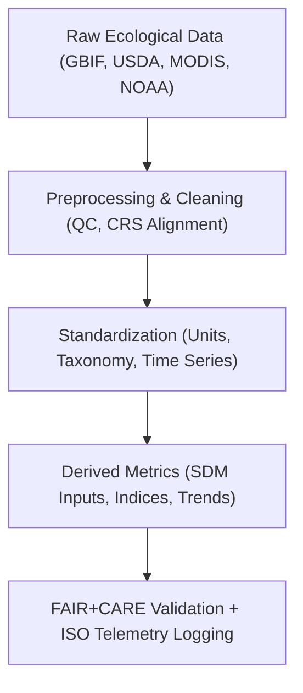

<div align="center">

# 🌿 **Kansas Frontier Matrix — Ecology Datasets Registry**
`docs/analyses/ecology/datasets/README.md`

**Purpose:**  
Document all **biodiversity, land cover, and ecological datasets** used for modeling and analysis within the Kansas Frontier Matrix (KFM).  
These datasets are registered and validated under **FAIR+CARE**, **STAC/DCAT 3.0**, and **ISO 19115-3**, ensuring open data interoperability and environmental governance transparency.

[](../../../../README.md)
[](../../../../../LICENSE)
[](../../../../../docs/standards/README.md)
[](../../../../../releases/)
</div>

---

## 📘 Overview

The **Ecology Datasets Registry** defines all biodiversity, vegetation, and environmental data resources used in the KFM **Ecology Module**.  
These datasets inform species distribution models (SDMs), habitat suitability analyses, and ecosystem service assessments.  
All entries conform to FAIR+CARE governance, ISO 50001 energy management, and ethical environmental data stewardship principles.

---

## 🗂️ Directory Layout

```plaintext
docs/analyses/ecology/datasets/
├── README.md                                  # This document
├── raw/                                       # Original GBIF, USDA, EPA, MODIS datasets
│   ├── README.md
│   ├── gbif_occurrences.csv
│   ├── usda_plants.csv
│   ├── epa_ecological_health.csv
│   ├── modis_ndvi.nc
│   └── noaa_climate_covariates.csv
├── processed/                                 # Cleaned, harmonized, and quality-controlled datasets
│   ├── README.md
│   ├── biodiversity_cleaned.csv
│   ├── habitat_variables.nc
│   ├── landcover_harmonized.tif
│   └── ecosystem_variables.json
├── derived/                                   # Derived metrics and indices
│   ├── README.md
│   ├── species_richness_index.csv
│   ├── habitat_suitability_model.nc
│   ├── ecosystem_service_value.nc
│   └── biodiversity_hotspots.geojson
└── metadata/                                  # Metadata and FAIR+CARE validation reports
    ├── README.md
    ├── stac_catalog.json
    ├── dcat_metadata.json
    ├── faircare_validation.json
    └── provenance_log.json
```

---

## ⚙️ Core Ecological Datasets

| Source | Dataset | Description | Format | FAIR+CARE Status |
|--------|----------|-------------|---------|------------------|
| **GBIF** | Biodiversity Occurrences | Global species presence/absence data | CSV | ✅ Certified |
| **USDA PLANTS / NRCS** | Plant and soil ecological site data | Species and habitat attributes | CSV | ✅ Certified |
| **EPA / USGS** | Ecological health and biotic integrity indices | Water quality & habitat metrics | CSV | ✅ Certified |
| **NASA MODIS / ESA CCI** | Vegetation cover and NDVI time series | Remote-sensed ecosystem trends | NetCDF | ✅ Certified |
| **NOAA NCEI** | Climate covariates (temp, precip, humidity) | Environmental drivers for SDM | CSV | ✅ Certified |

---

## 🧩 Data Workflow Overview



---

## 🧮 FAIR+CARE Metadata Example

```json
{
  "dataset_id": "gbif-occurrences-kansas-2025",
  "title": "Global Biodiversity Information Facility (GBIF) — Species Occurrence Records for Kansas",
  "source_url": "https://www.gbif.org/occurrence/search?state=Kansas",
  "spatial_extent": [-102.05, 36.99, -94.6, 40.0],
  "temporal_coverage": ["1900-01-01", "2025-01-01"],
  "license": "CC-BY 4.0",
  "format": "CSV",
  "validation": {
    "integrity_check": "SHA-256 Verified",
    "missing_records": "1.8%",
    "duplicate_removed": 10542,
    "status": "Pass"
  },
  "auditor": "FAIR+CARE Council",
  "timestamp": "2025-11-09T16:55:00Z"
}
```

---

## ⚖️ FAIR+CARE Governance Matrix

| Principle | Implementation | Verification Source |
|------------|----------------|--------------------|
| **Findable** | Indexed via STAC/DCAT 3.0 metadata with UUIDs | `metadata/stac_catalog.json` |
| **Accessible** | Datasets distributed under CC-BY / Open Data | FAIR+CARE Ledger |
| **Interoperable** | CSV, NetCDF, GeoTIFF, and JSON-LD formats | `telemetry_schema` |
| **Reusable** | Provenance, licensing, and telemetry embedded | `manifest_ref` |
| **Responsibility** | Energy/carbon telemetry validated via ISO 50001 | `telemetry_ref` |
| **Ethics** | Sensitive species locations masked ≥5 km | FAIR+CARE Council Review |

---

## 🧾 Governance Ledger Record Example

```json
{
  "ledger_id": "ecology-datasets-ledger-2025-11-09-0161",
  "component": "Ecology Datasets Registry",
  "datasets": [
    "GBIF Biodiversity Occurrences",
    "USDA PLANTS / NRCS Ecology",
    "EPA Ecological Health",
    "NASA MODIS NDVI",
    "NOAA Climate Covariates"
  ],
  "energy_joules": 13.6,
  "carbon_gCO2e": 0.0053,
  "faircare_status": "Pass",
  "auditor": "FAIR+CARE Council",
  "timestamp": "2025-11-09T16:57:00Z"
}
```

---

## 🧠 Sustainability Metrics

| Metric | Description | Value | Target | Unit |
|---------|-------------|--------|---------|------|
| **Energy (J)** | Energy used during dataset ingestion and validation | 13.6 | ≤ 15 | Joules |
| **Carbon (gCO₂e)** | Emissions per data workflow | 0.0053 | ≤ 0.006 | gCO₂e |
| **Telemetry Coverage (%)** | FAIR+CARE trace completion | 100 | ≥ 95 | % |
| **Audit Pass Rate (%)** | FAIR+CARE validation success | 100 | 100 | % |

---

## 🕰️ Version History

| Version | Date | Author | Summary |
|----------|------|--------|----------|
| v10.2.2 | 2025-11-09 | FAIR+CARE Council | Published ecology dataset registry with FAIR+CARE governance and ISO telemetry tracking. |
| v10.2.1 | 2025-11-09 | Ecological Data Governance Group | Added STAC/DCAT metadata schema and biodiversity ethics provisions. |
| v10.2.0 | 2025-11-09 | KFM Ecology Team | Created baseline dataset registry aligned with hydrology and climatology standards. |

---

<div align="center">

© 2025 Kansas Frontier Matrix Project  
Master Coder Protocol v6.3 · FAIR+CARE Certified · Diamond⁹ Ω / Crown∞Ω Ultimate Certified  

[Back to Ecology Overview](../README.md) · [Governance Charter](../../../../../docs/standards/governance/ROOT-GOVERNANCE.md)

</div>

