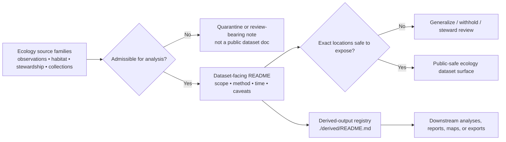

<!-- [KFM_META_BLOCK_V2]
doc_id: kfm://doc/<uuid-NEEDS-VERIFICATION>
title: Kansas Frontier Matrix — Ecology Datasets
type: standard
version: v1
status: draft
owners: @bartytime4life
created: YYYY-MM-DD
updated: YYYY-MM-DD
policy_label: <policy_label-NEEDS-VERIFICATION>
related: [../README.md, ../../README.md, ../../../README.md, ../../../../README.md, ./derived/README.md]
tags: [kfm, ecology, datasets, analyses]
notes: [Current public main confirms this directory is scaffold-light and broad /docs/ CODEOWNERS coverage points to @bartytime4life; doc UUID, dates, policy label, and path-specific ecology stewardship still need verification.]
[/KFM_META_BLOCK_V2] -->

<a id="top"></a>

# Kansas Frontier Matrix — Ecology Datasets

Directory index for ecology dataset-facing analysis docs, derived-output registries, and geoprivacy-aware reuse boundaries under `docs/analyses/ecology/datasets/`.

| Status | Owners | Current live footprint |
|---|---|---|
| **experimental** | **`@bartytime4life`** | `README.md`, `derived/README.md` |


**Quick jump:** [Scope](#scope) · [Repo fit](#repo-fit) · [Accepted inputs](#accepted-inputs) · [Exclusions](#exclusions) · [Directory tree](#directory-tree) · [Quickstart](#quickstart) · [Usage](#usage) · [Diagram](#diagram) · [Tables](#tables) · [Task list](#task-list--definition-of-done) · [FAQ](#faq) · [Appendix](#appendix)

**Evidence posture:** live file paths and child directories named below are **CONFIRMED** only where directly visible on the current public branch. Ecology lane source-family examples and sensitivity rules are **CONFIRMED doctrine**. Additional ecology dataset modules remain **INFERRED**, **PROPOSED**, or **NEEDS VERIFICATION** until mounted evidence exists.

> [!IMPORTANT]
> Ecology dataset docs in KFM are not neutral wrappers around points, rasters, or tables. When exact locations would expose rare species or culturally sensitive material, public-facing docs should generalize, withhold, or explicitly route readers to steward review instead of silently overpublishing.

## Scope

This directory is the dataset-facing documentation seam for the ecology lane inside `docs/analyses/`.

It should explain **what a dataset or source family is**, **why it is in scope**, **how it was shaped for analysis**, **what caveats govern reuse**, and **which downstream derived surfaces depend on it**. It is downstream of governed evidence and upstream of derived ecology analysis notes.

Use this directory for documentation that is:

- readable by maintainers and reviewers
- explicit about time, method, caveats, and sensitivity
- linked to downstream analysis or derived-output surfaces
- honest about unknowns, review burden, and publication limits

This directory should **not** become a second truth system, a raw-drop folder, or a detached notebook graveyard.

[Back to top](#top)

## Repo fit

| Field | Value |
|---|---|
| Path | `docs/analyses/ecology/datasets/README.md` |
| Role | Dataset-facing index for ecology analysis documentation |
| Upstream | [`../README.md`](../README.md) · [`../../README.md`](../../README.md) · [`../../../README.md`](../../../README.md) · [`../../../../README.md`](../../../../README.md) |
| Downstream | [`./derived/README.md`](./derived/README.md) |
| Confirmed live child directories | `derived/` |
| Intended handoff | Dataset-facing docs here should point to derived-output notes, caveat notes, and release/provenance links when those surfaces exist |

A good mental model is:

- `docs/analyses/` defines the governed analysis surface
- `docs/analyses/ecology/` scopes the ecology lane
- `docs/analyses/ecology/datasets/` explains ecology datasets and their reuse boundaries
- `docs/analyses/ecology/datasets/derived/` tracks documentation for derived ecology outputs

## Accepted inputs

The following belong here when they are expressed as **documentation**, not as raw payloads:

| Accepted input | What it should do here |
|---|---|
| Dataset family README | Explain what a source family or ecology dataset covers, why it matters, and how it should be interpreted |
| Harmonization note | Describe joins, field mapping, deduplication, normalization, or crosswalk logic used for ecology analysis |
| Validation / caveat note | Make uncertainty, support limits, spatial bias, taxonomic limits, or freshness constraints visible |
| Geoprivacy / sensitivity note | Record whether public-facing docs are precise, generalized, withheld, or steward-reviewed |
| Derived-output pointer | Link readers to downstream derived registries under [`./derived/README.md`](./derived/README.md) |
| Release / provenance link set | Point to release-bearing or evidence-bearing surfaces when those exist and are public-safe |

## Exclusions

| This does **not** belong here | Put it where it goes instead |
|---|---|
| RAW / WORK / QUARANTINE files | Governed data intake or storage surfaces |
| Authoritative dataset versions, manifests, receipts, or proof packs | Release-, catalog-, or contract-bearing surfaces, with links from here when appropriate |
| Exact rare-species or culturally sensitive coordinates in public docs | Generalized public docs, withheld notes, or steward-review surfaces |
| Policy bundles, decision grammars, or schema authorities | `policy/`, `contracts/`, and `schemas/` |
| Detached notebook scratch work or AI-only summaries | Notebook, report, or author workspace surfaces |
| UI-only feature briefs | Product, app, or surface-specific documentation |

> [!CAUTION]
> Public-friendly ecology prose is not a license to flatten support, method, or sensitivity. If a reader cannot tell whether a location is exact, generalized, or withheld, the document is underspecified.

[Back to top](#top)

## Directory tree

**Live-verified current tree**

```text
docs/analyses/ecology/datasets/
├── README.md
└── derived/
    └── README.md
```

**Working interpretation**

- This directory is currently scaffold-light.
- The richer structure should grow from verified need.
- Future ecology dataset subdirectories are welcome, but should be marked **INFERRED**, **PROPOSED**, or **NEEDS VERIFICATION** until they exist on the mounted branch.

## Quickstart

1. Decide whether you are adding:
   - a dataset-facing README,
   - a harmonization/caveat note,
   - or a pointer into [`./derived/README.md`](./derived/README.md).
2. Create the smallest path that makes the dataset discoverable.
3. State the dataset family, spatial scope, temporal basis, and method in plain language.
4. Make the sensitivity posture explicit: **public-safe**, **generalized**, **withheld**, or **steward review required**.
5. Link upstream and downstream docs with relative links only.
6. Do not imply mounted schemas, workflows, or release automation unless they are directly verified in the repo.

```bash
mkdir -p docs/analyses/ecology/datasets/<dataset_or_theme>
$EDITOR docs/analyses/ecology/datasets/<dataset_or_theme>/README.md
```

A new per-dataset README should usually answer:

- What is this dataset or source family?
- Why is it in the ecology lane?
- What is its spatial and temporal support?
- What transformation or harmonization has already happened?
- What is safe to publish at this path?
- What downstream derived docs or reports depend on it?

## Usage

### Add a source-facing ecology dataset doc

Use this when you need a human-readable entry point for a source family, study input, or harmonized working set.

Minimum expectations:

- name the source family or dataset clearly
- declare spatial scope and time basis
- summarize any transform, filtering, or harmonization
- state locational precision and sensitivity posture
- point to downstream outputs or open verification needs

### Add a derived-output pointer

Use [`./derived/README.md`](./derived/README.md) when the main job is to help readers navigate derived rasters, vector summaries, tables, or model-ready packages.

Keep the distinction sharp:

- **actual artifacts** may live in release-bearing data surfaces
- **their human-readable interpretation surface** should remain discoverable from docs

### Review an existing ecology dataset doc

When reviewing, look for:

- stale scope or unqualified time language
- silent switches between exact and generalized locations
- undocumented merges or filters
- unsupported certainty
- broken relative links
- missing downstream or provenance pointers

> [!TIP]
> Keep artifacts and explanations separate. A raster, vector package, or tabular export may live elsewhere; this directory should explain **how to interpret it** and **how safely it may be reused**.

[Back to top](#top)

## Diagram


```mermaid
flowchart LR
    A[Ecology source families<br/>observations • habitat • stewardship • collections] --> B{Admissible for analysis?}
    B -- No --> Q[Quarantine or review-bearing note<br/>not a public dataset doc]
    B -- Yes --> C[Dataset-facing README<br/>scope • method • time • caveats]
    C --> D{Exact locations safe to expose?}
    D -- No --> E[Generalize / withhold / steward review]
    D -- Yes --> F[Public-safe ecology dataset surface]
    C --> G[Derived-output registry<br/>./derived/README.md]
    G --> H[Downstream analyses, reports, maps, or exports]
```

## Tables

### Representative ecology source families

These are **doctrine-aligned examples**, not a claim that each family is already mounted in this repo.

| Source family | Typical use in this directory | Public-facing caution |
|---|---|---|
| Observations | Species occurrence, pollinator, or bird-observation docs | Exact coordinates may need generalization or withholding |
| Habitat / protected areas | Management, boundary, or stewardship context | Administrative extent is not the same thing as ecological truth |
| State / regional stewardship inventories | Kansas-specific ecology context and review-bearing lane notes | Rarity and access posture may constrain publication |
| Collections / specimen history | Historical and provenance-rich ecology context | Interpretation burden and source lineage should remain visible |
| Vegetation / land-cover ecology inputs | Context for habitat or change analysis | Classification method and temporal comparability must stay explicit |

### Minimum contents for a per-dataset README

| Field | Why it matters | Expected posture |
|---|---|---|
| Dataset or source-family name | Keeps the surface identifiable | **CONFIRMED** where directly evidenced |
| Spatial scope | Prevents scale ambiguity | Explicit |
| Temporal basis | Prevents stale or timeless reading | Explicit |
| Method / transform summary | Makes reuse inspectable | Explicit |
| Sensitivity posture | Prevents accidental overexposure | Explicit |
| Downstream docs / outputs | Helps navigation and review | Link if present; otherwise **NEEDS VERIFICATION** |
| Open questions / caveats | Prevents silent bluff | Visible |

### Status labels for this directory

| Label | Use it when |
|---|---|
| **CONFIRMED** | The path, file, or dataset property is directly visible in the current evidence boundary |
| **INFERRED** | The structure is strongly implied by adjacent repo doctrine but not directly mounted here |
| **PROPOSED** | The path or pattern is a recommended next move |
| **UNKNOWN** | A property may exist, but current evidence does not prove it |
| **NEEDS VERIFICATION** | A reviewer should confirm the value before merging or publishing |

[Back to top](#top)

## Task list & definition of done

A dataset-facing ecology doc in this directory is ready for review when the following are true:

- [ ] Title and directory naming match the dataset or source-family role
- [ ] Upstream and downstream relative links resolve cleanly
- [ ] Spatial scope and temporal basis are explicit
- [ ] Method, transform, or harmonization summary is present
- [ ] Locational precision is stated when material
- [ ] Sensitivity / geoprivacy posture is explicit
- [ ] Public-safe abstraction is checked for rare-species or culturally sensitive cases
- [ ] Derived-output pointers are added when downstream outputs exist
- [ ] Unknowns remain visible instead of being smoothed away
- [ ] No unverified schemas, workflows, endpoints, or enforcement claims are presented as settled repo reality
- [ ] Superseded or corrected interpretations are linked forward rather than silently replaced

## FAQ

### Does a raw species CSV belong here?

No. Raw files belong in governed ingest or storage surfaces. This directory is for the documentation layer that explains how to interpret and safely reuse a dataset.

### Can I publish exact observation coordinates here?

Not by default. If exposure would increase risk to rare species or reveal culturally sensitive locations, use generalized geography, explicit withholding, or steward review.

### Where do derived ecology rasters, tables, or model-ready packages go?

Document them from [`./derived/README.md`](./derived/README.md). Their actual storage may live in release-bearing or other governed data surfaces.

### Can I predeclare future ecology dataset modules before they exist?

Yes, but mark them **INFERRED**, **PROPOSED**, or **NEEDS VERIFICATION** until the paths are real.

### Should this directory duplicate policy bundles or schema definitions?

No. Link out to `policy/`, `contracts/`, or `schemas/` when relevant. Keep this directory focused on dataset interpretation, reuse boundaries, and downstream discoverability.

## Appendix

<details>
<summary><strong>Suggested starter skeleton for a per-dataset README</strong></summary>

```md
# <Dataset or source-family name>
One-line purpose.

## Status
- Truth posture: CONFIRMED / INFERRED / PROPOSED / UNKNOWN
- Sensitivity posture: public-safe / generalized / withheld / steward review required
- Owners: <NEEDS VERIFICATION>

## What this covers
Describe the dataset or source family in plain language.

## Spatial and temporal scope
State geography, scale, cadence, and relevant time limits.

## Method / transform summary
Record joins, filters, harmonization, field mapping, or caveats.

## Interpretation notes
State what the dataset can and cannot support.

## Sensitivity and publication posture
State whether locations are exact, generalized, or withheld.

## Downstream use
Link to derived docs, analyses, reports, or release-facing surfaces.

## Open verification items
Keep unresolved questions visible.
```

</details>

[Back to top](#top)
