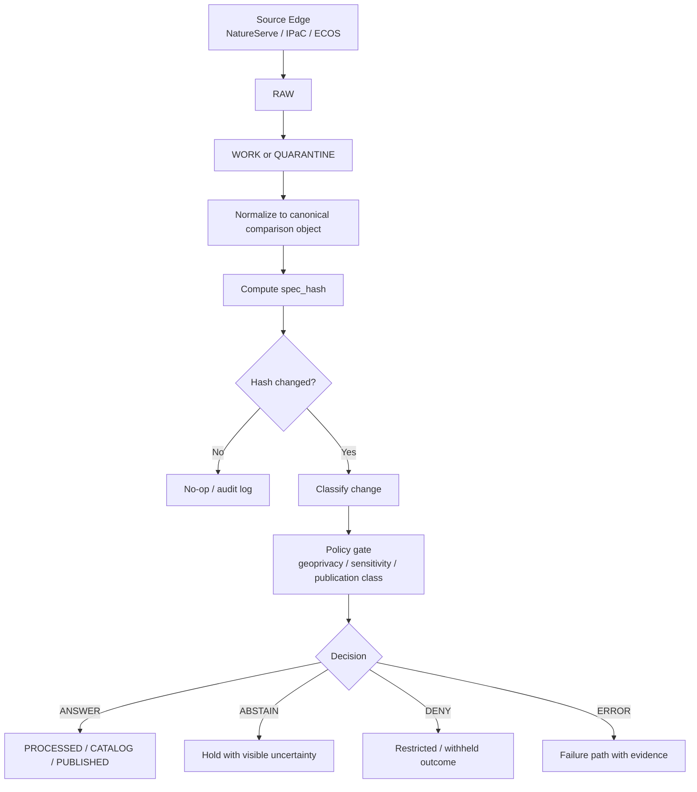
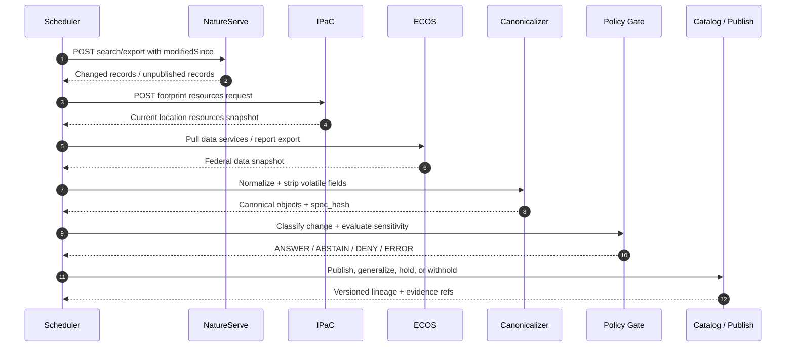

<!--
doc_id: NEEDS VERIFICATION
title: Conservation Change-Watch Pattern (NatureServe + IPaC + ECOS)
type: standard
version: v1
status: draft
owners: [@bartytime4life, NEEDS VERIFICATION]
created: NEEDS VERIFICATION
updated: 2026-04-05
policy_label: NEEDS VERIFICATION
related: [
  docs/governance/ROOT_GOVERNANCE.md,
  docs/governance/ETHICS.md,
  docs/analyses/ecology/README.md,
  docs/analyses/ecology/datasets/README.md,
  docs/analyses/ecology/datasets/derived/README.md,
  .github/CODEOWNERS
]
tags: [kfm, ecology, change-detection, natureserve, ipac, ecos, geoprivacy, provenance]
notes: [
  "Repository path and owning team are NEEDS VERIFICATION in this session.",
  "External API specifics are CONFIRMED from public official documentation as of 2026-04-05.",
  "KFM contract names are aligned to project doctrine where previously referenced, but live implementation wiring is NEEDS VERIFICATION."
]
-->

# Conservation Change-Watch Pattern (NatureServe + IPaC + ECOS)

**Purpose:** Define a governed, evidence-first pattern for detecting upstream ecological data changes from NatureServe Explorer, USFWS IPaC Location API, and ECOS/FWS data services.

> **Status:** experimental  
> **Owners:** @bartytime4life, **NEEDS VERIFICATION**  
> 
> 
> 
> 
> 

**Quick jumps:** [Scope](#scope) · [Repo fit](#repo-fit) · [Inputs](#accepted-inputs) · [Exclusions](#exclusions) · [Architecture](#architecture) · [Source connectors](#source-connectors) · [Canonicalization](#canonicalization-and-spec_hash) · [Policy gates](#policy-gates) · [Operations](#operations) · [Task list](#task-list) · [Appendix](#appendix)

---

## Scope

This document describes a **lightweight but governed** change-watch pattern for ecology and sensitive-occurrence adjacent data flows. The pattern combines:

- **NatureServe Explorer** for incremental record discovery using `modifiedSince`
- **IPaC Location API** for footprint-based current-resource snapshots
- **ECOS / USFWS data services and exports** for federal listing, habitat, and related regulatory overlays

The intent is to detect **material upstream changes** while preserving KFM trust rules:

- **Evidence before persuasion**
- **Context before compression**
- **Stewardship before exposure**
- **Correction before quiet supersession**

**CONFIRMED:** NatureServe Explorer supports `modifiedSince` in search criteria and export criteria.  
**CONFIRMED:** IPaC Location API accepts WKT footprint input and can return species, critical habitat, and other FWS resources for a location.  
**CONFIRMED:** ECOS exposes data services and explorer/report surfaces for species and critical habitat related data.  
**INFERRED:** A KFM implementation would treat these as source-edge inputs entering RAW → WORK/QUARANTINE → PROCESSED → CATALOG/TRIPLET → PUBLISHED.  
**NEEDS VERIFICATION:** Exact KFM repository path, contract classes, and active pipeline names.

---

## Repo fit

| Field | Value |
|---|---|
| Intended path | `docs/analyses/ecology/datasets/derived/CHANGE_WATCH_PATTERN.md` **NEEDS VERIFICATION** |
| Upstream dependencies | `docs/governance/ROOT_GOVERNANCE.md`, `docs/governance/ETHICS.md` |
| Adjacent docs | `docs/analyses/ecology/README.md`, `docs/analyses/ecology/datasets/README.md`, `docs/analyses/ecology/datasets/derived/README.md` |
| Downstream consumers | Derived dataset pipelines, catalog/provenance views, Focus surfaces, governed APIs **INFERRED** |
| Publication stance | Public-safe summary allowed; exact sensitive occurrences are **not publish-by-default** |

### Fit statement

This pattern belongs in the ecology / datasets / derived lane because it governs how authoritative external biodiversity sources are observed, normalized, compared, and conditionally promoted into KFM-derived products without letting derived convenience layers silently become sovereign truth.

---

## Accepted inputs

This pattern accepts:

1. **Source criteria objects** for NatureServe Explorer search or export jobs
2. **Project footprint geometries** for IPaC Location API
3. **ECOS/FWS dataset pulls** from official report/data service endpoints
4. **Checkpoint state** for prior successful run timestamps, ETags, prior `spec_hash` values, and release lineage
5. **Policy context** including publication class, precision controls, geoprivacy rules, and steward review requirements

### Example accepted artifacts

- ISO 8601 timestamps for `modifiedSince`
- WKT `POLYGON`, `MULTIPOLYGON`, or `LINESTRING` footprints where upstream supports them
- Official JSON/CSV/XLSX export outputs
- Prior run manifests and hash registries

---

## Exclusions

This pattern does **not** define:

- A final public species-occurrence publication policy for each taxon class
- A full authoritative replacement for NatureServe or USFWS source systems
- A promise of exact-site public release
- A generalized 3D ecology surface; KFM default remains 2D unless added burden is justified
- A UI contract for Focus Mode beyond the minimum evidence and decision expectations
- Continuous real-time streaming guarantees

---

## Directory tree

```text
docs/
├─ governance/
│  ├─ ROOT_GOVERNANCE.md
│  └─ ETHICS.md
└─ analyses/
   └─ ecology/
      ├─ README.md
      └─ datasets/
         ├─ README.md
         └─ derived/
            ├─ README.md
            └─ CHANGE_WATCH_PATTERN.md  # PROPOSED / NEEDS VERIFICATION
```

---

## Quickstart

> [!IMPORTANT]
> This quickstart is **PROPOSED**. Repository scripts, make targets, services, and schemas are **NEEDS VERIFICATION** unless already present in-repo.

### 1) Register source checkpoints

Create or update source checkpoint state with:

- `source_id`
- `cursor` or `modified_since`
- `etag` / `last_modified` when available
- prior `spec_hash`
- last successful evidence bundle reference

### 2) Pull source deltas or snapshots

- NatureServe: query by `modifiedSince`
- IPaC: submit canonical footprint and retrieve current resources
- ECOS: pull official reports/data services or exports on a scheduled cadence

### 3) Normalize to a canonical comparison object

Map raw source records into a stable KFM comparison structure:

- stable identifiers
- source lineage
- normalized statuses
- normalized geometry
- source timestamps
- precision/publication class hints

### 4) Compute `spec_hash`

Hash the canonical form after stripping volatile fields and normalizing ordering.

### 5) Run change classification and policy gates

If the new hash differs from the prior accepted hash:

- classify change severity
- attach evidence
- evaluate geoprivacy and stewardship controls
- decide: **ANSWER**, **ABSTAIN**, **DENY**, or **ERROR**

### 6) Publish, hold, or quarantine

Only promote outputs that satisfy trust, evidence, and exposure rules.

---

## Architecture

### High-level flow



### Runtime intent

The system should prefer a **finite, visible outcome** over hidden failure or quiet supersession.

| Outcome | Meaning |
|---|---|
| `ANSWER` | Sufficient evidence and allowed exposure; publish or promote |
| `ABSTAIN` | Insufficient certainty, incomplete lineage, or unresolved mismatch |
| `DENY` | Policy or sensitivity rules prohibit release |
| `ERROR` | Technical failure, malformed input, unavailable source, or invalid comparison |

---

## Source connectors

## NatureServe Explorer

**Role:** Incremental source-edge change detector for species and ecosystems.

**CONFIRMED behavior**

- Search APIs support `modifiedSince` in ISO 8601 with UTC offset
- Species and ecosystems searches are POST endpoints with structured criteria
- Export criteria also support `modifiedSince`
- NatureServe also exposes an unpublished-record search for taxa removed from Explorer

### Recommended use

Use NatureServe as the strongest **delta-oriented** source in this pattern:

- record `modifiedSince` checkpoint after a fully successful run
- preserve source request body
- store raw response payload
- map record identifiers and publication state into lineage

### Example request body

```json
{
  "criteriaType": "species",
  "textCriteria": [],
  "statusCriteria": [],
  "locationCriteria": [],
  "pagingOptions": {
    "page": 1,
    "recordsPerPage": 100
  },
  "recordSubtypeCriteria": [],
  "modifiedSince": "2026-04-01T00:00:00Z",
  "locationOptions": null,
  "classificationOptions": null,
  "speciesTaxonomyCriteria": []
}
```

### Use notes

- Prefer explicit pagination and durable checkpoints
- Treat unpublished-record results as **correction-significant**
- Do not assume Explorer summary outputs are cleared for exact-site public release

---

## IPaC Location API

**Role:** Footprint-based current-resource snapshot probe.

**CONFIRMED behavior**

- The API accepts a location in WKT form
- Supported geometry types include `LINESTRING`, `POLYGON`, and `MULTIPOLYGON`
- The resources endpoint can return species, critical habitat, field office, refuges, wetlands, and other FWS resources
- The API supports optional flags such as `includeCrithabGeometry`
- Official docs state the API will eventually require an API key

### Recommended use

Use IPaC as a **snapshot comparator** rather than a pure delta feed:

- canonicalize the submitted footprint
- submit the exact same footprint when comparing across runs
- separate geometry changes in the request from content changes in the response
- treat critical habitat geometry inclusion as a high-cost / high-noise option and enable deliberately

### Example request body

```json
{
  "projectLocationWKT": "POLYGON((-101.0 38.0,-101.0 39.0,-100.0 39.0,-100.0 38.0,-101.0 38.0))",
  "locationFormat": "WKT",
  "includeOtherFwsResources": true,
  "includeCrithabGeometry": false,
  "timeout": 5
}
```

### Use notes

- IPaC is best compared against a stable canonical footprint and a prior accepted response digest
- Because current outputs can vary as upstream species/habitat knowledge changes, keep request fingerprints and response hashes together
- Do not over-interpret minor list ordering or display-only metadata as material change

---

## ECOS / USFWS data services

**Role:** Federal authoritative data for listing, habitat, and related regulatory overlays.

**CONFIRMED behavior**

- ECOS provides data services / explorer/report access for species-related federal data
- ECOS exposes critical habitat data surfaces
- The Data Explorer documentation presents a REST-style exploration path for species data

### Recommended use

Use ECOS as a **federal authority overlay**:

- schedule periodic pulls rather than assuming push notifications
- version exports and source URLs as first-class lineage inputs
- compare listing/habitat status changes independently from derived summaries

### Use notes

- Prefer source URLs, retrieval timestamp, and dataset/report identifiers in evidence
- Treat federal listing or habitat changes as **material** by default
- Preserve distinction between source observation, normalized comparison object, and published derivative

---

## Canonicalization and `spec_hash`

The most important technical control in this pattern is **stable canonicalization** before hashing.

### Why canonicalization matters

Upstream APIs often include noise that should not count as ecological or regulatory change:

- volatile timestamps
- request IDs
- field ordering differences
- null-vs-empty representation drift
- minor numeric precision jitter in geometry
- non-semantic label or presentation changes

Without canonicalization, the system will produce false positives and unstable history.

### Canonical comparison object

A **PROPOSED** comparison envelope:

```json
{
  "source": {
    "system": "natureserve",
    "endpoint": "speciesSearch",
    "retrieved_at": "REMOVED_FROM_HASH",
    "request_fingerprint": "sha256:..."
  },
  "entity": {
    "stable_id": "ELEMENT_GLOBAL_ID",
    "record_type": "species"
  },
  "taxonomy": {
    "scientific_name": "Example species",
    "common_name": "Example common name"
  },
  "status": {
    "global_rank": "G2",
    "federal_status": "listed"
  },
  "geometry": {
    "type": "Polygon",
    "coordinates": "CANONICALIZED"
  },
  "publication": {
    "precision_class": "restricted-precise-view",
    "sensitivity_flags": ["rare_species"]
  }
}
```

### Canonicalization rules

| Rule | Intent |
|---|---|
| Sort object keys recursively | remove JSON ordering noise |
| Remove volatile transport fields | avoid false positives |
| Normalize empty/null patterns | reduce schema drift effects |
| Round coordinates to a defined precision | suppress insignificant geometry jitter |
| Canonicalize ring orientation and vertex order where feasible | stabilize geometry digests |
| Sort unordered lists by stable key | prevent list-order noise |
| Preserve semantically ordered lists | avoid masking true sequence changes |
| Record canonicalization version | support future re-hash with lineage |

### `spec_hash` definition

**PROPOSED:** `spec_hash = sha256(canonical_json_bytes)`

```python
import hashlib
import json

def canonical_dumps(obj: dict) -> bytes:
    return json.dumps(
        obj,
        sort_keys=True,
        separators=(",", ":"),
        ensure_ascii=False
    ).encode("utf-8")

def compute_spec_hash(obj: dict) -> str:
    return hashlib.sha256(canonical_dumps(obj)).hexdigest()
```

### Geometry digest

For geometry-heavy outputs, compute and store a separate `geometry_digest` in addition to the whole-object `spec_hash`.

This helps distinguish:

- metadata-only change
- geometry-only change
- mixed change

---

## Change classes

A hash mismatch is necessary for change detection, but not sufficient for publication.

### Proposed classes

| Class | Meaning | Typical response |
|---|---|---|
| `NONE` | Canonical object unchanged | no-op / audit only |
| `MINOR_METADATA` | Non-spatial, low-consequence metadata change | log, maybe hold for batching |
| `MATERIAL_STATUS` | Listing, rank, publication state, or authoritative status changed | evidence bundle + review/publish |
| `MATERIAL_GEOMETRY` | Spatial footprint or habitat geometry changed materially | policy gate + likely review |
| `UNPUBLISHED_OR_WITHDRAWN` | Upstream record removed or withdrawn | correction path |
| `SENSITIVE_EXPOSURE_RISK` | Change is real but output would increase exposure risk | generalize, withhold, or deny |

### Classification guidance

Treat these as **material by default**:

- federal listing changes
- critical habitat additions/removals
- NatureServe unpublished records
- precision increases on sensitive occurrences
- footprint membership changes that alter presence/absence claims

---

## Policy gates

> [!WARNING]
> Ecology outputs that imply rare-species locality, cultural sensitivity, or stewardship risk are **not publish-by-default**.

### Minimum gate checks

1. **Sensitivity**
   - rare or imperiled taxa?
   - sensitive habitat?
   - culturally sensitive overlap?
   - source license or use restrictions?

2. **Precision**
   - exact coordinates present?
   - geometry resolution too high for public release?
   - critical habitat or occurrence shapes expose restricted detail?

3. **Authority**
   - is the source authoritative for the claim being made?
   - is a derived summary being mistaken for sovereign truth?
   - does the evidence bundle resolve the claim cleanly?

4. **Correction**
   - is this a new version, a supersession, a withdrawal, or a narrowing?
   - will lineage remain visible?

### Gate outcomes

| Outcome | Meaning |
|---|---|
| `publish_public_safe` | Allowed for public-safe release |
| `publish_generalized` | Publish only generalized geometry / language |
| `steward_only` | Restrict to steward or privileged view |
| `withhold` | Hold from publication pending review |
| `deny` | Do not publish this output |

### Exposure classes

Use explicit classes when publishing or withholding:

- `public-safe`
- `generalized`
- `steward-only`
- `restricted-precise-view`
- `withheld`

---

## Evidence and lineage

Every accepted change should be accompanied by a traceable evidence package.

### Minimum evidence bundle

```json
{
  "source_system": "ipac",
  "retrieved_at": "2026-04-05T18:00:00Z",
  "request_fingerprint": "sha256:...",
  "previous_spec_hash": "abc123",
  "current_spec_hash": "def456",
  "geometry_digest_previous": "ghi789",
  "geometry_digest_current": "jkl012",
  "change_class": "MATERIAL_STATUS",
  "diff_summary": [
    "critical_habitat_presence: false -> true"
  ],
  "source_refs": [
    "official_endpoint_or_report_identifier"
  ],
  "canonicalization_version": "v1"
}
```

### KFM alignment

**INFERRED:** Suitable related KFM contracts likely include:

- `DatasetVersion`
- `EvidenceBundle`
- `ReleaseManifest`
- `ReleaseProofPack`
- `CorrectionNotice`

**NEEDS VERIFICATION:** Actual contract file names, JSON schemas, and publish services in the live repo.

---

## Operations

## Polling strategy

| Source | Preferred watch method | Notes |
|---|---|---|
| NatureServe | `modifiedSince` checkpoint polling | strongest native delta signal |
| IPaC | stable-footprint snapshot diff | no native `modifiedSince` observed in docs |
| ECOS | scheduled export/report diff | cadence depends on dataset and use case |

### Scheduler recommendations

- Keep independent checkpoints per source and per configured footprint/query
- Never advance a checkpoint until the full cycle succeeds
- Store request bodies and response digests with each checkpoint update
- Support replay from a prior checkpoint for correction and audit workflows

### Suggested cadence

| Source | Suggested starting cadence | Status |
|---|---|---|
| NatureServe | daily or twice daily | PROPOSED |
| IPaC | daily per managed footprint set | PROPOSED |
| ECOS | daily to weekly depending on dataset volatility | PROPOSED |

> [!NOTE]
> Final cadence should be driven by rate limits, source guidance, governance burden, and actual use-case criticality. Live source consumption policy is **NEEDS VERIFICATION**.

---

## Usage examples

### Example 1 — NatureServe species delta search

```json
{
  "criteriaType": "species",
  "modifiedSince": "2026-04-01T00:00:00Z",
  "pagingOptions": {
    "page": 1,
    "recordsPerPage": 100
  },
  "textCriteria": [],
  "statusCriteria": [],
  "locationCriteria": [],
  "recordSubtypeCriteria": [],
  "locationOptions": null,
  "classificationOptions": null,
  "speciesTaxonomyCriteria": []
}
```

### Example 2 — IPaC footprint snapshot

```json
{
  "projectLocationWKT": "MULTIPOLYGON(((-101 38,-101 39,-100 39,-100 38,-101 38)))",
  "locationFormat": "WKT",
  "includeOtherFwsResources": true,
  "includeCrithabGeometry": false,
  "timeout": 5
}
```

### Example 3 — Canonical diff decision pseudocode

```python
def evaluate_change(source_record, prior_state):
    canonical = normalize_to_comparison_object(source_record)
    new_hash = compute_spec_hash(canonical)
    old_hash = prior_state.spec_hash if prior_state else None

    if new_hash == old_hash:
        return {"decision": "ANSWER", "change_class": "NONE", "publish": False}

    diff = summarize_diff(prior_state.canonical if prior_state else None, canonical)
    change_class = classify_change(diff, canonical)
    gate = run_policy_gate(change_class, canonical, diff)

    return {
        "decision": gate["decision"],
        "change_class": change_class,
        "publish": gate["publish"],
        "spec_hash": new_hash,
        "diff": diff,
    }
```

---

## Diagram



---

## Data model sketch

| Field | Type | Purpose |
|---|---|---|
| `source_system` | string | `natureserve`, `ipac`, `ecos` |
| `source_endpoint` | string | endpoint or report identifier |
| `source_cursor` | string/null | `modifiedSince`, export cursor, or equivalent |
| `request_fingerprint` | string | digest of normalized request |
| `entity_stable_id` | string | durable entity identifier |
| `canonicalization_version` | string | comparison algorithm version |
| `spec_hash` | string | full canonical object digest |
| `geometry_digest` | string/null | geometry-only digest |
| `change_class` | string | classification result |
| `publication_class` | string | exposure control |
| `evidence_ref` | string | lineage/evidence locator |
| `supersedes` | string/null | prior release/version linkage |

---

## Task list

### Definition of done

- [ ] **NEEDS VERIFICATION** confirm target path and document owner(s)
- [ ] **NEEDS VERIFICATION** confirm related governance doc paths in mounted repo
- [ ] Add or confirm source connector code paths
- [ ] Add canonicalization versioning and stable hash tests
- [ ] Add policy-gate test cases for sensitive species and exact geometry exposure
- [ ] Add correction-path handling for unpublished/withdrawn records
- [ ] Add release manifest / evidence bundle integration
- [ ] Add operator runbook for checkpoint reset and replay
- [ ] Add public-safe examples distinct from restricted precise views
- [ ] Confirm licensing and usage constraints for each source before production release

### Suggested implementation gates

- [ ] Unit tests for canonicalization stability
- [ ] Fixture tests proving identical semantic inputs produce identical `spec_hash`
- [ ] Regression tests for list-order and timestamp-noise immunity
- [ ] Controlled examples showing geometry change triggers
- [ ] Policy tests for `public-safe`, `generalized`, `steward-only`, and `withheld`
- [ ] Documentation links validated relative to actual repo structure

---

## FAQ

### Why not hash raw payloads directly?

Because raw payloads often contain volatile or presentation-only differences that would produce false positives. The trust boundary is the **canonical comparison object**, not the transport envelope.

### Why keep separate `geometry_digest` and `spec_hash`?

Because many ecology changes are spatially meaningful. A separate geometry digest makes it easier to distinguish geometry-only from metadata-only changes.

### Why treat IPaC differently from NatureServe?

NatureServe exposes a documented `modifiedSince` pattern, which is a strong native delta signal. IPaC, by contrast, is best treated as a stable-footprint snapshot service whose outputs are compared across runs.

### Why is publication stricter than change detection?

Because a real upstream change can still create an exposure risk. KFM doctrine prefers visible restraint—generalize, withhold, steward-route, or deny—over unsafe disclosure.

---

## Appendix

<details>
<summary><strong>Appendix A — Comparison rules checklist</strong></summary>

### Strip from hash unless semantically required

- retrieval timestamp
- request ID
- trace ID
- cache metadata
- pagination wrappers not part of record meaning
- source-generated hyperlinks that do not change meaning

### Preserve in hash when semantically meaningful

- stable identifiers
- listing / rank / status values
- publication state
- geometry content after canonicalization
- presence / absence membership in footprint results
- source-side withdrawal / unpublished state

</details>

<details>
<summary><strong>Appendix B — Truth labels used in this document</strong></summary>

- **CONFIRMED** — directly supported by official source documentation or visible project doctrine already referenced in KFM context
- **INFERRED** — strongly implied by KFM doctrine but not live-verified in mounted repo during this session
- **PROPOSED** — recommended target shape consistent with KFM architecture but not proven as active implementation
- **UNKNOWN** — no reliable session evidence
- **NEEDS VERIFICATION** — owner/path/date/rule must be confirmed in repo before merge or public publication

</details>

<details>
<summary><strong>Appendix C — Open verification items</strong></summary>

1. Exact destination path in the mounted repository
2. Actual owner list and CODEOWNERS coverage
3. Whether KFM already defines a canonical `DatasetVersion` / `EvidenceBundle` schema for ecology deltas
4. Existing pipeline/runtime names for source-edge ingestion
5. Publication class vocabulary already standardized in ecology lane docs

</details>

---

_Back to top: [Conservation Change-Watch Pattern (NatureServe + IPaC + ECOS)](#conservation-change-watch-pattern-natureserve--ipac--ecos)_
