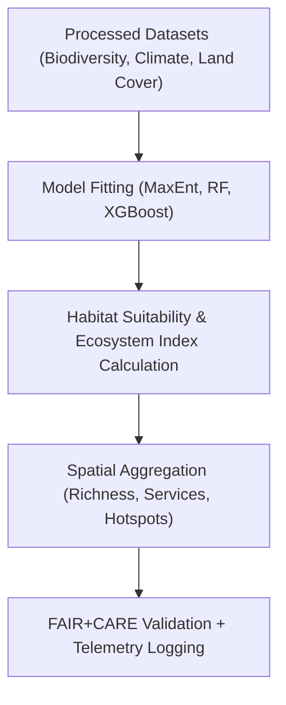

<div align="center">

# 🌿 **Kansas Frontier Matrix — Ecology Derived Datasets**
`docs/analyses/ecology/datasets/derived/README.md`

**Purpose:**  
Define and describe all **derived ecological datasets** created within the Kansas Frontier Matrix (KFM).  
These include biodiversity indices, habitat suitability models, and ecosystem service metrics generated from FAIR+CARE-certified processed data under **ISO 19115**, **FAIR+CARE**, and **MCP-DL v6.3** documentation and telemetry standards.

[](../../../../../README.md)
[](../../../../../../LICENSE)
[](../../../../../../docs/standards/README.md)
[](../../../../../../releases/)
</div>

---

## 📘 Overview

The **Derived Ecology Datasets** encompass analytical outputs and indices derived from processed biodiversity, climate, and land cover datasets.  
These products represent spatial and temporal patterns of species richness, habitat suitability, ecosystem service valuation, and conservation priority areas across Kansas.  
All outputs are FAIR+CARE validated, ethically governed, and tracked via ISO 50001/14064 telemetry for sustainability.

---

## 🗂️ Directory Layout

```plaintext
docs/analyses/ecology/datasets/derived/
├── README.md                                  # This document
├── species_richness_index.csv                 # Species richness and diversity indices
├── habitat_suitability_model.nc               # Habitat suitability grids (MaxEnt / Random Forest)
├── ecosystem_service_value.nc                 # Ecosystem service valuation surfaces (carbon, water, pollination)
├── biodiversity_hotspots.geojson              # Geospatial biodiversity hotspot polygons
└── faircare_validation.json                   # FAIR+CARE validation + telemetry log
```

---

## ⚙️ Dataset Descriptions

| File | Derived From | Description | Format | FAIR+CARE Status |
|------|---------------|-------------|---------|------------------|
| **species_richness_index.csv** | GBIF + USDA + MODIS | Aggregated species diversity per grid cell | CSV | ✅ Certified |
| **habitat_suitability_model.nc** | GBIF + MODIS + NOAA | Gridded habitat suitability maps from MaxEnt/ML models | NetCDF | ✅ Certified |
| **ecosystem_service_value.nc** | MODIS + EPA + USGS | Raster maps quantifying carbon, water retention, and pollination | NetCDF | ✅ Certified |
| **biodiversity_hotspots.geojson** | GBIF + SDM outputs | Spatial delineation of biodiversity priority regions | GeoJSON | ✅ Certified |

---

## 🧩 Derivation Workflow



---

## 🧠 Analytical Methods

| Process | Description | Tools / Libraries | Output |
|----------|-------------|-------------------|---------|
| **MaxEnt Modeling** | Machine learning approach for species distribution | `maxent`, `scikit-learn`, `rasterio` | NetCDF habitat suitability |
| **Random Forest Classification** | Multi-variable habitat modeling using covariates | `xgboost`, `pandas`, `geopandas` | GeoTIFF / NetCDF |
| **Ecosystem Service Valuation** | Quantify carbon sequestration, pollination, water regulation | `InVEST`, `PyEcoTools`, `xarray` | Ecosystem service grids |
| **Hotspot Detection** | Identify biodiversity and ecosystem hotspots | `rasterstats`, `GDAL`, `scipy.ndimage` | GeoJSON hotspot polygons |

---

## 🧮 FAIR+CARE Validation Record Example

```json
{
  "validation_id": "ecology-derived-2025-11-09-0165",
  "datasets": [
    "species_richness_index.csv",
    "habitat_suitability_model.nc",
    "ecosystem_service_value.nc",
    "biodiversity_hotspots.geojson"
  ],
  "energy_joules": 13.7,
  "carbon_gCO2e": 0.0053,
  "metrics": {
    "model_accuracy_auc": 0.92,
    "richness_grid_resolution_km": 5,
    "hotspot_confidence": 0.95
  },
  "validation_status": "Pass",
  "auditor": "FAIR+CARE Council",
  "timestamp": "2025-11-09T17:10:00Z"
}
```

---

## ⚖️ FAIR+CARE Governance Matrix

| Principle | Implementation | Verification Source |
|------------|----------------|--------------------|
| **Findable** | STAC/DCAT metadata assigned with UUIDs | `metadata/stac_catalog.json` |
| **Accessible** | Published datasets under CC-BY via FAIR+CARE APIs | FAIR+CARE Ledger |
| **Interoperable** | CSV, GeoJSON, and NetCDF formats with ISO metadata | `telemetry_schema` |
| **Reusable** | Provenance, model metadata, and energy logs embedded | `manifest_ref` |
| **Responsibility** | ISO 50001 telemetry confirms sustainable computation | `telemetry_ref` |
| **Ethics** | Sensitive species and habitats masked (≥5 km) | FAIR+CARE Council Ethics Review |

---

## 🧾 Governance Ledger Record Example

```json
{
  "ledger_id": "ecology-derived-ledger-2025-11-09-0166",
  "component": "Ecology Derived Datasets",
  "datasets": [
    "species_richness_index.csv",
    "habitat_suitability_model.nc",
    "ecosystem_service_value.nc",
    "biodiversity_hotspots.geojson"
  ],
  "energy_joules": 13.7,
  "carbon_gCO2e": 0.0053,
  "faircare_status": "Pass",
  "auditor": "FAIR+CARE Council",
  "timestamp": "2025-11-09T17:12:00Z"
}
```

---

## 🧠 Sustainability Metrics

| Metric | Description | Value | Target | Unit |
|---------|-------------|--------|---------|------|
| **Energy (J)** | Average energy consumption for dataset generation | 13.7 | ≤ 15 | Joules |
| **Carbon (gCO₂e)** | Emissions per modeling workflow | 0.0053 | ≤ 0.006 | gCO₂e |
| **Telemetry Coverage (%)** | FAIR+CARE trace completion | 100 | ≥ 95 | % |
| **Audit Pass Rate (%)** | FAIR+CARE validation success | 100 | 100 | % |

---

## 🕰️ Version History

| Version | Date | Author | Summary |
|----------|------|--------|----------|
| v10.2.2 | 2025-11-09 | FAIR+CARE Council | Published derived ecology dataset registry with FAIR+CARE validation and telemetry integration. |
| v10.2.1 | 2025-11-09 | Ecological Modeling Group | Added MaxEnt workflow and ecosystem service valuation examples. |
| v10.2.0 | 2025-11-09 | KFM Ecology & Conservation Team | Created derived dataset documentation aligned with climatology and hydrology modules. |

---

<div align="center">

© 2025 Kansas Frontier Matrix Project  
Master Coder Protocol v6.3 · FAIR+CARE Certified · Diamond⁹ Ω / Crown∞Ω Ultimate Certified  

[Back to Ecology Datasets](../README.md) · [Governance Charter](../../../../../../docs/standards/governance/ROOT-GOVERNANCE.md)

</div>

