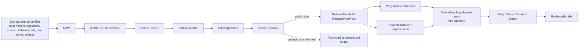

<!-- [KFM_META_BLOCK_V2]
doc_id: kfm://doc/<NEEDS_VERIFICATION>
title: Kansas Frontier Matrix — Ecology Derived Datasets
type: standard
version: v1
status: review
owners: <NEEDS_VERIFICATION>
created: YYYY-MM-DD
updated: YYYY-MM-DD
policy_label: <NEEDS_VERIFICATION>
related: [../README.md, ../../README.md, ../../../README.md, <NEEDS_VERIFICATION>]
tags: [kfm, ecology, datasets, derived]
notes: [Current-session workspace evidence was PDF-only; exact repo tree, owners, dates, policy label, related links, schema files, tests, and mounted directory inventory require verification before commit.]
[/KFM_META_BLOCK_V2] -->

# Kansas Frontier Matrix — Ecology Derived Datasets

Registry and operating guide for public-safe, release-linked **derived ecology datasets** in KFM.

> [!IMPORTANT]
> **Status:** review *(document role is well-supported by the corpus; mounted repo inventory and lifecycle metadata still need verification)*  
> **Owners:** `<NEEDS_VERIFICATION>`  
> [](#repo-fit)
> [](#scope)
> [](#definition-of-done)
> [](#open-verification-items)
> [](#interpretation-rules)  
> **Quick jumps:** [Scope](#scope) · [Repo fit](#repo-fit) · [Inputs](#inputs) · [Exclusions](#exclusions) · [Directory tree](#directory-tree) · [Quickstart](#quickstart) · [Usage](#usage) · [Diagram](#diagram) · [Publication burden](#publication-burden) · [Definition of done](#definition-of-done) · [FAQ](#faq) · [Appendix](#appendix)

> [!NOTE]
> In KFM, **derived** ecology outputs stay downstream of authoritative truth. They may be publishable, useful, and operationally important, but they must remain linked to release state, evidence, policy, and correction lineage.

---

## Scope

This directory is for **derived ecological datasets** and their release-facing documentation.

That includes ecology outputs such as biodiversity indices, habitat suitability layers, ecosystem-service metrics, pollinator or stewardship summaries, vegetation-change composites, and similar analytical products that are **computed from governed upstream inputs** rather than treated as sovereign truth.

### KFM rule of the road

Derived ecology outputs here should:

- remain visibly distinct from canonical or source-authoritative records
- preserve **support**, **time basis**, **rights posture**, **uncertainty**, and **modeled-vs-observed** status
- carry release linkage and proof objects when they underpin consequential public claims
- make correction, supersession, narrowing, and withdrawal visible instead of silent
- protect sensitive ecological locations through **generalization**, **withholding**, or steward review when required

> [!WARNING]
> Rare-species, nesting, denning, culturally sensitive, or otherwise vulnerable ecological locations must not be exposed casually. Public-safe ecology publication may require generalization, aggregation, delayed release, or full withholding.

[Back to top](#kansas-frontier-matrix--ecology-derived-datasets)

## Repo fit

**Path:** `docs/analyses/ecology/datasets/derived/` *(INFERRED from corpus draft material; NEEDS VERIFICATION against mounted repo tree)*

**Upstream context:**  
- [`../README.md`](../README.md) — datasets-level ecology context *(INFERRED; NEEDS VERIFICATION)*  
- [`../../README.md`](../../README.md) — ecology analysis context *(INFERRED; NEEDS VERIFICATION)*  
- [`../../../README.md`](../../../README.md) — analyses-level conventions *(INFERRED; NEEDS VERIFICATION)*

**Downstream consumers:**  
- map, dossier, story, compare, and export surfaces
- release manifests / proof packs
- EvidenceBundle drill-through flows
- policy and review workflows for public-safe ecology publication
- correction and supersession views

### What belongs here conceptually

This directory is the **inspectable documentation and registry face** of derived ecology products.

It is **not** the place for raw acquisition, unpublished candidate transforms, canonical internal truth stores, or hidden policy enforcement logic. Those belong upstream or elsewhere in the governed stack.

---

## Inputs

The following belong here:

- README and registry material for **derived ecology datasets**
- per-dataset entries or linked documents describing release-linked ecology derivatives
- method notes that state whether an output is:
  - observation-derived
  - modeled
  - assimilated
  - mixed
- references to required trust objects and release artifacts
- public-safe summaries of upstream source families when they materially affect interpretation
- sensitivity, geoprivacy, rights, uncertainty, and correction notes needed for downstream publication

### Representative ecology source roles

The corpus makes source-role discipline load-bearing. For ecology, that matters because different source families carry different publication burdens.

| Source role | Representative ecology sources | Typical use here | Main caution |
|---|---|---|---|
| Statutory / administrative | KDWP listed-species materials, USFWS listed-species / habitat programs, protected-area or stewardship records | listing status, stewardship overlays, review burden | legal status, habitat suitability, and ecological condition are related but not identical |
| Direct observational / instrumented | field surveys, specimen records, biodiversity collections, station/plot observations | occurrence support, measured observations, site summaries | support, units, cadence, method, and calibration context must stay visible |
| Community-contributed | eBird, iNaturalist, other citizen-science observations | supplementary occurrence context, trend hints, observation density | contributor evidence is governed input, not automatic truth |
| Modeled / assimilated | habitat suitability, interpolation, ecosystem-service indices, predicted habitat surfaces, climate or land-cover derivatives | derived surfaces and prioritization outputs | modeled status and validation limits must stay explicit |
| Mirror / discovery service | GBIF and similar aggregation/discovery layers | discovery, comparison, source expansion, occurrence search | mirrors are provenance anchors, not replacements for origin authorities |
| Documentary / archival | reports, stewardship plans, historic vegetation mapping, interpretive descriptions | explanatory context, temporal framing, narrative support | context must not be flattened into decontextualized facts |

### Representative upstream ecology source families

| Source family | Typical upstream role | Why it matters here |
|---|---|---|
| KDWP listed-species and ecological review materials | state regulatory and stewardship context | exact-location sensitivity and regulatory interpretation burdens are high |
| USFWS / ECOS / IPaC | federal listed-species and habitat context | species or habitat presence in a review workflow is not the same as a public-safe point release |
| GBIF / specimen repositories | occurrence discovery and cross-source corroboration | discovery copies and aggregated occurrence data require provenance discipline |
| eBird / iNaturalist | community-contributed observation streams | useful for coverage and recency, but not equivalent to settled authority |
| Land-cover, climate, terrain, hydrology, protected-area overlays | environmental covariates and context layers | many ecology derivatives depend on these as explanatory or predictive inputs |
| Modeled habitat / ecosystem-service products | analytic or prioritization layers | must never masquerade as direct observation |

> [!NOTE]
> The table above is **representative operational guidance**, not a verified mounted connector inventory for this directory.

---

## Exclusions

The following do **not** belong here:

- raw captures, unpublished downloads, or quarantine-stage transforms
- canonical internal source-of-truth records
- exact sensitive location data that has not passed public-safe review
- runtime services, policy bundles, schema authority, or enforcement code
- detached prose that is not tied to release scope, evidence, or correction lineage
- decorative summaries that make a derived ecology layer appear more authoritative than it is

### Send these elsewhere instead

| Does not belong here | Where it should go instead |
|---|---|
| RAW / WORK / QUARANTINE / PROCESSED artifacts | governed upstream data lanes *(exact paths NEED VERIFICATION)* |
| exact rare-species or culturally sensitive point data | steward-only or restricted review surfaces |
| schema authority and policy enforcement files | contracts / schemas / policy lanes *(exact paths NEED VERIFICATION)* |
| governed API implementations and runtime envelopes | runtime / services / APIs lanes *(exact paths NEED VERIFICATION)* |
| release automation and proof-pack assembly | release / delivery / CI lanes *(exact paths NEED VERIFICATION)* |

---

## Directory tree

The mounted repo tree was not directly visible in this session, so the tree below is intentionally conservative.

```text
docs/
└── analyses/
    └── ecology/
        └── datasets/
            └── derived/
                ├── README.md
                ├── <dataset entries or registry docs>      # NEEDS VERIFICATION
                ├── <method or model notes>                # NEEDS VERIFICATION
                ├── <release / proof references>           # NEEDS VERIFICATION
                └── <supersession / correction notes>      # NEEDS VERIFICATION
```

If this directory already contains concrete files, replace the placeholder tree with the mounted inventory before commit.

---

## Quickstart

1. Start from a **known upstream lineage**.
2. Mark the output clearly as **derived**.
3. State whether it is observed, observation-derived, modeled, assimilated, or mixed.
4. Record spatial support and temporal basis explicitly.
5. Link the required proof objects.
6. Apply geoprivacy, rights, and sensitivity handling before any public-safe release.
7. Preserve correction and supersession lineage instead of overwriting quietly.

### Fast intake checklist

- [ ] stable dataset identifier
- [ ] human-readable title
- [ ] one-sentence purpose
- [ ] derived status stated explicitly
- [ ] upstream version or source references
- [ ] spatial support / grain
- [ ] temporal basis
- [ ] modeled-vs-observed note
- [ ] uncertainty note
- [ ] rights / sensitivity / geoprivacy note
- [ ] release or proof-object links
- [ ] correction / supersession linkage where applicable

---

## Usage

### Minimum entry shape

Every consequential dataset entry in this directory should be able to answer:

- **What is it?**
- **What was it derived from?**
- **At what support and time basis?**
- **Is it modeled, observed, or mixed?**
- **What rights/sensitivity constraints apply?**
- **What release/proof objects back it?**
- **How is correction or supersession handled?**

### Illustrative dataset-entry skeleton

```yaml
# Illustrative example only — structure, not a confirmed mounted schema
dataset_id: <stable-id>
title: <dataset title>
dataset_class: <biodiversity-index|habitat-suitability|ecosystem-service|stewardship-summary|other>
truth_status: derived
release_ref: <release-manifest-or-proof-pack>
upstream_dataset_versions:
  - <dataset_version_id>
projection_build_receipt: <receipt-ref>
evidence_bundle_ref: <bundle-ref>
spatial_support: <grid|watershed|county|protected-area|other>
temporal_basis:
  kind: <as-of|interval|season|multi-year>
  value: <date-or-interval>
method:
  status: <observation-derived|modeled|assimilated|mixed>
  summary: <short explanation>
  uncertainty_note: <required>
sensitivity:
  exact_locations_public: false
  handling: <generalized|withheld|public-safe>
correction:
  supersedes: <optional>
  superseded_by: <optional>
```

### Update / supersede flow

1. Keep the earlier record discoverable.
2. Publish the newer release linkage.
3. Add a visible supersession or correction note.
4. Rebuild dependent derived views when required.
5. Preserve visibility across map, story, export, and other trust surfaces.

[Back to top](#kansas-frontier-matrix--ecology-derived-datasets)

## Diagram


```mermaid
flowchart LR
    A[Ecology source families<br/>observations, regulatory context, habitat inputs, land cover, climate] --> B[RAW]
    B --> C[WORK / QUARANTINE]
    C --> D[PROCESSED]
    D --> E[DatasetVersion]
    E --> F[CatalogClosure]
    F --> G[Policy / Review]
    G -->|public-safe| H[ReleaseManifest / ReleaseProofPack]
    H --> I[ProjectionBuildReceipt]
    I --> J[Derived ecology dataset entry<br/>this directory]
    J --> K[Map / Story / Dossier / Export]
    K --> L[EvidenceBundle]
    G -->|generalize or withhold| M[Restricted or generalized output]
    H --> N[CorrectionNotice / supersession]
    N --> J
```

---

## Derived dataset classes

The classes below are a **PROPOSED starter taxonomy** for maintainers. Treat them as a reviewable working set until the mounted inventory is verified.

| Dataset class | Representative output | Typical support | What must stay visible |
|---|---|---|---|
| Biodiversity index | richness/diversity surface, observation-density summary | grid, watershed, county, protected-area unit | source mix, observation density, temporal basis, uncertainty |
| Habitat suitability | suitability or corridor surface | raster cell, habitat polygon, corridor | modeled status, assumptions, validation limits |
| Ecosystem service metric | service-capacity or ecological-benefit estimate | watershed, county, ecological unit | component logic, weights, uncertainty, comparability limits |
| Stewardship / conservation priority | priority ranking or triage layer | protected-area, county, landscape unit | ranking logic, decomposability, review context |
| Derived observation summary | trend or aggregated occurrence summary | site, county-year, basin-year, protected-area interval | aggregation rules, missingness, source coverage |
| Vegetation / habitat change composite | change class or condition surface | raster cell, polygon, unit-year | baseline years, method, classification caveats |

> [!NOTE]
> These examples are operationally plausible and corpus-consistent, but they are **not** a confirmed directory inventory.

---

## Required trust objects

The corpus repeatedly prefers named, typed trust objects over undocumented behavior. For this directory, the smallest useful set is below.

| Object | Required when | Why it matters here |
|---|---|---|
| `DatasetVersion` | always | anchors the authoritative candidate or promoted subject set used upstream |
| `CatalogClosure` | outward release metadata exists | ties the dataset to STAC / DCAT / PROV closure and outward identifiers |
| `DecisionEnvelope` | policy, rights, or sensitivity materially shape output | makes the policy result machine-readable and reviewable |
| `ReviewRecord` | approval, denial, escalation, or note is required | preserves human decision context |
| `ReleaseManifest` / `ReleaseProofPack` | any public-safe release | binds release scope, docs/accessibility gate, rollback, and correction posture |
| `ProjectionBuildReceipt` | any built derivative such as map/vector/raster/search layer | proves the derived ecology surface was built from a known release scope |
| `EvidenceBundle` | consequential claim, feature, story, export preview, or answer | keeps support inspectable at the point of use |
| `RuntimeResponseEnvelope` | bounded Focus / governed assistance touches the dataset | keeps runtime result and audit linkage accountable |
| `CorrectionNotice` | supersession, withdrawal, narrowing, or geoprivacy correction occurs | preserves visible lineage under change |

---

## Publication burden

Ecology is a lane where publication burden is especially easy to understate. Use the table below as the minimum review frame.

| Burden | What must be explicit | Common failure to avoid |
|---|---|---|
| Exact-location sensitivity | whether release is precise, generalized, aggregated, or withheld | exposing rare-species or vulnerable habitat locations as ordinary points |
| Modeled vs observed status | whether output is measured, inferred, modeled, or mixed | presenting a habitat or priority model as direct fact |
| Support / grain | raster cell, watershed, county-year, protected-area unit, corridor, etc. | comparing unlike units without saying so |
| Temporal basis | as-of date, interval, season, or multi-year window | collapsing time into a timeless surface |
| Rights / reuse posture | license, steward expectations, restrictions, public-safe status | publishing reuse assumptions by silence |
| Uncertainty / completeness | missingness, validation limits, confidence, partial coverage | polished outputs hiding weak support |
| Correction lineage | superseded, rebuilt, generalized, narrowed, withdrawn | silent overwrite |

### Ecology-specific caution points

| Case | Required treatment |
|---|---|
| rare species, nesting, denning, or vulnerable habitat | default to generalization or withholding unless public-safe exposure is justified |
| citizen-science-heavy inputs | preserve contributor/source context; do not equate contribution with settled truth |
| mixed-source composites | record source-family differences and comparability limits |
| predictive habitat or ecosystem-service surfaces | keep modeled status and uncertainty visible in-place |
| protected-area or stewardship summaries | distinguish legal/protected status from measured ecological condition |
| county or coarse administrative summaries | do not imply fine-grained locality precision |

[Back to top](#kansas-frontier-matrix--ecology-derived-datasets)

## Interpretation rules

### 1) Derived is not authoritative

This directory does not redefine ecology truth in KFM. It documents **derived** products that must remain linked back to governed upstream inputs, release state, and correction lineage.

### 2) Public-safe is earned, not assumed

A useful ecological derivative is not automatically safe to publish.

### 3) Evidence stays one hop away

If a map, table, narrative, or export cannot route a reviewer to inspectable support, it is incomplete.

### 4) Sensitive precision is a review burden

Where exact ecological locations could create harm, the public-safe form may be generalized or withheld, and that narrowing should be visible.

### 5) Correction preserves trust

Supersession, narrowing, withdrawal, and geoprivacy correction are part of the system, not embarrassing exceptions.

---

## Definition of done

A dataset entry in this directory is ready when all applicable checks below are true.

- [ ] The entry is clearly labeled as **derived**.
- [ ] Upstream dataset version(s) or source references are named.
- [ ] Spatial support and temporal basis are explicit.
- [ ] Observed / modeled / mixed status is explicit.
- [ ] Rights, sensitivity, and geoprivacy handling are explicit.
- [ ] Required proof objects are linked or referenced.
- [ ] Correction readiness is visible: supersedes / superseded-by / withdrawn state where relevant.
- [ ] Exact locations that should be generalized or withheld are not exposed.
- [ ] Public-facing claims are inspectable through evidence linkage.
- [ ] The entry does not imply canonical authority for a derived layer.
- [ ] Documentation and accessibility checks have been considered before release.

### Recommended review gates

| Gate | Expectation |
|---|---|
| provenance gate | upstream lineage is reconstructible |
| support/time gate | support and temporal semantics are not implied away |
| modeled-status gate | modeled outputs do not masquerade as direct observation |
| public-safe gate | exact-location and sensitivity issues are handled |
| documentation gate | wording, labels, and caveats match actual behavior |
| accessibility gate | headings, tables, labels, and collapsed appendices remain readable in GitHub |

---

## FAQ

### Why is this a documentation directory instead of the ecology data store?

Because KFM separates authoritative truth from derived delivery and release-facing surfaces. This directory is for the **inspectable registry/documentation face** of derived ecology outputs.

### Can habitat suitability models live here?

Yes — as **derived** outputs, not as authoritative facts. Their modeled status, assumptions, uncertainty, and validation limits must remain visible.

### Can I publish a point layer of rare-species observations here?

Not by default. Exact ecological locations may require generalization, aggregation, withholding, or steward review.

### Can a citizen-science-heavy layer be included?

Yes, but contributor evidence must remain clearly labeled and governed. Community-contributed input is not automatic truth.

### Can I keep only a pretty map and skip the proof objects?

No. A map may be downstream of the entry, but the entry should still preserve release linkage, proof references, and correction lineage.

[Back to top](#kansas-frontier-matrix--ecology-derived-datasets)

## Appendix

<details>
<summary><strong>Open verification items</strong></summary>

### Metadata and ownership
- Verify `doc_id`, owners, created date, updated date, and policy label.
- Confirm whether this document should remain in `review` status or move to another lifecycle value.

### Parent and related links
- Confirm whether the following parent docs actually exist:
  - `../README.md`
  - `../../README.md`
  - `../../../README.md`

### Mounted directory inventory
- Replace the placeholder tree with the actual contents of `docs/analyses/ecology/datasets/derived/`.
- Confirm whether this directory contains only Markdown/registry material or also release-linked data artifacts.

### Schema, tests, and release references
- Verify whether any companion schema files actually exist for this doc.
- Verify whether metadata / provenance / accessibility test profiles are implemented in the mounted repo.
- Verify whether release-manifest or proof-pack references exist for the current ecology-derived directory state.

### Proposal-derived cues intentionally left un-hardened
A nearby draft for this exact target path suggests — but does not prove in the mounted repo — the following fields:
- lifecycle stage: `stable`
- review cadence: every 12 months
- accessibility target: `WCAG 2.1 AA+`
- AI training inclusion: `false`
- AI focus-mode usage: allowed with restrictions
- prohibited transform: species-location de-anonymization
- test profiles:
  - markdown-lint
  - schema-lint
  - metadata-check
  - provenance-check
  - footer-check
  - accessibility-check

Treat these as **NEEDS VERIFICATION** until confirmed against the mounted repository.

</details>

<details>
<summary><strong>Maintainer notes</strong></summary>

- Prefer short, explicit dataset summaries over abstract prose.
- Keep “derived”, “modeled”, “generalized”, “partial”, “withdrawn”, and “superseded” visible in-place.
- Do not convert uncertainty into soft marketing language.
- Where a source family is discovery-oriented rather than origin-authoritative, say so.
- When in doubt, choose the smaller public-safe representation and escalate for review.

</details>
