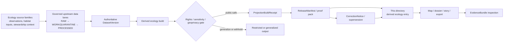

<!-- [KFM_META_BLOCK_V2]
doc_id: kfm://doc/<NEEDS_VERIFICATION>
title: Kansas Frontier Matrix — Ecology Derived Datasets
type: standard
version: v1
status: review
owners: <NEEDS_VERIFICATION>
created: YYYY-MM-DD
updated: YYYY-MM-DD
policy_label: <NEEDS_VERIFICATION>
related: [../README.md, ../../README.md, ../../../README.md, <NEEDS_VERIFICATION>]
tags: [kfm, ecology, datasets, derived]
notes: [Mounted repo tree was not directly visible in the current session; owners, dates, policy label, related links, and exact directory inventory require verification before commit.]
[/KFM_META_BLOCK_V2] -->

# Kansas Frontier Matrix — Ecology Derived Datasets

Registry and operating guide for public-safe, release-linked, **derived ecology datasets** in KFM.

> [!IMPORTANT]
> **Status:** active *(document role confirmed; lifecycle state and mounted inventory still need verification)*  
> **Owners:** `<NEEDS_VERIFICATION>`  
> [](#repo-fit)
> [](#scope)
> [](#definition-of-done)
> [](#open-verification-items)
> [](#scope)  
> **Quick jumps:** [Scope](#scope) · [Repo fit](#repo-fit) · [Inputs](#inputs) · [Exclusions](#exclusions) · [Directory tree](#directory-tree) · [Usage](#usage) · [Diagram](#diagram) · [Publication burden](#publication-burden) · [Definition of done](#definition-of-done) · [FAQ](#faq) · [Appendix](#appendix)

> [!NOTE]
> This directory is for **derived** ecology outputs and their documentation. In KFM, derived layers stay downstream of authoritative truth and must remain rebuildable, inspectable, and correction-linked.

---

## Scope

This directory documents **derived ecological datasets** used by Kansas Frontier Matrix analysis and publication flows. Typical contents include release-linked descriptions of biodiversity indices, habitat suitability outputs, ecosystem-service metrics, stewardship summaries, and other ecology-facing products that are **computed from governed upstream inputs**, not treated as canonical truth.

The governing KFM posture for this directory is straightforward:

- keep **authoritative** source and processed data distinct from **derived** projections
- make **support**, **time basis**, **rights posture**, and **uncertainty** visible
- require release linkage, proof objects, and correction lineage for consequential public use
- protect sensitive ecological locations through **generalization**, **withholding**, or steward review where needed

> [!WARNING]
> Rare-species and culturally sensitive ecological locations must not be exposed casually. Public-safe ecology outputs may require geoprivacy, generalization, or full withholding.

[Back to top](#kansas-frontier-matrix--ecology-derived-datasets)

## Repo fit

**Path:** `docs/analyses/ecology/datasets/derived/`

**Upstream context:**  
- [`../README.md`](../README.md) — datasets-level ecology context *(INFERRED; NEEDS VERIFICATION)*  
- [`../../README.md`](../../README.md) — ecology analysis context *(INFERRED; NEEDS VERIFICATION)*  
- [`../../../README.md`](../../../README.md) — analyses-level conventions *(INFERRED; NEEDS VERIFICATION)*

**Downstream consumers:**  
- release-linked map, dossier, story, export, and evidence-inspection surfaces
- proof objects such as `ProjectionBuildReceipt`, `EvidenceBundle`, and correction-linked public views
- governance and review workflows for public-safe ecology publication

**Why this directory exists:**  
It gives maintainers one place to keep the *documented, inspectable face* of KFM’s derived ecology outputs without collapsing them into raw source storage, runtime code, or policy bundles.

---

## Inputs

The following belong here:

- documentation and registry entries for **derived ecology datasets**
- release-linked descriptions of biodiversity, habitat, stewardship, or ecosystem-service outputs
- method notes that explain whether an output is **observed**, **derived from observations**, or **modeled**
- links or references to required trust objects such as:
  - `DatasetVersion`
  - `ProjectionBuildReceipt`
  - `EvidenceBundle`
  - `ReleaseManifest` / proof-pack references
  - `CorrectionNotice` where applicable
- public-safe summaries of representative source families used upstream, especially when they materially affect interpretation
- geoprivacy, rights, sensitivity, and uncertainty notes needed for downstream publication

### Representative upstream ecology source families

| Source family | Typical upstream role | Why it matters here |
|---|---|---|
| GBIF / iNaturalist / eBird | species observations and occurrence-derived summaries | observation density, sampling bias, and geoprivacy affect downstream interpretation |
| PAD-US / KDWP / Kansas Natural Heritage Inventory | protected-area and stewardship overlays | legal/protected status does not automatically equal ecological condition |
| Biodiversity collections | specimen- and collection-based support | time basis, collection method, and spatial precision matter |
| Environmental and land-cover inputs | habitat, cover, terrain, climate, or other ecological context | modeled outputs must not be mislabeled as direct observation |

---

## Exclusions

The following do **not** belong here:

- raw captures, unreviewed downloads, or unpublished candidate transforms
- canonical source-of-truth records that belong upstream in governed data lanes
- exact species-location material that has not passed public-safe review
- policy bundles, route definitions, runtime code, or schema-authority files
- detached narrative prose that is not tied back to release scope and inspectable evidence
- convenience summaries that would make a derived ecology layer look authoritative by omission

### Send these elsewhere instead

| Does not belong here | Where it should go instead |
|---|---|
| RAW / WORK / QUARANTINE / PROCESSED artifacts | authoritative upstream data lanes *(exact paths NEED VERIFICATION)* |
| restricted precise-location ecology data | steward-only or restricted review surfaces |
| policy code and obligation registries | policy / contract authority lanes *(exact paths NEED VERIFICATION)* |
| runtime response handling and governed API implementation | runtime / services / contracts lanes *(exact paths NEED VERIFICATION)* |
| release automation and proof-pack assembly | delivery / release / CI lanes *(exact paths NEED VERIFICATION)* |

---

## Directory tree

The mounted repo tree was not directly visible in this session, so the tree below is intentionally conservative.

```text
docs/
└── analyses/
    └── ecology/
        └── datasets/
            └── derived/
                ├── README.md
                ├── <dataset-registry entries>          # NEEDS VERIFICATION
                ├── <method-or-model notes>            # NEEDS VERIFICATION
                ├── <release/proof references>         # NEEDS VERIFICATION
                └── <correction-or-supersession docs>  # NEEDS VERIFICATION
```

If this directory already contains concrete dataset files, update this tree to match the mounted inventory exactly rather than preserving placeholders.

---

## Usage

### Quickstart

1. Add or update a dataset entry only after its upstream inputs have a known governed lineage.
2. Mark the output clearly as **derived** and state whether it is:
   - observation-derived
   - modeled
   - assimilated
   - mixed
3. Record the **spatial support** and **temporal basis**.
4. Attach or reference the required proof objects.
5. Apply geoprivacy, rights, and sensitivity handling before public-safe publication.
6. Make supersession or correction visible rather than silently overwriting earlier claims.

### Minimum per-dataset checklist

- stable dataset identifier
- human-readable title
- one-sentence purpose
- release reference
- upstream dataset version reference(s)
- support / grain
- temporal basis
- observed vs modeled status
- uncertainty note
- geoprivacy / rights / sensitivity note
- proof-object links
- correction / supersession linkage where relevant

### Illustrative entry skeleton

```yaml
# Illustrative example only — structure, not a confirmed mounted schema
dataset_id: <stable-id>
title: <dataset title>
dataset_class: <species-richness|habitat-suitability|ecosystem-service|stewardship-summary>
truth_status: derived
release_ref: <release-manifest-or-proof-pack>
upstream_dataset_versions:
  - <dataset_version_id>
projection_build_receipt: <receipt-ref>
evidence_bundle_ref: <bundle-ref>
spatial_support: <grid|watershed|county|protected-area|other>
temporal_basis:
  kind: <as-of|interval|season|multi-year>
  value: <date-or-interval>
method:
  status: <observation-derived|modeled|assimilated|mixed>
  summary: <short explanation>
  uncertainty_note: <required>
sensitivity:
  exact_locations_public: false
  handling: <generalized|withheld|public-safe>
correction:
  supersedes: <optional>
  superseded_by: <optional>
```

### Update / supersede flow

1. Keep the older record discoverable.
2. Publish the newer release linkage.
3. Add a visible supersession note.
4. Rebuild any dependent derived views if needed.
5. Keep correction lineage visible across map, story, export, and other public-facing surfaces.

[Back to top](#kansas-frontier-matrix--ecology-derived-datasets)

## Diagram


```mermaid
flowchart LR
    A[Ecology source families<br/>observations, habitat inputs, stewardship context] --> B[Governed upstream data lanes<br/>RAW → WORK/QUARANTINE → PROCESSED]
    B --> C[Authoritative DatasetVersion]
    C --> D[Derived ecology build]
    D --> E{Rights / sensitivity / geoprivacy gate}
    E -->|public-safe| F[ProjectionBuildReceipt]
    F --> G[ReleaseManifest / proof pack]
    G --> H[This directory<br/>derived ecology entry]
    H --> I[Map / dossier / story / export]
    I --> J[EvidenceBundle inspection]
    E -->|generalize or withhold| K[Restricted or generalized output]
    G --> L[CorrectionNotice / supersession]
    L --> H
```

---

## Derived dataset classes

The classes below are a **starter taxonomy** for maintainers. Treat them as operational guidance until the mounted inventory is verified.

| Dataset class | Representative output | Typical support | Must stay visible |
|---|---|---|---|
| Biodiversity index | species richness / diversity surface | grid, watershed, county, protected-area unit | observation density limits, method, time basis |
| Habitat suitability | suitability score, corridor score, connectivity surface | raster cell, habitat polygon, corridor | modeled status, assumptions, validation limits |
| Ecosystem service metric | service-capacity or ecological-benefit estimate | watershed, county, ecological unit | indicator composition, weights, uncertainty |
| Stewardship / conservation priority | priority ranking or triage layer | protected-area, basin, county, landscape unit | ranking logic, decomposability, review context |
| Derived observation summary | aggregated trend or summary layer | interval, site, county-year, basin-year | aggregation rule, missingness, source coverage |

> [!NOTE]
> The examples above are representative. They are not a confirmed mounted file inventory for this directory.

---

## Required trust objects

Every consequential dataset entry in this directory should be anchored by the smallest applicable trust-object set below.

| Object | Required when | Why it belongs here |
|---|---|---|
| `DatasetVersion` | always | identifies the authoritative candidate or promoted subject set used upstream |
| `ProjectionBuildReceipt` | any built map/vector/raster/search derivative | proves the derived ecology output was built from a known release scope |
| `EvidenceBundle` | any consequential public claim, feature, export preview, or explanation | keeps evidence inspectable at the point of use |
| `DecisionEnvelope` | when policy, rights, or sensitivity handling materially shapes output | records machine-readable result, reasons, obligations, and audit linkage |
| `ReviewRecord` | where approval, escalation, or denial is required | preserves who approved what, and when |
| `ReleaseManifest` / proof pack | any public-safe release | binds release scope, docs/accessibility gates, and rollback posture |
| `CorrectionNotice` | supersession, withdrawal, narrowing, or geoprivacy correction | preserves visible lineage under change |

---

## Publication burden

Derived ecology outputs should not flatten important distinctions.

| Burden | What must be explicit | Common failure to avoid |
|---|---|---|
| Exact-location sensitivity | whether publication is precise, generalized, or withheld | exposing rare-species or culturally sensitive locations as ordinary points |
| Modeled vs observed status | whether the output is measured, inferred, modeled, or mixed | presenting a habitat model as direct fact |
| Support / grain | raster cell, watershed, county-year, protected-area unit, corridor, etc. | comparing unlike units without saying so |
| Temporal basis | as-of date, interval, season, or multi-year window | collapsing time into a timeless surface |
| Rights / reuse posture | license, steward expectations, restrictions, public-safe status | publishing reuse assumptions by silence |
| Uncertainty / completeness | missingness, validation limits, confidence, partial coverage | overconfident map polish hiding weak support |
| Correction lineage | superseded, withdrawn, generalized, rebuilt, or current | silent overwrite |

### Ecology-specific caution points

| Case | Required treatment |
|---|---|
| rare species, nesting, denning, or vulnerable habitat | default to generalization or withholding unless public-safe exposure is justified |
| citizen-science-heavy inputs | preserve contributor/source context; do not equate contribution with settled truth |
| composite conservation scores | keep components inspectable; avoid “risk theater” or opaque ranking surfaces |
| mixed-source derivatives | record source-family differences and comparability limits |
| historical ecology or long-span trend layers | keep time scope visible |

[Back to top](#kansas-frontier-matrix--ecology-derived-datasets)

## Interpretation rules

### 1) Derived is not authoritative

This directory does not redefine authoritative ecology truth. It documents *derived* products that must remain linked back to governed upstream inputs and release state.

### 2) Public-safe is earned, not assumed

Nothing here should be treated as automatically publishable just because it is analytically useful.

### 3) Evidence stays one hop away

If a map, table, narrative, or export cannot route a reviewer to inspectable support, it is incomplete.

### 4) Correction preserves lineage

Supersession, narrowing, withdrawal, and generalization must remain visible.

---

## Definition of done

A dataset entry in this directory is ready when all applicable gates below are true.

- [ ] The entry is clearly labeled as **derived**.
- [ ] Upstream dataset version(s) are named or linked.
- [ ] The spatial support and temporal basis are explicit.
- [ ] Observed / modeled / mixed status is explicit.
- [ ] Rights, sensitivity, and geoprivacy handling are explicit.
- [ ] Required proof objects are linked or referenced.
- [ ] The entry is correction-ready: supersedes / superseded-by / withdrawn state is visible where relevant.
- [ ] The entry does not reveal exact locations that should be generalized or withheld.
- [ ] Public-facing claims are inspectable through evidence linkage.
- [ ] Documentation and accessibility checks have been considered before release.

### Recommended review gates

| Gate | Expectation |
|---|---|
| provenance gate | upstream lineage is reconstructible |
| support/time gate | support and temporal semantics are not implied away |
| public-safe gate | exact-location and sensitivity issues are handled |
| modeled-status gate | no modeled output masquerades as direct observation |
| documentation gate | wording, labels, and caveats match behavior |
| accessibility gate | tables, labels, alt text, and structure remain legible in GitHub and assistive reading |

---

## FAQ

### Why is this a documentation directory instead of the ecology data store?

Because KFM keeps authoritative truth separate from derived public-facing or convenience-facing surfaces. This README is for the inspectable documentation and release face of derived ecology outputs.

### Can habitat suitability models live here?

Yes — as **derived** outputs, not as authoritative facts. Their modeled status, assumptions, validation limits, and uncertainty must remain visible.

### Can I publish a point layer of rare-species observations here?

Not by default. Exact ecological locations may require generalization, withholding, or steward review.

### Can I keep only a pretty map and skip the proof objects?

No. The map can be downstream of the directory, but the directory entry should still preserve release linkage, proof references, and correction lineage.

[Back to top](#kansas-frontier-matrix--ecology-derived-datasets)

## Appendix

<details>
<summary><strong>Open verification items</strong></summary>

### Metadata and ownership
- Verify `doc_id`, owners, created date, updated date, and policy label.
- Verify whether this file is meant to remain `review` or should be `published`.

### Parent and related links
- Confirm whether the expected parent READMEs actually exist at:
  - `../README.md`
  - `../../README.md`
  - `../../../README.md`

### Mounted directory inventory
- Replace the placeholder tree with the actual contents of `docs/analyses/ecology/datasets/derived/`.
- Confirm whether this directory contains only Markdown/registry artifacts or also release-linked dataset files.

### Proposal-derived cues that were intentionally not hard-coded as facts
A nearby design draft for this exact target path suggests, but does not prove in the mounted repo, several useful defaults:
- lifecycle stage: `stable`
- review cadence: every 12 months
- accessibility target: `WCAG 2.1 AA+`
- AI training inclusion: `false`
- AI focus-mode usage: allowed with restrictions
- prohibited transform: species-location de-anonymization
- test profiles:
  - markdown-lint
  - schema-lint
  - metadata-check
  - provenance-check
  - footer-check
  - accessibility-check

Verify these against the mounted repo before adopting them as live metadata.

### Schema and release references
- Confirm whether this document has an adopted JSON Schema or SHACL companion.
- Confirm whether release-manifest and telemetry links exist for this directory’s current version.
- Confirm whether dataset entries here are expected to point to STAC / DCAT / PROV closures directly, or indirectly through release manifests.

</details>

<details>
<summary><strong>Maintainer notes</strong></summary>

- Prefer short, explicit dataset summaries over abstract prose.
- Keep “modeled”, “derived”, “generalized”, “partial”, and “withdrawn” labels visible in-place.
- Do not convert uncertainty into soft marketing language.
- When in doubt, choose a smaller public-safe representation and escalate for review.

</details>
