<div align="center">

# 🌿 **Kansas Frontier Matrix — Ecology Derived Datasets**  
`docs/analyses/ecology/datasets/derived/README.md`

**Purpose:**  
Define and describe all **derived ecological datasets** created within the Kansas Frontier Matrix (KFM).  
These include biodiversity indices, habitat suitability models, and ecosystem service metrics generated from FAIR+CARE-certified processed data under **ISO 19115**, **FAIR+CARE**, and **MCP-DL v6.3** documentation and telemetry standards.

[](../../../../../README.md)  
[](../../../../../../LICENSE)  
[](../../../../../../docs/standards/README.md)  
[](../../../../../../releases/v11.2.4/manifest.zip)

</div>

---

## 📘 Overview

The **Derived Ecology Datasets** encompass analytical outputs and indices derived from processed biodiversity, climate, and land cover datasets.  
These products represent spatial and temporal patterns of **species richness**, **habitat suitability**, **ecosystem service valuation**, and **conservation priority areas** across Kansas.  

All outputs are:

- FAIR+CARE validated  
- Ethically governed (Indigenous data sovereignty respected)  
- Tracked via **ISO 50001 / 14064** telemetry for sustainability  
- Versioned and provenance-linked into the KFM governance ledger  

---

## 🗂️ Directory Layout

```plaintext
docs/analyses/ecology/datasets/derived/
├── 📄 README.md                                  # This document (registry + contracts)
├── 📄 species_richness_index.csv                 # Species richness and diversity indices
├── 📄 habitat_suitability_model.nc               # Habitat suitability grids (MaxEnt / Random Forest / XGBoost)
├── 📄 ecosystem_service_value.nc                 # Ecosystem service valuation surfaces (carbon, water, pollination)
├── 📄 biodiversity_hotspots.geojson              # Geospatial biodiversity hotspot polygons
└── 📄 faircare_validation.json                   # FAIR+CARE validation + telemetry log for this derived family
```

---

## ⚙️ Dataset Descriptions

| File                               | Derived From                            | Description                                                  | Format  | FAIR+CARE Status |
|------------------------------------|-----------------------------------------|--------------------------------------------------------------|---------|------------------|
| **species_richness_index.csv**     | GBIF · USDA · MODIS                     | Aggregated species diversity and richness per grid cell      | CSV     | ✅ Certified     |
| **habitat_suitability_model.nc**   | GBIF · MODIS · NOAA · USDA             | Gridded habitat suitability maps from ensemble SDMs          | NetCDF  | ✅ Certified     |
| **ecosystem_service_value.nc**     | MODIS · EPA · USGS · SDM outputs       | Raster maps quantifying carbon, water retention, pollination | NetCDF  | ✅ Certified     |
| **biodiversity_hotspots.geojson**  | GBIF · SDM outputs · service layers    | Spatial delineation of biodiversity and ecosystem hotspots   | GeoJSON | ✅ Certified     |

All derived datasets must:

- Include **explicit links** to their input datasets (processed layer IDs)  
- Record **model version**, **parameter set**, and **code commit** in metadata  
- Store **grid resolution**, **CRS**, and **temporal coverage** in machine-readable form  

---

## 🧩 Derivation Workflow

```mermaid
flowchart TD
  A["Processed Datasets<br/>(Biodiversity · Climate · Land Cover)"]
    --> B["Model Fitting<br/>(MaxEnt · RF · XGBoost)"]
  B --> C["Habitat Suitability & Ecosystem Index Calculation"]
  C --> D["Spatial Aggregation<br/>(Richness · Services · Hotspots)"]
  D --> E["FAIR+CARE Validation<br/>+ Telemetry Logging"]
```



---

## 🧠 Analytical Methods

| Process                       | Description                                               | Tools / Libraries                          | Output                     |
|------------------------------|-----------------------------------------------------------|--------------------------------------------|----------------------------|
| **MaxEnt Modeling**          | Presence-only species distribution modeling               | `maxent`, `dismo`, `scikit-learn`, `rasterio` | NetCDF habitat suitability |
| **Random Forest / XGBoost**  | Multi-variable habitat modeling with climate + NDVI       | `xgboost`, `scikit-learn`, `pandas`, `geopandas` | GeoTIFF / NetCDF        |
| **Ecosystem Service Valuation** | Carbon sequestration, pollination, water regulation    | `InVEST`, `PyEcoTools`, `xarray`, `rasterio` | Ecosystem service grids |
| **Hotspot Detection**        | Identification of biodiversity/service hotspots           | `rasterstats`, `GDAL`, `scipy.ndimage`     | GeoJSON hotspot polygons   |

Each derived product must have:

- A **model card** (even if simple)  
- A **derivation note** (inputs, methods, date, version)  
- A **telemetry snapshot** (energy, carbon, runtime)  

---

## 🧮 FAIR+CARE Validation Record Example

```json
{
  "validation_id": "ecology-derived-2025-11-09-0165",
  "datasets": [
    "species_richness_index.csv",
    "habitat_suitability_model.nc",
    "ecosystem_service_value.nc",
    "biodiversity_hotspots.geojson"
  ],
  "energy_joules": 13.7,
  "carbon_gCO2e": 0.0053,
  "metrics": {
    "model_accuracy_auc": 0.92,
    "richness_grid_resolution_km": 5,
    "hotspot_confidence": 0.95
  },
  "validation_status": "Pass",
  "auditor": "FAIR+CARE Council",
  "timestamp": "2025-11-09T17:10:00Z"
}
```

---

## ⚖️ FAIR+CARE Governance Matrix

| Principle        | Implementation                                             | Verification Source                        |
|------------------|------------------------------------------------------------|--------------------------------------------|
| **Findable**     | STAC/DCAT metadata assigned with UUIDs per derived asset   | `metadata/stac_catalog.json` (parent dir)  |
| **Accessible**   | Published under CC‑BY via FAIR+CARE-compliant APIs         | FAIR+CARE Ledger                           |
| **Interoperable**| CSV, GeoJSON, and NetCDF with ISO sidecar metadata         | `telemetry_schema`                         |
| **Reusable**     | Provenance, model metadata, and energy logs embedded       | `manifest_ref`                             |
| **Responsibility** | ISO 50001 telemetry confirms sustainable computation     | `telemetry_ref`                            |
| **Ethics**       | Sensitive species/habitats masked (≥ 5 km) and clipped     | FAIR+CARE Council Ethics Review            |

---

## 🧾 Governance Ledger Record Example

```json
{
  "ledger_id": "ecology-derived-ledger-2025-11-09-0166",
  "component": "Ecology Derived Datasets",
  "datasets": [
    "species_richness_index.csv",
    "habitat_suitability_model.nc",
    "ecosystem_service_value.nc",
    "biodiversity_hotspots.geojson"
  ],
  "energy_joules": 13.7,
  "carbon_gCO2e": 0.0053,
  "faircare_status": "Pass",
  "auditor": "FAIR+CARE Council",
  "timestamp": "2025-11-09T17:12:00Z"
}
```

---

## 🧠 Sustainability Metrics

| Metric                 | Description                                       | Value | Target | Unit   |
|------------------------|---------------------------------------------------|------:|-------:|--------|
| **Energy (J)**         | Average energy consumption for dataset generation | 13.7  | ≤ 15   | Joules |
| **Carbon (gCO₂e)**     | Emissions per modeling workflow                   | 0.0053| ≤ 0.006| gCO₂e  |
| **Telemetry Coverage** | FAIR+CARE trace completion                        | 100   | ≥ 95   | %      |
| **Audit Pass Rate**    | FAIR+CARE validation success                      | 100   | 100    | %      |

---

## 🕰️ Version History

| Version | Date       | Author                       | Summary                                                                                           |
|--------:|-----------:|------------------------------|---------------------------------------------------------------------------------------------------|
| v11.2.4 | 2025-12-06 | FAIR+CARE Council            | Aligned derived ecology datasets registry with KFM‑MDP v11.2.4; added scope and ontology fields. |
| v10.2.2 | 2025-11-09 | FAIR+CARE Council            | Published derived ecology dataset registry with FAIR+CARE validation and telemetry integration.   |
| v10.2.1 | 2025-11-09 | Ecological Modeling Group    | Added MaxEnt workflow and ecosystem service valuation examples.                                  |
| v10.2.0 | 2025-11-09 | KFM Ecology & Conservation Team | Created derived dataset documentation aligned with climatology and hydrology modules.        |

---

<div align="center">

© 2025 Kansas Frontier Matrix Project  
Master Coder Protocol v6.3 · FAIR+CARE Certified · Diamond⁹ Ω / Crown∞Ω Ultimate Certified  

[Back to Ecology Datasets](../README.md) · [Governance Charter](../../../../../../docs/standards/governance/ROOT-GOVERNANCE.md)

</div>