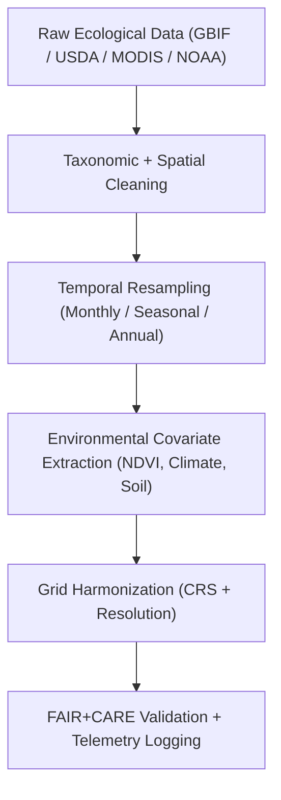

<div align="center">

# 🌿 **Kansas Frontier Matrix — Ecology Processed Datasets**  
`docs/analyses/ecology/datasets/processed/README.md`

**Purpose:**  
Document all **processed and quality-controlled ecological datasets** prepared for modeling and analysis within the Kansas Frontier Matrix (KFM).  
These datasets have undergone **taxonomic validation**, **spatial harmonization**, and **temporal resampling**, ensuring compliance with **FAIR+CARE**, **ISO 19115**, and **MCP-DL v6.3** standards for ethical, transparent, and reproducible ecological data workflows.

[](../../../../../README.md)  
[](../../../../../../LICENSE)  
[](../../../../../../docs/standards/README.md)  
[](../../../../../../releases/v11.2.4/manifest.zip)

</div>

---

## 📘 Overview

The **Processed Ecology Datasets** include cleaned, harmonized, and verified environmental and biodiversity data ready for use in:

- habitat modeling  
- species distribution analyses  
- ecosystem and sustainability assessments  

All processed data:

- follow **FAIR+CARE** open-science principles  
- are linked to **ISO 50001 / 14064** telemetry logs for sustainability tracking  
- are compatible with the **Ecology Datasets Registry** (raw → processed → derived → metadata)  

---

## 🗂️ Directory Layout

```plaintext
docs/analyses/ecology/datasets/processed/
├── README.md                     # This document (processed datasets registry)
├── biodiversity_cleaned.csv      # Cleaned GBIF + USDA biodiversity dataset
├── habitat_variables.nc          # Environmental covariates (climate + vegetation)
├── landcover_harmonized.tif      # Harmonized land cover classification raster
├── ecosystem_variables.json      # Processed ecosystem-level indicators
└── faircare_validation.json      # FAIR+CARE validation report + telemetry metrics
```

---

## ⚙️ Dataset Descriptions

| File                         | Derived From            | Description                                                            | Format  | FAIR+CARE Status |
|------------------------------|-------------------------|------------------------------------------------------------------------|---------|------------------|
| **biodiversity_cleaned.csv** | GBIF / USDA             | De-duplicated, validated biodiversity records with standardized taxonomy | CSV     | ✅ Certified      |
| **habitat_variables.nc**     | MODIS / NOAA / PRISM    | Gridded bioclimatic and vegetation variables (BioClim + NDVI)         | NetCDF  | ✅ Certified      |
| **landcover_harmonized.tif** | NASA / ESA / USGS       | Unified raster of land cover types and vegetation classes on common grid | GeoTIFF | ✅ Certified      |
| **ecosystem_variables.json** | EPA / USGS / NRCS       | Aggregated ecosystem health indicators (pH, nitrate, canopy cover, biomass) | JSON | ✅ Certified      |

Each processed dataset is:

- linked back to **raw sources** in `docs/analyses/ecology/datasets/raw/`  
- referenced by **derived products** in `docs/analyses/ecology/datasets/derived/`  
- indexed in the **metadata registry** under `metadata/stac_catalog.json` and `metadata/dcat_metadata.json`  

---

## 🧩 Data Processing Workflow



---

## 📈 Processing Steps Summary

| Step                     | Description                                            | Tools / Libraries              | Output                         |
|--------------------------|--------------------------------------------------------|--------------------------------|--------------------------------|
| **Taxonomic Validation** | Reconcile species names using GBIF/USDA taxonomies    | `pygbif`, `pandas`             | `biodiversity_cleaned.csv`     |
| **Spatial Harmonization**| Align coordinates, clip to Kansas extent, remove outliers | `geopandas`, `shapely`     | Cleaned point/area geometries |
| **Temporal Aggregation** | Aggregate raw time series to monthly/seasonal/annual means | `xarray`, `pandas`        | `habitat_variables.nc`         |
| **Raster Harmonization** | Merge MODIS + ESA rasters to common 1 km grid (EPSG:4326) | `GDAL`, `rasterio`         | `landcover_harmonized.tif`     |
| **Ecosystem Aggregation**| Build basin/bioregion indicators (health, nutrients, cover) | `xarray`, `rasterstats`   | `ecosystem_variables.json`     |
| **Validation**           | FAIR+CARE metadata and ISO telemetry logging          | FAIR+CARE CLI / pipelines      | `faircare_validation.json`     |

---

## 🧮 FAIR+CARE Validation Record Example

```json
{
  "validation_id": "ecology-processed-2025-11-09-0163",
  "datasets": [
    "biodiversity_cleaned.csv",
    "habitat_variables.nc",
    "landcover_harmonized.tif",
    "ecosystem_variables.json"
  ],
  "energy_joules": 12.9,
  "carbon_gCO2e": 0.0052,
  "qa_metrics": {
    "taxonomic_accuracy": 0.98,
    "spatial_rmse_km": 0.6,
    "temporal_completeness": 99.2
  },
  "validation_status": "Pass",
  "auditor": "FAIR+CARE Council",
  "timestamp": "2025-11-09T17:05:00Z"
}
```

---

## ⚖️ FAIR+CARE Governance Matrix

| Principle        | Implementation                                           | Verification Source                 |
|------------------|-----------------------------------------------------------|-------------------------------------|
| **Findable**     | Datasets registered in STAC/DCAT with UUIDs              | `metadata/stac_catalog.json`        |
| **Accessible**   | Processed data shared under CC‑BY license                | FAIR+CARE Ledger                    |
| **Interoperable**| CSV, NetCDF, GeoTIFF, and JSON formats                   | `telemetry_schema`                  |
| **Reusable**     | Provenance and QC metrics embedded in metadata           | `manifest_ref`                      |
| **Responsibility** | ISO 50001 / 14064 telemetry logged for sustainability | `telemetry_ref`                     |
| **Ethics**       | Sensitive biodiversity data anonymized to ≥ 5 km         | FAIR+CARE Ethics Audit              |

---

## 🧾 Governance Ledger Record Example

```json
{
  "ledger_id": "ecology-processed-ledger-2025-11-09-0164",
  "component": "Ecology Processed Datasets",
  "datasets": [
    "biodiversity_cleaned.csv",
    "habitat_variables.nc",
    "landcover_harmonized.tif",
    "ecosystem_variables.json"
  ],
  "energy_joules": 12.9,
  "carbon_gCO2e": 0.0052,
  "faircare_status": "Pass",
  "auditor": "FAIR+CARE Council",
  "timestamp": "2025-11-09T17:07:00Z"
}
```

---

## 🧠 Sustainability Metrics

| Metric                 | Description                                       | Value | Target | Unit   |
|------------------------|---------------------------------------------------|------:|-------:|--------|
| **Energy (J)**         | Energy used during ecological dataset processing  | 12.9  | ≤ 15   | Joules |
| **Carbon (gCO₂e)**     | CO₂ emissions during preprocessing                | 0.0052| ≤ 0.006| gCO₂e  |
| **Telemetry Coverage** | FAIR+CARE trace completion                        | 100   | ≥ 95   | %      |
| **Audit Pass Rate**    | FAIR+CARE compliance rate                         | 100   | 100    | %      |

---

## 🕰️ Version History

| Version | Date       | Author              | Summary                                                                                      |
|--------:|-----------:|---------------------|----------------------------------------------------------------------------------------------|
| v11.2.4 | 2025-12-06 | FAIR+CARE Council   | Aligned processed ecology datasets registry with KFM‑MDP v11.2.4; added scope and lifecycle metadata. |
| v10.2.2 | 2025-11-09 | FAIR+CARE Council   | Published processed ecology dataset documentation with ISO telemetry and FAIR+CARE validation. |
| v10.2.1 | 2025-11-09 | Ecological Data Processing Group | Added spatial harmonization and temporal aggregation details.                       |
| v10.2.0 | 2025-11-09 | KFM Ecology Team    | Created baseline processed dataset documentation aligned with climatology module standards.   |

---

<div align="center">

© 2025 Kansas Frontier Matrix Project  
Master Coder Protocol v6.3 · FAIR+CARE Certified · Diamond⁹ Ω / Crown∞Ω Ultimate Certified  

[Back to Ecology Datasets](../README.md) · [Governance Charter](../../../../../../docs/standards/governance/ROOT-GOVERNANCE.md)

</div>