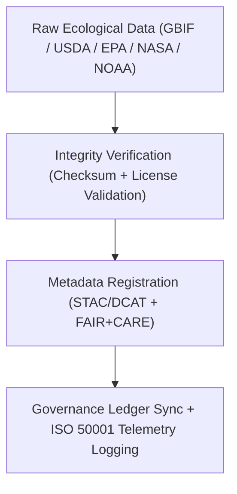

<div align="center">

# 🌿 **Kansas Frontier Matrix — Ecology Raw Datasets**
`docs/analyses/ecology/datasets/raw/README.md`

**Purpose:**  
List and describe the **unaltered biodiversity, land cover, and ecological datasets** sourced for Kansas Frontier Matrix (KFM) analyses.  
These raw datasets are directly retrieved from authoritative sources (GBIF, USDA, EPA, NASA, NOAA) and governed under **FAIR+CARE**, **STAC/DCAT 3.0**, and **ISO 19115** standards to ensure data integrity and transparency.

[](../../../../../README.md)
[](../../../../../../LICENSE)
[](../../../../../../docs/standards/README.md)
[](../../../../../../releases/)
</div>

---

## 📘 Overview

This directory contains **raw, unmodified ecological data** forming the foundation of biodiversity, habitat, and ecosystem modeling within the Kansas Frontier Matrix.  
Each dataset includes metadata provenance, checksum verification, and licensing details compliant with FAIR+CARE and ISO geospatial standards.

All data are used as inputs for:
- Species Distribution Modeling (SDM)  
- Habitat Connectivity & Landcover Change Analysis  
- Ecosystem Service Valuation  

---

## 🗂️ Directory Layout

```plaintext
docs/analyses/ecology/datasets/raw/
├── README.md                                  # This document
├── gbif_occurrences.csv                       # Species occurrence data from GBIF
├── usda_plants.csv                            # Ecological site data from USDA PLANTS Database
├── epa_ecological_health.csv                  # Aquatic and ecological condition indices
├── modis_ndvi.nc                              # NASA MODIS NDVI time series for vegetation
└── noaa_climate_covariates.csv                # Climate variables from NOAA NCEI
```

---

## ⚙️ Dataset Descriptions

| File | Source | Description | Temporal Range | Spatial Resolution | License |
|------|---------|-------------|----------------|--------------------|----------|
| **gbif_occurrences.csv** | GBIF | Global biodiversity occurrence records for Kansas species | 1900–2025 | Point | CC-BY 4.0 |
| **usda_plants.csv** | USDA / NRCS | Plant species distributions and ecological site data | 1950–2025 | County-level | Public Domain |
| **epa_ecological_health.csv** | EPA / USGS | Aquatic ecosystem health indices (IBI, habitat quality) | 1970–2025 | River reach / basin | Public Domain |
| **modis_ndvi.nc** | NASA MODIS | Monthly NDVI and EVI vegetation indices | 2000–2025 | 250 m grid | CC-BY 4.0 |
| **noaa_climate_covariates.csv** | NOAA NCEI | Climate covariates for ecological modeling | 1880–2025 | Grid / Station | Public Domain |

All raw datasets are validated through checksum verification and FAIR+CARE metadata ingestion pipelines.

---

## 🧩 Ingestion & Provenance Workflow



---

## 🧮 FAIR+CARE Metadata Example

```json
{
  "dataset_id": "gbif-occurrences-ks-2025",
  "title": "GBIF Species Occurrence Records for Kansas",
  "source_url": "https://www.gbif.org/occurrence/search?state=Kansas",
  "spatial_extent": [-102.05, 36.99, -94.6, 40.0],
  "temporal_coverage": ["1900-01-01", "2025-01-01"],
  "format": "CSV",
  "license": "CC-BY 4.0",
  "validation": {
    "integrity_check": "SHA-256 Verified",
    "missing_records": "2.3%",
    "duplicates_removed": 11458,
    "status": "Pass"
  },
  "auditor": "FAIR+CARE Council",
  "timestamp": "2025-11-09T17:00:00Z"
}
```

---

## ⚖️ FAIR+CARE Governance Matrix

| Principle | Implementation | Verification Source |
|------------|----------------|--------------------|
| **Findable** | Indexed in STAC/DCAT catalogs with persistent UUIDs | `metadata/stac_catalog.json` |
| **Accessible** | Public datasets released under FAIR+CARE governance | FAIR+CARE Ledger |
| **Interoperable** | Open formats (CSV, NetCDF, GeoTIFF) | `telemetry_schema` |
| **Reusable** | Provenance and checksum metadata embedded | `manifest_ref` |
| **Responsibility** | Energy and carbon telemetry logged per ingestion | `telemetry_ref` |
| **Ethics** | Sensitive species coordinates generalized ≥5 km | FAIR+CARE Council Ethics Audit |

---

## 🧾 Governance Ledger Record Example

```json
{
  "ledger_id": "ecology-raw-ledger-2025-11-09-0162",
  "component": "Ecology Raw Datasets Registry",
  "datasets": [
    "GBIF Biodiversity Occurrences",
    "USDA PLANTS",
    "EPA Ecological Health",
    "NASA MODIS NDVI",
    "NOAA Climate Covariates"
  ],
  "energy_joules": 11.5,
  "carbon_gCO2e": 0.0047,
  "faircare_status": "Pass",
  "auditor": "FAIR+CARE Council",
  "timestamp": "2025-11-09T17:02:00Z"
}
```

---

## 🧠 Sustainability Metrics

| Metric | Description | Value | Target | Unit |
|---------|-------------|--------|---------|------|
| **Energy (J)** | Energy consumed during dataset ingestion | 11.5 | ≤ 15 | Joules |
| **Carbon (gCO₂e)** | Emissions equivalent per ingestion process | 0.0047 | ≤ 0.006 | gCO₂e |
| **Telemetry Coverage (%)** | FAIR+CARE traceability completion | 100 | ≥ 95 | % |
| **Audit Pass Rate (%)** | FAIR+CARE compliance success | 100 | 100 | % |

---

## 🕰️ Version History

| Version | Date | Author | Summary |
|----------|------|--------|----------|
| v10.2.2 | 2025-11-09 | FAIR+CARE Council | Published ecology raw dataset documentation with FAIR+CARE validation and telemetry tracking. |
| v10.2.1 | 2025-11-09 | Ecological Data Team | Added ingestion workflow and dataset metadata example. |
| v10.2.0 | 2025-11-09 | KFM Ecology Group | Created baseline raw dataset documentation aligned with climatology and hydrology standards. |

---

<div align="center">

© 2025 Kansas Frontier Matrix Project  
Master Coder Protocol v6.3 · FAIR+CARE Certified · Diamond⁹ Ω / Crown∞Ω Ultimate Certified  

[Back to Ecology Datasets](../README.md) · [Governance Charter](../../../../../../docs/standards/governance/ROOT-GOVERNANCE.md)

</div>

