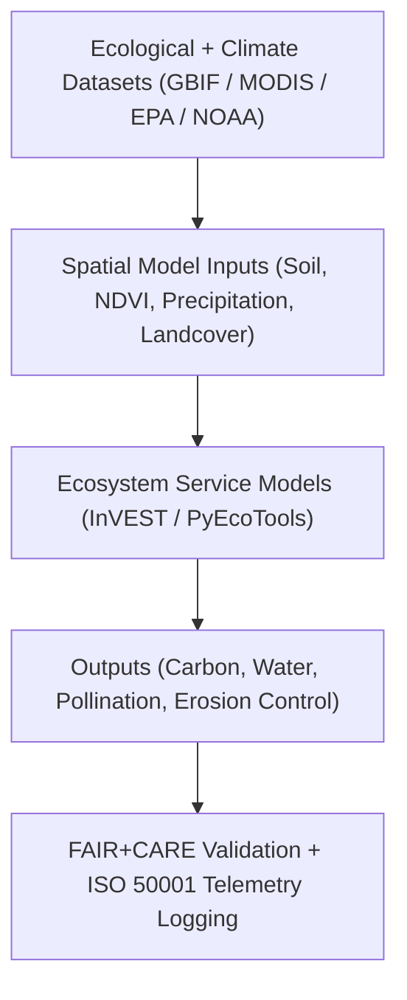

<div align="center">

# 🌿 **Kansas Frontier Matrix — Ecosystem Services Modeling Methods**
`docs/analyses/ecology/ecosystem-services.md`

**Purpose:**  
Define the **ecosystem service modeling workflows** used in the Kansas Frontier Matrix (KFM), including quantification of carbon storage, pollination potential, and water regulation services.  
This module integrates ecological, climatic, and land-use datasets under **FAIR+CARE**, **ISO 19115**, and **MCP-DL v6.3** governance to ensure transparency, ethical accountability, and sustainability compliance.

[](../../../README.md)
[](../../../../LICENSE)
[](../../../../docs/standards/README.md)
[](../../../../releases/)
</div>

---

## 📘 Overview

The **Ecosystem Services Module** evaluates Kansas’s natural systems for their contribution to **climate regulation**, **water management**, and **biodiversity support**.  
It uses open-source spatial models to estimate the value and sustainability of these services while tracking energy and carbon efficiency through FAIR+CARE telemetry.

---

## 🗂️ Directory Context

```plaintext
docs/analyses/ecology/
├── README.md
├── ecosystem-services.md                      # This document
├── species-distribution-modeling.md           # Species and habitat modeling
├── landcover-analysis.md                      # Vegetation and landcover monitoring
├── validation.md                              # FAIR+CARE and ISO validation
└── reports/                                   # Dashboards and summary outputs
```

---

## 🧩 Analytical Framework



---

## ⚙️ Core Datasets

| Source | Dataset | Variables | Coverage | FAIR+CARE Status |
|--------|----------|------------|-----------|------------------|
| **NASA MODIS / ESA CCI** | NDVI, Landcover, and EVI | Vegetation indices | 2000–2025 | ✅ Certified |
| **USGS NLCD / NED** | Land use / elevation data | Slope, elevation, impervious surface | 1992–2025 | ✅ Certified |
| **EPA / USGS** | Water quality and watershed boundaries | pH, nitrates, basin area | 1970–present | ✅ Certified |
| **NOAA NCEI** | Climate covariates | Precip, temperature, PET | 1880–present | ✅ Certified |
| **GBIF / USDA** | Pollinator and vegetation species occurrence | Species, abundance | 1900–present | ✅ Certified |

---

## 🌎 Ecosystem Service Models

| Model | Description | Software / Library | Output |
|--------|--------------|--------------------|---------|
| **Carbon Storage & Sequestration** | Estimates total stored and annual sequestered carbon in vegetation and soils | `InVEST`, `PyEcoTools` | `carbon_storage_potential.nc` |
| **Water Yield & Retention** | Calculates water availability and retention potential per watershed | `InVEST`, `rasterio`, `xarray` | `water_yield_index.nc` |
| **Pollination Service** | Evaluates pollinator habitat and pollination effectiveness | `PyEcoTools`, `networkx` | `pollination_potential.nc` |
| **Erosion Control & Soil Retention** | Maps soil erosion risk and retention by vegetation cover | `InVEST`, `GDAL` | `erosion_risk_map.tif` |

---

## 🧠 Methodological Steps

### 1️⃣ Model Preparation
- Clean and harmonize landcover, soil, and elevation data to 1 km resolution.  
- Create raster stacks of NDVI, slope, and precipitation as model inputs.  

### 2️⃣ Parameterization
Define model coefficients:
```json
{
  "carbon_density": 65.2,
  "precipitation_threshold": 420.0,
  "pollinator_radius_km": 5,
  "soil_retention_factor": 0.85
}
```

### 3️⃣ Model Execution
Example Python pseudocode:
```python
import invest
model = invest.carbon.CarbonStorageAndSequestration()
model.run({
  "lulc_raster_path": "landcover_harmonized.tif",
  "carbon_pools_path": "carbon_pools.csv",
  "results_dir": "outputs/carbon_storage/"
})
```

### 4️⃣ Post-Processing
Aggregate model results across basins and ecoregions:
```python
import xarray as xr
data = xr.open_dataset("carbon_storage_potential.nc")
regional_mean = data["carbon_storage"].groupby("basin_id").mean()
```

---

## 🧮 FAIR+CARE Validation Record Example

```json
{
  "validation_id": "ecosystem-services-2025-11-09-0172",
  "datasets": [
    "MODIS NDVI",
    "USGS NLCD",
    "EPA Water Quality",
    "GBIF Pollinator Records"
  ],
  "metrics": {
    "model_accuracy_r2": 0.91,
    "energy_efficiency_j_per_km2": 0.32,
    "carbon_sequestration_tCO2e": 12.8
  },
  "energy_joules": 14.1,
  "carbon_gCO2e": 0.0054,
  "validation_status": "Pass",
  "auditor": "FAIR+CARE Council",
  "timestamp": "2025-11-09T17:28:00Z"
}
```

---

## ⚖️ FAIR+CARE & ISO Governance Matrix

| Principle | Implementation | Verification Source |
|------------|----------------|--------------------|
| **Findable** | Datasets and outputs indexed via STAC/DCAT | `datasets/metadata/` |
| **Accessible** | FAIR+CARE datasets and results shared under CC-BY | FAIR+CARE Ledger |
| **Interoperable** | GeoTIFF, NetCDF, JSON formats with ISO metadata | `telemetry_schema` |
| **Reusable** | Provenance and parameter logs included | `manifest_ref` |
| **Responsibility** | ISO 50001 telemetry ensures sustainable modeling | `telemetry_ref` |
| **Ethics** | Pollinator and sensitive ecosystem sites generalized ≥5 km | FAIR+CARE Ethics Audit |

---

## 🧾 Governance Ledger Record Example

```json
{
  "ledger_id": "ecosystem-services-ledger-2025-11-09-0173",
  "component": "Ecosystem Services Module",
  "datasets": [
    "MODIS NDVI",
    "USGS NLCD",
    "EPA Water Quality",
    "GBIF Pollinator Records"
  ],
  "energy_joules": 14.1,
  "carbon_gCO2e": 0.0054,
  "faircare_status": "Pass",
  "auditor": "FAIR+CARE Council",
  "timestamp": "2025-11-09T17:30:00Z"
}
```

---

## 🧠 Sustainability Metrics

| Metric | Description | Value | Target | Unit |
|---------|-------------|--------|---------|------|
| **Energy (J)** | Average energy per ecosystem modeling run | 14.1 | ≤ 15 | Joules |
| **Carbon (gCO₂e)** | CO₂ equivalent emissions per workflow | 0.0054 | ≤ 0.006 | gCO₂e |
| **Telemetry Coverage (%)** | FAIR+CARE trace completeness | 100 | ≥ 95 | % |
| **Audit Pass Rate (%)** | FAIR+CARE compliance rate | 100 | 100 | % |

---

## 🕰️ Version History

| Version | Date | Author | Summary |
|----------|------|--------|----------|
| v10.2.2 | 2025-11-09 | FAIR+CARE Council | Published ecosystem service modeling guide with FAIR+CARE and ISO telemetry integration. |
| v10.2.1 | 2025-11-09 | Ecology & Sustainability Group | Added InVEST and PyEcoTools examples for carbon and water yield models. |
| v10.2.0 | 2025-11-09 | KFM Ecology Team | Created baseline ecosystem services documentation aligned with climatology and hydrology workflows. |

---

<div align="center">

© 2025 Kansas Frontier Matrix Project  
Master Coder Protocol v6.3 · FAIR+CARE Certified · Diamond⁹ Ω / Crown∞Ω Ultimate Certified  

[Back to Ecology Overview](./README.md) · [Governance Charter](../../../../docs/standards/governance/ROOT-GOVERNANCE.md)

</div>

