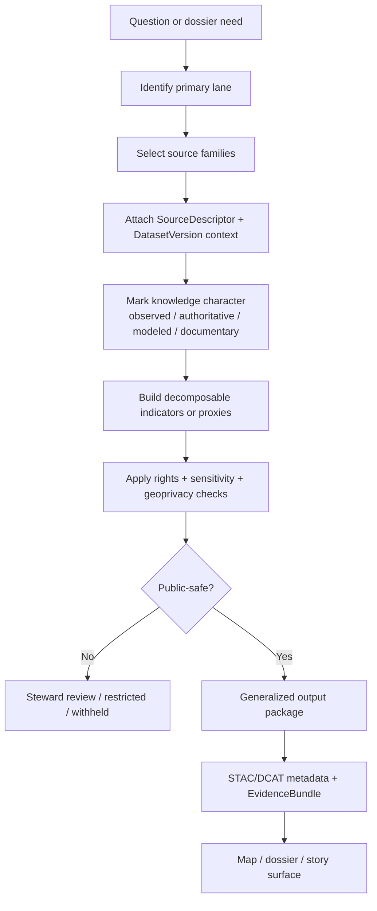

<!-- [KFM_META_BLOCK_V2]
doc_id: kfm://doc/REVIEW_REQUIRED_UUID
title: Ecosystem Services
type: standard
version: v1
status: draft
owners: @bartytime4life
created: REVIEW_REQUIRED_DATE
updated: REVIEW_REQUIRED_DATE
policy_label: REVIEW_REQUIRED_POLICY_LABEL
related: [docs/analyses/ecology/README.md, docs/analyses/ecology/datasets/README.md, docs/domains/README.md, docs/standards/KFM_MARKDOWN_WORK_PROTOCOL.md]
tags: [kfm, ecology, ecosystem-services]
notes: [Current public file is a placeholder stub; this draft replaces it with a doctrine-aligned analysis scaffold. Exact UUID, merge-time dates, and policy label still need verification.]
[/KFM_META_BLOCK_V2] -->

# Ecosystem Services

_Analysis frame for ecology-adjacent, public-safe, evidence-aware interpretation of ecosystem-service questions in KFM._

> [!IMPORTANT]
> **Interpretive status**
>
> - **CONFIRMED:** KFM has an ecology operating lane with strong publication cautions around rare-species precision, protected-area context, and source-role separation.
> - **INFERRED:** “Ecosystem services” fits KFM best as a **cross-lane analysis frame**, not as a sovereign truth layer or a replacement for the ecology lane itself.
> - **PROPOSED:** This document restores `ecosystem-services.md` as a real analysis guide so the path stops behaving like a placeholder stub.
> - **UNKNOWN:** Exact live descriptors, receipts, tests, manifests, and release-ready ecology proof packs in the mounted implementation.

**Status:** draft · experimental  
**Owners:** @bartytime4life  
**Repo fit:** `docs/analyses/ecology/ecosystem-services.md`

**Quick jumps:** [Scope](#scope) · [Repo fit](#repo-fit) · [What this doc means by ecosystem-services](#what-this-doc-means-by-ecosystem-services) · [Inputs](#accepted-input-families) · [Exclusions](#exclusions) · [Disclosure rules](#disclosure-and-geoprivacy-rules) · [Workflow](#analysis-workflow) · [Output classes](#output-classes) · [Definition of done](#definition-of-done) · [Open unknowns](#open-unknowns)

---

## Scope

This file defines how to handle **ecosystem-service analysis** inside KFM without flattening distinct evidence classes into one persuasive but weak synthetic layer.

In KFM, ecosystem-service work should stay subordinate to:

- the **ecology lane** and its publication cautions,
- the **authoritative-versus-derived** distinction,
- visible **time/support/provenance** semantics,
- and public-safe handling for sensitive biodiversity and habitat material.

This is an **analysis guide**, not a claim that a live ecosystem-services pipeline already exists.

[Back to top](#ecosystem-services)

## Repo fit

| Item | Value |
|---|---|
| Path | `docs/analyses/ecology/ecosystem-services.md` |
| Immediate upstream | `./README.md` |
| Adjacent dataset guide | `./datasets/README.md` |
| Domain framing | `../../domains/README.md` |
| Authoring rule source | `../../standards/KFM_MARKDOWN_WORK_PROTOCOL.md` |
| Likely downstream surfaces | ecology analyses, public-safe dossiers, review packets, EvidenceBundle-backed map/story surfaces |
| Trust boundary | This file guides interpretation and packaging; it does **not** prove mounted runtime implementation |

### Why this file exists

The ecology subtree already establishes a geoprivacy-aware, dataset-facing posture. What was still thin was the interpretation layer for questions such as:

- where ecological condition supports downstream human benefit,
- where habitat or wetland condition contributes to buffering, cooling, filtration, or continuity,
- and how those interpretations should be published without overstating precision or collapsing observed and modeled evidence into one score.

[Back to top](#ecosystem-services)

## What this doc means by ecosystem services

> [!NOTE]
> **KFM usage note**
>
> “Ecosystem services” is treated here as an **INFERRED analysis frame**. It is useful, but it is not currently established in the visible source corpus as a standalone canonical KFM operating lane.

For this repository, **ecosystem services** should mean:

> a governed way to relate ecological condition, habitat, land cover, water, terrain, and stewardship context to human-facing or system-facing consequences **without** pretending those relationships are a single authoritative layer.

That means this file is about how to structure questions like:

- habitat support and corridor continuity,
- floodplain or wetland buffering context,
- vegetation or canopy contributions to cooling or cover,
- pollinator-support context around agricultural land,
- and other ecology-to-place interpretations

while still preserving:

- **knowledge character**,
- **source role**,
- **time basis**,
- **rights/sensitivity posture**,
- and **public-safe disclosure**.

### What this file explicitly rejects

- A single sovereign “ecosystem services score.”
- Quietly mixing occurrence records, habitat models, protected-area boundaries, and narrative stewardship material into one undifferentiated layer.
- Publishing exact sensitive ecology locations just because they support a compelling story.
- Letting modeled habitat or proxy surfaces masquerade as direct observation.
- Treating convenience summaries as stronger than the underlying EvidenceBundle.

[Back to top](#ecosystem-services)

## Accepted input families

Only inputs that can keep their **knowledge character** visible belong here.

### Minimum accepted families

| Input family | Typical role in this analysis | Knowledge character | Minimum caution |
|---|---|---|---|
| Species observations and occurrence summaries | Presence context, seasonality, broad stewardship cues | Observed / reported | Precision may need withholding or generalization |
| At-risk species status lists and range products | Regulatory/stewardship status context | Authoritative status / curated range | Do not confuse list status with site-specific occurrence |
| Protected areas and conservation lands | Stewardship, access, protection, and management context | Administrative / boundary | Boundary presence is not proof of ecological condition |
| Habitat, corridor, or suitability models | Broad ecological support or continuity interpretation | Modeled / derived | Must remain visibly modeled |
| Wetlands, hydrology, floodplain, terrain, land cover | Buffering, filtration, connectivity, regulation proxies | Mixed observed / derived / mapped | Time basis and derivation method must stay explicit |
| Agriculture/soil/moisture context | Pollination, erosion, soil-support, production-adjacent interpretation | Mixed observed / derived | Keep provisioning claims proportional to actual support |
| Place, service-area, and exposure context | Beneficiary or continuity framing | Administrative / operational | Avoid “beneficiary certainty” when support is only approximate |
| Documentary or stewardship narrative material | Context and interpretation support | Documentary evidence | Rights, quote safety, and provenance remain first-class |

### Required properties for any admitted source family

Every source entering an ecosystem-services analysis should be describable through a source contract that includes at least:

- identity,
- spatial extent,
- temporal basis,
- knowledge character,
- rights/sensitivity posture,
- publication class,
- and intended analytical use.

[Back to top](#ecosystem-services)

## Exclusions

The following do **not** belong here by default.

| Excluded content | Why excluded | Where it belongs instead |
|---|---|---|
| Exact rare-species or sensitive occurrence coordinates intended for public display | Too easy to over-publish and too hard to retract cleanly | Steward-only review lane or withheld package |
| Purely regulatory status documentation with no ecology analysis layer | Important, but not the same as ecosystem-service interpretation | Domain records / source dossiers |
| Narrative-first advocacy that lacks source-role separation | Violates KFM evidence posture | Story work only after evidence and publication class are explicit |
| Free-floating composite service scores with opaque weighting | Creates composite-risk theater in a new form | Only admissible after decomposable components, weights, and uncertainty are explicit |
| Fully speculative service-beneficiary claims | Overstates what the evidence supports | Keep as PROPOSED research questions, not published findings |
| Precision-sensitive archaeology or heritage inference bundled into ecology | Crosses into a separate burdened lane | Archaeology / heritage analysis docs |

[Back to top](#ecosystem-services)

## KFM analysis posture for this topic

### 1) Start from lanes, not from slogans

Ecosystem-service analysis in KFM should begin by asking which existing lane is carrying the claim:

- ecology,
- hydrology,
- agriculture/soils,
- hazards,
- place/service geography,
- or documentary stewardship context.

### 2) Keep direct observation separate from derived interpretation

If a map or dossier shows both observed occurrences and modeled support surfaces, the user must be able to tell which is which.

### 3) Prefer decomposable interpretations

If the analysis says an area has “high service importance,” the underlying components should still be separable:

- observed evidence,
- modeled evidence,
- boundary context,
- land cover / terrain / water proxies,
- beneficiary or exposure framing,
- and uncertainty notes.

### 4) Publish only the public-safe slice

The public-facing result should often be a generalized or summarized surface, not the most precise internal working product.

> [!WARNING]
> **Default caution**
>
> Biodiversity, protected-area, and habitat materials are high-risk for over-publication. If there is any doubt about whether a precise output is public-safe, treat that output as **review-bearing** or **withheld** until a stewarded publication class exists.

[Back to top](#ecosystem-services)

## Disclosure and geoprivacy rules

This topic inherits the ecology lane’s strongest caution.

### Public-safe rules

| Rule | Meaning |
|---|---|
| Default-deny precision | Exact locations are not public by default merely because they exist in source data |
| Generalize before publishing | Public outputs should prefer bins, masks, corridors, zones, summaries, or other generalized forms |
| Keep source role visible | Status lists, occurrence records, habitat models, and protected-area boundaries are not interchangeable |
| Distinguish observed vs modeled | Any mixed output must keep those classes legible |
| Preserve rights posture | Licensed, restricted, or culturally sensitive data should not be smoothed into “open” outputs |
| Treat absence carefully | “No observation shown” is not the same as “species absent” or “no service present” |

### Recommended publication classes

| Class | Typical content | Public suitability |
|---|---|---|
| **Public-safe generalized** | Generalized corridors, service zones, county/H3 summaries, masked overlays | Usually publishable |
| **Steward review** | More precise joins, sensitive overlays, draft interpretations | Review-bearing |
| **Precise restricted** | Exact occurrences, precise habitat-sensitive joins, licensed/proprietary source outputs | Non-public by default |
| **Withheld / denied** | Outputs whose harm or rights risk exceeds current publication support | Do not publish |

[Back to top](#ecosystem-services)

## Analysis workflow

```mermaid
flowchart TD
    A[Question or dossier need] --> B[Identify primary lane]
    B --> C[Select source families]
    C --> D[Attach SourceDescriptor + DatasetVersion context]
    D --> E[Mark knowledge character<br/>observed / authoritative / modeled / documentary]
    E --> F[Build decomposable indicators or proxies]
    F --> G[Apply rights + sensitivity + geoprivacy checks]
    G --> H{Public-safe?}
    H -- No --> I[Steward review / restricted / withheld]
    H -- Yes --> J[Generalized output package]
    J --> K[STAC/DCAT metadata + EvidenceBundle]
    K --> L[Map / dossier / story surface]
```

### Preferred sequence

1. Define the question narrowly.
2. Identify the **primary lane** carrying the interpretation.
3. Resolve source families and keep their roles explicit.
4. Build only the minimum proxy stack needed.
5. Apply disclosure rules before cartography or prose polish.
6. Publish the **public-safe** interpretation, not the entire working stack.
7. Keep the outward claim resolvable to an EvidenceBundle or equivalent review object.

[Back to top](#ecosystem-services)

## Example question shapes

These are **illustrative examples**, not claims of implemented analyses.

### Habitat / support
- Which generalized areas appear to support pollinator-adjacent habitat continuity near agricultural production zones?
- Which protected or semi-protected landscapes overlap with modeled corridor continuity?

### Regulation / buffering
- Which wetland or floodplain landscapes plausibly contribute to buffering or filtration context for a watershed-facing dossier?
- Where do vegetation, terrain, and water context suggest landscape regulation capacity worth review?

### Provisioning-adjacent context
- Where might ecological condition intersect with soil, moisture, or land-cover context in ways relevant to stewardship or agricultural support?
- Which areas deserve review for pollination-support interpretation without claiming direct yield attribution?

### Cultural / stewardship context
- Which public lands, protected areas, or stewardship landscapes carry strong ecological plus public-memory or civic-education value?

> [!TIP]
> Phrase outputs as **context**, **support**, **buffering**, **continuity**, **proxy**, or **review priority** unless the evidence truly supports a stronger causal claim.

[Back to top](#ecosystem-services)

## Output classes

| Output class | Good fit | Bad fit |
|---|---|---|
| Generalized map layer | Public-facing summaries, broad service zones, generalized habitat-support context | Exact sensitive sites |
| Dossier panel | “Why this place matters” context with visible source-role notes | Unbounded composite ranking |
| Steward review packet | Precise joins, conflict checks, publication comparison | Public default publication |
| Derived indicator | Narrow, decomposable proxy with documented components | Black-box score with hidden weights |
| Story node support | Carefully bounded context with drill-through | Narrative convenience that erases provenance |

### Output wording guidance

Prefer wording like:

- “generalized habitat-support context”
- “modeled corridor continuity”
- “wetland/floodplain buffering proxy”
- “public-safe stewardship summary”
- “review-bearing precise output”

Avoid wording like:

- “true ecological value score”
- “definitive ecosystem services map”
- “guaranteed pollination zone”
- “complete biodiversity service index”

[Back to top](#ecosystem-services)

## Minimum burden checklist

A draft in this path is not ready merely because the map looks convincing.

### Definition of done

- [ ] Primary lane is named explicitly.
- [ ] All source families are separated by role.
- [ ] Observed vs modeled vs administrative context stays visible.
- [ ] Rights and sensitivity posture are stated.
- [ ] Public-safe generalization choice is explicit.
- [ ] Time basis and support semantics are present.
- [ ] Any score or proxy remains decomposable.
- [ ] Outward outputs can resolve to an evidence object or review packet.
- [ ] Open unknowns are kept visible instead of smoothed away.

### Merge-time checks still needed

- [ ] Replace review placeholders in the KFM meta block.
- [ ] Confirm final related links and any downstream dataset paths.
- [ ] Add concrete examples only when backed by mounted source descriptors or released artifacts.
- [ ] Reconcile this file with subtree README language if historical-path wording is no longer accurate.

[Back to top](#ecosystem-services)

## Open unknowns

| Unknown | Why it matters |
|---|---|
| Exact mounted ecology source descriptors | Without them, this file should remain a guidance document rather than an implementation claim |
| Live publication classes for sensitive ecology outputs | Required before precise/public-safe comparisons can be trusted operationally |
| EvidenceBundle / receipt examples for ecology analyses | Needed to prove runtime inspectability rather than only doctrine |
| Actual downstream STAC/DCAT/PROV packaging for ecology slices | Important for release and review discipline |
| Concrete current tests for geoprivacy and withholding behavior | Central to trust, but not verified here |

[Back to top](#ecosystem-services)

## Appendix

<strong>Candidate source-family clusters for future expansion</strong>

### Biodiversity and stewardship anchors
- GBIF
- iNaturalist
- eBird
- KDWP
- Kansas Natural Heritage Inventory
- USFWS ECOS
- PAD-US
- NatureServe

### Ecological support and proxy context
- Wetlands and floodplain context
- Terrain and elevation context
- Land cover and vegetation condition
- Hydrology and water-quality context
- Soil and moisture context
- Agricultural edge and pollinator-adjacent context

### Documentary and interpretive context
- Stewardship plans
- Protected-area documentation
- Public-facing education material
- Archive or oral-history material only when rights/provenance remain explicit

<strong>Short authoring note for future contributors</strong>

If a future edit tries to make this file “more useful” by collapsing source roles, hiding uncertainty, or publishing finer biodiversity precision, that is regression, not improvement.

The right way to deepen this file is to add:
- mounted descriptors,
- reviewed examples,
- release-ready receipts,
- and explicit public-safe / steward-only comparison patterns.

[Back to top](#ecosystem-services)
