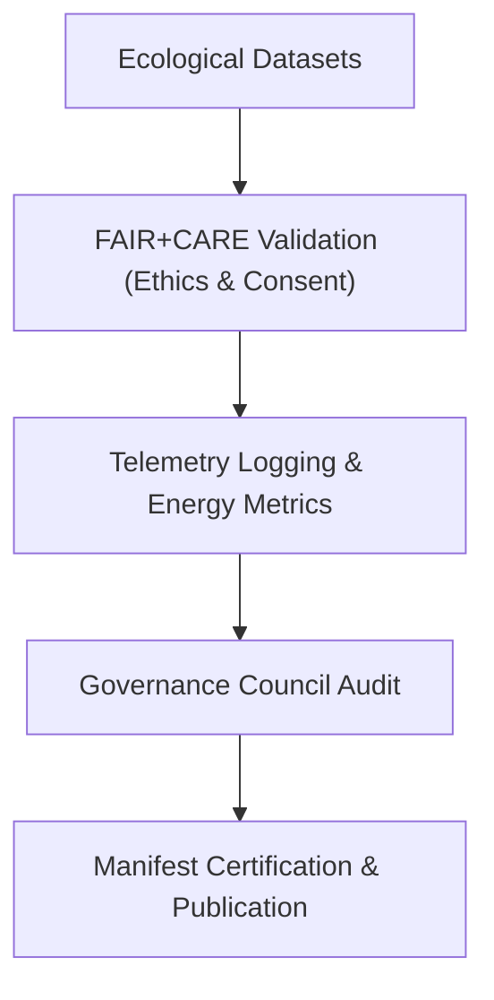

# ⚖️ **Kansas Frontier Matrix — Ecology Governance**  
`docs/analyses/ecology/governance.md`

**Purpose:**  
Establish the **ethical governance, audit procedures, and FAIR+CARE oversight** for all ecological analyses conducted within the Kansas Frontier Matrix (KFM).  
This framework ensures Indigenous sovereignty, ecological data ethics, and sustainable computational practices under **Master Coder Protocol v6.3** and **Diamond⁹ Ω / Crown∞Ω certification**.

---

## 📘 Overview

Ecological governance in KFM ensures all analyses — including landcover, species modeling, and ecosystem services — are ethically conducted, scientifically valid, and reproducible.  
This document defines:
- Ethical oversight protocols for ecological and biodiversity data.  
- FAIR+CARE implementation for ecological transparency.  
- Compliance workflows linking telemetry, provenance, and cultural consent.  
- Audit pipelines for sustainability and ethical computing metrics.  

---

## 🧭 Roles and Responsibilities

| Role | Responsibility | Telemetry Source |
|------|----------------|------------------|
| FAIR+CARE Governance Council | Oversight of ecological FAIR+CARE compliance and dataset licensing | `governance-events.log` |
| Data Steward (Ecology) | Maintains ecological dataset provenance, metadata, and Indigenous consent logs | `telemetry-validation-summary.json` |
| Ecological Modeling Lead | Ensures model transparency, explainability, and sustainability tracking | `energy-usage.csv` |
| Indigenous Data Governance Board (IDGB) | Validates consent and ethical use of culturally sensitive ecological data | `focus-telemetry.json` |

---

## 🧩 FAIR+CARE Governance Integration

| Principle | Implementation | Metric |
|------------|----------------|--------|
| **FAIR: Findable** | Ecological datasets indexed in STAC/DCAT with persistent DOIs. | Dataset discoverability score ≥ 95%. |
| **FAIR: Accessible** | Metadata and derived results publicly available under open licenses. | Metadata completeness ≥ 98%. |
| **CARE: Authority to Control** | Indigenous communities approve data representing species, territories, or sacred sites. | Consent validation 100%. |
| **CARE: Responsibility** | Mandatory governance review for ecological AI or ML outputs. | Audit pass rate ≥ 95%. |

---

## ⚙️ Governance Workflow

1. Ecological datasets undergo FAIR+CARE validation before analysis.  
2. Telemetry logs record ethical actions, energy metrics, and data usage.  
3. Governance Council audits and approves results for public release.  
4. Certified datasets and models are indexed in manifest and release reports.  

---

## ⚖️ Ethical & Environmental Safeguards

- No publication of sensitive or endangered species locations.  
- Indigenous and community-derived datasets require explicit consent.  
- All models must include explainability and uncertainty quantification.  
- AI tools monitored for bias in ecological classification or prediction.  
- Energy consumption from model runs tracked and audited quarterly.  

---

## 📊 Compliance Metrics

| Metric | Target | Verified By |
|--------|---------|-------------|
| FAIR+CARE Compliance | ≥ 95% | Governance Council |
| Provenance Completeness | 100% | Data Stewardship Team |
| Consent Confirmation (IDGB) | 100% | IDGB Audit |
| Model Transparency | ≥ 90% explainability index | Ecology Methods Council |
| Computational Sustainability | ≤ 2.5 kWh per job | FAIR+CARE Sustainability Review |

---

## 🕰️ Version History

| Version | Date | Author | Summary |
|----------|------|--------|----------|
| v10.2.2 | 2025-11-11 | FAIR+CARE Governance Council | Created ecology governance document aligning with v10.2 standards and IDGB validation requirements. |

---

© 2025 Kansas Frontier Matrix · Master Coder Protocol v6.3 · FAIR+CARE Certified  
Diamond⁹ Ω / Crown∞Ω Ultimate Certified  

[Back to Ecology Analysis](./README.md) · [Governance Charter](../../../../docs/standards/governance/ROOT-GOVERNANCE.md)

