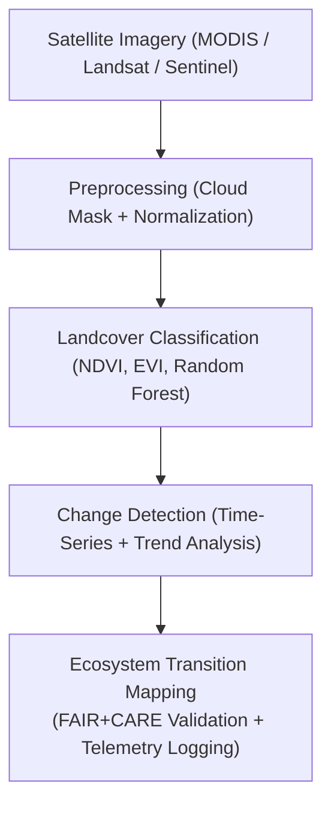

<div align="center">

# 🌿 **Kansas Frontier Matrix — Landcover Analysis & Vegetation Monitoring Methods**
`docs/analyses/ecology/landcover-analysis.md`

**Purpose:**  
Define the **landcover classification, vegetation trend analysis, and ecosystem transition modeling** methods used in the Kansas Frontier Matrix (KFM).  
These workflows integrate satellite observations, field datasets, and FAIR+CARE telemetry under **ISO 19115**, **KFM‑MDP v11.2.4**, and **MCP‑DL v6.3**, ensuring scientific transparency and environmental ethics.

[](../../../README.md)  
[](../../../LICENSE)  
[](../../standards/README.md)  
[](../../../releases/v11.2.4/manifest.zip)

</div>

---

## 📘 Overview

The **Landcover Analysis Module** quantifies vegetation dynamics, land‑use transitions, and ecosystem transformations across Kansas.  
By combining remote sensing (MODIS, Landsat, Sentinel) with field validation (USDA, NRCS), the module tracks long‑term vegetation trends, desertification risks, and ecological resilience.  
All processes are FAIR+CARE certified, energy‑audited, and supported by ISO‑aligned telemetry for sustainability monitoring.

---

## 🗂️ Directory Context

```plaintext
docs/analyses/ecology/
├── 📄 README.md                               # Ecology overview
├── 📄 landcover-analysis.md                   # This document
├── 📄 species-distribution-modeling.md        # Habitat and biodiversity modeling
├── 📄 ecosystem-services.md                   # Ecosystem service valuation
├── 📄 validation.md                           # FAIR+CARE and ISO validation
└── 📁 reports/                                # Analytical summaries and visual outputs
```

---

## 🧩 Analytical Framework



---

## ⚙️ Input Datasets

| Source               | Dataset                          | Resolution | Variables            | FAIR+CARE Status |
|----------------------|----------------------------------|-----------:|----------------------|------------------|
| **NASA MODIS**       | NDVI, EVI, LAI time‑series       | 250 m      | Vegetation indices   | ✅ Certified      |
| **USGS Landsat 8/9** | Surface reflectance (Bands 2–7)  | 30 m       | Land cover, spectra  | ✅ Certified      |
| **ESA Sentinel‑2**   | Optical and NIR data             | 10 m       | Vegetation structure | ✅ Certified      |
| **USDA NRCS**        | Field vegetation cover data      | —          | Ground truth labels  | ✅ Certified      |

All datasets are harmonized to **EPSG:4326** and normalized to a **1991–2020 baseline** for temporal consistency.

---

## 🌱 Methodological Steps

### 1️⃣ Preprocessing

- Cloud masking and atmospheric correction using MODIS QA flags and Landsat QA bands.  
- Normalization of vegetation indices:

```python
ndvi = (nir - red) / (nir + red)
evi = 2.5 * ((nir - red) / (nir + 6*red - 7.5*blue + 1))
```

Outputs:

- `ndvi_stack.nc`  
- `evi_stack.nc`  
- Quality masks for each sensor.

---

### 2️⃣ Landcover Classification

- Random Forest classifier trained on MODIS NDVI and Landsat spectral bands.  
- Cross‑validated using USDA NRCS ground observations.

```python
from sklearn.ensemble import RandomForestClassifier

rf = RandomForestClassifier(
    n_estimators=200,
    max_depth=None,
    n_jobs=-1,
    random_state=42  # deterministic for KFM runs
)
rf.fit(X_train, y_train)
pred = rf.predict(X_test)
```

Outputs:

- `landcover_classification.tif`  
- `classification_accuracy.json` (confusion matrix, F1 scores, OA/UA/PA)  

All classification runs must:

- Log seed, hyperparameters, library versions, and training dataset hashes.  
- Emit PROV‑O lineage and energy/carbon telemetry.

---

### 3️⃣ Vegetation Change Detection

- Linear regression and **Mann–Kendall** trend analysis applied to NDVI time‑series.  

```python
from scipy.stats import linregress

slope, intercept, r_value, p_value, std_err = linregress(years, ndvi_values)
```

- Outputs per pixel:
  - Trend slope (`ΔNDVI/year`)  
  - Trend significance (`p_value`)  

Results:

- `ndvi_trend_slope.tif`  
- `ndvi_trend_significance.tif`  

Significant trends (e.g., `p < 0.05`) are flagged for ecological review and potential Story Node creation.

---

### 4️⃣ Ecosystem Transition Mapping

- Identify transitions between vegetation types (e.g., grassland → shrubland, cropland → urban).  

```python
import numpy as np

transition_matrix = np.zeros((n_classes, n_classes), dtype=int)
for i in range(len(previous)):
    transition_matrix[previous[i], current[i]] += 1
```

- Derive:

  - `transition_matrix.json`  
  - `landcover_transition_map.tif`  

Transitions that intersect sensitive ecological zones or heritage overlays must be flagged for FAIR+CARE review.

---

## 🧮 FAIR+CARE Validation Record Example

```json
{
  "validation_id": "landcover-analysis-2025-11-09-0174",
  "datasets": [
    "MODIS NDVI",
    "Landsat 8 SR",
    "Sentinel-2 MSI",
    "USDA Ground Data"
  ],
  "metrics": {
    "classification_accuracy": 0.92,
    "trend_significance": 0.88,
    "telemetry_coverage": 100
  },
  "energy_joules": 13.8,
  "carbon_gCO2e": 0.0054,
  "validation_status": "Pass",
  "auditor": "FAIR+CARE Council",
  "timestamp": "2025-11-09T17:33:00Z"
}
```

---

## ⚖️ FAIR+CARE & ISO Governance Matrix

| Principle          | Implementation                                               | Verification Source  |
|--------------------|--------------------------------------------------------------|----------------------|
| **Findable**       | Indexed via STAC/DCAT with UUIDs per dataset and product    | `datasets/metadata/` |
| **Accessible**     | CC‑BY datasets and maps available via FAIR+CARE dashboard   | FAIR+CARE Ledger     |
| **Interoperable**  | GeoTIFF, JSON, NetCDF with metadata sidecars                | `telemetry_schema`   |
| **Reusable**       | Lineage, validation, and telemetry logs stored per release  | `manifest_ref`       |
| **Responsibility** | ISO 50001 telemetry ensures sustainable computation         | `telemetry_ref`      |
| **Ethics**         | Sensitive landcover classes generalized in populated zones  | FAIR+CARE Ethics Review |

---

## 🧾 Governance Ledger Record Example

```json
{
  "ledger_id": "landcover-analysis-ledger-2025-11-09-0175",
  "component": "Landcover Analysis Module",
  "datasets": [
    "NASA MODIS",
    "USGS Landsat",
    "ESA Sentinel-2",
    "USDA Ground Observations"
  ],
  "energy_joules": 13.8,
  "carbon_gCO2e": 0.0054,
  "faircare_status": "Pass",
  "auditor": "FAIR+CARE Council",
  "timestamp": "2025-11-09T17:35:00Z"
}
```

---

## 🧠 Sustainability Metrics

| Metric                 | Description                            | Value | Target | Unit   |
|------------------------|----------------------------------------|------:|-------:|--------|
| **Energy (J)**         | Energy consumption for landcover runs  | 13.8  | ≤ 15   | Joules |
| **Carbon (gCO₂e)**     | CO₂ equivalent emissions               | 0.0054| ≤ 0.006| gCO₂e  |
| **Telemetry Coverage** | FAIR+CARE trace completeness           | 100   | ≥ 95   | %      |
| **Audit Pass Rate**    | FAIR+CARE validation compliance        | 100   | 100    | %      |

---

## 🕰️ Version History

| Version | Date       | Author                     | Summary                                                                                      |
|--------:|-----------:|----------------------------|----------------------------------------------------------------------------------------------|
| v11.2.4 | 2025-12-06 | FAIR+CARE Council          | Aligned landcover methods to KFM‑MDP v11.2.4; updated governance links, telemetry, metadata. |
| v10.2.2 | 2025-11-09 | FAIR+CARE Council          | Published landcover analysis documentation with FAIR+CARE and ISO validation.                |
| v10.2.1 | 2025-11-09 | Ecological Monitoring Team | Added classification and transition matrix examples.                                         |
| v10.2.0 | 2025-11-09 | KFM Ecology Team           | Created baseline vegetation and landcover documentation aligned with climatology module.     |

---

<div align="center">

© 2025 Kansas Frontier Matrix Project  
Master Coder Protocol v6.3 · FAIR+CARE Certified · Diamond⁹ Ω / Crown∞Ω Ultimate Certified  

[Back to Ecology Overview](./README.md) · [Governance Charter](../../standards/governance/ROOT-GOVERNANCE.md)

</div>