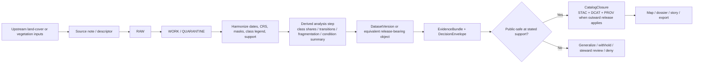

<!-- [KFM_META_BLOCK_V2]
doc_id: kfm://doc/REVIEW_REQUIRED_UUID
title: Kansas Frontier Matrix — Land Cover Analysis
type: standard
version: v1
status: draft
owners: @bartytime4life
created: REVIEW_REQUIRED_DATE
updated: 2026-04-09
policy_label: REVIEW_REQUIRED_POLICY_LABEL
related: [./README.md, ./datasets/README.md, ./datasets/derived/README.md, ../README.md, ../../domains/README.md, ../../standards/KFM_STAC_PROFILE.md, ../../standards/KFM_DCAT_PROFILE.md, ../../standards/KFM_PROV_PROFILE.md, ../../../pipelines/hls-ndvi/README.md, ../../../data/README.md]
tags: [kfm, ecology, land-cover, vegetation, remote-sensing, geoprivacy]
notes: [doc_id placeholder pending assignment, created date unresolved, owner uses current /docs CODEOWNERS fallback, public-main placeholder history should be rechecked before publish]
[/KFM_META_BLOCK_V2] -->

# Kansas Frontier Matrix — Land Cover Analysis

Purpose: define how land-cover and vegetation-condition analysis should be interpreted, checked, and published inside KFM’s ecology lane without collapsing observation-derived surfaces into habitat truth, occurrence truth, or exact-location evidence.

> [!NOTE]
> **Status:** `draft`  
> **Owners:** `@bartytime4life`  
>       
> **Quick jumps:** [Status snapshot](#status-snapshot) · [Scope](#scope) · [Repo fit](#repo-fit) · [Where land cover belongs](#where-land-cover-belongs) · [Knowledge character](#knowledge-character-and-claim-discipline) · [Source families](#source-families-that-fit-this-page) · [Analysis patterns](#analysis-patterns-in-scope) · [Workflow](#minimum-workflow-and-proof-pack) · [Disclosure](#publication-and-disclosure-rules) · [Definition of done](#definition-of-done) · [Open verification items](#open-verification-items) · [Appendix](#appendix)  
> **Repo fit:** `docs/analyses/ecology/landcover-analysis.md` → parent [`./README.md`](./README.md) · dataset context [`./datasets/README.md`](./datasets/README.md) · derived-output rules [`./datasets/derived/README.md`](./datasets/derived/README.md) · analyses index [`../README.md`](../README.md) · adjacent execution neighbor [`../../../pipelines/hls-ndvi/README.md`](../../../pipelines/hls-ndvi/README.md) · outward metadata standards [`../../standards/KFM_STAC_PROFILE.md`](../../standards/KFM_STAC_PROFILE.md), [`../../standards/KFM_DCAT_PROFILE.md`](../../standards/KFM_DCAT_PROFILE.md), [`../../standards/KFM_PROV_PROFILE.md`](../../standards/KFM_PROV_PROFILE.md)

> [!IMPORTANT]
> In KFM, land cover is usually an **observation-derived** ecological context layer. It can support vegetation summaries, change interpretation, stewardship screening, and public-safe aggregated publication. It should **not** be presented as direct species occurrence, definitive habitat truth, or parcel/exact-point ecological evidence by default.

> [!CAUTION]
> This leaf should stay analysis-facing. It must not become a second sovereign data catalog, a species-point release surface, or a generic remote-sensing scratchpad. Public-safe aggregation, visible time basis, and explicit method burden outrank visual completeness.

## Status snapshot

| Item | Status | Why it matters |
| --- | --- | --- |
| Ecology analysis lane exists with explicit sensitivity posture | **CONFIRMED** | This leaf inherits the existing ecology rules on geoprivacy, withholding, and review-bearing interpretation. |
| `docs/analyses/ecology/landcover-analysis.md` exists as a path | **CONFIRMED** | The file is a valid repo destination, but public-main evidence showed it as placeholder-thin. |
| Adjacent ecology dataset docs are stronger than this leaf | **CONFIRMED** | This page should build on nearby doctrine instead of inventing a parallel local vocabulary. |
| A land-cover/vegetation execution-adjacent neighbor exists under `pipelines/hls-ndvi/` | **CONFIRMED** | County/HUC12 vegetation summaries are the clearest visible repo-adjacent pattern for public-safe land-cover-like aggregation. |
| Exact land-cover dataset registry, fixture pack, and release-manifest depth for this leaf | **NEEDS VERIFICATION** | Public-main evidence did not prove a dedicated land-cover schema family or emitted proof pack for this path. |
| Dedicated land-cover analysis belongs in ecology when it stays interpretation-focused and sensitivity-aware | **INFERRED** | The lane rules and derived-dataset rules justify a separate leaf once routing, burden, and claim type are explicit. |
| Exact policy label, UUID, and original creation date | **UNKNOWN** | Keep metadata placeholders review-visible until branch history or internal registry evidence is surfaced. |

## Scope

This page is for **land-cover interpretation inside the ecology lane**.

That means three things.

First, it covers how land-cover classes, vegetation-condition surfaces, and dated change products should be used as **ecological context**. Second, it defines the **claim discipline** needed so land cover does not quietly become habitat truth, species truth, or exact-location exposure. Third, it gives this leaf a repo-native route to adjacent docs, contracts, and execution notes without pretending implementation depth the visible workspace did not prove.

### In scope

- class-composition summaries at public-safe supports such as county, HUC, management unit, or similarly reviewable aggregation
- dated land-cover comparison and transition interpretation
- vegetation-condition context such as NDVI-style summaries when clearly labeled as signal, not class
- fragmentation, edge, or patch summaries when support and method are stated
- protected-area, stewardship, hydrology, terrain, or climate overlays used as explanatory context
- ecology-facing routing to proof objects, metadata closure, and correction posture

### Out of scope

- exact species-point release
- parcel- or exact-pixel ecological disclosure by default
- treating land-cover products as direct evidence of species presence
- treating habitat suitability as equivalent to land cover
- generic crop/soils production reporting that belongs in the agriculture lane
- free-form narrative claims unsupported by visible dates, class dictionaries, and method notes

## Repo fit

| Surface | Role here | Notes |
| --- | --- | --- |
| [`./README.md`](./README.md) | Immediate lane parent | Governs ecology analysis posture and sensitivity boundaries. |
| [`./datasets/README.md`](./datasets/README.md) | Dataset-facing ecology context | Clarifies what belongs in the ecology dataset subtree versus analysis leaves. |
| [`./datasets/derived/README.md`](./datasets/derived/README.md) | Strongest nearby burden doc | Defines derived-output caution, source-role distinctions, and trust-object families. |
| [`../README.md`](../README.md) | Analyses index | Keeps this page routed as an analysis leaf, not a new catalog root. |
| [`../../domains/README.md`](../../domains/README.md) | Cross-lane atlas pointer | Confirms that land cover sits across ecology, agriculture, and atmosphere/EO concerns. |
| [`../../../pipelines/hls-ndvi/README.md`](../../../pipelines/hls-ndvi/README.md) | Adjacent execution-facing pattern | Most relevant visible repo neighbor for aggregated vegetation-condition outputs and proof-pack expectations. |
| [`../../standards/KFM_STAC_PROFILE.md`](../../standards/KFM_STAC_PROFILE.md) | Discovery-facing metadata boundary | Use when this page routes toward released assets or outward catalog closure. |
| [`../../../data/README.md`](../../../data/README.md) | Lifecycle zone reminder | Keeps analysis discussion tied to RAW → WORK/QUARANTINE → PROCESSED → CATALOG → PUBLISHED discipline. |

### Local routing rule

Use this file when the question is:

- how should land-cover evidence be interpreted in ecology?
- what claims are safe or unsafe?
- what minimum method and proof burden belongs on a land-cover summary or change note?

Route elsewhere when the question is instead:

- **raw or derived dataset packaging** → [`./datasets/README.md`](./datasets/README.md) or [`./datasets/derived/README.md`](./datasets/derived/README.md)
- **execution mechanics for vegetation summaries** → [`../../../pipelines/hls-ndvi/README.md`](../../../pipelines/hls-ndvi/README.md)
- **global lane placement and publication burden** → [`../../domains/README.md`](../../domains/README.md)
- **catalog closure / outward metadata** → STAC / DCAT / PROV standards in `docs/standards/`

## Where land cover belongs

Land cover is cross-lane by nature.

KFM’s visible domain framing places **land cover** explicitly in the agriculture / soils / erosion lane, while the ecology-derived docs also treat land-cover, climate, terrain, hydrology, and protected-area overlays as legitimate context layers for derived ecological products. This page keeps that split visible instead of pretending the question belongs to one lane only.

| Topic | Primary home | Why | Keep out of this page when… |
| --- | --- | --- | --- |
| Land-cover class summaries | **This leaf** | Ecology-facing interpretation of classes, transitions, and context belongs here. | the work becomes a dataset registry or execution spec |
| Vegetation-condition summaries | **This leaf** + adjacent execution docs | Ecology often needs aggregated condition signals, not just classes | the work turns into pipeline operation detail |
| Crop type, production, soil-unit reporting | Agriculture / soils lane | Those are rural-production or soil-survey questions first | land-cover language is being used to hide agricultural specificity |
| Exact occurrence evidence | Ecology occurrence / stewardship surfaces | Species observations carry different burden than land cover | class maps are being used as an excuse to disclose sensitive locations |
| Habitat suitability or corridor models | Derived ecology surfaces | These are modeled or mixed-source outputs, not raw land cover | model logic is being flattened into simple “land cover says…” prose |
| Protected-area overlays | Ecology / stewardship context | Useful as context, but not equivalent to ecological condition | statutory boundary is being confused with habitat or species truth |

### Practical split

A good land-cover analysis leaf answers questions like:

- What classes dominate this county, watershed, or management unit?
- What changed between two dated releases?
- How much of a stewardship area intersects a class or transition type?
- Does a vegetation-condition summary suggest broad stress or recovery?

A weak land-cover analysis leaf starts saying:

- “species X occurs here because the class looks suitable”
- “this protected area is ecologically intact because it is mapped as class Y”
- “this land-cover tile proves habitat quality at exact location Z”

## Knowledge character and claim discipline

The most important distinction is not raster versus vector. It is **what kind of knowledge the surface actually carries**.

| Knowledge character | Typical examples in this leaf | Safe claim shape | Unsafe collapse |
| --- | --- | --- | --- |
| Direct observation | field plot summaries, steward-reviewed site notes, exact occurrence records used only under proper controls | “observed”, “surveyed”, “counted”, “recorded at stated support” | pretending land-cover class is equivalent to these observations |
| Observation-derived | classified land-cover products, vegetation index summaries, change composites | “derived from imagery”, “classified”, “aggregated”, “compared across dated releases” | presenting derived class or NDVI as direct ecological truth |
| Modeled | habitat suitability, corridor score, ecosystem-service surfaces | “modeled”, “estimated”, “scored”, “prediction/explanatory layer” | labeling the output as observation |
| Mixed / decision-support | stewardship priority overlays combining land cover, protected areas, hydrology, terrain, and known occurrences | “composite”, “priority surface”, “review aid” | hiding the mixture and implying one sovereign layer |

> [!TIP]
> Prefer explicit names such as **land-cover class**, **vegetation condition**, **transition class**, **fragmentation summary**, or **modeled habitat surface**. Avoid undifferentiated labels like “ecology layer” or “environmental truth.”

### Non-negotiable claim rules

1. **Land cover is not habitat by default.**
2. **Vegetation index is not land-cover class by default.**
3. **Protected-area boundary is not ecological condition by default.**
4. **A dated change product is only as strong as its dates, masks, class dictionary, and comparison method.**
5. **When exact biodiversity locations could be inferred through overlay, precision should be generalized, withheld, or denied.**

## Source families that fit this page

This page does not need one monolithic source stack. It needs a clear role map.

| Source family | Typical role in land-cover analysis | Knowledge character | Main burden |
| --- | --- | --- | --- |
| Imagery-derived land-cover products | class baselines, class shares, class transitions | observation-derived | visible acquisition window, class dictionary, version drift |
| HLS / NDVI-style vegetation summaries | condition context, anomaly context, coarse comparative summaries | observation-derived | cloud/smoke/mask burden, equal-area aggregation, date visibility |
| Terrain and hydrology overlays | explanatory context for fragmentation, slope, moisture, corridor barriers | mixed depending on source | must not overwrite direct ecological evidence |
| Climate / atmosphere overlays | drought, heat, smoke, or seasonality context | mixed; often observed + modeled families | observation/model distinction must remain visible |
| Protected areas / stewardship boundaries | legal or stewardship framing for overlap summaries | statutory / administrative | legal status is not ecological condition |
| Occurrence and collection sources | corroboration, sensitivity-bearing review context | direct observation, community-contributed, or administrative depending on source | exact-point exposure may require generalization or withholding |
| Documentary evidence | photos, reports, historic descriptions, stewardship memos | documentary evidence | provenance and time basis matter; do not flatten into class truth |

### Source-role reminder

Use **land cover** to answer “what is mapped or derived here, at this support, under this class system, on these dates?”

Do **not** use land cover alone to answer “what species is present?”, “what exact habitat quality exists?”, or “what precise sensitive ecology should be published?”

## Analysis patterns in scope

| Pattern | Fits this page? | Minimum support burden | Common failure to avoid |
| --- | --- | --- | --- |
| Class composition snapshot | Yes | dated source, class legend, support unit, nodata rule | presenting totals without area/support context |
| Change / transition summary | Yes | two dated sources, comparison logic, class crosswalk, stability note | hiding that the two releases use different classes or masks |
| Fragmentation / edge / patch summary | Yes | method note, resolution/support, edge rule, minimum mapping unit | over-reading tiny patch behavior as biological truth |
| Vegetation-condition context | Yes | date window, mask burden, signal definition, aggregation support | calling NDVI “land cover” or “habitat” |
| Protected-area overlap summary | Yes | boundary vintage, land-cover vintage, intersection support | implying protection equals intact condition |
| Habitat suitability inference | Related, but not primary | explicit model labeling, covariate list, evaluation note | pretending the model is a land-cover summary |
| Parcel- or exact-point ecological screening | Usually no | separate review class and precision decision | quiet exact-location disclosure |
| Species presence assertion from class only | No | not admissible from land cover alone | inference theater |

## Minimum workflow and proof pack

The visible repo and doctrine support a consistent shape even where implementation depth remains unresolved.


```mermaid
flowchart LR
    A[Upstream land-cover or vegetation inputs] --> B[Source note / descriptor]
    B --> C[RAW]
    C --> D[WORK / QUARANTINE]
    D --> E[Harmonize dates, CRS, masks, class legend, support]
    E --> F[Derived analysis step
class shares / transitions / fragmentation / condition summary]
    F --> G[DatasetVersion or equivalent release-bearing object]
    G --> H[EvidenceBundle + DecisionEnvelope]
    H --> I{Public-safe at stated support?}
    I -- Yes --> J[CatalogClosure
STAC + DCAT + PROV when outward release applies]
    I -- No --> K[Generalize / withhold / steward review / deny]
    J --> L[Map / dossier / story / export]
```

### Minimum method sequence

1. **Admit the source deliberately.**  
   Record what product is being used, what dates it covers, and what role it plays.

2. **Normalize support before interpretation.**  
   Make support, CRS, nodata, masks, and time basis explicit before counting, comparing, or overlaying.

3. **Declare the class system.**  
   Every summary needs a class legend or crosswalk. “Forest increased” is too vague unless the actual class dictionary is visible.

4. **Keep comparison logic reviewable.**  
   For change work, name the two releases, the crosswalk, the threshold or difference logic, and the stability caveat.

5. **Emit analysis outputs as derived, not sovereign.**  
   Route them through derived-output language and release-bearing objects rather than treating them as self-authenticating facts.

6. **Carry correction forward.**  
   If a class map, mask, or comparison logic changes, the analysis must preserve correction visibility.

### Minimum evidence pack

A land-cover analysis note or release should not move forward without these:

| Required element | Why it exists |
| --- | --- |
| source reference(s) and visible dates | prevents timeless or floating interpretations |
| support unit and analysis CRS | prevents “looks aligned” analysis errors |
| class legend or class crosswalk | prevents vague or unstable class claims |
| mask / nodata / valid-pixel note | prevents false certainty from incomplete observation |
| method note for aggregation or change logic | keeps the result inspectable |
| derived-output label | prevents collapse into direct observation |
| release-facing trust objects where applicable | keeps analysis tied to DatasetVersion / EvidenceBundle / DecisionEnvelope / CatalogClosure families rather than free-floating prose |
| sensitivity / public-safe note | makes disclosure posture explicit before publication |

[Back to top](#kansas-frontier-matrix--land-cover-analysis)

## Publication and disclosure rules

Land-cover analysis becomes dangerous when it looks harmless.

### Public-safe by default only when all of these are true

- support is coarse enough to avoid quiet exact-location exposure
- dates are visible
- class system is visible
- observation-derived or modeled status is visible
- overlay logic does not allow easy reconstruction of sensitive biodiversity locations
- correction path remains available

### Default-deny or review-bearing cases

| Case | Default posture | Why |
| --- | --- | --- |
| exact or near-exact overlay with rare-species data | **withhold / generalize / review** | land-cover context can indirectly expose sensitive ecology |
| parcel-scale ecological judgments | **review** | support often outruns defensibility |
| habitat claims inferred from class only | **deny as stated** | class does not prove occupancy or habitat quality |
| stale or mixed-date comparisons | **generalize or clearly label** | time inconsistency can manufacture false change |
| community-contributed + modeled + classified composites | **review** | mixed evidence classes need visible separation |

> [!IMPORTANT]
> Public-safe publication is **earned**, not assumed. A visually attractive land-cover output still fails KFM if its dates, support, source class, or disclosure burden are hidden.

### Wording guidance

Prefer phrasing like:

- “classified land-cover share”
- “derived vegetation-condition summary”
- “dated change product”
- “stewardship overlap summary”
- “modeled habitat context”

Avoid phrasing like:

- “the ecology here is…”
- “this proves habitat…”
- “species occur here because…”
- “protected means intact…”

## Definition of done

- [ ] This leaf stays analysis-facing and does not duplicate dataset registries.
- [ ] Repo links point only to visible or intentionally review-placeholder surfaces.
- [ ] All land-cover claims are dated, support-aware, and knowledge-character-aware.
- [ ] Derived outputs are labeled as derived.
- [ ] Habitat, occurrence, stewardship, and land-cover claims remain separate.
- [ ] Public-safe / generalized / withheld posture is stated where sensitivity could emerge through overlay.
- [ ] Any release-facing note references outward metadata and proof objects without inventing unverified schemas or automation.
- [ ] “Change” language is only used when the compared releases, class crosswalk, and comparison logic are named.
- [ ] This file remains pleasant to scan in GitHub and does not degrade into a prose wall.

## Open verification items

| Item | Current posture | What would resolve it |
| --- | --- | --- |
| Exact doc UUID assignment | **UNKNOWN** | repository or documentation registry evidence |
| Original creation date for this leaf | **UNKNOWN** | file history / branch history |
| Final policy label | **UNKNOWN** | visible documentation policy registry or maintainer decision |
| Exact land-cover dataset family used most often by this subtree | **NEEDS VERIFICATION** | checked-in source descriptors or derived dataset entries |
| Exact fixture, schema, and policy tests for this leaf | **NEEDS VERIFICATION** | visible test inventory or schema bundle tied to land-cover work |
| Whether this leaf should also route to a future `docs/domains/ecology/` substantive page | **INFERRED / NEEDS VERIFICATION** | branch inventory once domain docs are deepened |
| Exact emitted proof-pack path for ecology land-cover releases | **NEEDS VERIFICATION** | mounted release manifests or example receipts |

[Back to top](#kansas-frontier-matrix--land-cover-analysis)

## Appendix

<details>
<summary><strong>Starter term distinctions</strong></summary>

| Term | Use it when you mean… | Do not quietly substitute it for… |
| --- | --- | --- |
| Land cover | mapped or classified surface category | species presence, habitat quality, or land use |
| Vegetation condition | signal or index about canopy/greenness/stress at a stated time | a stable class map |
| Land-cover change | comparison between dated releases under stated method | “what happened ecologically” in full |
| Habitat suitability | modeled probability or relative suitability | land-cover class |
| Stewardship / protected-area context | legal or management boundary context | observed ecological condition |
| Exact occurrence evidence | point or fine-area observation with provenance | a class raster or coarse summary |

</details>

<details>
<summary><strong>Lightweight reviewer prompts</strong></summary>

1. Are the dates obvious?
2. Is the support unit obvious?
3. Can a reader tell whether the output is direct, derived, modeled, or mixed?
4. Would a rare-species location become easier to infer after overlay?
5. Does the page accidentally speak in habitat or occurrence language when it only has land-cover evidence?
6. Is correction possible without rewriting history?

</details>

<details>
<summary><strong>Illustrative output shape for a future land-cover analysis note</strong></summary>

```yaml
analysis_subject: REVIEW_REQUIRED_SUBJECT
knowledge_character: observation-derived
source_window:
  start: REVIEW_REQUIRED_DATE
  end: REVIEW_REQUIRED_DATE
support_unit: county_or_huc_or_management_unit
class_dictionary_ref: REVIEW_REQUIRED_REF
comparison_basis: single_release_or_two_release_change
sensitivity_posture: public-safe|generalized|withheld|review
related_release_objects:
  dataset_version: REVIEW_REQUIRED_REF
  evidence_bundle: REVIEW_REQUIRED_REF
  decision_envelope: REVIEW_REQUIRED_REF
  catalog_closure: REVIEW_REQUIRED_REF
correction_note: REVIEW_REQUIRED_REF
```

This block is illustrative only. It is a shape guide, not a claim that these exact fields already exist for this leaf.

</details>

[Back to top](#kansas-frontier-matrix--land-cover-analysis)
