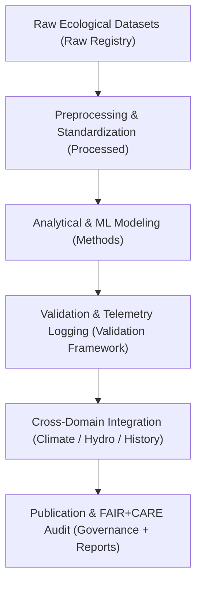

<div align="center">

# 🧩 **Kansas Frontier Matrix — Ecology Analytical Methods**  
`docs/analyses/ecology/methods/README.md`

**Purpose**  
Document the analytical, statistical, and AI-assisted methodologies used within the **Ecology domain** of the Kansas Frontier Matrix (KFM).  
These methods ensure scientific reproducibility, ethical transparency, and **FAIR+CARE-certified governance** across ecological modeling and assessment workflows.

[](../../../../../README.md)  
[](../../../../../../LICENSE)  
[](../../../../../../docs/standards/faircare.md)  
[](../../../../../../releases/v11.2.4/manifest.zip)

</div>

---

## 📘 Overview

The **Ecology Analytical Methods** layer defines the scientific foundation for all ecology analyses — from **species distribution modeling (SDM)** to **landcover change detection** and **ecosystem service valuation**.  

All procedures:

- Follow **Master Coder Protocol v6.3** and **KFM‑MDP v11.2.4**  
- Are backed by **NASA-grade reproducibility** and explicit model cards  
- Are governed by **FAIR+CARE** with Indigenous and ecological ethics review  
- Emit telemetry conformant with `analyses-ecology-methods-v3` for energy, carbon, and validation metrics  

This document is the **methods index** for:

- `docs/analyses/ecology/species-distribution-modeling.md`  
- `docs/analyses/ecology/landcover-analysis.md`  
- `docs/analyses/ecology/ecosystem-services.md`  
- `docs/analyses/ecology/validation.md`  
- `docs/analyses/ecology/governance.md`  

---

## 🗂️ Directory Layout

```plaintext
docs/analyses/ecology/methods/
├── 📘 README.md                    # This methods index
├── 📊 summary-findings.md          # Cross-method ecological findings & synthesis
├── 📈 figures/                     # Plots and visual method artifacts
│   └── 📘 README.md
├── 📋 tables/                      # Method performance tables and benchmarks
│   └── 📘 README.md
├── 📡 telemetry-logs/              # Method-level telemetry & validation exports
│   └── 📘 README.md
└── ⚖️ governance.md                # Method governance, approvals, and deprecation rules
```

Each subdirectory maintains:

- A local `README.md` with **scope, schema, and provenance**  
- Links into the **Ecology Validation Framework** (`docs/analyses/ecology/validation.md`)  
- Telemetry bindings to `telemetry_schema: analyses-ecology-methods-v3.json`  

---

## 🧩 Core Method Categories

| Method Type                               | Description                                                                 | Key Tools / Frameworks                                  | FAIR+CARE Considerations                                  |
|-------------------------------------------|-----------------------------------------------------------------------------|---------------------------------------------------------|-----------------------------------------------------------|
| **Species Distribution Modeling (SDM)**   | Predict species presence and habitat suitability using statistical + ML SDMs | Python (`scikit-learn`, `xgboost`), R (`dismo`, MaxEnt) | Indigenous consent, species sensitivity tagging, masking  |
| **Ecosystem Services Valuation**          | Quantify ecosystem functions (carbon, pollination, water retention)        | `InVEST`, `PyEcoTools`, `xarray`, `rasterio`            | Open licensing of derived indices; energy/carbon telemetry |
| **Landcover & Vegetation Analysis**       | Classify vegetation and detect landcover transitions                       | `GDAL`, `rasterio`, Google Earth Engine, `numpy`        | Attribution for climate & Indigenous lands, bias checks   |
| **Ecology–Climate–Hydrology Integration** | Cross-domain correlation and scenario modeling                             | Neo4j, `pandas`, `xarray`, AI correlation pipelines     | FAIR+CARE linkage in telemetry and governance logs        |
| **Validation & Uncertainty Quantification** | Accuracy, drift, and uncertainty assessment for ecological models         | `scikit-learn`, `statsmodels`, `arviz`                  | Model cards, explainability indices, CARE ethics review   |

---

## ⚙️ Methodological Workflow



Key stages:

- **Preprocessing**  
  - Taxonomic checks, spatial harmonization, temporal resampling  
  - Inputs from `datasets/raw` → `datasets/processed`  

- **Modeling**  
  - SDM, landcover, ecosystem services, and cross-domain analyses  
  - Methods documented in per-topic files (SDM, landcover, ecosystem services)  

- **Validation & Telemetry**  
  - Metrics and sustainability telemetry logged to `telemetry-logs/`  
  - Governed by `docs/analyses/ecology/validation.md`  

- **Publication**  
  - Outputs feed into `docs/analyses/ecology/reports/` and cross-domain analyses  
  - FAIR+CARE audit recorded in governance ledger  

---

## 🧠 FAIR+CARE Integration

| FAIR Principle | Implementation                                                           | CARE Principle        | Implementation                                                   |
|----------------|---------------------------------------------------------------------------|------------------------|------------------------------------------------------------------|
| **Findable**   | Methods, models, and scripts indexed in STAC-like method registry       | **Collective Benefit** | Ecology insights oriented to conservation and climate resilience |
| **Accessible** | Reproducible notebooks, containers, and config files under CC-BY        | **Authority to Control** | Consent and governance checks for community/Indigenous data      |
| **Interoperable** | Open formats (GeoJSON, NetCDF, CSV, JSON-LD) with shared CRS & time | **Responsibility**     | Explainable modeling, bias audits, and transparent limitations   |
| **Reusable**   | Full provenance, parameters, and telemetry schemas versioned in Git     | **Ethics**             | Avoid decontextualized ecological claims or exploitative uses    |

---

## 📏 Method-Level Validation Protocols

| Validation Type         | Description                                      | Metric / Artifact                                  | Target / Threshold       |
|-------------------------|--------------------------------------------------|----------------------------------------------------|--------------------------|
| **Spatial Accuracy**    | Predicted vs observed distributions / classes    | AUC, F1, confusion matrices                        | AUC ≥ 0.85; accuracy ≥ 90% |
| **Temporal Stability**  | Stability across years / climate regimes         | Drift index, rolling AUC                           | Drift ≤ 5% over baseline |
| **Uncertainty Analysis**| Confidence in predictions & scenario responses   | Calibration curves, predictive intervals           | Documented & calibrated  |
| **FAIR+CARE Audit**     | Ethics & governance verification                 | `faircare_validation.json` entries                 | FAIR+CARE ≥ 95%          |
| **Telemetry Linkage**   | Telemetry + provenance completeness              | Linked `run_id` / `method_id` across logs          | 100% linkage             |

Method runs must:

- Emit a **method run record** with `method_id`, `run_id`, `datasets`, `parameters`, `metrics`, and `energy/carbon`  
- Attach a **governance verdict** (e.g., `APPROVED`, `REVIEW_REQUIRED`, `BLOCKED`) when used in production analyses  

---

## ⚖️ Governance Integration

Ecology methods are governed by:

- **FAIR+CARE Data Standards Council**  
  - Approves new methods and major parameter shifts  
  - Reviews model cards for explainability and ethics  

- **Indigenous Data Governance Board (IDGB)**  
  - Reviews methods that use culturally sensitive ecological data  
  - May require masking, aggregation, or access controls  

- **Automation & CI Integration**  
  - Method CI workflows (e.g., `ecology-methods-validation.yml`) must:  
    - Run unit + integration tests  
    - Validate telemetry emission against `analyses-ecology-methods-v3`  
    - Enforce governance labels before merging to main  

---

## 🕰️ Version History

| Version | Date       | Author                                | Summary                                                                                   |
|--------:|-----------:|----------------------------------------|-------------------------------------------------------------------------------------------|
| v11.2.4 | 2025-12-06 | FAIR+CARE Ecology Methods Council      | Upgraded ecology methods index to KFM‑MDP v11.2.4; added scope, lifecycle, telemetry schema linkage, and emoji directory layout. |
| v10.2.2 | 2025-11-11 | FAIR+CARE Ecology Methods Council      | Created standardized ecology analytical methods README aligning with v10.2 standards and governance integration. |

---

<div align="center">

© 2025 Kansas Frontier Matrix Project  
Master Coder Protocol v6.3 · FAIR+CARE Certified · Diamond⁹ Ω / Crown∞Ω Ultimate Certified  

[Back to Ecology Overview](../README.md) · [Back to Ecology Analyses](../README.md) · [Governance Charter](../../../../../../docs/standards/governance/ROOT-GOVERNANCE.md)

</div>