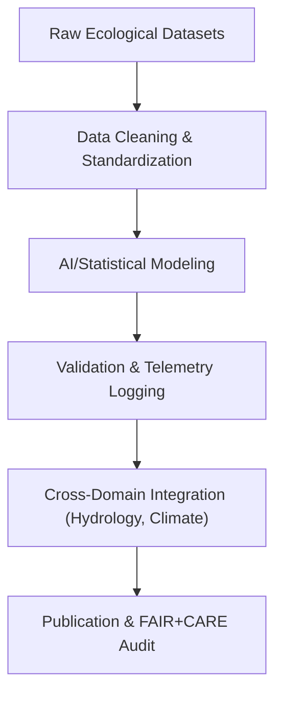

<div align="center">

# 🧩 **Kansas Frontier Matrix — Ecology Analytical Methods**  
`docs/analyses/ecology/methods/README.md`

**Purpose:**  
Document the analytical, statistical, and AI-assisted methodologies used within the **Ecology domain** of the Kansas Frontier Matrix (KFM).  
These methods ensure scientific reproducibility, ethical transparency, and FAIR+CARE-certified governance throughout ecological modeling and assessment workflows.

[](../../../../../../docs/standards/markdown_guide.md)
[](../../../../../../LICENSE)
[](../../../../../../docs/standards/faircare.md)
[](../../../../../../releases/v10.2.0/manifest.zip)

</div>

---

## 📘 Overview

The **Ecology Analytical Methods** layer defines the scientific foundation for all analyses under the ecology domain — from species distribution modeling to landcover change detection and ecosystem service valuation.  
All procedures follow the **Master Coder Protocol v6.3** and **NASA-grade reproducibility standards**, combining quantitative rigor with ethical oversight under FAIR+CARE principles.

---

## 🗂️ Directory Layout

```bash
methods/
 ├── README.md
 ├── figures/
 │    └── README.md
 ├── tables/
 │    └── README.md
 ├── telemetry-logs/
 │    └── README.md
 ├── summary-findings.md
 └── governance.md
```

Each subfolder includes metadata-enriched documentation with provenance tracking and telemetry integration.

---

## 🧩 Core Method Categories

| Method Type | Description | Key Tools/Frameworks | FAIR+CARE Considerations |
|--------------|--------------|-----------------------|---------------------------|
| **Species Distribution Modeling (SDM)** | Predict species presence and habitat suitability using AI-assisted models (MaxEnt, Random Forest). | Python (scikit-learn, PyCaret), R (dismo) | Indigenous consent and habitat sensitivity tagging |
| **Ecosystem Services Valuation** | Quantify ecosystem functions (carbon sequestration, pollination) from spatial models. | ArcGIS, QGIS, R (InVEST) | Open licensing of derived data layers |
| **Landcover and Vegetation Analysis** | Classify and quantify vegetation dynamics via NDVI, MODIS, and Landsat datasets. | GDAL, Google Earth Engine | Climate and Indigenous land attribution audits |
| **Validation and Cross-Domain Integration** | Align ecological results with climatology and hydrology frameworks. | Neo4j Graph + AI Correlation Pipelines | FAIR+CARE linkage in telemetry and governance logs |

---

## ⚙️ Methodological Workflow



- **Preprocessing:** Data harmonization, spatial re-projection, metadata tagging  
- **Modeling:** AI and statistical algorithms with cross-validation and explainability metrics  
- **Validation:** Error and drift detection logged to telemetry  
- **Publication:** FAIR+CARE audit triggers upon method finalization  

---

## 🧠 FAIR+CARE Integration

| FAIR Principle | Implementation | CARE Principle | Implementation |
|----------------|----------------|----------------|----------------|
| **Findable** | Datasets and models indexed in the KFM STAC catalog | **Collective Benefit** | Ecological insights shared for conservation and education |
| **Accessible** | Reproducible notebooks and documented parameters | **Authority to Control** | Consent verified for all ecological and community-derived data |
| **Interoperable** | Open formats (GeoJSON, NetCDF, CSV) | **Responsibility** | Explainable modeling ensures no black-box ecological outcomes |
| **Reusable** | Provenance metadata and full validation schemas | **Ethics** | Bias mitigation for species and land data interpretations |

---

## 🧾 Validation Protocols

| Validation Type | Description | Metric | Threshold |
|-----------------|--------------|---------|------------|
| Spatial Accuracy | Compare predicted vs observed distributions | R² / AUC | ≥ 0.85 |
| Temporal Stability | Evaluate consistency across years | Drift Index | ≤ 5% |
| FAIR+CARE Audit | Verify ethical metadata presence | FAIR+CARE Score | ≥ 95% |
| Telemetry Linkage | Confirm audit logging and dataset traceability | Linked Records | 100% |

---

## ⚖️ Governance Integration

All ecological methods undergo governance validation through:
- **Telemetry linkage:** All AI models log usage and bias metrics automatically.  
- **IDGB oversight:** Cultural and environmental sensitivity reviewed quarterly.  
- **FAIR+CARE validation:** CI/CD checks ensure compliance and provenance linkage.  
- **Remediation loop:** Drift or ethical concerns trigger automatic model re-review.

---

## 🕰️ Version History

| Version | Date | Author | Summary |
|----------|------|--------|----------|
| v10.2.2 | 2025-11-11 | FAIR+CARE Ecology Methods Council | Created standardized ecology analytical methods README aligning with v10.2 standards and governance integration. |

---

<div align="center">

© 2025 Kansas Frontier Matrix · Master Coder Protocol v6.3 · FAIR+CARE Certified  
Diamond⁹ Ω / Crown∞Ω Ultimate Certified  

[Back to Ecology Analysis](../README.md) · [Governance Charter](../../../../../../docs/standards/governance/ROOT-GOVERNANCE.md)

</div>