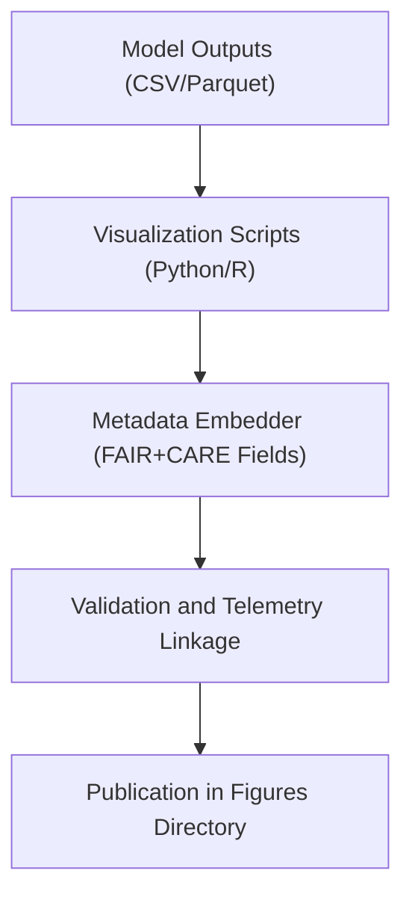

<div align="center">

# 🖼️ **Kansas Frontier Matrix — Ecology Methods: Figures**  
`docs/analyses/ecology/methods/figures/README.md`

**Purpose:**  
Document and archive all **visual outputs and analytical figures** generated by ecological methods in the Kansas Frontier Matrix (KFM).  
These figures visually represent model behavior, validation performance, and cross-domain relationships, fully compliant with FAIR+CARE visualization standards.

[](../../../../../../../docs/standards/markdown_guide.md)
[](../../../../../../../LICENSE)
[](../../../../../../../docs/standards/faircare.md)
[](../../../../../../../releases/v10.2.0/manifest.zip)

</div>

---

## 📘 Overview

The **Ecology Methods Figures** directory contains graphical representations of analytical workflows, validation results, and ecosystem metrics.  
Each figure integrates FAIR+CARE metadata for accessibility, provenance, and reproducibility.

Figures are designed to:
- Summarize model validation and accuracy.  
- Illustrate ecological processes and domain linkages.  
- Communicate cross-domain AI correlations and FAIR+CARE outcomes.  
- Support governance reports with ethical and scientific transparency.  

---

## 🗂️ Directory Layout

```bash
figures/
 ├── model-validation-accuracy.png       # Validation accuracy comparison for ecological models
 ├── biodiversity-trend-plot.svg         # Biodiversity index trends across temporal intervals
 ├── energy-efficiency-barplot.pdf       # Power consumption and sustainability chart
 ├── spatial-habitat-heatmap.png         # Predicted species distribution density map
 └── README.md                           # This document
```

Each figure embeds EXIF and JSON-LD metadata fields (`version`, `checksum`, `dataset_ref`, `telemetry_id`) for FAIR+CARE traceability.

---

## 🧾 Figure Descriptions

| File | Description | Format | Validation |
|------|--------------|---------|-------------|
| `model-validation-accuracy.png` | Model accuracy and validation comparison across species distribution models | PNG | FAIR Metadata Validator |
| `biodiversity-trend-plot.svg` | Time-series plot showing biodiversity index changes per region | SVG | Schema Validation |
| `energy-efficiency-barplot.pdf` | Visualizes energy efficiency across model runs | PDF | SBOM Audit Reference |
| `spatial-habitat-heatmap.png` | Heatmap of species richness and predicted habitat suitability | PNG | FAIR+CARE Ethical Review |

---

## ⚙️ Figure Generation Workflow



1. Raw model outputs processed into publication-quality visualizations.  
2. FAIR+CARE metadata embedded via automated pipelines.  
3. Telemetry logs cross-link figure generation with SBOM and governance audits.  
4. Figures validated and archived for integration with reports and results dashboards.  

---

## 🧩 Analytical Applications

- Validate ecological model performance visually for peer review.  
- Provide spatial insight into biodiversity, carbon storage, and ecosystem change.  
- Support FAIR+CARE audit documentation and scientific presentations.  
- Enable quick comparison between ecological, hydrological, and climatological data models.  

---

## ⚖️ FAIR+CARE Compliance Summary

| Metric | Tag | Description |
|--------|-----|-------------|
| `figure_metadata_integrity` | FAIR-Reproducible | Confirms all figures contain embedded provenance metadata |
| `energy_audit_trace` | FAIR-Sustainable | Records and visualizes sustainability metrics for computing resources |
| `spatial_ethics_compliance` | CARE-Integrity | Ensures no sensitive ecological or cultural data are disclosed |
| `visual_accessibility` | FAIR-Accessible | Confirms all figures include alt-text, color accessibility compliance, and captions |

---

## 🕰️ Version History

| Version | Date | Author | Summary |
|----------|------|--------|----------|
| v10.2.2 | 2025-11-11 | FAIR+CARE Ecology Visualization Council | Established ecology methods figures documentation with telemetry metadata and governance linkage per schema v3. |

---

<div align="center">

© 2025 Kansas Frontier Matrix · Master Coder Protocol v6.3 · FAIR+CARE Certified  
Diamond⁹ Ω / Crown∞Ω Ultimate Certified  

[Back to Ecology Methods](../README.md) · [Governance Charter](../../../../../../../docs/standards/governance/ROOT-GOVERNANCE.md)

</div>