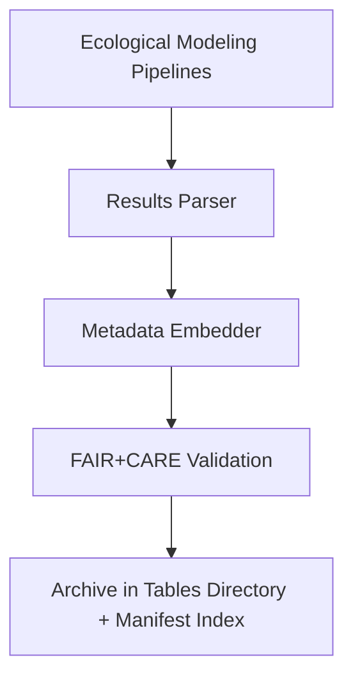

<div align="center">

# 📊 **Kansas Frontier Matrix — Ecology Methods: Tables**  
`docs/analyses/ecology/methods/tables/README.md`

**Purpose:**  
Provide structured documentation for **tabular datasets and outputs** derived from ecological analytical methods in the Kansas Frontier Matrix (KFM).  
These tables summarize modeling parameters, validation metrics, and ecological indices essential to FAIR+CARE-compliant analysis workflows.

[](../../../../../../../docs/standards/markdown_guide.md)
[](../../../../../../../LICENSE)
[](../../../../../../../docs/standards/faircare.md)
[](../../../../../../../releases/v10.2.0/manifest.zip)

</div>

---

## 📘 Overview

This directory contains **ecological modeling tables** produced during data analysis and validation phases.  
Each table records harmonized statistics, correlation coefficients, or model-derived outputs, ensuring transparent and reproducible documentation across the ecological domain.

All tables follow standardized metadata conventions under **Master Coder Protocol v6.3**, and are automatically referenced by the release manifest and telemetry pipeline.

---

## 🗂️ Directory Layout

```bash
tables/
 ├── model-parameter-summary.csv        # AI and statistical model parameters per ecological method
 ├── validation-metrics.csv             # Accuracy, precision, recall, and F1 scores for ecological models
 ├── biodiversity-index-summary.parquet # Summary of biodiversity and species indices
 ├── energy-efficiency-table.csv        # Energy consumption and sustainability metrics
 └── README.md                          # This file
```

Each dataset includes provenance metadata (timestamp, commit hash, model version, and checksum) embedded for full reproducibility.

---

## 🧾 Table Descriptions

| File | Description | Format | Validation |
|------|--------------|---------|-------------|
| `model-parameter-summary.csv` | Model coefficients and hyperparameters for AI/ML ecological methods | CSV | FAIR+CARE schema validator |
| `validation-metrics.csv` | Accuracy and recall scores across multiple ecological modeling pipelines | CSV | CI validation pipeline |
| `biodiversity-index-summary.parquet` | Computed ecological diversity metrics across regions and temporal spans | Parquet | FAIR validator |
| `energy-efficiency-table.csv` | Power usage effectiveness and sustainability tracking for model runs | CSV | SBOM-linked audit |

---

## ⚙️ Table Generation Workflow



1. Model pipelines output raw JSON or CSV statistics.  
2. A parser converts results into standardized tables.  
3. Metadata embedder attaches version, checksum, and FAIR+CARE compliance flags.  
4. Validated tables are stored, referenced in telemetry, and included in the manifest.  

---

## 🧩 Analytical Applications

- Enable reproducible comparison of ecological model performance.  
- Support cross-domain correlation with climatology and hydrology data.  
- Facilitate FAIR+CARE reporting through integrated telemetry metrics.  
- Provide energy-efficiency data for sustainability governance.  

---

## ⚖️ FAIR+CARE Compliance Summary

| Metric | Tag | Description |
|--------|-----|-------------|
| `table_metadata_completeness` | FAIR-Reproducible | Ensures tables contain full metadata, units, and lineage |
| `integration_consistency` | FAIR-Interoperable | Confirms harmonized schema across ecological datasets |
| `energy_sustainability_kWh` | FAIR-Sustainable | Tracks computational energy cost for each model run |
| `consent_audit_trace` | CARE-Transparency | Links tables to data consent and governance approvals |

---

## 🕰️ Version History

| Version | Date | Author | Summary |
|----------|------|--------|----------|
| v10.2.2 | 2025-11-11 | FAIR+CARE Ecology Methods Council | Created ecology methods tables documentation under v10.2 telemetry schema and FAIR+CARE compliance. |

---

<div align="center">

© 2025 Kansas Frontier Matrix · Master Coder Protocol v6.3 · FAIR+CARE Certified  
Diamond⁹ Ω / Crown∞Ω Ultimate Certified  

[Back to Ecology Methods](../README.md) · [Governance Charter](../../../../../../../docs/standards/governance/ROOT-GOVERNANCE.md)

</div>