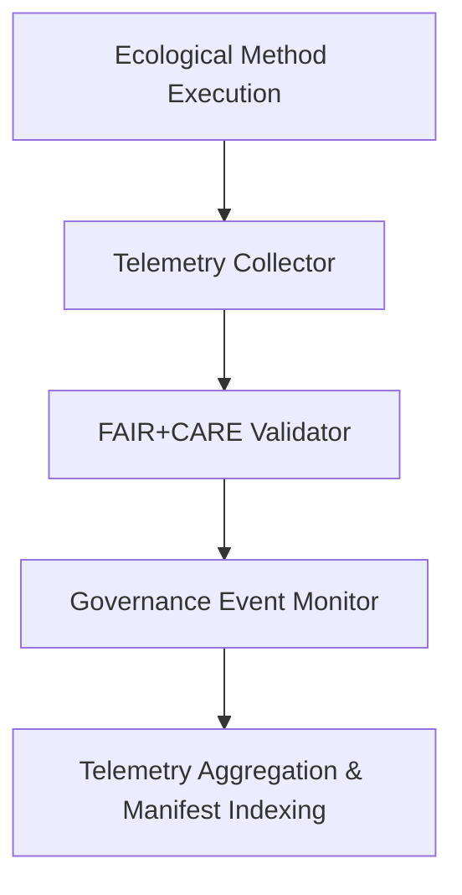

<div align="center">

# 📡 **Kansas Frontier Matrix — Ecology Methods: Telemetry Logs**  
`docs/analyses/ecology/methods/telemetry-logs/README.md`

**Purpose:**  
Document and maintain all **telemetry data, performance metrics, and governance event logs** generated during the execution of ecological analytical methods in the Kansas Frontier Matrix (KFM).  
Telemetry logging ensures traceability, energy transparency, and FAIR+CARE compliance across every stage of the ecological modeling lifecycle.

[](../../../../../../../docs/standards/markdown_guide.md)
[](../../../../../../../LICENSE)
[](../../../../../../../docs/standards/faircare.md)
[](../../../../../../../releases/v10.2.0/manifest.zip)

</div>

---

## 📘 Overview

This folder stores all **telemetry logs** produced during the execution and validation of ecological analytical methods.  
Each log entry captures computational efficiency, ethical governance triggers, model drift, and sustainability metrics.  
All logs are automatically validated by the continuous integration (CI/CD) pipeline for completeness and integrity under the FAIR+CARE framework.

---

## 🗂️ Directory Layout

```bash
telemetry-logs/
 ├── model-latency-profile.json      # Runtime and inference latency logs for ecological models
 ├── energy-consumption.csv          # Records of power draw, CPU/GPU usage, and energy efficiency
 ├── drift-detection.log             # Model drift and data schema deviation events
 ├── governance-events.log           # CARE compliance and ethical trigger audit logs
 ├── validation-summary.jsonl        # JSON Lines file of validation metrics for all model runs
 └── README.md                       # This file
```

Each file is linked to its corresponding analysis and referenced in `focus-telemetry.json` within the release manifest.

---

## 🧾 Log Descriptions

| File | Description | Format | Validation |
|------|--------------|---------|-------------|
| `model-latency-profile.json` | Captures model runtime statistics (average latency, variance, throughput) | JSON | FAIR+CARE Schema Validator |
| `energy-consumption.csv` | Tracks power draw, energy cost per run, and efficiency (kWh) | CSV | SBOM Energy Audit |
| `drift-detection.log` | Documents deviations in input schema or predictive drift over time | LOG | Drift Analysis Workflow |
| `governance-events.log` | Records ethical reviews, Indigenous consent triggers, and governance interventions | LOG | Governance-As-Code CI |
| `validation-summary.jsonl` | Summarized results of validation accuracy, precision, and bias across models | JSONL | CI/CD FAIR Validation Pipeline |

---

## ⚙️ Telemetry Generation Workflow



1. **Execution:** Ecological models emit logs for runtime, validation, and ethics.  
2. **Collection:** Telemetry pipeline gathers all logs into JSON/CSV formats.  
3. **Validation:** FAIR+CARE validation scripts verify completeness and ethical metadata.  
4. **Indexing:** Logs archived and linked to the release manifest and governance schema.

---

## 🧩 Analytical Applications

- **Performance Benchmarking:** Compare ecological model efficiency and scalability.  
- **Energy Optimization:** Track and reduce computational power consumption per job.  
- **Ethical Oversight:** Audit consent and governance triggers via CARE logging.  
- **Model Drift Tracking:** Identify and remediate prediction or schema drift over time.  
- **Governance Reporting:** Provide traceable FAIR+CARE data for certification and transparency.

---

## ⚖️ FAIR+CARE Compliance Summary

| Metric | Tag | Description |
|--------|-----|-------------|
| `telemetry.data_integrity` | FAIR-Reproducible | Ensures telemetry logs are complete and traceable |
| `energy_usage_kWh` | FAIR-Sustainable | Records per-run energy consumption for all analyses |
| `governance_audit_trace` | CARE-Integrity | Tracks consent, ethical decisions, and review outcomes |
| `bias_monitoring_index` | FAIR-Interoperable | Measures fairness and predictive stability in AI models |

---

## 🕰️ Version History

| Version | Date | Author | Summary |
|----------|------|--------|----------|
| v10.2.2 | 2025-11-11 | FAIR+CARE Ecology Methods Council | Established ecology methods telemetry logs README with governance-linked metrics and energy validation integration. |

---

<div align="center">

© 2025 Kansas Frontier Matrix · Master Coder Protocol v6.3 · FAIR+CARE Certified  
Diamond⁹ Ω / Crown∞Ω Ultimate Certified  

[Back to Ecology Methods](../README.md) · [Governance Charter](../../../../../../../docs/standards/governance/ROOT-GOVERNANCE.md)

</div>