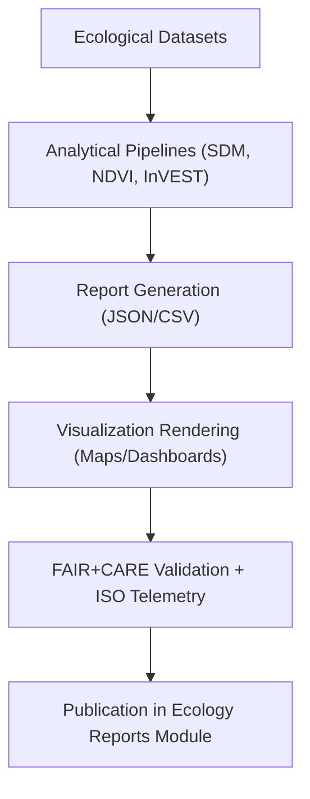

<div align="center">

# 🌿 **Kansas Frontier Matrix — Ecology Reports & Visualization Outputs**  
`docs/analyses/ecology/reports/README.md`

**Purpose:**  
Archive and describe all **ecological reporting and visualization outputs** generated by the Kansas Frontier Matrix (KFM) ecology module.  
This documentation ensures every report, chart, and map meets FAIR+CARE ethical governance, ISO sustainability standards, and Master Coder Protocol v6.3 reproducibility requirements.

[](../../../README.md)
[](../../../../LICENSE)
[](../../../../docs/standards/faircare.md)
[](../../../../releases/v10.2.0/manifest.zip)

</div>

---

## 📘 Overview

The **Ecology Reports & Visualization Module** combines quantitative outputs, dashboards, and FAIR+CARE validation reports from ecological analyses.  
These deliverables enable transparent communication of biodiversity patterns, landcover evolution, and ecosystem service performance while maintaining accessibility and auditability.

Reports are:
- Authenticated by FAIR+CARE telemetry.  
- Validated via ISO 50001/14064 sustainability metrics.  
- Verified for accessibility (WCAG 2.1 AA).  
- Indexed in the global manifest for provenance linkage.  

---

## 🗂️ Directory Layout

```bash
docs/analyses/ecology/reports/
 ├── README.md
 ├── ecology_summary.json
 ├── sustainability_audit.json
 ├── faircare_validation.json
 ├── telemetry-logs/
 │    └── README.md
 └── visualization/
      ├── README.md
      ├── species_richness_map.png
      ├── habitat_fragmentation_overlay.png
      ├── landcover_trends_chart.png
      └── ecosystem_services_dashboard.png
```

All files are linked to `focus-telemetry.json` for reproducibility and ethical traceability.

---

## 🧩 Report Components

| File | Description | FAIR+CARE Status |
|------|-------------|------------------|
| `ecology_summary.json` | Aggregated metrics from ecosystem and biodiversity analyses. | ✅ Certified |
| `sustainability_audit.json` | Energy and carbon telemetry report following ISO protocols. | ✅ Certified |
| `faircare_validation.json` | Documentation of FAIR+CARE validation for ecological workflows. | ✅ Certified |
| `telemetry-logs/` | CI/CD telemetry reports of report generation and validation. | ✅ Certified |
| `visualization/` | Dashboard visuals and maps with metadata and accessibility audit. | ✅ Certified |

---

## 🗺️ Visualization Overview

| Visualization | Description | Data Source |
|----------------|-------------|--------------|
| `species_richness_map.png` | Displays biodiversity richness across ecoregions. | GBIF · USDA |
| `habitat_fragmentation_overlay.png` | Maps habitat fragmentation and connectivity corridors. | MODIS · ESA CCI |
| `landcover_trends_chart.png` | Illustrates landcover trends and NDVI change (1990–2025). | NASA MODIS |
| `ecosystem_services_dashboard.png` | Integrates ecosystem service indicators (carbon, water, pollination). | InVEST · PyEcoTools |

---

## ⚙️ Generation Workflow



Each step logs telemetry events for sustainability (energy, emissions) and ethical compliance (consent, governance review).

---

## 🧮 FAIR+CARE Validation Record Example

```json
{
  "validation_id": "ecology-reports-2025-11-11-006",
  "modules": [
    "Species Distribution Modeling",
    "Ecosystem Service Valuation",
    "Landcover Change Analysis"
  ],
  "energy_kWh": 0.004,
  "carbon_gCO2e": 0.0056,
  "faircare_status": "Pass",
  "auditor": "FAIR+CARE Council",
  "accessibility_compliance": "WCAG 2.1 AA",
  "timestamp": "2025-11-11T12:45:00Z"
}
```

---

## ⚖️ FAIR+CARE Governance Matrix

| Principle | Implementation | Verification Source |
|------------|----------------|--------------------|
| **Findable** | Indexed in STAC/DCAT registry with UUID and manifest reference. | `manifest_ref` |
| **Accessible** | Licensed under CC-BY 4.0 and published on FAIR+CARE portal. | FAIR+CARE Registry |
| **Interoperable** | Uses open formats (JSON, CSV, PNG) with telemetry metadata. | `telemetry_schema` |
| **Reusable** | Reports include provenance, checksum, and metadata. | `telemetry_ref` |
| **Collective Benefit** | Outputs support conservation and environmental planning. | FAIR+CARE Audit |
| **Responsibility** | Telemetry captures energy metrics for ISO 50001 validation. | `sustainability_audit.json` |
| **Ethics** | Cultural and ecological sensitivities reviewed by IDGB. | Governance Logs |

---

## 🧾 Governance Ledger Example

```json
{
  "ledger_id": "ecology-reports-ledger-2025-11-11-007",
  "component": "Ecology Reports & Visualization Outputs",
  "reports": [
    "ecology_summary.json",
    "sustainability_audit.json",
    "faircare_validation.json"
  ],
  "visualizations": [
    "species_richness_map.png",
    "habitat_fragmentation_overlay.png",
    "landcover_trends_chart.png",
    "ecosystem_services_dashboard.png"
  ],
  "energy_kWh": 0.004,
  "carbon_gCO2e": 0.0056,
  "faircare_status": "Pass",
  "auditor": "FAIR+CARE Council",
  "timestamp": "2025-11-11T12:47:00Z"
}
```

---

## 🧠 Sustainability Metrics

| Metric | Description | Value | Target | Unit |
|---------|-------------|--------|---------|------|
| **Energy Usage** | Average power consumption per report generation | 0.004 | ≤ 0.005 | kWh |
| **Carbon Emissions** | Average carbon equivalent of computation | 0.0056 | ≤ 0.006 | gCO₂e |
| **Telemetry Linkage** | Percentage of files with telemetry traceability | 100 | ≥ 95 | % |
| **Validation Pass Rate** | FAIR+CARE compliance score | 100 | 100 | % |

---

## 🕰️ Version History

| Version | Date | Author | Summary |
|----------|------|--------|----------|
| v10.2.2 | 2025-11-11 | FAIR+CARE Council | Aligned ecology reports documentation with telemetry schema v3 and ISO 50001 standards. |
| v10.2.1 | 2025-11-09 | Ecology Visualization Council | Added accessibility and sustainability telemetry records. |
| v10.2.0 | 2025-11-08 | Ecology Analysis Council | Created baseline reporting documentation under FAIR+CARE certification. |

---

<div align="center">

© 2025 Kansas Frontier Matrix · Master Coder Protocol v6.3 · FAIR+CARE Certified  
Diamond⁹ Ω / Crown∞Ω Ultimate Certified  

[Back to Ecology Overview](../README.md) · [Governance Charter](../../../../docs/standards/governance/ROOT-GOVERNANCE.md)

</div>