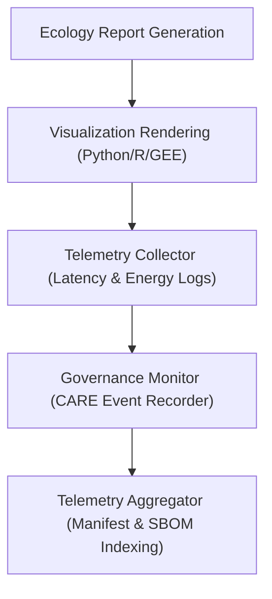

<div align="center">

# 📡 **Kansas Frontier Matrix — Ecology Reports: Telemetry Logs**  
`docs/analyses/ecology/reports/telemetry-logs/README.md`

**Purpose:**  
Maintain the **telemetry and performance logs** for all ecological reporting and visualization activities within the Kansas Frontier Matrix (KFM).  
These logs record rendering performance, governance audits, energy usage, and FAIR+CARE compliance telemetry for ecological report generation.

[](../../../../../../../docs/standards/markdown_guide.md)
[](../../../../../../../LICENSE)
[](../../../../../../../docs/standards/faircare.md)
[](../../../../../../../releases/v10.2.0/manifest.zip)

</div>

---

## 📘 Overview

This directory houses **telemetry logs** linked to ecology report generation and visualization rendering pipelines.  
Telemetry ensures every visual or analytical output adheres to **FAIR+CARE standards**, providing measurable sustainability, reproducibility, and ethical transparency across report modules.

---

## 🗂️ Directory Layout

```bash
telemetry-logs/
 ├── rendering-latency.json          # Rendering performance metrics for ecological visualizations
 ├── sustainability-metrics.csv      # Energy usage and carbon audit logs per report
 ├── governance-events.log           # Audit triggers, ethical reviews, and Indigenous consent logs
 ├── report-validation-summary.jsonl # Continuous validation record of ecological reports
 └── README.md                       # This file
```

Each telemetry artifact is linked to its originating visualization or report and referenced in the global manifest and telemetry schema.

---

## 🧾 Log Descriptions

| File | Description | Format | Validation |
|------|--------------|---------|-------------|
| `rendering-latency.json` | Frame render and export latency for each ecological visualization (avg, max, deviation). | JSON | FAIR+CARE performance validator |
| `sustainability-metrics.csv` | Tracks CPU/GPU energy use, job duration, and energy efficiency (kWh/report). | CSV | ISO 50001/14064 compliance audit |
| `governance-events.log` | FAIR+CARE governance events including audit checks, redaction actions, and consent confirmations. | LOG | Governance-as-Code workflow |
| `report-validation-summary.jsonl` | JSON Lines of report validation results including FAIR+CARE and accessibility metrics. | JSONL | Continuous integration FAIR validator |

---

## ⚙️ Telemetry Collection Workflow



1. **Rendering Engines** emit telemetry data during map/chart generation.  
2. **Collector** aggregates metrics for latency, throughput, and power usage.  
3. **Governance Monitor** records ethical triggers (redactions, approvals, IDGB consent).  
4. **Aggregator** validates logs and integrates results into the global telemetry schema.  

---

## 🧩 Analytical Applications

- Monitor **visualization latency** and improve computational efficiency.  
- Audit **energy consumption** and sustainability compliance of rendering systems.  
- Log **ethical governance triggers** during data publication or visualization.  
- Link FAIR+CARE telemetry to report provenance and global manifest certification.  

---

## ⚖️ FAIR+CARE Compliance Summary

| Metric | Tag | Description |
|--------|-----|-------------|
| `telemetry.log_completeness` | FAIR-Reproducible | Confirms telemetry entries are complete and linked to visualization outputs |
| `energy_kWh_per_report` | FAIR-Sustainable | Measures power used per ecological report render |
| `governance_traceability` | CARE-Integrity | Logs Indigenous consent and governance actions |
| `validation_audit_score` | FAIR-Interoperable | Captures overall compliance score for report generation and rendering pipelines |

---

## 🧠 Telemetry Example Record

```json
{
  "telemetry_id": "eco-report-telemetry-2025-11-11-04",
  "rendering_latency_avg_ms": 1820,
  "energy_kWh": 0.004,
  "carbon_gCO2e": 0.0056,
  "governance_events": 0,
  "faircare_status": "Pass",
  "auditor": "FAIR+CARE Council",
  "timestamp": "2025-11-11T12:45:00Z"
}
```

---

## 🕰️ Version History

| Version | Date | Author | Summary |
|----------|------|--------|----------|
| v10.2.2 | 2025-11-11 | FAIR+CARE Ecology Council | Created ecology report telemetry logs README aligned with v10.2 FAIR+CARE telemetry schema and sustainability metrics. |

---

<div align="center">

© 2025 Kansas Frontier Matrix · Master Coder Protocol v6.3 · FAIR+CARE Certified  
Diamond⁹ Ω / Crown∞Ω Ultimate Certified  

[Back to Ecology Reports](../README.md) · [Governance Charter](../../../../../../../docs/standards/governance/ROOT-GOVERNANCE.md)

</div>