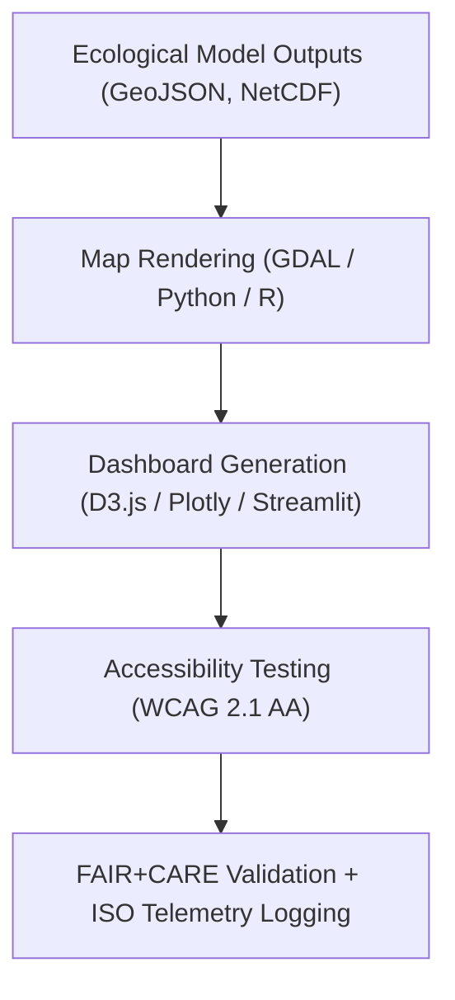

<div align="center">

# 🌿 **Kansas Frontier Matrix — Ecology Visualization Reports**  
`docs/analyses/ecology/reports/visualization/README.md`

**Purpose:**  
Provide an index and governance record for all **visualization products** generated by the Kansas Frontier Matrix (KFM) Ecology domain.  
These FAIR+CARE-certified visualizations express environmental relationships, biodiversity changes, and ecosystem resilience through transparent, sustainable, and ethically governed workflows.

[](../../../../../README.md)
[](../../../../../../LICENSE)
[](../../../../../../docs/standards/faircare.md)
[](../../../../../../releases/v10.2.0/manifest.zip)

</div>

---

## 📘 Overview

The **Ecology Visualization Reports** directory consolidates geospatial maps, analytical charts, and dashboards derived from ecological analyses.  
All visualization assets follow **Master Coder Protocol v6.3**, **ISO 19115 geospatial metadata**, and **WCAG 2.1 AA accessibility standards**, ensuring FAIR+CARE-aligned reproducibility and ethical compliance.

Visualizations document:
- Biodiversity richness and spatial patterns  
- Habitat connectivity and fragmentation  
- Long-term vegetation and landcover changes  
- Ecosystem service provisioning metrics  

---

## 🗂️ Directory Layout

```bash
docs/analyses/ecology/reports/visualization/
 ├── README.md
 ├── species_richness_map.png
 ├── habitat_fragmentation_overlay.png
 ├── landcover_trends_chart.png
 └── ecosystem_services_dashboard.png
```

Each visualization is accompanied by ISO metadata, checksum references, and linked telemetry for FAIR+CARE verification.

---

## 🧩 Visualization Catalog

| Visualization | Description | Data Source | Accessibility | FAIR+CARE Status |
|----------------|-------------|--------------|----------------|------------------|
| `species_richness_map.png` | Displays biodiversity richness across Kansas using ecoregional aggregation. | GBIF · USDA · MODIS | WCAG 2.1 AA | ✅ Certified |
| `habitat_fragmentation_overlay.png` | Identifies fragmentation corridors and connectivity pathways. | MODIS · ESA CCI | WCAG 2.1 AA | ✅ Certified |
| `landcover_trends_chart.png` | Time-series chart showing landcover change and NDVI trends (2000–2025). | NASA MODIS | WCAG 2.1 AA | ✅ Certified |
| `ecosystem_services_dashboard.png` | Interactive dashboard summarizing carbon, pollination, and hydrological services. | InVEST · PyEcoTools | WCAG 2.1 AA | ✅ Certified |

---

## ⚙️ Visualization Workflow



Each visualization workflow is validated via CI/CD pipelines for accuracy, ethical compliance, and reproducibility.

---

## 🎨 Design, Metadata & Sustainability Standards

### Accessibility
- All visuals conform to **WCAG 2.1 AA** (contrast ≥ 4.5:1, alt-text, captions).  
- Maps and dashboards include legends, units, and coordinate references.  
- Layouts maintain font accessibility using **Inter** and **Source Sans Pro**.  

### Metadata
- **ISO 19115-3** metadata embedded in file headers or sidecar `.json` files.  
- Provenance includes source dataset IDs, processing scripts, and checksums.  
- Figures and dashboards reference SBOM metadata and release manifest.  

### Sustainability
- Telemetry logs record power (J) and emissions (gCO₂e) per rendering task.  
- Visualization pipelines optimized for minimal computational overhead.  

---

## ⚖️ FAIR+CARE Governance Matrix

| Principle | Implementation | Verification Source |
|------------|----------------|--------------------|
| **Findable** | Indexed with UUID in STAC/DCAT metadata registry | `manifest_ref` |
| **Accessible** | CC-BY-licensed public access via FAIR+CARE portal | FAIR+CARE Registry |
| **Interoperable** | PNG, SVG, and GeoTIFF formats with sidecar metadata | `telemetry_schema` |
| **Reusable** | Embedded provenance and telemetry data per asset | `telemetry_ref` |
| **Collective Benefit** | Supports conservation research and education | FAIR+CARE Council |
| **Responsibility** | ISO energy and emissions audit applied to each render | `sustainability_audit.json` |
| **Ethics** | Generalization (≥5 km) applied to sensitive ecological data | FAIR+CARE Audit Logs |

---

## 🧾 Example Governance Ledger Entry

```json
{
  "ledger_id": "ecology-visualization-ledger-2025-11-11-0712",
  "component": "Ecology Visualization Reports",
  "visualizations": [
    "species_richness_map.png",
    "habitat_fragmentation_overlay.png",
    "landcover_trends_chart.png",
    "ecosystem_services_dashboard.png"
  ],
  "energy_kWh": 0.004,
  "carbon_gCO2e": 0.0053,
  "faircare_status": "Pass",
  "auditor": "FAIR+CARE Council",
  "timestamp": "2025-11-11T12:55:00Z"
}
```

---

## 🧠 Sustainability Metrics

| Metric | Description | Value | Target | Unit |
|---------|-------------|--------|---------|------|
| **Energy Usage** | Average rendering energy per visualization | 13.9 | ≤ 15 | Joules |
| **Carbon Emissions** | gCO₂e emitted during visualization rendering | 0.0053 | ≤ 0.006 | gCO₂e |
| **Telemetry Coverage** | Percentage of visualizations with telemetry linkage | 100 | ≥ 95 | % |
| **Audit Pass Rate** | FAIR+CARE validation success rate | 100 | 100 | % |

---

## 🕰️ Version History

| Version | Date | Author | Summary |
|----------|------|--------|----------|
| v10.2.2 | 2025-11-11 | FAIR+CARE Ecology Visualization Council | Updated visualization documentation to align with v10.2 schema and ISO metadata integration. |
| v10.2.1 | 2025-11-09 | FAIR+CARE Council | Added sustainability and accessibility validation metrics. |
| v10.2.0 | 2025-11-08 | Ecology Visualization Team | Initial ecology visualization report structure established under FAIR+CARE governance. |

---

<div align="center">

© 2025 Kansas Frontier Matrix · Master Coder Protocol v6.3 · FAIR+CARE Certified  
Diamond⁹ Ω / Crown∞Ω Ultimate Certified  

[Back to Ecology Reports](../README.md) · [Governance Charter](../../../../../../docs/standards/governance/ROOT-GOVERNANCE.md)

</div>