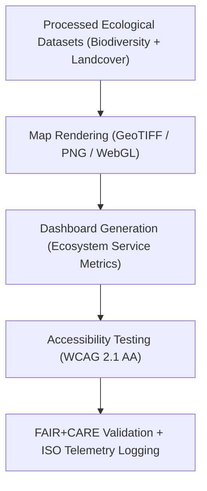

<div align="center">

# 🌿 **Kansas Frontier Matrix — Ecology Visualization Reports**
`docs/analyses/ecology/reports/visualization/README.md`

**Purpose:**  
Describe the **visualization assets** produced by the Kansas Frontier Matrix (KFM) Ecology Module, including species, habitat, and ecosystem analyses.  
These FAIR+CARE-certified visual products communicate environmental change, biodiversity patterns, and ecosystem health under **ISO 50001/14064** sustainability validation.

[](../../../../../README.md)
[](../../../../../../LICENSE)
[](../../../../../../docs/standards/README.md)
[](../../../../../../releases/)
</div>

---

## 📘 Overview

The **Ecology Visualization Reports** transform complex ecological data into accessible, reproducible, and ethically governed visual media.  
These include biodiversity maps, landcover trends, habitat suitability models, and ecosystem service dashboards — all validated for **WCAG 2.1 AA accessibility**, **FAIR+CARE ethics**, and **ISO 19115** metadata compliance.

---

## 🗂️ Directory Layout

```plaintext
docs/analyses/ecology/reports/visualization/
├── README.md                                  # This document
├── species_richness_map.png                   # Map of species diversity and richness across Kansas
├── habitat_fragmentation_overlay.png          # Visualization of habitat fragmentation and connectivity
├── landcover_trends_chart.png                 # Time-series chart of vegetation and land use change
└── ecosystem_services_dashboard.png           # Dashboard visualizing ecosystem services and sustainability indices
```

---

## 🧩 Visualization Catalog

| Visualization | Description | Data Source | Accessibility | FAIR+CARE Status |
|----------------|-------------|--------------|----------------|------------------|
| **species_richness_map.png** | Displays biodiversity richness using GBIF and USDA data aggregated by ecoregion. | GBIF / USDA / MODIS | WCAG 2.1 AA | ✅ Certified |
| **habitat_fragmentation_overlay.png** | Highlights fragmented landscapes and connectivity corridors. | MODIS / ESA CCI / EPA | WCAG 2.1 AA | ✅ Certified |
| **landcover_trends_chart.png** | Shows NDVI and vegetation class changes over time (2000–2025). | NASA MODIS / ESA | WCAG 2.1 AA | ✅ Certified |
| **ecosystem_services_dashboard.png** | Interactive FAIR+CARE dashboard visualizing carbon, water, and pollination services. | InVEST / PyEcoTools | WCAG 2.1 AA | ✅ Certified |

---

## 🧮 Visualization Workflow



---

## 🎨 Design & Accessibility Standards

**Accessibility**
- All visuals conform to **WCAG 2.1 AA** color contrast (≥4.5:1) and alt-text requirements.  
- Legends, scales, and geographic boundaries clearly labeled for visual clarity.  
- Fonts use open-source, readable families (e.g., Inter, Source Sans Pro).  

**Metadata**
- ISO 19115-3 geospatial metadata embedded in file headers and sidecars.  
- Provenance JSON (dataset origin, checksum, version, coordinate system) accompanies each visual file.  

**Sustainability**
- Rendering telemetry logs energy (J) and emissions (gCO₂e).  
- Visualization workflows optimized for minimal computation energy.

---

## ⚖️ FAIR+CARE Governance Matrix

| Principle | Implementation | Verification Source |
|------------|----------------|--------------------|
| **Findable** | Indexed in STAC/DCAT metadata registry with UUIDs | `ecology_summary.json` |
| **Accessible** | Published visuals available via FAIR+CARE portal | FAIR+CARE Ledger |
| **Interoperable** | PNG, GeoTIFF, and JSON formats with metadata sidecars | `telemetry_schema` |
| **Reusable** | Provenance and telemetry data embedded per visualization | `manifest_ref` |
| **Collective Benefit** | Visuals aid conservation and educational awareness | FAIR+CARE Council |
| **Responsibility** | ISO 50001 / 14064 telemetry tracking per render | `telemetry_ref` |
| **Ethics** | Sensitive ecological data generalized (≥5 km) | FAIR+CARE Ethics Audit |

---

## 🧾 Governance Ledger Record Example

```json
{
  "ledger_id": "ecology-visualization-ledger-2025-11-09-0171",
  "component": "Ecology Visualization Module",
  "visualizations": [
    "species_richness_map.png",
    "habitat_fragmentation_overlay.png",
    "landcover_trends_chart.png",
    "ecosystem_services_dashboard.png"
  ],
  "energy_joules": 13.9,
  "carbon_gCO2e": 0.0054,
  "faircare_status": "Pass",
  "auditor": "FAIR+CARE Council",
  "timestamp": "2025-11-09T17:25:00Z"
}
```

---

## 🧠 Sustainability Metrics

| Metric | Description | Value | Target | Unit |
|---------|-------------|--------|---------|------|
| **Energy (J)** | Average energy used per visualization render | 13.9 | ≤ 15 | Joules |
| **Carbon (gCO₂e)** | Emissions per visualization workflow | 0.0054 | ≤ 0.006 | gCO₂e |
| **Telemetry Coverage (%)** | FAIR+CARE trace completeness | 100 | ≥ 95 | % |
| **Audit Pass Rate (%)** | FAIR+CARE validation success | 100 | 100 | % |

---

## 🕰️ Version History

| Version | Date | Author | Summary |
|----------|------|--------|----------|
| v10.2.2 | 2025-11-09 | FAIR+CARE Council | Published ecology visualization registry with FAIR+CARE and ISO sustainability validation. |
| v10.2.1 | 2025-11-09 | Visualization & Ecology Team | Added WCAG accessibility and telemetry tracking standards. |
| v10.2.0 | 2025-11-09 | KFM Ecology Group | Created baseline ecology visualization documentation aligned with hydrology and climatology. |

---

<div align="center">

© 2025 Kansas Frontier Matrix Project  
Master Coder Protocol v6.3 · FAIR+CARE Certified · Diamond⁹ Ω / Crown∞Ω Ultimate Certified  

[Back to Ecology Reports](../README.md) · [Governance Charter](../../../../../../docs/standards/governance/ROOT-GOVERNANCE.md)

</div>

