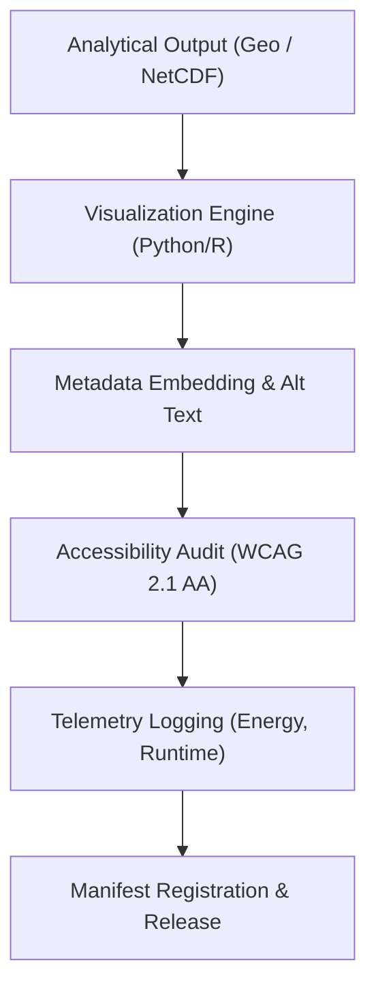

<div align="center">

# 🖼️ **Kansas Frontier Matrix — Ecology Results: Figures**  
`docs/analyses/ecology/results/figures/README.md`

**Purpose:**  
Document and index all **visualization outputs** associated with the Ecology Results Repository of the Kansas Frontier Matrix (KFM).  
These figure exports convey key ecological findings—such as species richness maps, land-cover trends, and ecosystem service dashboards—while ensuring full provenance, FAIR+CARE certification, accessibility compliance (WCAG 2.1 AA), and telemetry linkage.

[](../README.md)  
[](../../standards/faircare.md)  
[](../../../LICENSE)  
[](../../releases/v10.2.0/manifest.zip)

</div>

---

## 📘 Overview

The **Ecology Results: Figures** module houses the graphical outputs produced by ecological modelling and analysis workflows within KFM.  
Each visualization is accompanied by metadata (e.g., dataset references, script versions, checksums), accessibility annotations (alt-text, captions), and telemetry logs for energy, runtime, and governance events.  
This ensures reproducibility, transparency, and ethical stewardship of ecological insights.

---

## 🗂️ Directory Layout

```bash
docs/analyses/ecology/results/figures/
 ├── README.md
 ├── species-richness-map.png
 ├── landcover-trend-chart.svg
 ├── habitat-fragmentation-heatmap.png
 └── ecosystem-services-dashboard.png
```

Each figure file includes an embedded side-car `.json` metadata or EXIF header that captures:
- `dataset_ref`
- `model_version`
- `generation_timestamp`
- `checksum`
- `telemetry_id`

---

## 🧩 Visualization Catalogue

| File                             | Description                                                           | Key Metadata Fields                            |
|----------------------------------|------------------------------------------------------------------------|------------------------------------------------|
| `species-richness-map.png`       | Map illustrating spatial patterns of species richness across Kansas.   | `dataset_ref`, `script_hash`, `alt_text`       |
| `landcover-trend-chart.svg`      | Time-series graphic of landcover class changes (2000-2025).            | `time_range`, `units`, `caption`               |
| `habitat-fragmentation-heatmap.png` | Heatmap of habitat fragmentation and connectivity corridors.           | `resolution`, `input_layers`, `governance_flag`|
| `ecosystem-services-dashboard.png`| Dashboard depicting ecosystem service indices (carbon, water, pollination). | `service_metrics`, `temporal_span`, `alt_text`|

---

## ⚙️ Generation & Validation Workflow



1. Analytical outputs are fed into visualization pipelines.  
2. Metadata and accessibility features are embedded automatically.  
3. Telemetry logs capture energy usage, run time, and governance triggers.  
4. Final figures are registered in the release manifest for lineage traceability.

---

## ⚖️ FAIR+CARE Governance Summary

| Principle              | Implementation Summary                                      |
|-------------------------|-------------------------------------------------------------|
| **Findable**            | Visuals indexed in STAC/DCAT registry with UUID identifiers |
| **Accessible**          | CC-BY license, alt-text, WCAG 2.1 AA compliance              |
| **Interoperable**       | PNG/SVG formats with metadata side-cars, dataset refs        |
| **Reusable**            | Provenance, checksums, telemetry logs included               |
| **Collective Benefit**  | Supports ecosystem management, education, policy             |
| **Authority to Control**| Sensitive locations generalized; Indigenous data treated under CARE rules |
| **Responsibility**      | Energy/emissions monitored per render; sustainability logged |
| **Ethics**              | Governance logs for any publications including cultural/ecological data |

---

## 🕰️ Version History

| Version | Date       | Author                        | Summary                                              |
|---------|------------|-------------------------------|------------------------------------------------------|
| v10.2.2 | 2025-11-11 | FAIR+CARE Ecology Visualization Council | Created figure documentation aligned with v10.2 schema and governance protocols |

---

<div align="center">

© 2025 Kansas Frontier Matrix · Master Coder Protocol v6.3 · FAIR+CARE Certified · Diamond⁹ Ω / Crown∞Ω Ultimate Certified  
[⬅ Back to Ecology Results](../README.md) · [Governance Charter](../../standards/governance/ROOT-GOVERNANCE.md)

</div>