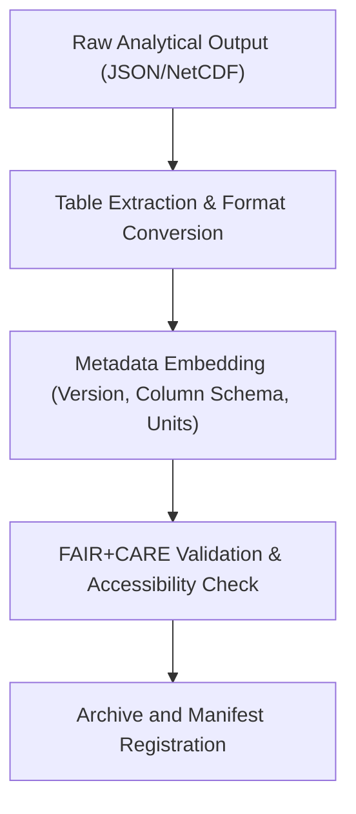

<div align="center">

# 📊 **Kansas Frontier Matrix — Ecology Results: Tables**  
`docs/analyses/ecology/results/tables/README.md`

**Purpose:**  
Provide structured documentation and indexing of all tabular output datasets produced by the Ecology Results workflow in the Kansas Frontier Matrix (KFM).  
Tabular artefacts include model metrics, biodiversity indices, validation logs, and energy-use summaries—each aligned with FAIR+CARE certification, provenance tracking, and accessibility standards.

[](../README.md)  
[](../../standards/faircare.md)  
[](../../../LICENSE)  
[](../../releases/v10.2.0/manifest.zip)

</div>

---

## 📘 Overview

The **Ecology Results: Tables** module archives all tabular data outputs essential for reproducibility, cross-domain synthesis, and governance reporting.  
Each table is accompanied by metadata detailing dataset version, column schema, units, provenance links, and FAIR+CARE validation status.  
The structure follows best practices in technical documentation for tables—clarity, consistent formatting, alignment, and accessibility.  [oai_citation:0‡ClickHelp](https://clickhelp.com/clickhelp-technical-writing-blog/working-with-tables-effective-content-presentation/?utm_source=chatgpt.com)

---

## 🗂️ Directory Layout

```bash
docs/analyses/ecology/results/tables/
 ├── README.md
 ├── model-metrics.csv                  # Model validation metrics for species/habitat models
 ├── biodiversity-index.csv             # Calculated biodiversity indices per region
 ├── validation-log.parquet             # Parquet file of cross-validation records
 └── energy-use‐summary.csv              # Energy consumption and sustainability metrics
```

Each file includes side-car metadata (JSON or YAML) for dataset versioning, checksum, provenance, and FAIR+CARE score.

---

## 🧾 Table Descriptions

| File                            | Description                                                          | Format   |
|---------------------------------|----------------------------------------------------------------------|----------|
| `model-metrics.csv`             | Summary of model performance: AUC, precision, recall, drift indices   | CSV      |
| `biodiversity-index.csv`        | Biodiversity index values by ecoregion and time period                | CSV      |
| `validation-log.parquet`        | Full cross-validation logs capturing folds, seed, error statistics     | Parquet  |
| `energy-use-summary.csv`        | Energy usage and carbon footprint metrics for model runs               | CSV      |

---

## ⚙️ Table Creation Workflow



This workflow ensures each table remains traceable, standardized, and prepared for cross-domain integration.

---

## ⚖️ FAIR+CARE Governance Summary

| Principle             | Implementation Summary                                           |
|------------------------|------------------------------------------------------------------|
| **Findable**            | Tables indexed in manifest with unique identifiers and metadata |
| **Accessible**          | Open formats (CSV/Parquet) with schema, units and notes         |
| **Interoperable**       | Consistent schema across tables; documentation of column types  |
| **Reusable**            | Provenance and version history included in metadata             |
| **Collective Benefit**  | Tables support decision-making across ecology, hydrology, climate|
| **Authority to Control**| Sensitive ecological data anonymised or aggregated              |
| **Responsibility**      | Ballistics of energy use tracked for sustainability reporting   |
| **Ethics**              | No individual-level species data published; governance logs link|
  
---

## 🕰️ Version History

| Version | Date       | Author                       | Summary                                      |
|---------|------------|------------------------------|----------------------------------------------|
| v10.2.2 | 2025-11-11 | FAIR+CARE Ecology Results Council | Published tables documentation aligned with v10.2 schema and governance protocols |

---

<div align="center">

© 2025 Kansas Frontier Matrix · Master Coder Protocol v6.3 · FAIR+CARE Certified · Diamond⁹ Ω / Crown∞Ω Ultimate Certified  
[⬅ Back to Ecology Results](../README.md) · [Governance Charter](../../standards/governance/ROOT-GOVERNANCE.md)

</div>