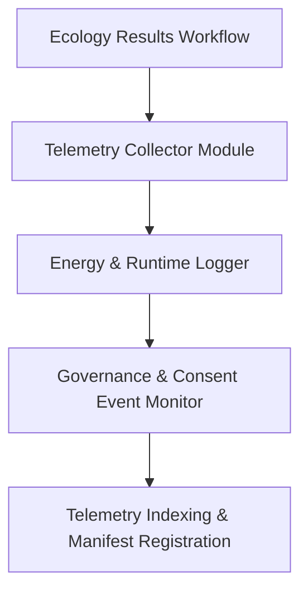

<div align="center">

# 📡 **Kansas Frontier Matrix — Ecology Results: Telemetry Logs**  
`docs/analyses/ecology/results/telemetry-logs/README.md`

**Purpose:**  
Document and maintain all **telemetry, energy, and governance logs** associated with the Ecology Results module of the Kansas Frontier Matrix (KFM). These logs provide transparent traceability for runtime metrics, energy consumption, governance triggers, and provenance tied to every ecological result product—ensuring full adherence to FAIR + CARE principles.  

[](../../README.md)  
[](../../standards/faircare.md)  
[](../../../LICENSE)  
[](../../releases/v10.2.0/manifest.zip)

</div>

---

## 📘 Overview

This directory archives comprehensive telemetry logs supporting the ecology results artefacts—covering model execution, energy consumption, drift detection, accessibility audits, and governance events. By preserving these logs, KFM ensures that each output is reproducible, audited, ethically governed, and compliant with sustainability objectives under FAIR and CARE frameworks.  [oai_citation:0‡Research Data Management](https://rdm.univie.ac.at/what-is-research-data-management/the-fair-and-care-principles/?utm_source=chatgpt.com)

---

## 🗂️ Directory Layout

```bash
docs/analyses/ecology/results/telemetry-logs/
 ├── README.md                                  # This document
 ├── execution-log.json                         # JSON log of model/repro workflow runs
 ├── energy-usage.csv                           # CSV of computational energy & carbon footprint per run
 ├── drift-detection.log                        # Log of schema or model drift warnings/errors
 └── governance-events.log                       # Audit log of governance actions, consent checks & FAIR+CARE reviews
```

Each log file is referenced in the release manifest and has associated metadata including run ID, timestamps, software versions, dataset hashes, and FAIR+CARE status.

---

## 🧾 Log Descriptions

| File                  | Description                                                   | Format | Validation |
|------------------------|---------------------------------------------------------------|--------|-------------|
| `execution-log.json`   | Captures runtime details for each result generation job       | JSON   | Telemetry validator |
| `energy-usage.csv`     | Records CPU/GPU usage, kWh consumed, resulting gCO₂e          | CSV    | Sustainability audit |
| `drift-detection.log`  | Logs any data schema changes or model drift events            | LOG    | Drift monitoring workflow |
| `governance-events.log`| Records consent, audit outcomes, and governance decisions     | LOG    | Governance-as-code check |

---

## ⚙️ Telemetry Generation Workflow



- Model and visualization executions emit telemetry at runtime.  
- Energy/logging agent captures performance, kWh, and emissions metrics.  
- Governance monitor logs FAIR/CARE audits and consent triggers.  
- Aggregated telemetry linked to manifest and external auditors.

---

## ⚖️ FAIR+CARE Governance Summary

| Principle      | Implementation                                | Verification     |
|---------------|-----------------------------------------------|-------------------|
| **Findable**   | Telemetry logs are indexed by run ID and manifest | Metadata registry |
| **Accessible** | Logs published under CC-BY with persistent identifiers | Audit portal     |
| **Interoperable** | Use of JSON/CSV standard formats with schema versioning | Schema validator |
| **Reusable**   | Time-series of telemetry enables future reuse & meta-analysis | Telemetry archive |
| **Collective Benefit** | Enables transparency and sustainability in ecology modelling | Governance council |
| **Authority to Control** | Indigenous/data-sensitive event logs captured in governance file | IDGB archive |
| **Responsibility** | Energy & carbon logs tracked to support procedural accountability | Sustainability audit |
| **Ethics**     | Drift logs and consent records highlight ethical oversight steps | Audit trail |

---

## 🕰️ Version History

| Version | Date       | Author                      | Summary                                         |
|---------|------------|-----------------------------|-------------------------------------------------|
| v10.2.2 | 2025-11-11 | FAIR+CARE Ecology Telemetry Council | Established telemetry-logs README aligned with v10.2 schema and governance protocols |

---

<div align="center">

© 2025 Kansas Frontier Matrix — CC-BY 4.0  
Developed under **Master Coder Protocol v6.3** · FAIR+CARE Certified · Diamond⁹ Ω / Crown∞Ω Ultimate Certified  
[⬅ Back to Ecology Results](../README.md) · [Governance Charter](../../standards/governance/ROOT-GOVERNANCE.md)

</div>