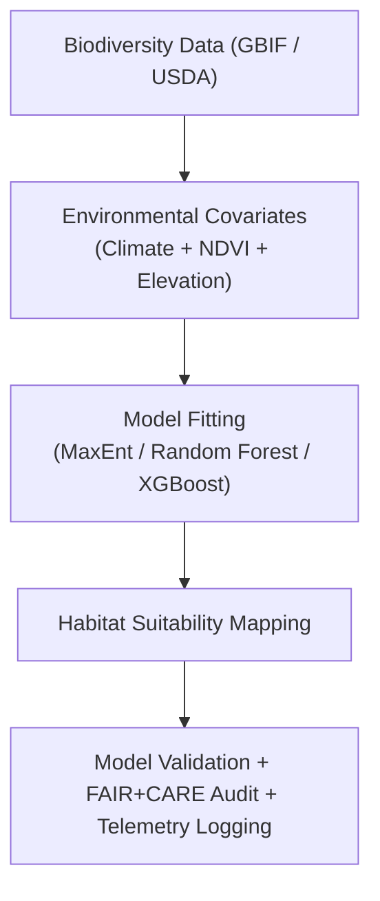

<div align="center">

# 🌿 **Kansas Frontier Matrix — Species Distribution Modeling (SDM) Methods**
`docs/analyses/ecology/species-distribution-modeling.md`

**Purpose:**  
Describe the **Species Distribution Modeling (SDM)** framework implemented in the Kansas Frontier Matrix (KFM), integrating biodiversity and environmental datasets under **FAIR+CARE**, **ISO 19115**, **KFM‑MDP v11.2.4**, and **MCP-DL v6.3** standards.  
This document ensures ethical, transparent, and reproducible modeling of species–habitat relationships across Kansas.

[](../../../README.md)  
[](../../../LICENSE)  
[](../../standards/README.md)  
[](../../../releases/v11.2.4/manifest.zip)

</div>

---

## 📘 Overview

The **Species Distribution Modeling Module** predicts habitat suitability and ecological niche distributions for key species in Kansas.  
Using FAIR+CARE‑validated biodiversity, climate, and landcover data, this workflow combines statistical and machine learning models to assess **species richness**, **conservation gaps**, and **ecological resilience** under present and future climate scenarios.

---

## 🗂️ Directory Context

```plaintext
docs/analyses/ecology/
├── 📄 README.md                               # Ecology overview
├── 📄 species-distribution-modeling.md        # This document
├── 📄 landcover-analysis.md                   # Vegetation change and landcover trends
├── 📄 ecosystem-services.md                   # Ecosystem service modeling
├── 📄 governance.md                           # Ecology governance & FAIR+CARE rules
└── 📁 reports/                                # Ecological summaries and visual outputs
```

---

## 🧩 Analytical Framework



---

## ⚙️ Input Datasets

| Source              | Dataset                     | Variables                    | Resolution | FAIR+CARE Status |
|---------------------|----------------------------|------------------------------|-----------:|------------------|
| **GBIF**           | Species occurrence records  | Presence‑only coordinates    | Point      | ✅ Certified      |
| **USDA / NRCS**    | Plant and habitat site data | Vegetation, soil, elevation  | 1 km grid  | ✅ Certified      |
| **NASA MODIS / ESA CCI** | Vegetation & landcover | NDVI, EVI, landcover class   | 250 m–1 km | ✅ Certified      |
| **NOAA / PRISM**   | Climate variables           | Temp, precip, humidity       | 4 km       | ✅ Certified      |

All datasets are harmonized to **EPSG:4326** and aggregated to a **1 km grid** for statewide coverage.

---

## 🧠 Methodological Steps

### 1️⃣ Data Preparation

- Combine GBIF occurrence data with environmental rasters (climate + NDVI + elevation).  
- Balance data using spatial thinning and pseudo‑absence generation (or background points for MaxEnt).  

```python
from sklearn.model_selection import train_test_split

# presence_df and pseudo_absence_df precomputed by spatial thinning pipeline
data = (
    presence_df.assign(label=1)
    .pipe(lambda df: df.append(pseudo_absence_df.assign(label=0), ignore_index=True))
)

X = data[env_feature_cols].values
y = data["label"].values
X_train, X_test, y_train, y_test = train_test_split(
    X, y, test_size=0.3, random_state=42, stratify=y
)
```

All preparation steps must:

- Log filters applied (date ranges, species subsets, spatial bounds).  
- Record hashes for raw and processed datasets in PROV‑O provenance.

---

### 2️⃣ Model Fitting

Run ensemble SDMs using multiple algorithms:

| Model          | Description                                  | Library / Tool           |
|----------------|----------------------------------------------|--------------------------|
| **MaxEnt**     | Maximum entropy model for presence‑only data | `maxent.jar`, `dismo`    |
| **Random Forest (RF)** | Ensemble tree‑based classification   | `scikit-learn`           |
| **XGBoost**    | Gradient boosting for large‑scale SDM        | `xgboost`, `numpy`       |

Example (Random Forest):

```python
from sklearn.ensemble import RandomForestClassifier

rf = RandomForestClassifier(
    n_estimators=200,
    max_depth=None,
    n_jobs=-1,
    random_state=42  # deterministic seed (KFM standard)
)
rf.fit(X_train, y_train)
predicted = rf.predict_proba(X_test)[:, 1]
```

Outputs:

- `habitat_suitability_model.nc`  
- `species_probability_map.tif`  
- Model card + parameter log in `reports/sdm_model_card.json`

---

### 3️⃣ Model Validation

Evaluate model performance with cross‑validation:

```python
from sklearn.metrics import roc_auc_score

auc = roc_auc_score(y_test, predicted)
```

| Metric | Target | Description                         |
|--------|--------|-------------------------------------|
| **AUC (Area Under Curve)** | ≥ 0.80 | Model discrimination accuracy |
| **TSS (True Skill Statistic)** | ≥ 0.60 | Sensitivity–specificity balance |
| **RMSE (Root Mean Square Error)** | ≤ 10% | Prediction deviation |

Validation results are saved in `faircare_validation.json` and linked into telemetry via `telemetry_ref`.

---

### 4️⃣ Projection & Mapping

Project the model to future climate scenarios using CMIP6 SSP data:

```python
import xarray as xr

future_data = xr.open_dataset("cmip6_ssp245_climate_1km.nc")
X_future = future_data[env_feature_cols].to_array().transpose("y", "x", "variable").values
future_pred = rf.predict_proba(X_future.reshape(-1, X_future.shape[-1]))[:, 1]
```

Outputs:

- `habitat_suitability_future.tif`  
- `species_range_shift.geojson` (thresholded, post‑processed, masked)  

All future projections must:

- Record scenario (SSP, GCM ensemble), time horizon, and run configuration.  
- Apply FAIR+CARE rules for sensitive species (mask or generalize locations).

---

## 🧮 FAIR+CARE Validation Record Example

```json
{
  "validation_id": "sdm-analysis-2025-11-09-0176",
  "datasets": [
    "GBIF Occurrences",
    "MODIS NDVI",
    "NOAA Climate Covariates",
    "USDA PLANTS"
  ],
  "models": ["MaxEnt", "Random Forest", "XGBoost"],
  "metrics": {
    "auc_mean": 0.89,
    "tss_mean": 0.71,
    "rmse": 0.09
  },
  "energy_joules": 13.9,
  "carbon_gCO2e": 0.0054,
  "validation_status": "Pass",
  "auditor": "FAIR+CARE Council",
  "timestamp": "2025-11-09T17:38:00Z"
}
```

---

## ⚖️ FAIR+CARE & ISO Governance Matrix

| Principle         | Implementation                                   | Verification Source     |
|-------------------|--------------------------------------------------|-------------------------|
| **Findable**      | STAC/DCAT metadata with persistent UUIDs         | `datasets/metadata/`    |
| **Accessible**    | FAIR+CARE open data access with DOI links        | FAIR+CARE Ledger        |
| **Interoperable** | CSV, GeoTIFF, NetCDF outputs                     | `telemetry_schema`      |
| **Reusable**      | Model provenance and code reproducibility tracked| `manifest_ref`          |
| **Responsibility**| ISO 50001/14064 telemetry per model run          | `telemetry_ref`         |
| **Ethics**        | Sensitive species coordinates masked ≥ 5 km      | FAIR+CARE Ethics Audit  |

---

## 🧾 Governance Ledger Record Example

```json
{
  "ledger_id": "sdm-ledger-2025-11-09-0177",
  "component": "Species Distribution Modeling Module",
  "datasets": [
    "GBIF Biodiversity Records",
    "MODIS NDVI",
    "NOAA Climate Covariates"
  ],
  "energy_joules": 13.9,
  "carbon_gCO2e": 0.0054,
  "faircare_status": "Pass",
  "auditor": "FAIR+CARE Council",
  "timestamp": "2025-11-09T17:40:00Z"
}
```

---

## 🧠 Sustainability Metrics

| Metric                  | Description                          | Value | Target | Unit   |
|-------------------------|--------------------------------------|------:|-------:|--------|
| **Energy (J)**          | Average energy used per SDM run      | 13.9  | ≤ 15   | Joules |
| **Carbon (gCO₂e)**      | CO₂ equivalent per analysis          | 0.0054| ≤ 0.006| gCO₂e  |
| **Telemetry Coverage**  | FAIR+CARE trace completion           | 100   | ≥ 95   | %      |
| **Validation Pass Rate**| FAIR+CARE audit compliance           | 100   | 100    | %      |

---

## 🕰️ Version History

| Version | Date       | Author              | Summary                                                                                  |
|--------:|-----------:|---------------------|------------------------------------------------------------------------------------------|
| v11.2.4 | 2025-12-06 | FAIR+CARE Council   | Aligned SDM methods with KFM‑MDP v11.2.4; added metadata, governance, and telemetry refs.|
| v10.2.2 | 2025-11-09 | FAIR+CARE Council   | Published SDM framework with FAIR+CARE validation and ISO telemetry.                     |
| v10.2.1 | 2025-11-09 | Ecological Modeling Team | Added ensemble model methods and future projection integration.                     |
| v10.2.0 | 2025-11-09 | KFM Ecology Group   | Created baseline SDM documentation aligned with hydrology and climatology workflows.     |

---

<div align="center">

© 2025 Kansas Frontier Matrix Project  
Master Coder Protocol v6.3 · FAIR+CARE Certified · Diamond⁹ Ω / Crown∞Ω Ultimate Certified  

[Back to Ecology Overview](./README.md) · [Governance Charter](../../standards/governance/ROOT-GOVERNANCE.md)

</div>