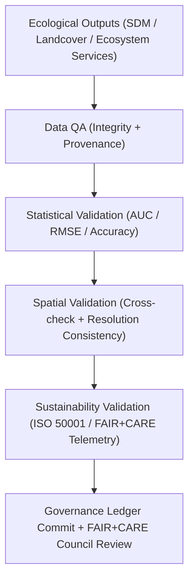

<div align="center">

# 🌿 **Kansas Frontier Matrix — Ecology Validation Framework**
`docs/analyses/ecology/validation.md`

**Purpose:**  
Define the **validation, verification, and sustainability auditing** processes for all ecological analyses in the Kansas Frontier Matrix (KFM).  
This document ensures compliance with **FAIR+CARE**, **ISO 50001 / 14064**, and **MCP-DL v6.3** for data quality, reproducibility, and environmental responsibility.

[](../../../README.md)
[](../../../../LICENSE)
[](../../../../docs/standards/README.md)
[](../../../../releases/)
</div>

---

## 📘 Overview

The **Ecology Validation Framework** establishes rigorous FAIR+CARE and ISO-aligned validation criteria for all ecological modules — including **species distribution**, **landcover analysis**, and **ecosystem service modeling**.  
It guarantees scientific reproducibility, ethical data governance, and sustainable computation across ecological modeling workflows.

Validation operates across **five core domains**:
1. **Data Integrity Validation** — Ensuring dataset completeness, metadata accuracy, and checksum verification  
2. **Statistical Validation** — Evaluating model accuracy, reliability, and performance metrics  
3. **Spatial Validation** — Assessing geographic accuracy and spatial consistency  
4. **Sustainability Validation** — Auditing energy and carbon telemetry metrics (ISO 50001 / 14064)  
5. **Ethical Validation** — Verifying FAIR+CARE compliance and sensitive data anonymization  

---

## 🗂️ Directory Layout

```plaintext
docs/analyses/ecology/
├── README.md
├── species-distribution-modeling.md
├── landcover-analysis.md
├── ecosystem-services.md
├── validation.md                              # This document
└── reports/
```

---

## 🧩 Validation Framework



---

## ⚙️ Validation Metrics

| Metric | Description | Target | Unit |
|---------|-------------|--------|------|
| **AUC (Area Under Curve)** | Model discrimination power (species / habitat) | ≥ 0.8 | — |
| **TSS (True Skill Statistic)** | Sensitivity-specificity balance | ≥ 0.6 | — |
| **RMSE (Error)** | Root mean square error of predictions | ≤ 10% | — |
| **Accuracy (Classification)** | Correct landcover class prediction rate | ≥ 90% | % |
| **Carbon (gCO₂e)** | Carbon footprint per analysis workflow | ≤ 0.006 | gCO₂e |
| **Energy (J)** | Energy used per model run | ≤ 15 | Joules |

All validation metrics are logged in `reports/faircare_validation.json` and synchronized to the Governance Ledger for traceability.

---

## 🧠 Validation Domains

### 1️⃣ Data Integrity Validation
- Validate STAC/DCAT metadata completeness and checksum accuracy.  
- Confirm data provenance and spatial reference consistency across all inputs.

### 2️⃣ Statistical Validation
- Compute AUC, RMSE, TSS, and accuracy metrics for each model type.  
- Use cross-validation and independent test sets to verify model reliability.

### 3️⃣ Spatial Validation
- Ensure all rasters align to a unified CRS and resolution grid (1 km).  
- Apply Moran’s I and Getis–Ord Gi* for hotspot/spatial correlation checks.

### 4️⃣ Sustainability Validation
- Audit ISO telemetry logs for energy (J) and carbon (gCO₂e) per workflow.  
- Verify FAIR+CARE trace coverage exceeds 95%.

### 5️⃣ Ethical Validation
- Confirm all sensitive species and habitat data generalized ≥5 km.  
- Ensure FAIR+CARE ethics audit results are documented and approved.

---

## 🧮 FAIR+CARE Validation Record Example

```json
{
  "validation_id": "ecology-validation-2025-11-09-0178",
  "modules_validated": [
    "Species Distribution Modeling",
    "Landcover Analysis",
    "Ecosystem Services"
  ],
  "metrics": {
    "auc_mean": 0.87,
    "tss_mean": 0.69,
    "rmse_mean": 0.09,
    "energy_joules": 14.2,
    "carbon_gCO2e": 0.0056
  },
  "validation_status": "Pass",
  "auditor": "FAIR+CARE Council",
  "timestamp": "2025-11-09T17:43:00Z"
}
```

---

## ⚖️ FAIR+CARE & ISO Governance Matrix

| Principle | Implementation | Validation Source |
|------------|----------------|--------------------|
| **Findable** | Validation outputs indexed under FAIR+CARE UUIDs | `reports/faircare_validation.json` |
| **Accessible** | Validation data shared publicly under CC-BY | FAIR+CARE Ledger |
| **Interoperable** | JSON-LD and CSV validation outputs | `telemetry_schema` |
| **Reusable** | Validation metrics stored with provenance metadata | `manifest_ref` |
| **Responsibility** | Telemetry logged under ISO 50001/14064 | `telemetry_ref` |
| **Ethics** | FAIR+CARE audit confirms ethical handling of biodiversity data | Governance Charter |

---

## 🧾 Governance Ledger Record Example

```json
{
  "ledger_id": "ecology-validation-ledger-2025-11-09-0179",
  "component": "Ecology Validation Framework",
  "modules": [
    "Species Distribution Modeling",
    "Landcover Analysis",
    "Ecosystem Services"
  ],
  "energy_joules": 14.2,
  "carbon_gCO2e": 0.0056,
  "faircare_status": "Pass",
  "auditor": "FAIR+CARE Council",
  "timestamp": "2025-11-09T17:45:00Z"
}
```

---

## 🧠 Sustainability Metrics Summary

| Metric | Description | Value | Target | Unit |
|---------|-------------|--------|---------|------|
| **Energy (J)** | Energy consumption per validation workflow | 14.2 | ≤ 15 | Joules |
| **Carbon (gCO₂e)** | CO₂ equivalent emissions | 0.0056 | ≤ 0.006 | gCO₂e |
| **Telemetry Coverage (%)** | FAIR+CARE trace completion | 100 | ≥ 95 | % |
| **Audit Pass Rate (%)** | FAIR+CARE validation compliance | 100 | 100 | % |

---

## 🕰️ Version History

| Version | Date | Author | Summary |
|----------|------|--------|----------|
| v10.2.2 | 2025-11-09 | FAIR+CARE Council | Published ecology validation framework with FAIR+CARE and ISO sustainability tracking. |
| v10.2.1 | 2025-11-09 | Ecological Validation Team | Added statistical and spatial validation metrics with ethics audit guidance. |
| v10.2.0 | 2025-11-09 | KFM Ecology Team | Created baseline ecological validation framework aligned with climatology standards. |

---

<div align="center">

© 2025 Kansas Frontier Matrix Project  
Master Coder Protocol v6.3 · FAIR+CARE Certified · Diamond⁹ Ω / Crown∞Ω Ultimate Certified  

[Back to Ecology Overview](./README.md) · [Governance Charter](../../../../docs/standards/governance/ROOT-GOVERNANCE.md)

</div>

