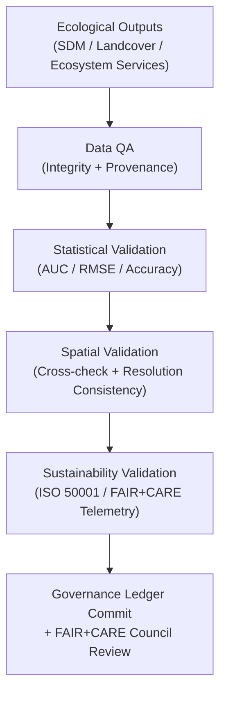

<div align="center">

# 🌿 **Kansas Frontier Matrix — Ecology Validation Framework**  
`docs/analyses/ecology/validation.md`

**Purpose:**  
Define the **validation, verification, and sustainability auditing** processes for all ecological analyses in the Kansas Frontier Matrix (KFM).  
This document ensures compliance with **FAIR+CARE**, **ISO 50001 / 14064**, **KFM‑MDP v11.2.4**, and **MCP-DL v6.3** for data quality, reproducibility, and environmental responsibility.

[](../../../README.md)  
[](../../../LICENSE)  
[](../../standards/README.md)  
[](../../../releases/v11.2.4/manifest.zip)

</div>

---

## 📘 Overview

The **Ecology Validation Framework** establishes rigorous FAIR+CARE‑ and ISO‑aligned validation criteria for all ecological modules — including **species distribution**, **landcover analysis**, and **ecosystem service modeling**.  
It guarantees scientific reproducibility, ethical data governance, and sustainable computation across ecological modeling workflows.

Validation operates across **five core domains**:

1. **Data Integrity Validation** — dataset completeness, metadata accuracy, checksum verification  
2. **Statistical Validation** — model accuracy, reliability, and performance metrics  
3. **Spatial Validation** — geographic accuracy and spatial consistency  
4. **Sustainability Validation** — energy and carbon telemetry (ISO 50001 / 14064)  
5. **Ethical Validation** — FAIR+CARE compliance and sensitive data anonymization  

---

## 🗂️ Directory Layout

```plaintext
docs/analyses/ecology/
├── 📄 README.md
├── 📄 species-distribution-modeling.md
├── 📄 landcover-analysis.md
├── 📄 ecosystem-services.md
├── 📄 governance.md
├── 📄 validation.md                          # This document
└── 📁 reports/
```

---

## 🧩 Validation Framework



---

## ⚙️ Validation Metrics

| Metric                    | Description                                       | Target | Unit   |
|---------------------------|---------------------------------------------------|--------|--------|
| **AUC (Area Under Curve)**| Model discrimination power (species / habitat)    | ≥ 0.80 | —      |
| **TSS (True Skill Statistic)** | Sensitivity–specificity balance              | ≥ 0.60 | —      |
| **RMSE (Error)**          | Root mean square error of predictions            | ≤ 10%  | —      |
| **Accuracy (Classification)** | Correct landcover class prediction rate      | ≥ 90%  | %      |
| **Carbon (gCO₂e)**        | Carbon footprint per analysis workflow           | ≤ 0.006| gCO₂e  |
| **Energy (J)**            | Energy used per model run                        | ≤ 15   | Joules |

All validation metrics are logged in `reports/faircare_validation.json` (per‑module) and synchronized to the Governance Ledger for traceability.

---

## 🧠 Validation Domains

### 1️⃣ Data Integrity Validation

- Validate STAC/DCAT metadata completeness and checksum accuracy.  
- Confirm data provenance, temporal coverage, and spatial reference consistency.  
- Ensure all inputs are **license‑compatible** and recorded in `sbom_ref` / `manifest_ref`.  

---

### 2️⃣ Statistical Validation

- Compute AUC, RMSE, TSS, and accuracy metrics for each model type.  
- Use k‑fold cross‑validation and independent test sets to verify reliability.  
- Store per‑run metrics as structured JSON, keyed by `analysis_id` and `run_id`.  

---

### 3️⃣ Spatial Validation

- Ensure all rasters align to a unified CRS (**EPSG:4326**) and reference grid (1 km).  
- Apply Moran’s I and (optionally) Getis–Ord Gi* for hotspot/spatial correlation checks.  
- Verify alignment between gridded products (NDVI, landcover) and vector layers (boundaries, basins).  

---

### 4️⃣ Sustainability Validation

- Audit ISO telemetry logs for energy (J) and carbon (gCO₂e) per workflow.  
- Verify FAIR+CARE trace coverage exceeds **95%** of steps (including data prep, modeling, and export).  
- Confirm that energy and carbon metrics are within thresholds defined in ecology standards.  

---

### 5️⃣ Ethical Validation

- Confirm all sensitive species and habitat data are generalized ≥ 5 km (or masked entirely) according to species risk class.  
- Ensure FAIR+CARE ethics audit results are documented and signed off by the **Ecology Governance Lead** and **IDGB** when relevant.  
- Review narrative and visualization outputs (maps, dashboards) for cultural and ecological sensitivity.  

---

## 🧮 FAIR+CARE Validation Record Example

```json
{
  "validation_id": "ecology-validation-2025-11-09-0178",
  "modules_validated": [
    "Species Distribution Modeling",
    "Landcover Analysis",
    "Ecosystem Services"
  ],
  "metrics": {
    "auc_mean": 0.87,
    "tss_mean": 0.69,
    "rmse_mean": 0.09,
    "accuracy_mean": 0.92,
    "energy_joules": 14.2,
    "carbon_gCO2e": 0.0056
  },
  "validation_status": "Pass",
  "auditor": "FAIR+CARE Council",
  "timestamp": "2025-11-09T17:43:00Z"
}
```

---

## ⚖️ FAIR+CARE & ISO Governance Matrix

| Principle     | Implementation                                             | Validation Source                             |
|---------------|------------------------------------------------------------|-----------------------------------------------|
| **Findable**  | Validation outputs indexed under FAIR+CARE UUIDs          | `reports/faircare_validation.json`            |
| **Accessible**| Validation data shared publicly under CC‑BY where allowed | FAIR+CARE Ledger                              |
| **Interoperable** | JSON‑LD and CSV validation outputs                    | `telemetry_schema`                            |
| **Reusable**  | Validation metrics stored with full provenance metadata    | `manifest_ref`                                |
| **Responsibility** | Telemetry logged under ISO 50001/14064               | `telemetry_ref`                               |
| **Ethics**    | FAIR+CARE audit confirms ethical handling of biodiversity data | Governance Charter / `governance_ref`    |

---

## 🧾 Governance Ledger Record Example

```json
{
  "ledger_id": "ecology-validation-ledger-2025-11-09-0179",
  "component": "Ecology Validation Framework",
  "modules": [
    "Species Distribution Modeling",
    "Landcover Analysis",
    "Ecosystem Services"
  ],
  "energy_joules": 14.2,
  "carbon_gCO2e": 0.0056,
  "faircare_status": "Pass",
  "auditor": "FAIR+CARE Council",
  "timestamp": "2025-11-09T17:45:00Z"
}
```

---

## 🧠 Sustainability Metrics Summary

| Metric                  | Description                              | Value | Target | Unit   |
|-------------------------|------------------------------------------|------:|-------:|--------|
| **Energy (J)**          | Energy consumption per validation workflow | 14.2 | ≤ 15   | Joules |
| **Carbon (gCO₂e)**      | CO₂ equivalent emissions                 | 0.0056| ≤ 0.006| gCO₂e  |
| **Telemetry Coverage**  | FAIR+CARE trace completion               | 100   | ≥ 95   | %      |
| **Audit Pass Rate**     | FAIR+CARE validation compliance          | 100   | 100    | %      |

---

## 🕰️ Version History

| Version | Date       | Author              | Summary                                                                            |
|--------:|-----------:|---------------------|------------------------------------------------------------------------------------|
| v11.2.4 | 2025-12-06 | FAIR+CARE Council   | Aligned ecology validation with KFM‑MDP v11.2.4; added extended metadata and scope. |
| v10.2.2 | 2025-11-09 | FAIR+CARE Council   | Published ecology validation framework with FAIR+CARE and ISO sustainability tracking. |
| v10.2.1 | 2025-11-09 | Ecological Validation Team | Added statistical and spatial validation metrics with ethics audit guidance.  |
| v10.2.0 | 2025-11-09 | KFM Ecology Team    | Created baseline ecological validation framework aligned with climatology standards.  |

---

<div align="center">

© 2025 Kansas Frontier Matrix Project  
Master Coder Protocol v6.3 · FAIR+CARE Certified · Diamond⁹ Ω / Crown∞Ω Ultimate Certified  

[Back to Ecology Overview](./README.md) · [Governance Charter](../../standards/governance/ROOT-GOVERNANCE.md)

</div>