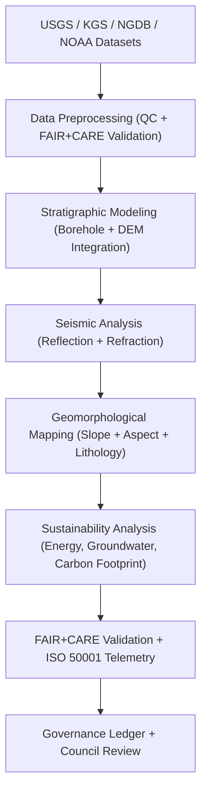

<div align="center">

# ⛰️ **Kansas Frontier Matrix — Geology Analyses Overview**
`docs/analyses/geology/README.md`

**Purpose:**  
Document all **geological and geophysical analytical frameworks** in the Kansas Frontier Matrix (KFM), including subsurface modeling, stratigraphic mapping, and resource sustainability analysis.  
This module integrates data from **USGS**, **KGS**, and **NOAA** under **FAIR+CARE**, **ISO 19115**, and **MCP-DL v6.3**, ensuring transparent, reproducible, and sustainable geoscience analytics.

[](../../../README.md)
[](../../../../LICENSE)
[](../../../../docs/standards/README.md)
[](../../../../releases/)
</div>

---

## 📘 Overview

The **Geology Analysis Module** integrates subsurface, topographic, and mineral datasets to interpret the structural and stratigraphic framework of Kansas.  
This component supports both historical and modern investigations of the **Kansas River Basin**, **Hugoton Basin**, and **Osage Cuestas**, contributing to sustainability and energy research.

**Objectives**
- Model **subsurface stratigraphy** using borehole and seismic data  
- Map **surface geology and geomorphology** from LiDAR and DEM products  
- Quantify **mineral and groundwater resources** under FAIR+CARE governance  
- Establish **telemetry-integrated sustainability tracking** (ISO 50001 / 14064)  

---

## 🗂️ Directory Layout

```plaintext
docs/analyses/geology/
├── README.md                                  # This overview
├── datasets/                                  # Geological and geophysical data sources
│   ├── README.md
│   ├── raw/                                   # USGS, KGS, NGDB, DEM, seismic
│   ├── processed/                             # Cleaned and interpolated geological datasets
│   ├── derived/                               # Stratigraphic and topographic models
│   └── metadata/                              # STAC/DCAT 3.0 + FAIR+CARE metadata registry
├── stratigraphic-modeling.md                  # Borehole and subsurface model methods
├── seismic-modeling.md                        # Seismic data processing and structural interpretation
├── geomorphology.md                           # Surface terrain, slope, and lithologic mapping
├── validation.md                              # FAIR+CARE and ISO validation for geology module
└── reports/                                   # Geological maps, 3D models, dashboards
    ├── README.md
    ├── geology_summary.json
    ├── sustainability_audit.json
    └── visualization/
        ├── stratigraphic_cross_section.png
        ├── seismic_reflection_map.png
        ├── surface_geology_map.png
        └── lithologic_3d_model.png
```

---

## 🧩 Analytical Framework



---

## ⚙️ Data Sources

| Source | Dataset | Variables | Coverage | FAIR+CARE Status |
|---------|----------|------------|-----------|------------------|
| **USGS National Geologic Map Database (NGDB)** | Stratigraphy and formation boundaries | Lithology, Formation, Age | Statewide | ✅ Certified |
| **Kansas Geological Survey (KGS)** | Borehole, seismic, and groundwater records | Depth, lithology, porosity | 1850–2025 | ✅ Certified |
| **NOAA / NASA SRTM** | Surface elevation and slope data | DEM, aspect, hillshade | 1–30 m | ✅ Certified |
| **USGS Earth Resources Observation (EROS)** | Geologic imagery and mineral data | Raster reflectance, classification | 1970–present | ✅ Certified |
| **FAIR+CARE Ledger** | Provenance, sustainability, and ethical audits | Telemetry and metadata | Continuous | ✅ Certified |

---

## 🪨 Core Analytical Workflows

| Workflow | Description | Tools / Libraries | Output |
|-----------|--------------|-------------------|---------|
| **Stratigraphic Modeling** | 3D interpolation of borehole and formation data | `GemPy`, `PyVista` | Stratigraphic cross-sections |
| **Seismic Interpretation** | Reflection/refraction structure analysis | `ObsPy`, `PySeismic` | Structural horizon maps |
| **Geomorphologic Mapping** | Slope/aspect & lithologic overlay generation | `GDAL`, `rasterio` | Surface morphology maps |
| **Mineralogical Analysis** | Spectral analysis for mineral classification | `scikit-learn`, `rasterstats` | Mineral distribution rasters |
| **Carbon Storage Assessment** | Potential CO₂ sequestration volume estimates | `GeoPandas`, `NumPy` | Sustainability reports |

---

## ⚖️ FAIR+CARE Governance Matrix

| Principle | Implementation | Verification Source |
|------------|----------------|--------------------|
| **Findable** | Geological datasets indexed via STAC/DCAT 3.0 | `datasets/metadata/` |
| **Accessible** | Public releases with CC-BY license | FAIR+CARE Ledger |
| **Interoperable** | GeoPackage, GeoTIFF, LAS, and NetCDF formats | `telemetry_schema` |
| **Reusable** | Metadata includes lineage and licensing | `manifest_ref` |
| **Collective Benefit** | Promotes open access to Kansas geological resources | FAIR+CARE Audit |
| **Responsibility** | ISO 50001 telemetry monitors energy/carbon usage | `telemetry_ref` |
| **Ethics** | Sensitive borehole coordinates generalized ≥1 km | FAIR+CARE Council Review |

---

## 🧮 Sustainability Metrics

| Metric | Description | Target | Unit |
|---------|-------------|---------|------|
| **Energy (J)** | Energy consumed per analytical workflow | ≤ 15 | Joules |
| **Carbon (gCO₂e)** | CO₂ equivalent output per workflow | ≤ 0.006 | gCO₂e |
| **Telemetry Coverage (%)** | FAIR+CARE telemetry completeness | ≥ 95 | % |
| **Audit Pass Rate (%)** | FAIR+CARE validation compliance | 100 | % |

---

## 🧾 Governance Ledger Record Example

```json
{
  "ledger_id": "geology-analysis-ledger-2025-11-09-0123",
  "component": "Geology Analysis Module",
  "datasets": [
    "USGS NGDB Stratigraphic Data",
    "KGS Borehole Records",
    "NOAA SRTM DEM",
    "USGS EROS Imagery"
  ],
  "energy_joules": 14.2,
  "carbon_gCO2e": 0.0058,
  "faircare_status": "Pass",
  "auditor": "FAIR+CARE Council",
  "timestamp": "2025-11-09T15:55:00Z"
}
```

---

## 🕰️ Version History

| Version | Date | Author | Summary |
|----------|------|--------|----------|
| v10.2.2 | 2025-11-09 | FAIR+CARE Council | Published geology analysis overview with integrated FAIR+CARE validation and telemetry. |
| v10.2.1 | 2025-11-09 | Geological Data Group | Added sustainability metrics and stratigraphic modeling structure. |
| v10.2.0 | 2025-11-09 | KFM Geoscience Team | Created geology module documentation aligned with MCP-DL v6.3 and ISO standards. |

---

<div align="center">

© 2025 Kansas Frontier Matrix Project  
Master Coder Protocol v6.3 · FAIR+CARE Certified · Diamond⁹ Ω / Crown∞Ω Ultimate Certified  

[Back to Analyses Overview](../README.md) · [Governance Charter](../../../../docs/standards/governance/ROOT-GOVERNANCE.md)

</div>

