<div align="center">

# ⛰️ **Kansas Frontier Matrix — Geology Analyses Overview**  
`docs/analyses/geology/README.md`

**Purpose:**  
Document all **geological and geophysical analytical frameworks** in the Kansas Frontier Matrix (KFM), encompassing subsurface modeling, stratigraphic interpretation, and geomorphological change analysis.  
The Geology module integrates datasets from **USGS**, **KGS**, **NGDB**, and **NOAA**, upholding **FAIR+CARE** governance, **ISO 19115 metadata**, and **MCP-DL v6.3 reproducibility** standards.

[](../../../README.md)
[](../../../../LICENSE)
[](../../../../docs/standards/faircare.md)
[](../../../../releases/v10.2.0/manifest.zip)

</div>

---

## 📘 Overview

The **Geology Analysis Module** provides an integrated geospatial-geophysical framework for Kansas, addressing subsurface structure, surface processes, and sustainability.  
It supports both historic and contemporary geological research on:
- Stratigraphy of the **Kansas River Basin**, **Hugoton Basin**, and **Osage Cuestas**.  
- Geophysical modelling of seismic and lithologic data.  
- Sustainability analysis of energy and groundwater resources.  
- FAIR+CARE-linked telemetry tracking under ISO 50001 / 14064 energy governance.

---

## 🗂️ Directory Layout

```bash
docs/analyses/geology/
 ├── README.md
 ├── datasets/
 │    ├── README.md
 │    ├── raw/
 │    ├── processed/
 │    ├── derived/
 │    └── metadata/
 ├── geomorphology.md
 ├── seismic-modeling.md
 ├── stratigraphic-modeling.md
 ├── validation.md
 ├── methods/
 │    ├── README.md
 │    ├── summary-findings.md
 │    ├── figures/
 │    ├── tables/
 │    └── telemetry-logs/
 ├── results/
 │    ├── README.md
 │    ├── summary-findings.md
 │    ├── figures/
 │    ├── tables/
 │    └── telemetry-logs/
 ├── reports/
 │    ├── README.md
 │    ├── geology_summary.json
 │    ├── sustainability_audit.json
 │    └── visualization/
 │         ├── stratigraphic_cross_section.png
 │         ├── seismic_reflection_map.png
 │         ├── surface_geology_map.png
 │         └── lithologic_3d_model.png
 └── governance.md
```

Each sub-directory follows the FAIR+CARE workflow: `datasets → methods → results → reports`, ensuring full traceability and reproducibility.

---

## 🧩 Analytical Framework

```mermaid
flowchart TD
  A["USGS · KGS · NGDB · NOAA Data"] --> B["Pre-Processing & FAIR+CARE Validation"]
  B --> C["Stratigraphic Modeling (Borehole + DEM)"]
  C --> D["Seismic Analysis (Reflection / Refraction)"]
  D --> E["Geomorphologic Mapping (Slope + Aspect)"]
  E --> F["Sustainability Evaluation (Energy, Carbon, Water)"]
  F --> G["Telemetry Logging + ISO 50001/14064 Audit"]
  G --> H["Governance Review & Certification"]
```



---

## ⚙️ Data Sources

| Source | Dataset | Variables | Coverage | FAIR+CARE Status |
|---------|----------|------------|-----------|------------------|
| **USGS NGDB** | Stratigraphic boundaries & lithology | Formation, lithology, depth | Kansas | ✅ Certified |
| **KGS** | Borehole, seismic & hydrologic records | Porosity, permeability | 1850–2025 | ✅ Certified |
| **NOAA / NASA SRTM** | Elevation & surface slope | DEM, aspect, hillshade | 1–30 m | ✅ Certified |
| **USGS EROS** | Satellite mineral & reflectance data | Raster reflectance | 1970–present | ✅ Certified |
| **FAIR+CARE Ledger** | Provenance / audit metadata | Telemetry + ethics | Continuous | ✅ Certified |

---

## 🪨 Core Analytical Workflows

| Workflow | Description | Tools / Libraries | Output |
|-----------|--------------|-------------------|---------|
| **Stratigraphic Modeling** | 3D interpolation of borehole + formation data | `GemPy`, `PyVista` | Stratigraphic cross-sections |
| **Seismic Interpretation** | Reflection/refraction seismic structure analysis | `ObsPy`, `PySeismic` | Structural horizon maps |
| **Geomorphologic Mapping** | Slope/aspect + lithologic mapping | `GDAL`, `Rasterio` | Terrain & morphology maps |
| **Mineralogical Analysis** | Spectral classification of surface minerals | `scikit-learn`, `rasterstats` | Mineral occurrence maps |
| **Sustainability Analysis** | CO₂ storage / energy metrics | `GeoPandas`, `NumPy` | ISO sustainability report |

---

## ⚖️ FAIR+CARE Governance Matrix

| Principle | Implementation | Verification Source |
|------------|----------------|--------------------|
| **Findable** | Datasets indexed via STAC/DCAT 3.0 metadata | `datasets/metadata/` |
| **Accessible** | CC-BY licensing with public registry | FAIR+CARE Ledger |
| **Interoperable** | GeoPackage, GeoTIFF, LAS, NetCDF formats | `telemetry_schema` |
| **Reusable** | Metadata includes lineage & checksums | `manifest_ref` |
| **Collective Benefit** | Promotes sustainable resource & hazard research | FAIR+CARE Audit |
| **Responsibility** | Telemetry monitors ISO energy + emission metrics | `telemetry_ref` |
| **Ethics** | Sensitive borehole data generalized ≥ 1 km | IDGB Review |

---

## 🧮 Sustainability Metrics

| Metric | Description | Target | Unit |
|---------|-------------|---------|------|
| **Energy (J)** | Energy used per geologic workflow | ≤ 15 | Joules |
| **Carbon (gCO₂e)** | CO₂ equivalent per workflow | ≤ 0.006 | gCO₂e |
| **Telemetry Coverage (%)** | FAIR+CARE telemetry completeness | ≥ 95 | % |
| **Audit Pass Rate (%)** | FAIR+CARE validation compliance | 100 | % |

---

## 🧾 Governance Ledger Example

```json
{
  "ledger_id": "geology-analysis-ledger-2025-11-11-0123",
  "component": "Geology Analysis Module",
  "datasets": [
    "USGS NGDB Stratigraphic Data",
    "KGS Borehole Records",
    "NOAA SRTM DEM",
    "USGS EROS Imagery"
  ],
  "energy_joules": 14.2,
  "carbon_gCO2e": 0.0058,
  "faircare_status": "Pass",
  "auditor": "FAIR+CARE Council",
  "timestamp": "2025-11-11T15:55:00Z"
}
```

---

## 🕰️ Version History

| Version | Date | Author | Summary |
|----------|------|--------|----------|
| v10.2.2 | 2025-11-11 | FAIR+CARE Council | Updated geology overview to align with telemetry schema v3 and ISO sustainability metrics. |
| v10.2.1 | 2025-11-09 | Geological Data Group | Added FAIR+CARE metrics and workflow integration. |
| v10.2.0 | 2025-11-08 | KFM Geoscience Team | Created geology module overview compliant with MCP-DL v6.3. |

---

<div align="center">

© 2025 Kansas Frontier Matrix · Master Coder Protocol v6.3 · FAIR+CARE Certified  
Diamond⁹ Ω / Crown∞Ω Ultimate Certified  

[⬅ Back to Analyses Index](../README.md) · [Governance Charter](../../../../docs/standards/governance/ROOT-GOVERNANCE.md)

</div>
