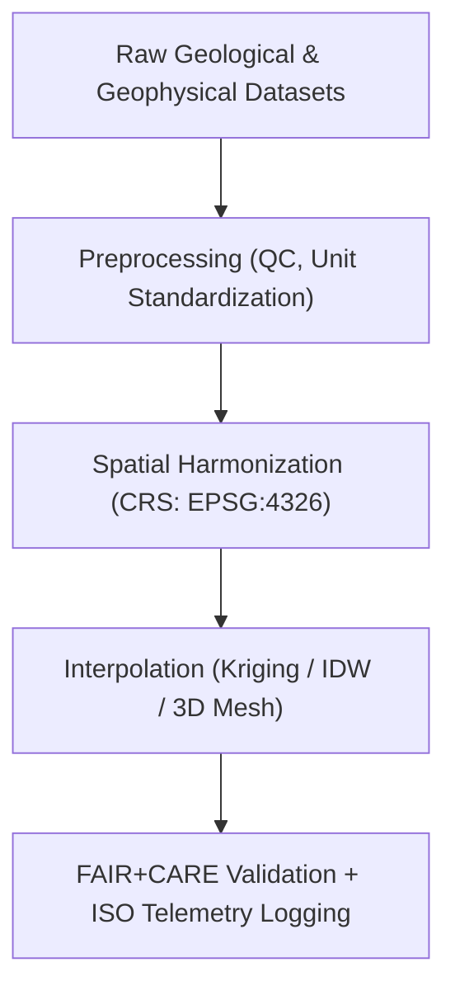

<div align="center">

# ⛰️ **Kansas Frontier Matrix — Geology Datasets Registry**
`docs/analyses/geology/datasets/README.md`

**Purpose:**  
Catalog and describe all **geological and geophysical datasets** used within the Kansas Frontier Matrix (KFM).  
This registry documents raw, processed, and derived geological data under **FAIR+CARE**, **STAC/DCAT 3.0**, and **ISO 19115** metadata standards for transparency, sustainability, and ethical governance.

[](../../../../README.md)
[](../../../../../LICENSE)
[](../../../../../docs/standards/README.md)
[](../../../../../releases/)
</div>

---

## 📘 Overview

The **Geology Datasets Registry** defines the data assets used for subsurface, stratigraphic, and geomorphological analyses in KFM.  
Each dataset is FAIR+CARE-certified and integrated into the **Geology Analysis Module**, supporting geological interpretation and sustainability research across Kansas.  
All datasets include **STAC/DCAT metadata**, **checksum validation**, and **telemetry logs** for ISO 50001 and 14064 sustainability tracking.

---

## 🗂️ Directory Layout

```plaintext
docs/analyses/geology/datasets/
├── README.md                                  # This document
├── raw/                                       # Raw geoscientific data sources
│   ├── README.md
│   ├── usgs_ngdb_stratigraphy.csv
│   ├── kgs_boreholes.csv
│   ├── noaa_srtm_dem.tif
│   ├── eros_landsat_imagery.tif
│   └── seismic_reflection_profiles.segy
├── processed/                                 # Cleaned and harmonized geological data
│   ├── README.md
│   ├── borehole_interpolated.geojson
│   ├── dem_resampled_1km.tif
│   └── seismic_filtered.segy
├── derived/                                   # Derived and analytical geological datasets
│   ├── README.md
│   ├── stratigraphic_layers_3d.vtk
│   ├── lithologic_map.tif
│   ├── geomorphology_classification.tif
│   └── carbon_storage_potential.nc
└── metadata/                                  # Metadata registry (FAIR+CARE + STAC/DCAT)
    ├── README.md
    ├── stac_catalog.json
    ├── dcat_metadata.json
    ├── faircare_validation.json
    └── provenance_log.json
```

---

## ⚙️ Primary Geological Datasets

| Source | Dataset | Type | Description | Format | FAIR+CARE Status |
|--------|----------|------|--------------|---------|------------------|
| **USGS NGDB** | Stratigraphic Boundaries | Vector | Formation, age, and lithology boundaries | CSV / GeoPackage | ✅ Certified |
| **Kansas Geological Survey (KGS)** | Borehole Logs | Tabular | Depth, lithology, porosity, and water table | CSV | ✅ Certified |
| **NOAA / NASA SRTM** | Elevation DEM | Raster | Surface elevation and slope data | GeoTIFF | ✅ Certified |
| **USGS EROS Center** | Landsat Imagery | Raster | Spectral imagery for mineralogical analysis | GeoTIFF | ✅ Certified |
| **KGS / USGS** | Seismic Profiles | Raster / SEG-Y | Reflection and refraction seismic data | SEG-Y | ✅ Certified |

---

## 🪨 Data Transformation Workflow



---

## 🧩 FAIR+CARE Metadata Example

```json
{
  "dataset_id": "usgs-ngdb-stratigraphy-ks",
  "title": "USGS National Geologic Database - Stratigraphic Boundaries (Kansas)",
  "source_url": "https://ngmdb.usgs.gov/ngmdb/ngmdb_home.html",
  "spatial_extent": [-102.05, 36.99, -94.6, 40.0],
  "temporal_coverage": ["1900-01-01", "2025-01-01"],
  "format": "CSV",
  "license": "Public Domain",
  "validation": {
    "integrity_check": "SHA-256 Verified",
    "missing_records": "1.2%",
    "status": "Pass"
  },
  "auditor": "FAIR+CARE Council",
  "timestamp": "2025-11-09T16:00:00Z"
}
```

---

## ⚖️ FAIR+CARE Governance Matrix

| Principle | Implementation | Validation Source |
|------------|----------------|--------------------|
| **Findable** | Registered via STAC/DCAT 3.0 UUIDs | `metadata/stac_catalog.json` |
| **Accessible** | Public FAIR+CARE datasets under CC-BY | FAIR+CARE Ledger |
| **Interoperable** | GeoTIFF, GeoPackage, CSV, SEG-Y formats | `telemetry_schema` |
| **Reusable** | Provenance logs and transformation history embedded | `manifest_ref` |
| **Responsibility** | ISO 50001/14064 telemetry validation | `telemetry_ref` |
| **Ethics** | Sensitive borehole coordinates generalized to ≥1 km | FAIR+CARE Council Review |

---

## 🧮 Telemetry Example (ISO 50001 / 14064)

```json
{
  "process_id": "geology-datasets-2025-11-09-0126",
  "datasets": [
    "USGS NGDB Stratigraphy",
    "KGS Boreholes",
    "NOAA SRTM DEM",
    "USGS EROS Imagery"
  ],
  "energy_joules": 13.5,
  "carbon_gCO2e": 0.0052,
  "validation_status": "Pass",
  "auditor": "FAIR+CARE Council",
  "timestamp": "2025-11-09T16:02:00Z"
}
```

---

## 🧾 Governance Ledger Record Example

```json
{
  "ledger_id": "geology-datasets-ledger-2025-11-09-0127",
  "component": "Geology Dataset Registry",
  "datasets": [
    "USGS NGDB Stratigraphy",
    "KGS Boreholes",
    "NOAA SRTM DEM",
    "USGS EROS Imagery"
  ],
  "energy_joules": 13.5,
  "carbon_gCO2e": 0.0052,
  "faircare_status": "Pass",
  "auditor": "FAIR+CARE Council",
  "timestamp": "2025-11-09T16:03:00Z"
}
```

---

## 🕰️ Version History

| Version | Date | Author | Summary |
|----------|------|--------|----------|
| v10.2.2 | 2025-11-09 | FAIR+CARE Council | Published geology datasets registry with full metadata and ISO telemetry. |
| v10.2.1 | 2025-11-09 | Geological Data Team | Added data transformation workflow and FAIR+CARE governance matrix. |
| v10.2.0 | 2025-11-09 | KFM Geoscience Group | Created geology datasets registry aligned with hydrology and climatology modules. |

---

<div align="center">

© 2025 Kansas Frontier Matrix Project  
Master Coder Protocol v6.3 · FAIR+CARE Certified · Diamond⁹ Ω / Crown∞Ω Ultimate Certified  

[Back to Geology Overview](../README.md) · [Governance Charter](../../../../../docs/standards/governance/ROOT-GOVERNANCE.md)

</div>

