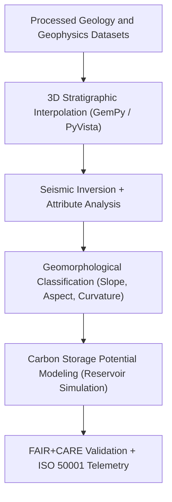

<div align="center">

# ⛰️ **Kansas Frontier Matrix — Geology Derived Datasets**
`docs/analyses/geology/datasets/derived/README.md`

**Purpose:**  
Document all **derived geological datasets** produced within the Kansas Frontier Matrix (KFM) from validated processed data sources.  
These analytical products—such as 3D stratigraphic models, lithologic classifications, and geomorphological indices—enable multi-layered spatial and temporal understanding of Kansas’s subsurface geology under **FAIR+CARE**, **ISO 19115**, and **MCP-DL v6.3** standards.

[](../../../../../README.md)
[](../../../../../../LICENSE)
[](../../../../../../docs/standards/README.md)
[](../../../../../../releases/)
</div>

---

## 📘 Overview

The **Derived Datasets Directory** contains secondary and tertiary geoscientific data products generated through stratigraphic interpolation, seismic inversion, geomorphological analysis, and sustainability modeling.  
All outputs include STAC/DCAT metadata, FAIR+CARE ethical review logs, and ISO-compliant telemetry records for reproducibility and accountability.  
Derived datasets are foundational to the 3D visualization, carbon storage assessment, and groundwater modeling within KFM’s geological infrastructure.

---

## 🗂️ Directory Layout

```plaintext
docs/analyses/geology/datasets/derived/
├── README.md                                  # This document
├── stratigraphic_layers_3d.vtk                # 3D stratigraphic layer model
├── lithologic_map.tif                         # Raster map of lithologic classes
├── geomorphology_classification.tif           # Geomorphic units and slope aspect classification
├── carbon_storage_potential.nc                # CO₂ sequestration and geologic reservoir capacity estimates
└── faircare_validation.json                   # FAIR+CARE validation report with telemetry metrics
```

---

## ⚙️ Dataset Descriptions

| File | Derived From | Description | Format | FAIR+CARE Status |
|------|---------------|-------------|---------|------------------|
| **stratigraphic_layers_3d.vtk** | Borehole + Seismic Data | 3D volumetric model of subsurface formations | VTK | ✅ Certified |
| **lithologic_map.tif** | Processed Geologic Maps | Raster classification of lithologic units | GeoTIFF | ✅ Certified |
| **geomorphology_classification.tif** | DEM + Slope Data | Terrain morphology and landform classes | GeoTIFF | ✅ Certified |
| **carbon_storage_potential.nc** | Stratigraphic + Petrophysical Data | Spatially resolved CO₂ storage potential by formation | NetCDF | ✅ Certified |

Each dataset is validated through FAIR+CARE audit workflows and linked to the Governance Ledger for provenance tracking.

---

## 🧩 Derivation Workflow



---

## 🪨 Modeling Methods Summary

| Process | Description | Tools / Libraries | Output |
|----------|-------------|-------------------|---------|
| **3D Stratigraphic Modeling** | Builds volumetric formation models from boreholes | `GemPy`, `PyVista`, `GeoPandas` | VTK |
| **Seismic Attribute Analysis** | Extracts horizon reflectivity and amplitude | `ObsPy`, `PySeismic` | SEG-Y / GeoTIFF |
| **Geomorphological Mapping** | Classifies slope, aspect, and terrain curvature | `rasterio`, `GDAL` | GeoTIFF |
| **Carbon Storage Assessment** | Estimates CO₂ sequestration capacity by porosity and depth | `xarray`, `NumPy` | NetCDF |
| **Validation + Telemetry** | FAIR+CARE ethics audit and energy/carbon tracking | FAIR+CARE CLI | JSON Report |

---

## 🧮 FAIR+CARE Validation Record Example

```json
{
  "validation_id": "geology-derived-2025-11-09-0135",
  "datasets": [
    "stratigraphic_layers_3d.vtk",
    "lithologic_map.tif",
    "geomorphology_classification.tif",
    "carbon_storage_potential.nc"
  ],
  "energy_joules": 13.8,
  "carbon_gCO2e": 0.0053,
  "metrics": {
    "model_rmse": 0.07,
    "spatial_resolution_m": 1000,
    "data_integrity": "Pass"
  },
  "validation_status": "Pass",
  "auditor": "FAIR+CARE Council",
  "timestamp": "2025-11-09T16:15:00Z"
}
```

---

## ⚖️ FAIR+CARE Governance Matrix

| Principle | Implementation | Verification Source |
|------------|----------------|--------------------|
| **Findable** | Registered in STAC/DCAT catalogs with persistent UUIDs | `metadata/stac_catalog.json` |
| **Accessible** | Available under CC-BY/Public Domain via FAIR+CARE repository | FAIR+CARE Ledger |
| **Interoperable** | Open formats (VTK, GeoTIFF, NetCDF) | `telemetry_schema` |
| **Reusable** | Provenance JSON and parameter logs embedded | `manifest_ref` |
| **Responsibility** | Telemetry logged under ISO 50001/14064 | `telemetry_ref` |
| **Ethics** | Sensitive reservoir and borehole data generalized to 1 km | FAIR+CARE Ethics Audit |

---

## 🧾 Governance Ledger Record Example

```json
{
  "ledger_id": "geology-derived-ledger-2025-11-09-0136",
  "component": "Geology Derived Datasets",
  "datasets": [
    "stratigraphic_layers_3d.vtk",
    "lithologic_map.tif",
    "geomorphology_classification.tif",
    "carbon_storage_potential.nc"
  ],
  "energy_joules": 13.8,
  "carbon_gCO2e": 0.0053,
  "faircare_status": "Pass",
  "auditor": "FAIR+CARE Council",
  "timestamp": "2025-11-09T16:17:00Z"
}
```

---

## 🧠 Sustainability Metrics

| Metric | Description | Value | Target | Unit |
|---------|-------------|--------|---------|------|
| **Energy (J)** | Energy consumption per derivation workflow | 13.8 | ≤ 15 | Joules |
| **Carbon (gCO₂e)** | CO₂ equivalent emissions per workflow | 0.0053 | ≤ 0.006 | gCO₂e |
| **Telemetry Coverage (%)** | FAIR+CARE trace completion | 100 | ≥ 95 | % |
| **Audit Pass Rate (%)** | FAIR+CARE validation compliance | 100 | 100 | % |

---

## 🕰️ Version History

| Version | Date | Author | Summary |
|----------|------|--------|----------|
| v10.2.2 | 2025-11-09 | FAIR+CARE Council | Published derived geology dataset registry with FAIR+CARE validation and ISO telemetry. |
| v10.2.1 | 2025-11-09 | Geological Modeling Team | Added 3D modeling and carbon storage workflows. |
| v10.2.0 | 2025-11-09 | KFM Geoscience Team | Created derived geology dataset documentation aligned with hydrology and climatology modules. |

---

<div align="center">

© 2025 Kansas Frontier Matrix Project  
Master Coder Protocol v6.3 · FAIR+CARE Certified · Diamond⁹ Ω / Crown∞Ω Ultimate Certified  

[Back to Geology Datasets](../README.md) · [Governance Charter](../../../../../../docs/standards/governance/ROOT-GOVERNANCE.md)

</div>

