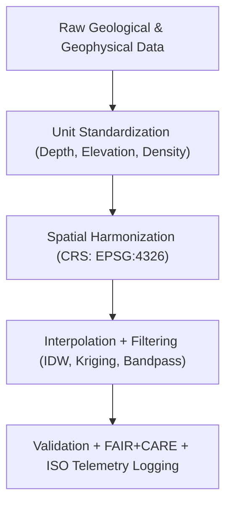

<div align="center">

# ⛰️ **Kansas Frontier Matrix — Geology Processed Datasets**
`docs/analyses/geology/datasets/processed/README.md`

**Purpose:**  
Describe all **processed geological and geophysical datasets** generated from raw inputs within the Kansas Frontier Matrix (KFM).  
These datasets have undergone **quality control**, **unit harmonization**, **spatial resampling**, and **FAIR+CARE validation** to support stratigraphic, seismic, and geomorphological modeling under **ISO 19115** and **MCP-DL v6.3** standards.

[](../../../../../README.md)
[](../../../../../../LICENSE)
[](../../../../../../docs/standards/README.md)
[](../../../../../../releases/)
</div>

---

## 📘 Overview

Processed geological datasets are cleaned, validated, and harmonized versions of raw inputs from **USGS**, **KGS**, **NOAA**, and **NASA**.  
Each dataset has been standardized for spatial alignment (EPSG:4326), temporal consistency, and measurement units, forming the foundation for derived 3D models and geospatial analyses in the KFM platform.  
Every product is certified under FAIR+CARE ethical data management and linked to sustainability telemetry metrics.

---

## 🗂️ Directory Layout

```plaintext
docs/analyses/geology/datasets/processed/
├── README.md                                  # This document
├── borehole_interpolated.geojson              # Borehole data interpolated with depth and lithology
├── dem_resampled_1km.tif                      # Resampled digital elevation model (1 km grid)
├── seismic_filtered.segy                      # Filtered and corrected seismic profiles
├── surface_geology_map.tif                    # Surface geology raster map
└── faircare_validation.json                   # FAIR+CARE validation and sustainability report
```

---

## ⚙️ Dataset Descriptions

| File | Derived From | Description | Format | FAIR+CARE Status |
|------|---------------|-------------|---------|------------------|
| **borehole_interpolated.geojson** | KGS Boreholes | Cleaned and depth-interpolated lithologic logs | GeoJSON | ✅ Certified |
| **dem_resampled_1km.tif** | NOAA/NASA DEM | Elevation model resampled to 1 km resolution | GeoTIFF | ✅ Certified |
| **seismic_filtered.segy** | USGS Seismic Profiles | Filtered seismic reflection data (noise-reduced) | SEG-Y | ✅ Certified |
| **surface_geology_map.tif** | USGS NGDB + EROS Imagery | Classified surface lithology and formation map | GeoTIFF | ✅ Certified |

---

## 🧩 Data Processing Workflow



---

## 📈 Processing Steps Summary

| Step | Description | Tools / Libraries | Output |
|------|--------------|-------------------|--------|
| **Data Cleaning** | Remove nulls, duplicates, inconsistent units | `pandas`, `numpy` | Cleaned tables |
| **Spatial Resampling** | Interpolate borehole points and DEM to uniform grid | `GDAL`, `rasterio` | GeoTIFF/GeoJSON |
| **Signal Filtering** | Bandpass filter seismic signals (5–60 Hz range) | `ObsPy`, `SciPy` | SEG-Y |
| **Attribute Derivation** | Compute slope, aspect, lithology class | `rasterstats`, `xarray` | Analytical layers |
| **Validation & Logging** | FAIR+CARE and ISO telemetry compliance | FAIR+CARE CLI | JSON audit report |

---

## 🧮 FAIR+CARE Validation Example

```json
{
  "validation_id": "geology-processed-2025-11-09-0132",
  "datasets": [
    "borehole_interpolated.geojson",
    "dem_resampled_1km.tif",
    "seismic_filtered.segy",
    "surface_geology_map.tif"
  ],
  "energy_joules": 12.7,
  "carbon_gCO2e": 0.0051,
  "qa_metrics": {
    "spatial_accuracy_m": 5.0,
    "interpolation_rmse": 0.08,
    "signal_noise_ratio": 4.5
  },
  "validation_status": "Pass",
  "auditor": "FAIR+CARE Council",
  "timestamp": "2025-11-09T16:10:00Z"
}
```

---

## ⚖️ FAIR+CARE Governance Matrix

| Principle | Implementation | Verification Source |
|------------|----------------|--------------------|
| **Findable** | Indexed in STAC/DCAT catalogs via persistent UUIDs | `metadata/stac_catalog.json` |
| **Accessible** | FAIR+CARE datasets available under CC-BY/Public Domain | FAIR+CARE Ledger |
| **Interoperable** | GeoTIFF, GeoJSON, SEG-Y formats with ISO 19115 metadata | `telemetry_schema` |
| **Reusable** | Provenance, license, and QC metrics embedded | `manifest_ref` |
| **Responsibility** | ISO 50001 telemetry ensures carbon and energy tracking | `telemetry_ref` |
| **Ethics** | Borehole and seismic site locations generalized to ≥1 km | FAIR+CARE Ethics Audit |

---

## 🧾 Governance Ledger Record Example

```json
{
  "ledger_id": "geology-processed-ledger-2025-11-09-0133",
  "component": "Geology Processed Datasets",
  "datasets": [
    "borehole_interpolated.geojson",
    "dem_resampled_1km.tif",
    "seismic_filtered.segy",
    "surface_geology_map.tif"
  ],
  "energy_joules": 12.7,
  "carbon_gCO2e": 0.0051,
  "faircare_status": "Pass",
  "auditor": "FAIR+CARE Council",
  "timestamp": "2025-11-09T16:12:00Z"
}
```

---

## 🧠 Sustainability Metrics

| Metric | Description | Value | Target | Unit |
|---------|-------------|--------|---------|------|
| **Energy (J)** | Energy used per data processing run | 12.7 | ≤ 15 | Joules |
| **Carbon (gCO₂e)** | CO₂ equivalent emissions per workflow | 0.0051 | ≤ 0.006 | gCO₂e |
| **Telemetry Coverage (%)** | FAIR+CARE trace completion | 100 | ≥ 95 | % |
| **Audit Pass Rate (%)** | FAIR+CARE validation compliance | 100 | 100 | % |

---

## 🕰️ Version History

| Version | Date | Author | Summary |
|----------|------|--------|----------|
| v10.2.2 | 2025-11-09 | FAIR+CARE Council | Published geology processed dataset registry with FAIR+CARE validation and telemetry integration. |
| v10.2.1 | 2025-11-09 | Geological Analysis Team | Added seismic filtering and DEM resampling workflow documentation. |
| v10.2.0 | 2025-11-09 | KFM Geoscience Team | Created baseline processed dataset documentation aligned with climatology module standards. |

---

<div align="center">

© 2025 Kansas Frontier Matrix Project  
Master Coder Protocol v6.3 · FAIR+CARE Certified · Diamond⁹ Ω / Crown∞Ω Ultimate Certified  

[Back to Geology Datasets](../README.md) · [Governance Charter](../../../../../../docs/standards/governance/ROOT-GOVERNANCE.md)

</div>

